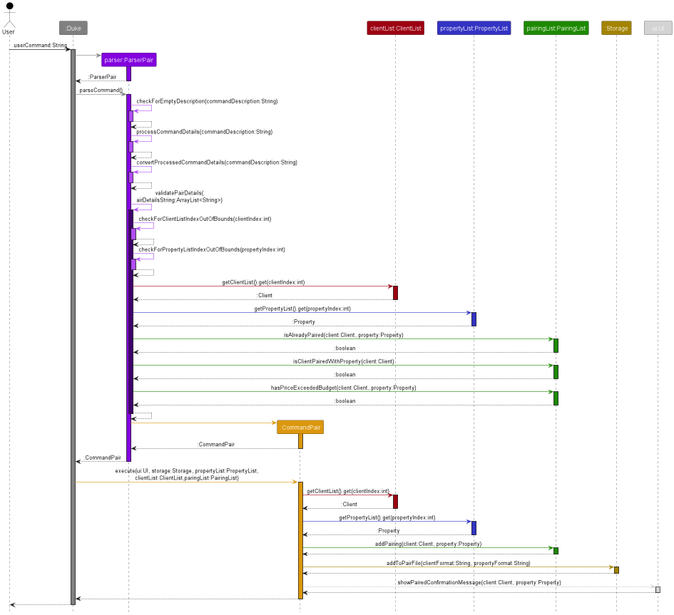

# Property Rental Manager - Developer Guide
* [Acknowledgements](#acknowledgements)
* [Setting Up and Getting Started](#setting-up-and-getting-started)
* [Product Scope](#product-scope)
* [Target User Profile](#target-user-profile)
* [Value Proposition](#value-proposition)
* [User Stories](#user-stories)
* [Design](#design)
  * [Architecture](#architecture)
  * [UI Component](#ui-component)
  * [Client Component](#client-component)
  * [Property Component](#property-component)
  * [Model Component](#model-component)
  * [Storage Component](#storage-component)
  * [Common Classes](#storage-component)
* [Implementation](#implementation)
* [Documentation, logging, testing, configuration and dev-ops](#documentation-logging-testing-configuration-and-dev-ops)
* [Appendix: Requirements](#appendix-requirements)
* [Appendix: Instruction for manual testing](#appendix-instruction-for-manual-testing)
* [Non Functional Requirement (NFR)](#non-functional-requirements)
* [Glossary](#glossary)
___
## Acknowledgements

{list here sources of all reused/adapted ideas, code, documentation, and third-party libraries -- include links to the original source as well}
___
## Setting Up and Getting Started
___
## Product scope
___
## Target user profile
This application is for property agent who is managing single owner rental units and is looking to reduce the overhead to filter appropriate tenants. The property agent would also want to monitor the expenses such as damages, utility bills and payment dates for rent.
___
## Value proposition
Aids property agent in tracking information related to their property which includes:
- Filtering appropriate tenants (Based on tags e.g.: gender, occupations and age)
- Show expenses from the rented unit
- Monitor payment dates 

Some of the constraint includes:
- Single owner unit (Shared ownership will be registered under one owner's name)
- Unable to calculate tax payment
___
## User Stories
| Version | As a ...         | I want to ...                         | So that I can ...                                                    |
|---------|------------------|---------------------------------------|----------------------------------------------------------------------|
| v1.0    | Property Manager | add properties                        | keep track of properties                                             |
| v1.0    | Property Manager | add clients                           | keep track of clients                                                |
| v1.0    | Property Manager | delete properties                     | prevent properties I am no longer tracking from cluttering my data   |
| v1.0    | Property Manager | delete clients                        | prevent clients I am no longer tracking from cluttering my data      |
| v1.0    | Property Manager | view a list of properties             | find out what and how many properties I manage                       |
| v1.0    | Property Manager | view a list of clients                | find out what and how many clients I manage                          |
| v1.0    | Property Manager | check the details of a property       | find out which clients are renting the property                      |
| v1.0    | Property Manager | pair a client to a property           | record down which client is renting which property                   |
| v1.0    | Property Manager | unpair a client to a property         | update my rental records when a client is no longer renting property |
| v1.0    | Property Manager | save my data                          | used the data created from a previous use of the app                 |
| v1.0    | Property Manager | quit the app                          | -                                                                    |
| v2.0    | Property Manager | check the details of a client         | find out which property the client is renting                        |
| v2.0    | Property Manager | edit client and property details      | keep my data updated                                                 |
| v2.0    | Property Manager | search clients using their details    | easily find specific clients                                         |
| v2.0    | Property Manager | search properties using their details | easily find specific properties                                      |

___
## Design
{Describe the design and implementation of the product. Use UML diagrams and short code snippets where applicable.}
### Architecture
### UI Component
### Parser Component
### Client Component
### Property Component

### Pairing Component
API: [```pairingList.java```](../src/main/java/seedu/duke/PairingList.java)

```PairingList``` is responsible for recording which clients renting which property.

```PairingList``` does not inherit from other classes. It stores references to Client and Property objects.

This a partial class diagram of the ```PairingList``` class:


```ParsePair``` and ```ParseUnpair``` contain references to data classes ```PairingList```, ```ClientList``` and 
```PropertyList``` because the data classes provide the required information to validate user input.

### Storage Component
For `Storage` feature:


The Storage class is a superclass itself that is not inherit from other class. This class is responsible for managing 
three different text file:
- `client.txt` - Stores the client that is in the Client ArrayList.
- `property.txt` - Stores the property that is in the Property ArrayList.
- `pairing.txt` - Stores the relationship between a client and property which is stored in the Pairing hashmap.


It has an association with other class which includes:
- CommandAddProperty
- CommandAddClient
- CommandDeleteProperty
- CommandDeleteClient
- CommandPair
- CommandUnpair

Since the arraylist changes by **adding** and **deleting** operations while hashmap changes by **pair** and **unpair** 
operations, the text files will be updated when `add`, `delete`, `pair` or `unpair` is invoked.

### Common Classes
___
## Implementation

This section describes the implementation details of the features within Property Rental Manager.

### Delete Client/Property feature
The **delete client/property** mechanism involves the following classes: ```ParseDeleteClient```,
```ParseDeleteProperty```, ```CommandDeleteClient```, ```CommandDeleteProperty```,
```ClientList```, ```PropertyList``` and ```PairingList```.

Given below is an example usage scenario and how the delete client/property behaves at each step.

**Step 1:** The user executes ```delete -client ic/INDEX``` or ```delete -property ip/INDEX```.
The ```ParseDeleteClient``` or ```ParseDeleteProperty``` class is called respectively and the format of the user
input is checked for any incorrect formatting.

**Step 2:** If there are no errors, ```CommandDeleteClient``` or ```CommandDeleteProperty``` is called respectively.
The ```CommandDeleteClient#execute()``` or ```CommandDeleteProperty#execute()``` method is then called.

**Step 3:** The ```ClientList#deleteClient()``` or ```PropertyList#deleteProperty()``` method is called which 
removes the Client or Property with that specific index from their respective ArrayList.

**Step 4:** Any pairings involving that specific Client or Property is also deleted using the
```pairingList#deletePairing()``` method. A message showing all the deleted pairs is shown to the user.

**Step 5:** The corresponding line(s) in the respective files are deleted. The method is shown in the Storage
Implementation section.

The following *class diagram* shows all the classes involved in the **delete client/property** operation
and their relationships.


The following *sequence diagram* shows how the **delete client** operation works, showcasing the
```ClientList#deleteClient()``` method.


The following *sequence diagram* shows how the **delete property** operation works, showcasing the
```PropertyList#deleteClient()``` method.


### PairingList

```PairingList``` facilities that pair and unpair commands by storing client-property pairs.

When client rents a property, the client and property form a pair.

*  ```PairingList``` uses a hash map to represent these client-property pairs, where the key is a ```Client``` object
  and the value is a ```Property``` object.
* A hash map is chosen due to its constant time lookup performance, making it efficient at querying the property that a
  client is renting.
* Also, the Java HashMap prevents duplicate keys, which dovetails nicely with the fact that real-life tenants only have
  one place of residence at any time.

#### Pair

Here is a sequence diagram for the pair command, called from ```Duke.java```:



**NOTE**: Some self-invocated calls have been omitted because this diagram emphasises cross-class method calls.

The pair command takes in user input of the format:
```
pair ip/PROPERTY_INDEX ic/CLIENT_INDEX
```
where ```PROERTY_INDEX``` and ```CLIENT_INDEX``` must be positive integers which are indexes present in ```ClientList```
and ```PropertyList``` if their private arrays were 1-indexed.

How the pair command works:
1. The user input for a pair command is first parsed by ```Parser``` (specifically, ```ParsePair```).
2. ```ParsePair``` checks the user input for formatting mistakes such as missing flags and wrong flag orders.
3. ```ParsePair``` also calls helper methods in ```PairingList``` to check that the pairing client and property indexes
    exists. Also, the client and property must not be already paired. The client must not be renting any property
    presently as well.
4. After passing all these checks, the program fetches the desired```Property``` and ```Client``` from
   ```PropertyList``` and ```ClientList```.
5. The ```Property``` and ```Client``` objects are inserted as a pair into the hashmap of ```PairingList```.
 
#### Unpair

The unpair command takes in user input of the format:
```
unpair ip/PROPERTY_INDEX ic/CLIENT_INDEX
```
where ```PROERTY_INDEX``` and ```CLIENT_INDEX``` must be positive integers which are indexes present in ```ClientList```
and ```PropertyList``` if their private arrays were 1-indexed.


How the unpair command works:
1. The user input for a pair command is first parsed by ```Parser``` (specifically, ```ParseUnpair```).
2. ```ParseUnpair``` checks the user input for formatting mistakes such as missing flags and wrong flag orders.
3. ```ParseUnpair``` also calls helper methods in ```PairingList``` to check that the pairing client and property
   indexes exist, and that the client-property pair exist in ```PairingList```.
4. After passing all these checks, the ```PairingList``` deletes the hashmap entry in ```clientPropertyPairings```
   which contains the client-property pair.


### Storage
The implementation of Storage class requires consists of different level of operations:

- Load Files
- Append to File
- Update to File

#### Load Files:

At the file loading level, it comprises checks to verify the directory is created. This is done by invoking a method: 
`loadFiles(hasDirectory, hasPropertyFile, hasClientFile, hasPairingFile, clientList, propertyList, pairingList)`.
This method would conduct the following operations:
- Create a `data` directory if not already exist. (`hasDirectory` is `false`)
- Load Clients into Client ArrayList if `hasClientFile` is `true`.
- Load Properties into Property ArrayList if `hasPropertyFile` is `true`.
- Load Pairings into Pairing HashMap if `hasPairingFile` is `true`.

An empty file would not be loaded into the ArrayList and PropertyList as the code is designed to read for `next()`.
An empty file would invoke a `false` in `hasNext()`, thus adding operation would not continue. The overall operation can
be visualised in the flowchart above.

#### Append To File
When file is appended into the text file, it's being stored in different formats as shown below:

- Client:  `NAME | CONTACT_NUMBER | EMAIL <optional> | BUDGET` 
- Property: `NAME | ADDRESS | RENTAL_PRICE | UNIT_TYPE` 
- Pairing: `[CLIENT_FORMAT] : [PROPERTY_FORMAT]` 

The text file of which Client, Property and Pairing is being stored is `client.txt`, `property.txt` and `pairing.txt` 
respectively.


The three sequence diagram above shows the sequence of which the append operation is being invoked. All three
operations are similar in operations but are invoked with different `parameter` and `path`.

### Update To File
The update operation happens when entries in ClientList and PropertyList is being deleted and entries the hash map of 
PairingList is being removed.

The sequence diagram of `updateClient`, `updateProperty` and `updatePair` can be seen below:


Note that when delete operation is being invoked on client and property, the `updatePair` method will also be invoked to
prevent entries retaining within pairingList after it has been deleted from clientList or propertyList.

## Documentation, logging, testing, configuration and dev-ops
___
## Appendix: Requirements
___
## Appendix: Instruction for Manual Testing

## Non-Functional Requirements

{Give non-functional requirements}

## Glossary

* *client* - Person who is seeking for property to rent


## Instructions for manual testing