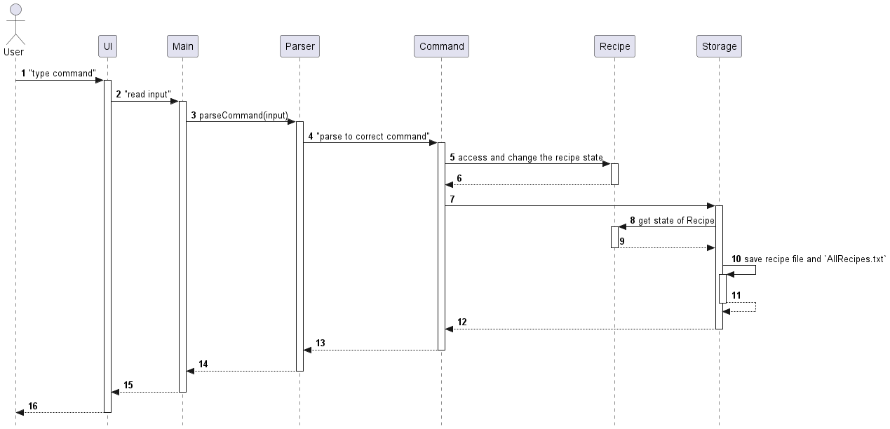
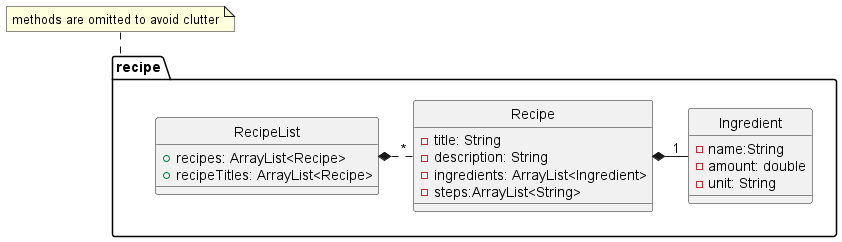
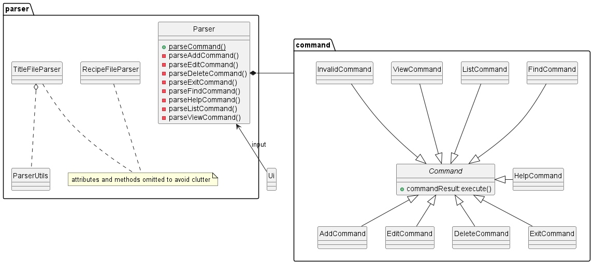
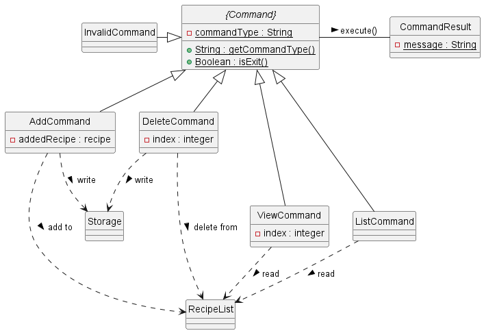
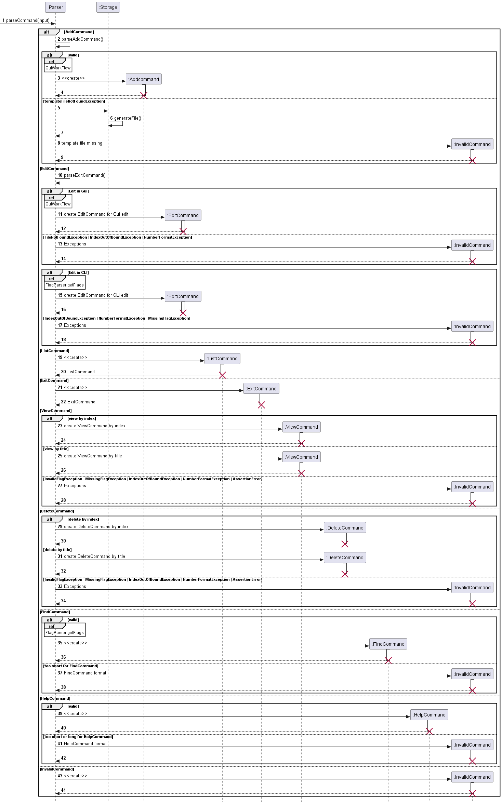
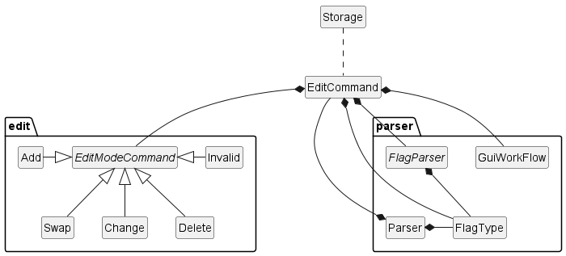
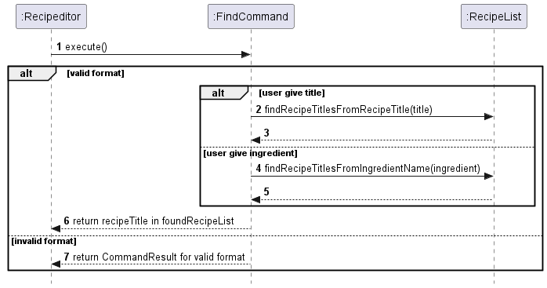
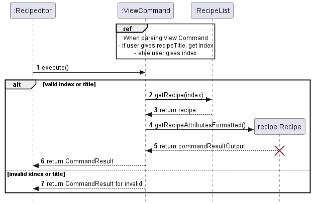
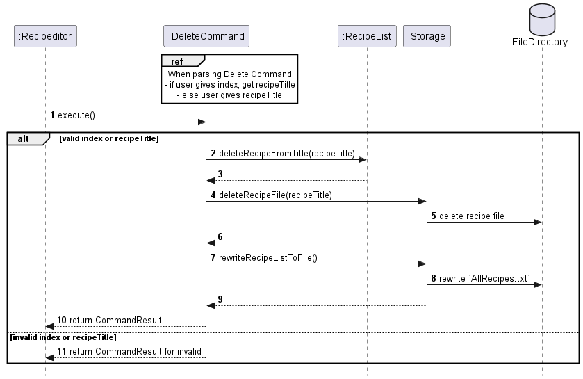
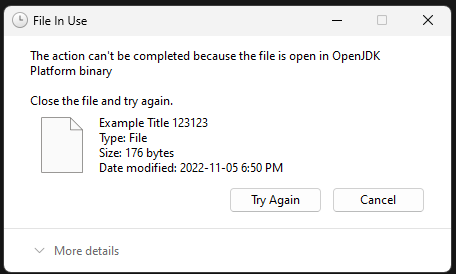

# RecipEditor

## Developer Guide

The aim of this guide is to help readers understand how the system and components of RecipEditor
is designed, implemented and tested. This developer guide also serves to help
developers to understand the architecture of RecipEditor and some design considerations.
Click to view the latest release of [RecipEditor](https://github.com/AY2223S1-CS2113-T18-2/tp/releases).

## Content page

- [Design](#design)
    - [Architecture](#architecture)
    - [Ui Component](#ui-component)
        - [GUI Component](#gui-component)
    - [Recipe Component](#recipe-component)
    - [Storage Component](#storage-component)
    - [Parser Component](#parser-component)
    - [Command Component](#command-component)
    - [Exception Component](#exception-component)
- [Implementation](#implementation)
    - [Data on Startup and Exit](#data-on-startup-and-exit)
    - [Parsing of Commands](#parsing-of-commands)
    - [Add Recipe](#add-recipe)
    - [GUI Workflow](#gui-workflow)
    - [Parse Text to Recipe](#parse-text-to-recipe)
    - [Edit an Existing Recipe](#edit-an-existing-recipe)
    - [Find Recipe](#find-recipe)
    - [View Recipe](#view-recipe)
    - [Delete Recipe](#delete-recipe)
    - [Other](#other)
- [Product Scope](#product-scope)
    - [Target User Profile](#target-user-profile)
    - [Value Proposition](#value-proposition)
- [User Stories](#user-stories)
- [Non-Functional Requirements](#non-functional-requirements)
- [Glossary](#glossary)
- [Instructions for manual testing](#instructions-for-manual-testing)

## Acknowledgements

- The design and structure of our User Guide and Developer Guide is referenced from AddressBook-Level3 (AB3)
    - [AB3 UG](https://se-education.org/addressbook-level3/UserGuide.html)
    - [AB3 DG](https://se-education.org/addressbook-level3/DeveloperGuide.html#proposed-undoredo-feature)

### External Library

- [Apache Commons Lang 3.0](https://mvnrepository.com/artifact/org.apache.commons/commons-lang3/3.0): for Utilities to
  handle String

## Design

### Architecture

<p align="center" width="50%">
  
</p>

- The components are grouped into these **packages** because of their functionality

#### Components (as packages)

`main` or `RecipEditor` (in some part of the DG) is the main running program, acting as the intermediary between
the `Ui` and the `Parser`

- `ui`: handles interactions with users, including printing messages and reading of inputs
- `storage`: manages the storage of the list of recipes by reading and writing data to the File Directory
- `command`: command executor to instruct what task to perform
- `parser`: interprets the user input into different commands
- `recipe`: Contains classes that keep track of Recipes being used when the program is running (or Model)
- `exception`: exceptions thrown by the program.

#### General interaction between the components

<p align="center" width="100%">
  
</p>

- Here is the general interaction between the components.
    - `Parser` parsed correct command from the user input
    - `Command` will affect change in the `Recipe` Model
        - Add and Edit command will also utilize GUI as shown here. [Add Recipe](#add-recipe)
    - `Command` will trigger `Storage` to save the `Recipe` Model to the File Directory

- The section below gives detailed description of the classes in the various components

[⏫ Back to content page](#content-page)

### Ui Component

The UI component is responsible for all user interfaces of the application.

<p align="center" width="100%">
  
</p>

**Class:** `Ui.java`,

- Handle the CLI user interface with the user
- `Ui` takes `CommandResult` as a parameter to show the output message after a command is completed.

**Class:** `GuiWorkFlow.java`, `Editor.java`

- See below

[⏫ Back to content page](#content-page)

#### GUI Component

<p align="center" width="100%">
  
</p>


The GUI component consists of 2 main classes: `Editor` and `GuiWorkFlow`

- `Editor` extends `Jframe` and implements `ActionListener`: This is the class that brings up the GUI (using **JavaFx UI
  framework**)
- `GUIWorkFlow` is the class that call `Editor`: This class have various methods that handle the transition between CLI
  and GUI
- Check [GUI Workfow](#gui-workflow), for the implementation

[⏫ Back to content page](#content-page)

### Recipe Component

The recipe module encapsulates the array, recipe and ingredient objects.

<p align="center" width="100%">
  
</p>

- Methods are omitted to avoid clutter

**Class:** `Ingredient.java`

- Stores the name, amount and unit of recipes

**Class:** `Recipe.java`

- has private attributes as shown
- has get and set methods on the attributes
- has methods to convert a recipe into printable or saveable format and perform operations

**Class:** `RecipeList.java`

- Consists of 2 **important arrays** that keep track of the added recipes
    - `RecipeList.recipes`: store the recipe
    - `RecipeList.recipeTitles`: store the recipe titles
        - This is necessary because it separately keeps track of valid titles from `AllRecipes.txt`
        - This is due to the fact that the recipe files might be tampered
- has methods to do various useful operation on the `RecipeList.recipes` and `RecipeList.recipeTitles`

[⏫ Back to content page](#content-page)

### Storage Component

<p align="center" width="100%">
  
</p>
The storage component allows data to be read from and saved to a storage file.

**Class:** `Storage.java`

1. `Storage` calls `Recipe` when saving data from `RecipeList` to an external storage file.
2. `Storage` calls `RecipeList` when loading recipe data from external storage file to.
3. `Storage` calls `ParserFileException` when there is an error in parsing recipe file content.
4. `Storage` uses a method in `RecipeFileParser` to parse the content in the recipe file content.
    - [Parse Text to Recipe](#parse-text-to-recipe)
5. `Storage` uses a method in `TitleFileParser` to parse `AllRecipes.txt`.
    - [Data on Startup and Exit](#data-on-startup-and-exit)

- Important files in the File Directory
    1. Individual Recipe Text File
        - Recipe Name
        - Recipe Description
        - Recipe Ingredients (name, amount, unit)
        - Recipe Steps

    2. `AllRecipes.txt`: contains the recipe title of all the recipes
    3. `Template.txt`: template file for adding recipe
    4. `TemporaryFile.txt`: for the [GUI Workflow](#gui-workflow)

[⏫ Back to content page](#content-page)

### Parser Component

<p align="center" width="100%">
  
</p>

**Class:** `Parser.java`

- Parser class parses user input to various `Command`. It parses user's input into commands through
  respective parsing functions.
- `parseCommand` will takes in the user input for parsing, and call respective parsing functions
  after identifying the type of `Command`. Then a `Command` will be returned as the result of parsing.

**Class:** `TitleFileParser.java`

- Parse `AllRecipes.txt` file into recipe titles to store in `RecipeList.recipeTitles`
- Used in [Data on Startup and Exit](#data-on-startup-and-exit)

**Class:** `RecipeFileParser.java`

- Parse recipe files content to a valid `Recipe`
- Used in [GUI Workflow](#gui-workflow) and [Data on Startup and Exit](#data-on-startup-and-exit)

[⏫ Back to content page](#content-page)

### Command Component

<p align="center" width="100%">
  
</p>

- The command component has classes that extend `Command`, identified from user input for the software to carry out
  certain tasks.
  A `CommandResult` is returned from `execute()` method call of each `Command`.
  The `CommandResult` consists of a single error message in `String`.

- Each subclass of `Command` has their own attributes and `CommandResult`
  from `Execute` method, allowing them to perform respective tasks.

- All types of`Command`and their functionalities are explained below:

- `AddCommand`: Add a valid `Recipe` to `RecipeList`, otherwise shows error message
  for `invalid Recipe`

- `DeleteCommand`: Remove an existing `Recipe` at a valid index from `RecipeList`,
  otherwise show error message on `index out of bound`

- `ExitCommand`: Deliver a `CommandResult` to terminate software run.

- `InvalidCommand`: Deliver a `CommandResult` of invalid command

- `ListCommand`: Print all formatted `Recipe` in `RecipeList` to screen

- `ViewCommand`: View an existing `Recipe` at a valid index from `RecipeList`,
  otherwise show error message on `index out of bound`

### Exception Component

- Contains exception classes that extend `Exception` for program specific exceptions
    - `ExcessFlagsException.java`
    - `InvalidFlagException.java`
    - `MissingFlagException.java`
    - `ParseException.java`
    - `ParseFileException.java`
    - `RecipeNotFoundException.java`


[⏫ Back to content page](#content-page)

## Implementation

### Data on Startup and Exit

#### Startup

<p align="center" width="100%">
  
</p>

When the program starts, it will

- First run
    - Create the storage folders
        - `./RecipeData/App`: to store `Template.txt` and `TemporaryFile.txt`
        - `./RecipeData/Recipes`: to store recipe files
    - Create `AllRecipes.txt` file to keep track of the recipe titles
    - Create `Template.txt` file for Add Command
- Subsequent run
    - Read the recipe titles from `Tempate.txt` line by line by `TitleFileParser`
    - **Check for the validity** of the titles
        - Title is not blank
        - Title is alphanumeric
        - Title does not exceed 255 characters
        - Title has a corresponding recipe file in `./RecipeData/Recipes`
    - Read the recipe file in `./RecipeData/Recipes`
        - The recipe file content is parsed by the `RecipeFileParser` class.
          Check [Parse Text to Recipe](#parse-text-to-recipe)
        - If the recipe title in the file content is different from the recipe file name, use the file name
    - Only when the parsing is correct
        - Load recipe into ArrayList `RecipeList.recipes`
        - Load recipe title into ArrayList `RecipeList.recipeTitles`

#### Exit

<p align="center" width="100%">
  
</p>

Before exiting, the program will

- Regenerate the `AllRecipes.txt`
- Delete existing all recipe files
- Generate the recipe files from RecipeList Model

This is to prevent manual tampering of the data that might affect the data in the next run

[⏫ Back to content page](#content-page)

### Parsing of Commands

- The following sequence diagram shows the usage of relevant classes and methods when trying to parse
  an input

<p align="center" width="100%">
  
</p>

- A user input will be parsed into `Parser` and checked for the command word by `parseCommand(input)`.

#### Add Command

- If command word is `/add`, `parseAddCommand()` will be called by `Parser`. If the input is a valid `AddCommand`,
  an instance of `AddCommand` to instruct entering `GuiWorkFlow` will be returned.

- If `templateFileMissingException` occurs,`Parser` will call `generateFile()` in `Storage` to create
  the template file. An `InvalidCommand`containing this exception will be returned.

#### Edit Command

- If command word is `/edit`, `parseEditCommand()` will be called by `Parser`. If the command input is a
  valid `EditCommand`
  to edit in Gui, an instance of `EditCommand` to instruct entering `GuiWorkFlow` will be returned.

- If the command is invalid, one of the `Exception` among `IndexOutOfBoundException`, `NumberFormatException`
  or `FileNotFoundException` occurs. An `InvalidCommand` containing the respective `Exception` message will
  be returned.

- If the command input is a valid `EditCommand` to edit in CLI, an instance of `EditCommand` to interpret user
  input into changes made to `recipe` is returned.

- If the command is invalid, one of the `Exception` among `IndexOutOfBoundException`, `NumberFormatException`
  or `FileNotFoundException` occurs. An `InvalidCommand` containing the respective `Exception` message will
  be returned.

#### List Command

- If the command word is `/list`, an instance of `ListCommand` will be returned to `Parser`.

#### Exit Command

- If the command word is `/exit`, an instance of `ExitCommand` will be returned to `Parser`.

#### View Command

- If the command word is `/view`, `Parser` will call `parseViewCommand()` from itself. If the command views
  `recipe` by index, a `ViewCommand` that instructs showing `recipe` at the given index will be returned
  to `Parser`.

- If the command views `recipe` by title, a `ViewCommand` that instructs showing `recipe` of the given
  title will be returned to `Parser`.

- If one of the `Exception` among `MissingFlagException`, `InvalidFlagException`, `IndexOutOfBoundException`
  and `NumberFormatException` or `AssertionError` occurs, an instance of `InvalidCommand` containing
  information on the respective `Exception` or `Error` will be returned to `Parser`.

#### Delete Command

- If the command word is `/delete`, `Parser` will call `parseDeleteCommand()` from itself. If the command deletes
  `recipe` by index, a `DeleteCommand` that instructs deleting `recipe` at the given index will be returned
  to `Parser`.

- If the command deletes `recipe` by title, a `DeleteCommand` that instructs deleting `recipe` of the given
  title will be returned to `Parser`.

- If one of the `Exception` among `MissingFlagException`, `InvalidFlagException`, `IndexOutOfBoundException`
  and `NumberFormatException` or `AssertionError` occurs, an instance of `InvalidCommand` containing
  information on the respective `Exception` or `Error` will be returned to `Parser`.

#### Find Command

- If the command word is `/find`, `Parser` will call `parseFindCommand()` from itself. If the input is a valid
  `FindCommand`, an instance containing the respective `flag` and other input information will be returned to
  `Parser`.

- If the input is shorter than the expected length of a `FindCommand` input, an instance of `InvalidCommand` containing
  information on the correct format for `FindCommand` input will be returned to `Parser`.

#### Help Command

- If the command word is `/help`, `Parser` will call `parseHelpCommand()` from itself. If the input is a valid
  `HelpCommand`, an instance containing input information will be returned to `Parser`.

- If the input is not of the same length as the expected length of a `HelpCommand` input, an instance
  of `InvalidCommand`
  containing information on the correct format for `HelpCommand` input will be returned to `Parser`.

#### Invalid Command

- If the command word is none of the above, an instance of `InvalidCommand` will be returned to `Parser`.

[⏫ Back to content page](#content-page)

### Add Recipe

- **Activation bar is ommitted to avoid clutter**

<p align="center" width="100%">
  
</p>

- When the `Parser` parsed the AddCommand, an instance of `GuiWorkFlow` will be created
- The internal working of `GuiWorkFlow` is elaborated in [GUI Workflow](#gui-workflow)
- `Parser` will call `getValid()` and `getRecipe()` from the `GuiWorkFlow`
    - After the user interact with the GUI, if the text the user provides is a valid recipe, the Add command will be
      valid
- If the recipe is valid
    - The recipe title is added to `AllRecipes.txt` file
    - A recipe file will be saved to the FileDirectory
    - A `CommandResult` instance is returned with a successful message

[⏫ Back to content page](#content-page)

### GUI Workflow

- Below is the sequence diagram of the GUI Workflow
    - Activation bar is ommitted to avoid clutter

<p align="center" width="100%">
  
</p>

1. GUI is only triggered by Add and Edit command

    - Add command will pass the path of the `Template.txt` file
    - Edit command will pass the path of the recipe the user wants to edit

2. From the path, `GuiWorkFlow` class can detect whether it is `Mode.ADD` or `Mode.EDIT`

    - `Mode.ADD` throws an exception when the recipe title already exist in the `RecipeList.recipes`
    - `Mode.EDIT` overwrite the recipe title that already exist `RecipeList.recipes`

3. There are an initial entry to `Editor` and a loop for subsequent entry to `Editor` if the user choose to fix the
   content of the recipe
4. When exiting the `Editor`, the user can choose to SAVE or EXIT

    - SAVE will return `saveToTemp = True` and save the content in the `Editor` to `TemporaryFile.txt`
    - EXIT will return `saveToTemp = False`
    - if `saveToTemp = False`, program flow will exit the loop
    - if `saveToTemp = False`, program flow will exit the loop

5. The loop is a PARSE and RE-ENTRY

- it wil parse the `TemporaryFile.txt` file. Check [Parse Text to Recipe](#parse-text-to-recipe)
- if parsing is valid and there is no duplicate recipe
    - exit the loop and set `isValid = True`
- else if parsing is invalid or there is a duplicate recipe
    - Ask the user if they want to fix the file
        - if yes (fix the invalid recipe)
            - re-enter `Editor` and the workflow is similar as point 4. above
        - if no (recipe remains invalid)
            - exit the loop and set `isValid = False`

[⏫ Back to content page](#content-page)

### Parse Text to Recipe

- The parsing of is solely handled by `RecipeFileParser` Class with little interaction with other classes. Hence **there
  will be no diagram**.
- The parser has variables and counter to keep track of the parsing process
    - `lineType`:`TITLE`, `DESCRIPTION`, `INGREDIENT`, `STEP`, `NORMAL`
    - `stage`: `TITLE_START`, `TITLE`, `TITLE_END`,  `DESCRIPTION`, `INGREDIENT`, `STEP`, `NORMAL`
    - `stageCounter = {0,0,0,0}`: count the occurrence of {TITLE, DESCRIPTION, INGREDIENT, STEP}
    - `ingredientIndex`: keep track of the increment of INGREDIENT index
    - `stepIndex`: keep track of the correct increment of STEP index

1. Go through the text line by line
2. Detect whether the line is a Heading (denoted by `#`) and assign the `lineType` for that line
    - if `lineType` is a heading, assign `stage` appropriately, and increment `stageCounter`
    - else, the `lineType` is `NORMAL`
3. Parsing of line with `NORMAL` type is dependent on the `stage`
    - If the line is blank, it does not affect the parsing
4. Different `stage`
    - For `TITLE`:
        - Perform validity check as the recipe title is a text file
            - Alphanumerical
            - less than 255 character
    - For `DESCRIPTION`:
        - Allow all characters, including blank lines
        - Blank lines will be recorded to give the user some freedom in describing the recipe
    - For `INGREDIENT`:
        - Check for the appropriate format `INDEX. INGREDIENT_NAME / AMOUNT / UNIT`
            - Positive integer index
            - Positive double amount
        - Check for the correct index increment based on `ingredientIndex`
    - For `STEP`
        - Check for the appropriate format `INDEX. STEP_DESCRIPTION`
            - Positive integer index
        - Check for the correct index increment based on `stepIndex`
5. Check if the correct number of Heading occurrence is correct
6. Because of the `stage`, Headings are **parseable** in different order (but highly discouraged)
7. Check if the recipe has empty fields
    - Because the blank lines are disregarded but considered valid

[⏫ Back to content page](#content-page)

### Edit an Existing Recipe

#### GUI

- Called if the user provides `/edit index`
- The workflow is similar to [Add Recipe](#add-recipe), check [GUI WorkFlow](#gui-workflow)
- Instead of loading `Template.txt`, the recipe file with the title name corresponding to the index will be loaded

#### CLI

- Called if the user provides more than two parameters.
    - `EditCommand` is instantiated with the corresponding flags parsed from the arguments provided by the user
    - Depending on the flags passed, it instantiates the abstract class `EditModeCommand` using different constructors
      (`Add`, `Delete`, `Swap`, `Change`)
    - Once it has been executed, it returns the new edited `Recipe`, which will be saved to `Storage` through the
      `RecipeList` class

<p align="center" width="100%">
  
</p>

- The edit component consists of three parts:

- **Parser**
    - Parses the user input, instantiates `EditCommand` and `GUIWorkFlow`, switches between different flags
- **EditModeCommand**
    - Handles the edit functions that falls under `EditModeCommand` (`Add`, `Swap`, `Change`, `Delete`, `Invalid`)
- **EditCommand**

    - Instantiated by parser whenever `/edit` is called, instantiates the flag parser, switches the flow between GUI and
      CLI, saves the edited recipe to `Storage`

##### Parser

- The `FlagParser` contains several functions to extract flags from the user input in the FlagType format. It is used to
  instantiate the necessary EditModeCommand.

- `GuiWorkFlow` bypasses this parsing step since there is nothing to be parsed (given that only the index is provided).

##### EditModeCommand

- An abstract class instantiated by `EditCommand` in CLI mode. It takes in the old recipe and, once executed,
  returns a new recipe which will be saved to Storage.

##### EditCommand

- Handles the branching of commands, once executed it will save the new recipe to Storage or returns an error.

##### Sequence  Diagram

- The following illustrates the work sequence to edit a recipe.

<p align="center" width="100%">
  
</p>

[⏫ Back to content page](#content-page)

### Find Recipe

<p align="center" width="100%">
  
</p>

- After parsing in [Parsing of Commands](#parsing-of-commands), `FindCommand` is given the `title` or `ingredient` to
  search
- If given `title`
    - An arraylist of found recipe is returned from `RecipeList.findRecipeTitlesFromRecipeTitle(title)`
    - A `CommandResult` containing the string format of the found recipe arraylist is returned
- If given `ingredient`
    - An arraylist of found recipe is returned from `RecipeList.findRecipeTitlesFromIngredientName(ingredient)`
    - A `CommandResult` containing the string format of the found recipe arraylist is returned
- If the given `title` or `ingredient` is invalid
    - A `CommandResult` containing failure is returned from `execute()`.

[⏫ Back to content page](#content-page)

### View Recipe

<p align="center" width="100%">
  
</p>

- After parsing in [Parsing of Commands](#parsing-of-commands),`ViewCommad` is given the `index` or `title` of `recipe`
  to view.

- If the given `index` is within the range of `RecipeList`:
    - The stored `recipe` file is found by calling `RecipeList.getRecipe(index)`.
    - The `recipe` information is formatted by calling `recipe.getRecipeAttributesFormatted()`.
    - A `CommandReseult` containing message of formatted `recipe` of given index is returned from `execute()`.
- If the given `index` is out of the range of `RecipeList`:
    - An `IndexOutofBoundException` is thrown when `RecipeList.getRecipe(index)`.
    - It is catched. `Ui` will show message on the total number of recipes in list.
    - A `CommandResult` containing failure in viewing the specified `recipe` returned from `execute()`.

[⏫ Back to content page](#content-page)

### Delete Recipe

<p align="center" width="100%">
  
</p>

- After parsing in [Parsing of Commands](#parsing-of-commands), `DeleteCommad` is given the `index` or `title`
  of `recipe` to delete.
- If the `recipe` of given `title` exist in the `RecipeList`:
    - The stored `recipe` file is deleted by calling `Storage.deleteRecipeFile(title)`.
    - The list of titles of all `recipe` is updated to remove the `title` of the deleted `recipe` by calling
      `Storage.rewriteRecipeListToFile(title)`.
    - A `CommandReseult` containing message of successful delete of `recipe` of given `title` is returned
      from `execute()`.
- If the `recipe` of given `title` does not exis in the `RecipeList`:
    - An `Exception` is thrown when calling `Storage.deleteRecipeFile()`.
    - It is catched. `Ui` will show message on the total number of recipes in list.
    - A `CommandResult` containing failure in deleting the specified `recipe` returned from `execute()`.

[⏫ Back to content page](#content-page)

### Other

- `HelpCommand`, `ListCommand`, `ExitCommand` are simple and self-explanatory in the code. Hence no elaboration will be
  made

[⏫ Back to content page](#content-page)

## Product scope

### Target user profile

Avid cook who wants to organize their recipe list for ease of reference and search. The user is also a fast typer who
can quickly type out all the part of the recipe

### Value proposition

Helps people who cook often to keep track of the many recipes that they have so that they don't have to go about
memorising all the recipe details. RecipEditor helps to manage all these recipes where users can add, edit and
delete recipes of their choice. Furthermore, they can find relevant recipes quickly using RecipEditor. For example,
if the user wants to make a dish with tomato, he/she can use RecipEditor to find recipes that uses tomato as ingredient
quickly.

## User Stories

| Version | As a ... | I want to ...                                 | So that I can ...                                                                                           |
|---------|----------|-----------------------------------------------|-------------------------------------------------------------------------------------------------------------|
| v1.0    | new user | see usage instructions                        | refer to them when I forget how to use the application                                                      |
| v1.0    | user     | add new recipes                               | store recipes that I need without having to remember everything                                             |
| v1.0    | user     | delete existing recipes                       | remove recipes that I no longer use so that the list will not be cluttered                                  |
| v1.0    | user     | show all recipes in my list                   | see the overview of what recipes I have added beforehand                                                    |
| v1.0    | user     | exit the application                          | close the entire application                                                                                |
| v2.0    | user     | edit a previously saved recipe                | update the recipe without having go through the trouble to delete and add the updated version of the recipe |
| v2.0    | user     | find recipe by recipe name or ingredient name | locate a recipe without having to go through the entire list                                                |
| v2.0    | user     | show detailed recipe that I specified         | view detailed recipe (name, description, ingredients and steps) of the one that I am interested             |
| v2.0    | new user | view the list of available commands           | use the appropriate command according to my needs                                                           |

[⏫ Back to content page](#content-page)

## Non-functional Requirements

1. Should work on any OS as long as it has Java 11 or above installed on their PC.
2. Should be able to hold up to 1000 recipes without a slowdown of performance.
3. Any user who can type >55 words per minute would be able to accomplish these tasks
   faster than if they used a mouse to navigate.

## Glossary

- `Main` or `RecipEditor`: refers to the main class that the program starts
- `Template.txt`: Template file generated for adding recipe
- `TemporaryFile.txt`: Temporary file generated for the GUI Workflow
- `AllRecipes.txt`: File that contains recipe titles
- `./RecipeData/App`: Directory path to store files that are not related to recipe
- `./RecipeData/Recipes`: Directory path to store recipe files


[⏫ Back to content page](#content-page)

## Instructions for manual testing

### Setup

1. Follow the instruction in the User Guide to setup the program
2. For sample recipes, download and unzip `ManualTestData.rar`
   from [Release](https://github.com/AY2223S1-CS2113-T18-2/tp/releases). There are
    - `Recipes` folder
    - `AllRecipes.txt` file
3. Copy the folder and file in 2. to `RecipeData` folder, overwriting existing files
4. This gives you 3 sample recipes so you don't have to manually add recipes all the time
5. Run the program, it should load and recognize the 3 recipes

### Parsing  from Text to Recipe using Add or Edit GUI

- For the ease of testing, use `/add` command and edit directly on the template
- When the parser throw an error, and you were asked `Do you want to FIX the recipe? (Y/N)`, type `y`

#### General errors

- **Whitespace at the start of the line**
    - Expected: Will be trimmed (except for [Description](#description-errors))
- **Blank whitespace**
    - Different types
        - Blank space at the start
        - Blank space between the '# HEADING' and the content
        - Blank space between the ingredients and step
    - Expected outcome: allowed and will not affect parsing (except for [Description](#description-errors))
- **Missing, duplicate Heading**
    - Expected: `Incorrect number of HEADINGS! Please follow the template!`
- **Heading in different order**
    - Expected: able to parse
- **Duplicate Title in `/add`**
    - Expected outcome: `This Recipe Title already existed!`

#### Title errors

- **Multi-line title**: Title contains multiple lines
    - Expected outcome: `TITLE should be a single line and less than 255 characters`
- **Title that is not alphanumeric**: To prevent characters that are an invalid file name
    - Expected outcome:
- **Title with >255 characters**: Cannot be saved as a file in the Operating System
    - Here is a 255 characters
      string: `aaaaaaaaaaaaaaaaaaaaaaaaaaaaaaaaaaaaaaaaaaaaaaaaaaaaaaaaaaaaaaaaaaaaaaaaaaaaaaaaaaaaaaaaaaaaaaaaaaaaaaaaaaaaaaaaaaaaaaaaaaaaaaaaaaaaaaaaaaaaaaaaaaaaaaaaaaaaaaaaaaaaaaaaaaaaaaaaaaaaaaaaaaaaaaaaaaaaaaaaaaaaaaaaaaaaaaaaaaaaaaaaaaaaaaaaaaaaaaaaaaaaaaaaaaaaaaa`
    - Expected outcome: `TITLE is too long! TITLE should be less than 255 characters!`

#### Description errors

- Description will record down all type of characters under the DESCRIPTION Heading as a string because we want to give
  the user freedom
- **Blank lines and whitespace at the start of a line**
    - Expected outcome: will be recorded
    - Save the Recipe and use `/view` command to check the description content

#### Ingredients errors

- **Characters in front of the index**
    - Expected outcome: `INGREDIENT format is incorrect!` and further instructions
- **Negative index**
    - Expected outcome: `INGREDIENT index must be a positive integer!`
- **Index increment is wrong**:
    - Expected outcome: `INGREDIENT index increment is incorrect! Index starts from 1`
- **More `/` than the format**
    - Expected outcome: `INGREDIENT format is incorrect!` and further instructions
- **`.` in ingredient name**
    - Expected outcome: allowed
- **Amount not a valid positive double**:
    - Expected outcome: `INGREDIENT amount should be a positive rational number!` and further instructions

#### Steps errors

- **Characters in front of the index**
    - Expected outcome: `STEP format is incorrect!` and further instructions
- **Negative index**
    - Expected outcome: `STEP index must be a positive integer!`
- **Index increment is wrong**:
    - Expected outcome: `STEP index increment is incorrect! Index starts from 1`
- **`.` in step description**:
    - Expected outcome: allowed because a step can have multiple sentences

[⏫ Back to content page](#content-page)
### Storage: Tampering the data

- Tamper the data to test if the program can recover gracefully

#### During the running of the program

- **Delete or tamper the `AllRecipes.txt` file**
    - No effect as the program does not use `AllRecipes.txt` while running
    - If the program is stopped not using `/exit`. The effect will be reflected in the next run
    - However, after `/add`, `/edit`,`/exit`, a correct `AllRecipes.txt` will be generated

- **Delete recipe files then `/edit`**
    - Deleting the data files can only be done if the files are newly created during the same run of the program.
    - If the file is loaded by the program, you cannot delete because JDK is using them.
        <p align="center" width="100%">
      </p>
    - Expected outcome:
      ```
      Please edit in the GUI editor!
      Recipe File is missing! Regenerate Recipe File! Please try again!
      >>>
      ```
- **Tamper the recipe files**
    - The change in recipe files will not be reflected in the Model
- **Tamper the recipe file then `/edit`**
    - The change will be loaded into the Editor GUI
    - The validity of the change will be parsed when exit the GUI and will be reflected in the Model
- **Tamper the recipe file then `/exit`**
    - The program will regenerate all the recipe files and `AllRecipes.txt` based on the Model

#### Before the running of the program

- **Delete the `AllRecipes.txt`**
    - The program cannot recognize any title start anew, despite having recipe files
- **Tamper the `AllRecipes.txt`**
    - The program will match the recipe titles in `AllRecipes.txt` with the stored recipe files
    - The program will parse the recipe files
    - If valid, the program will load the recipe into the Model
    - If the title does not match the stored recipe or the stored recipe cannot be parsed, the program will not
      recognize the recipe

- **Delete the recipe file**
    - The program cannot find the recipe file from the title in `AllRecipes.txt`
    - The program will skip this
- **Tamper the recipe file (parseable recipe)**
    - The program will load the recipe with the tampered content
- **Tamper the recipe file (unparseable recipe)**
    - The program will not load the recipe


[⏫ Back to content page](#content-page)


