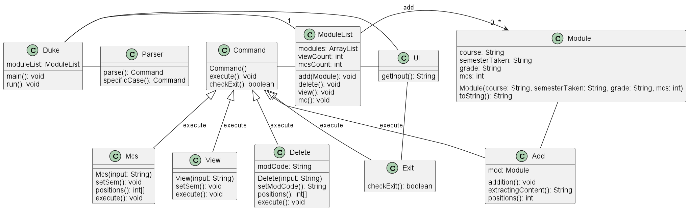
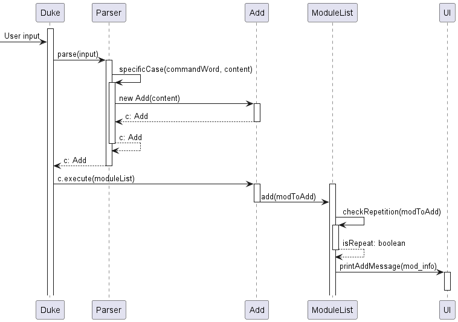
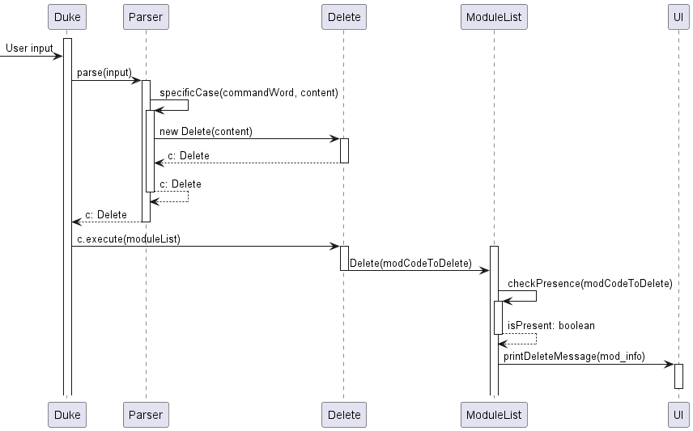

# Developer Guide

## Acknowledgements

{list here sources of all reused/adapted ideas, code, documentation, and third-party libraries -- include links to the original source as well}

## Design & implementation

Our program is structured as pictured in the following class diagram:

All the inheritors of Command are features that will be described below.

### Addition feature

The addition mechanism is facilitated by 'Parser', 'Add', 'ModuleList' and 'UI', where a Module object will be created according to the content inputted by the user and stored in the module list.

Below is an example usage scenario and how the addition mechanism behaves at each step:

Step 1: The user launches the application for the first time. A ModuleList object will be initiated with empty content.

Step 2: The user input of "add m/cs2113 s/y2s1 mc/4 g/a" will be taken in for parser and an object of class 'Add' will be returned.

Step 3: The execute method in the Add class that is overrides will be called with parameter of moduleList and module to be added passed. This will add the Module into the module list created in step 1.

The sequence diagram below illustrates this add mechanism:

### Deletion feature

The deletion mechanism is facilitated by 'Parser', 'Add', 'ModuleList' and 'UI', where a Module object will be deleted according to the module code inputted by the user and removed from the module list.

Below is an example usage scenario and how the addition mechanism behaves at each step:

Step 1: Assume that the user has already added a module named CS2113 into the ModuleList using the following command, "add m/cs2113 s/y2s1 mc/4 g/a"

Step 2: The user input of "delete m/cs2113" will be taken in for the parser and an object of class 'Delete' will be returned.

Step 3: The execute method in the Delete class that is overrides will be called with parameter of the modCode and will iterate through moduleList looking for a Module that matches. It will then remove the Module from the moduleList.

The sequence diagram below illustrates this delete mechanism:

### View feature

blah blah by insuf

### Mcs feature

blah blah by ishita

## Product scope
### Target user profile

{Describe the target user profile}

### Value proposition

{Describe the value proposition: what problem does it solve?}

## User Stories

|Version| As a ... | I want to ... | So that I can ...|
|--------|----------|---------------|------------------|
|v1.0|new user|see usage instructions|refer to them when I forget how to use the application|
|v2.0|user|find a to-do item by name|locate a to-do without having to go through the entire list|

## Non-Functional Requirements

{Give non-functional requirements}

## Glossary

* *glossary item* - Definition

## Instructions for manual testing

{Give instructions on how to do a manual product testing e.g., how to load sample data to be used for testing}
