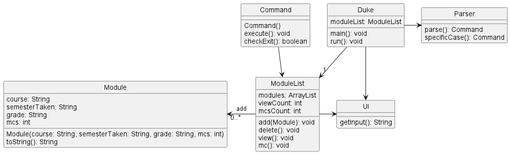
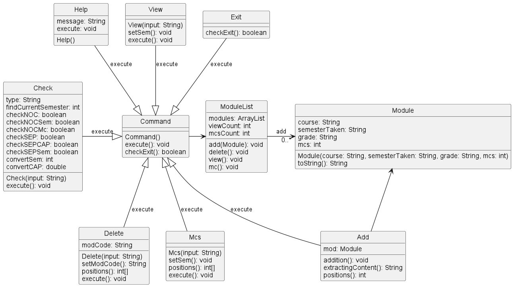

# Developer Guide

## Acknowledgements

{list here sources of all reused/adapted ideas, code, documentation, and third-party libraries -- include links to the original source as well}

## Design & implementation

The general class structure of our program is pictured in the following class diagram:

The class structure of our commands are listed below:

All the commands shown in the command class diagram above are features that will be described below.

### Addition feature

The addition mechanism is facilitated by 'Parser', 'Add', 'ModuleList' and 'UI', where a Module object will be created according to the content inputted by the user and stored in the module list.

Below is an example usage scenario and how the addition mechanism behaves at each step:

Step 1: The user launches the application for the first time. A ModuleList object will be initiated with empty content.

Step 2: The user input of "add m/cs2113 s/y2s1 mc/4 g/a" will be taken in for parser and an object of class 'Add' will be returned.

Step 3: The execute method in the Add class that is overrides will be called with parameter of moduleList and module to be added passed. This will add the Module into the module list created in step 1.

The sequence diagram below illustrates this add mechanism:

### Deletion feature

The deletion mechanism is facilitated by 'Parser', 'Add', 'ModuleList' and 'UI', where a Module object will be deleted according to the module code inputted by the user and removed from the module list.

Below is an example usage scenario and how the addition mechanism behaves at each step:

Step 1: Assume that the user has already added a module named CS2113 into the ModuleList using the following command, "add m/cs2113 s/y2s1 mc/4 g/a"

Step 2: The user input of "delete m/cs2113" will be taken in for the parser and an object of class 'Delete' will be returned.

Step 3: The execute method in the Delete class that is overrides will be called with parameter of the modCode and will iterate through moduleList looking for a Module that matches. It will then remove the Module from the moduleList.

The sequence diagram below illustrates this delete mechanism:

### View feature

The View mechanism is facilitated by 'Parser', 'View', 'ModuleList', and 'UI', where the user enters
a semester and the total number of mcs taken that semester is calculated and displayed.

Below is an example usage scenario and how the view mechanism behaves at each step.

Step 1: Assume that the user has already added two modules to y2s1:
The first module is CS2113, a 4 MC module which was added using the following command "add m/cs2113 s/y2s1 mc/4 g/a"
The second module is CS2030, a 4 MC module which was added using the following command "add m/cs2030 s/y2s1 mc/4 g/a"

Step 2: The user input of "view s/y2s1" will be taken in for the parser and an object of class 'View' will be returned.

Step 3: The execute method of View class that is overrides will be called with parameter of the semester and will iterate through
the moduleList. If the semester in which a particular module is taken matches the semester given as the argument, then the module will be added to an ArrayList called matchingModules. In the end, the arrayList matchingModules will be returned.

The sequence diagram below illustrates this view mechanism.

### Mcs feature

The mcs mechanism is facilitated by 'Parser', 'Mcs', 'ModuleList', and 'UI', where the user enters
a semester and the total number of mcs taken that semester is calculated and displayed. 

Below is an example usage scenario and how the mcs mechanism behaves at each step.

Step 1: Assume that the user has already added two modules to y2s1:
The first module is CS2113, a 4 MC module which was added using the following command "add m/cs2113 s/y2s1 mc/4 g/a"
The second module is CS2030, a 4 MC module which was added using the following command "add m/cs2030 s/y2s1 mc/4 g/a"

Step 2: The user input of "mcs s/y2s1" will be taken in for the parser and an object of class 'Mcs' will be returned.

Step 3: The execute method of MCs class that is overrides will be called with parameter of the semester and will iterate through 
the moduleList. If the semester in which a particular module is taken matches the semester given as the argument, then mcsCount variable 
will be increased by the number of Mcs of the module taken. In the end, mcsCount will be returned.

The sequence diagram below illustrates this mcs mechanism.

### Find feature

The find mechanism is facilitated by 'Parser', 'Find', 'ModuleList', and 'UI', where the user enters
a keyword and the modules containing the keyword in one of its fields will be displayed.

Below is an example usage scenario and how the find mechanism behaves at each step.

Step 1: Assume that the user has already added two modules to y2s1:
The first module is CS2113, a 4 MC module which was added using the following command "add m/cs2113 s/y2s1 mc/4 g/a"
The second module is CS2030, a 4 MC module which was added using the following command "add m/cs2030 s/y2s1 mc/4 g/b"

Step 2: The user input of "find a" will be taken in for the parser and an object of class 'Find' will be returned.

Step 3: The execute method of Find class that is overrides will be called with parameter of the keyword inputted and will iterate through
the moduleList. If the keyword matches a field of a particular module, the module will be added to a separate array list 
which will then be displayed to the user.

The sequence diagram below illustrates this find mechanism.

### Check feature

The help mechanism is facilitated by 'Parser', 'Check' and 'UI', where the user enters the check command and the resulting 
eligibility status will be displayed.

The eligibility requirements for NOC and SEP can be found in the glossary.

The sequence diagram below illustrates this check mechanism.

### Help feature

The help mechanism is facilitated by 'Parser', 'Help' and 'UI', where the user enters the word 'help' and a help message with 
the various commands summary will be displayed.

The sequence diagram below illustrates this help mechanism.

### Exit feature

The exit mechanism is facilitated by 'Parser', 'Exit' and 'UI'. 
This allows the program to exit smoothly with an exit message displayed when the user input is 'exit'.

The sequence diagram below illustrates this exit mechanism.

## Product scope
### Target user profile

Our target user profile are NUS students who are still unsure of what module they will be taking and/or are targeting one of the exchange programs that NUS has to offer (NOC/SEP).
Through our program students will be able to ensure that they are eligible for these programmes and ensure that they make the most out of their studies in NUS.

### Value proposition

It is often very confusing for students to plan out the full four years of their studies due to the sheer amount of modules they will be taking.
Students might also have doubts of their eligibility for the exchange programs. Our program allows users to ensure that they will be eligible for these programs when the time comes.

## User Stories

|Version| As a ...                          | I want to ...                                         | So that I can ...                                                               |
|--------|-----------------------------------|-------------------------------------------------------|---------------------------------------------------------------------------------|
|v1.0| new user                          | see usage instructions                                | refer to them when I forget how to use the application                          |
|v1.0| student                           | add modules to my plan                                | select which modules I would want to take during my course of study             |
|v1.0| student                           | delete modules from my plan                           | remove it in case I do not want to take the module anymore                      |
|v1.0| student                           | calculate my number of MCs each semester              | plan my MCs accordingly in case I overload or underload for a semester          |
|v1.0| new user                          | exit the program                                      | stop planning for my modules anytime I want                                     |
|v2.0| user                              | clear all of the modules in my plan                   | make space for another 4 year plan                                              |
|v2.0| user                              | find modules by course, grade, semester, number of MCs | locate the modules that fit into my filter without having to go through the list |
|v2.0| student planning on going for NOC | check my eligibility for NOC                          | ensure that I am eligible to go for NOC at the appropriate time                 |
|v2.0| student planning on going for SEP | check my eligibility for SEP                          | ensure that I am eligible to go for SEP at the appropriate time                 |
|v2.0| user                              | store my plan locally                                 | open my plan without having to readd all of my modules                          |
|v2.0| user                              | show an overview of my plan                           | summarize the details of my yearly plan instantly                               |

## Non-Functional Requirements

1. Program should work on any operating system supporting Java 11 or above.
2. Program should be accessible to users with no prior programming experience.
3. User should be able to store and load data on any operating system without any loss of data.

## Glossary

* *Module* - A class that a student takes for their current semester in NUS.
* *NOC* - NUS Overseas College is an entrepreneurial program for full-time students to learn more about entrepreneurship through interning at start-up companies and taking up courses part-time from other universities. Further details can be found in the following link: https://fass.nus.edu.sg/nus-overseas-college-programme-noc/#:~:text=Eligibility,refer%20to%20application%20details%20here.
* *SEP* - Student Exchange Program allows students to live and study in another country while earning credits for their NUS degree. Further information and eligibility can be found in the following link: https://www.nus.edu.sg/gro/global-programmes/student-exchange/outgoing-exchangers.

## Instructions for manual testing

To manually test our product, try to give commands which will give an expected output from user standpoint. 

### Basic workflow of testing

Follow a simple workflow
like the example given below.

1. Add any 5 modules using the add command. Ensure that atleast 3 modules belong to different semesters and have different grades and mcs.
2. View all the modules in any semester using the view command.
3. View all the modules using view all command.
4. Calculate the mcs taken in a semester using the mcs command.
5. Check for NOC and SEP eligibility using check command.
6. Check an overview of the entire plan using overview command.
7. Find module information using find command. Try to search for keywords and partial keywords that are specific to module code, semester, grade, and mcs. Try all variations to see if it works. 
8. Delete any one module using delete command. 
9. Try to view all the modules again using view all command to ensure that the deleted module is actually deleted. 
10. Clear all the modules in a specific semester using the clear command. 
11. Try to view all the modules again using view all command to ensure that the modules of the entire semester are actually cleared. 
12. Finally, clear all the remaining modules using clear all command. 
13. Try to view all the modules again using view all command to ensure that all the modules are actually cleared. 
14. In the end, exit the application using the exit command.

You can try the help command as well in the middle to see if it works or not.

### A few things to keep note of while manual testing:
- Ensure that the appropriate messages are displayed if the module list is empty for any command.
- Ensure that the appropriate messages are displayed if an action is being carried out on a module that does not exist.
- Ensure that the display of PlanIt in the beginning is correct.
- Ensure that the opening and closing messages are correct.
- Ensure that the message displayed in case of an exception is clear.

### Exceptions to test for:

The following are the exceptions to check for while manual testing.

1. Testing for valid year and semester.
- Ensure year is always given before semester.
- Ensure only year is not given.
- Ensure only semester is not given.
- Ensure special characters, negative numbers, and letters are not accepted for year and semester.
- Ensure only year from 1 to 4 (both inclusive) are accepted
- Ensure only semester 1 and 2 are accepted.
- ensure long numbers are not accepted.

2. Testing for valid mc.
- Ensure special characters, negative numbers, and letters are not accepted for mc.
- Ensure that mc which does not lie between 0 and 20 (both inclusive) is not accepted.
- Ensure that a long number is not accepted for mc.

3. Testing for valid grade.
- Ensure that number grade is not accepted.
- Ensure that a long string is not accepted for grade.
- Ensure that only a grade belonging to the following options is accepted: {"A", "A+","A-","B","B+","B-", "C", "C+","D", "D+", "F", "F*", "S", "U", "-"}

4. Testing for invalid command word
- Ensure that only a command word that is valid is accepted.

5.Testing for invalid content in input
- Ensure that any field left empty is invalid in terms of input content.
- Ensure that giving null input or empty string input in CLI is also treated as invalid content.
6. Testing for invalid input format
- Ensure that any parameter repeated in the input is treated as wrong input format.