# Developer Guide

## Contents
<!-- TOC -->
* [Developer Guide](#developer-guide)
  * [Contents](#contents)
  * [1 Acknowledgements](#1-acknowledgements)
  * [2 Design](#2-design)
    * [2.1 Architecture Level](#21-architecture-level)
      * [2.1.1 Main Components of the Architecture](#211-main-components-of-the-architecture)
    * [2.2 Model Component](#22-model-component)
    * [2.3 API Component](#23-api-component)
    * [2.4 Storage Component](#24-storage-component)
    * [2.5 UI Component](#25-ui-component)
    * [2.6 Logic Component](#26-logic-component)
    * [2.7 Common Component](#27-common-component)
  * [3 Implementation](#3-implementation)
    * [3.1 Favourite / Unfavourite feature](#31-favourite--unfavourite-feature)
      * [3.1.1 Design Considerations](#311-design-considerations)
    * [3.2 Update Data from LTA API Feature](#32-update-data-from-lta-api-feature)
    * [3.2.1 Design Considerations](#321-design-considerations)
    * [3.2.2 Limitations of the LTA API](#322-limitations-of-the-lta-api)
    * [3.3 Updating CarparkList with JSON file from API](#33-updating-carparklist-with-json-file-from-api)
      * [3.3.1 Loading CarparkList from text file](#331-loading-carparklist-from-text-file)
        * [3.3.1.1 Design Considerations](#3311-design-considerations)
      * [3.3.2 Loading CarparkList from JSON file](#332-loading-carparklist-from-json-file)
      * [3.3.3 Writing to text file](#333-writing-to-text-file)
    * [3.4 The `filter` command](#34-the-filter-command)
    * [3.5 Jansi formatting](#35-jansi-formatting)
    * [3.6 Exception Handling](#36-exception-handling)
* [Appendix](#appendix)
  * [Appendix A:  Product scope](#appendix-a-product-scope)
    * [Target user profile](#target-user-profile)
    * [Value proposition](#value-proposition)
  * [Appendix B: User Stories](#appendix-b-user-stories)
  * [Appendix C: Non-Functional Requirements](#appendix-c-non-functional-requirements)
  * [Appendix D: Glossary](#appendix-d--glossary)
  * [Appendix E: Instructions for manual testing](#appendix-e-instructions-for-manual-testing)
<!-- TOC -->

## 1 Acknowledgements
Our project uses external libraries and services from:
1. Land Transport Authority DataMall API Service ([link](https://datamall.lta.gov.sg/content/datamall/en.html)).
2. Jackson JSON Parser ([link](https://fasterxml.github.io/jackson-core/javadoc/2.8/com/fasterxml/jackson/core/JsonParser.html))
3. Jansi ([link](https://github.com/fusesource/jansi))

## 2 Design 

### 2.1 Architecture Level
The Architecture Diagram below explains the high level design of the app.

Given below is a quick overview of the main components and how they interact with one another.
#### 2.1.1 Main Components of the Architecture
Our program flow is managed by the Parking class.

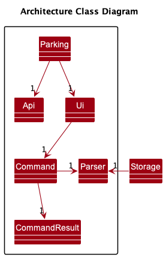

User input is passed to the Command class, which then calls the Parser to parse the user input string as a command. 
Each command subclass handles its own execution.

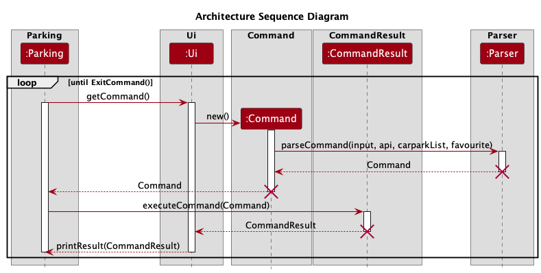
Below are the main subcomponents that Parking and the command subclass delegate work to:
* `Ui`: Deals with user interaction, such as reading input and printing output.
* `CommandResult`: Returns the results of the command instructed.
* `Parser`: Takes in the user input string to determine what is the command the user has instructed the program to do.

### 2.2 Model Component

The model component consists of a `CarparkList` (and `CarparkFilteredList`) class that contains
instances of `Carpark`, as well as the `Favourite` class, under the package `seedu.data`

This component: 
* Stores the necessary information to maintain a list of "favourited" carparks in the `Favourite` class.
* Stores all carpark data (all `Carpark` objects), contained in a `CarparkList` object.
* Stores filtered carpark data to be used in other components (in `CarparkFilteredList`).
* Contains methods for selecting a `Carpark` object based on a unique code (for the `find` command) as well
as filtering by a substring or set of substrings (`search` command).
* Is independent of other components except the API component, which is used to generate it.
* Group objects with the same code by enum `LotType` (Car, Motorcycle, Heavy Vehicle) and places them in a HashMap 
for easy access. For example: Three `Carpark` objects may have the same unique carpark code as they are the same 
carpark, but contain available lot information for different types of lot. These three objects will be grouped under 
one object with the HashMap `allAvailableLots` containing a breakdown of lots by type.

Note: The `Carpark` class contain many getters, setters and annotations to be used with the `jackson` module. 
See [`FileLoader`](#FileLoader) for more information.

### 2.3 API Component

The model component consists of a `Api` class that supports API call to LTA DataMall Services, under the
package `seedu.api`.

This component:
* Focuses on communicating with an external Api by using HTTP requests. 
* JSON response will be stored in the local JSON file as long as the response is `200 OK` and not empty.
* Only reads from the secret.txt file once and stores the API as a variable (will only read from the file
if requested again).

The API component is also able to:
- Loads in key from a local file storage (in txt format).
- Authenticate user API key. If no user key inputted, default key will be loaded.
- Get API authentication status.

The following sequence diagram shows how the API key is loaded.

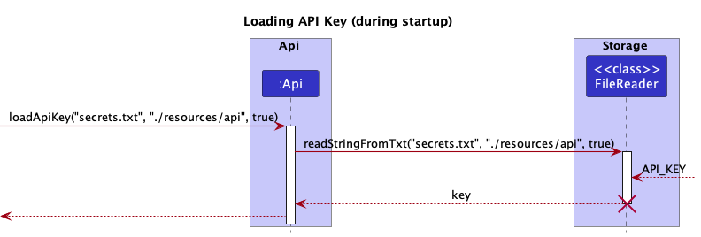

### 2.4 Storage Component

The storage component consists of a `FileReader` and `FileWriter` class in the `seedu.files` package.
`FileReader` is an abstract class and only contains static methods, while `FileWriter` can be instantiated and is used 
in the `API` and `Model` components.
A `LtaJsonWrapper` class is also present, for use with the Jackson JSON parser.

This component: 
- Reads and parses JSON files into a usable format for the program (`CarparkList` and 
`Carpark` classes)
- Read and parse a .txt file with save data into a usable format for the program (`CarparkList` and
  `Carpark` classes)
- Write to a .txt containing save information for carparks that may have been edited by the user
- Regenerate files when an invalid format is detected, and ignore invalid values

For more information on the process of loading files from JSON, please see the section 
[Updating CarparkList with JSON from API](#33-updating-carparklist-with-json-from-api).

### 2.5 UI Component

The user-facing parts of the program are implemented with the `Ui` class.

It implements the following main functions:

- `println()` - Prints either a String or an Ansi followed by a newline using System.out.println().
- `print()` - Prints either a String or an Ansi using System.out.println().
- `printGreen()` - Prints a String in green colour.
- `printRed()` - Prints a String in red colour.
- `printRenderedString()` - Prints a String to render.
- `getLine()` - Asks user for input and returns input.
- `getCommand()` - Asks user for a command input and returns input.
- `showLogo()` - Prints ASCII art of a car and parKING logo.
- `printResult()` - Shows the result of a command execution to the user. Includes additional formatting of the results of 
different commands.
- `printError()` - Print exception message.
- `changeScanner()` - Changes the scanner for the Ui object. To be used for JUnit testing.
- `getSeparatorString()` - Returns a separator string.

### 2.6 Logic Component
How the parsing works:

* When called upon to parse a user command, the `Parser` class creates an `ABCCommandParser` (`ABC` is a placeholder 
for the specific command name eg. `FindCommandParser`) which uses the other classes to parse the user command and
create an `ABCCommand` object (eg. `FindCommand`), which the `Parser` returns back as a `Command` object.

* All `ABCCommandParser` classes (eg. `FindCommandParser`, ``SearchCommandParser` etc) inherit from the `Parser` 
interface so that they can be treated similarly where possible.

How the command works:

* When the `Parser` returns back as a `Command` object, it will run `execute`, which is a method to execute the command
and return the intended result. `Execute` returns a `CommandResult`, which is an object that takes in `String` and
`CarparkList` and returns what the user will be seeing on the terminal.
* Each command will have its own class `ABCCommand` (`ABC` is a placeholder for the specific command name eg. 
`FindCommand`) as an extension of the `Command` class.
* All `ABCCommand` classes will have an override `execute` method, which will override the `execute` method in `Command` 
and return the respective `CommandResult` result of the Command.

### 2.7 Common Component
 
The Common component contain two auxiliary classes that just contain information that may be shared between or accessed by 
multiple other components. Both `CommonData` and `CommonFiles` are abstract and cannot be instantiated, and all fields
within are static and final.

`CommonFiles` contains information regarding files - file and directory paths.

`CommonData` contains assorted information that is packed together for easy access. These fields are ones that may be 
likely to need to be modified. Some examples are strings showing the correct format for using commands, used between 
command classes whenever an invalid input is entered, and the strings containing URLs for the API.

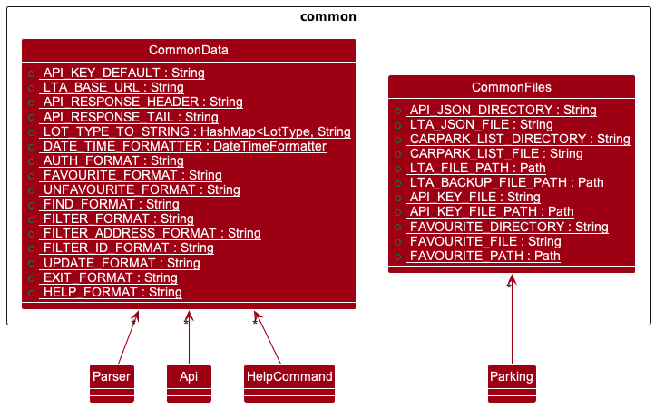

## 3 Implementation
This section describes some noteworthy details on how certain features are implemented.

### 3.1 Favourite / Unfavourite feature

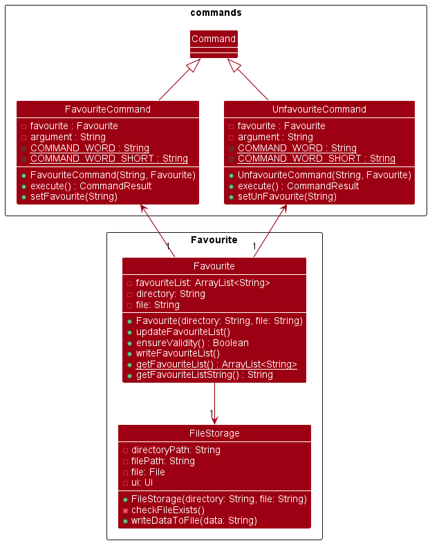

The `Favourite` class uses the `FileReader` and `FileStorage` classes to read and write carpark IDs to a `favourite.txt`
file so that user favourited carparks can be saved locally and retrieved even after the user exits the application.

It contains the following attributes:

- `favouriteList` - An ArrayList of favourited carpark IDs.
- `fileStorage` - A FileStorage object that helps to write to `favourite.txt`.
- `directory` - A String that contains the directory of `favourite.txt`.
- `file` - A String that contains the name of the file, in this case 'favourite.txt'.

It implements the following operations:

- `updateFavouriteList()` - Reads in data from favourite.txt file and saves it to this object.
- `ensureValidity()` - Checks if all carpark IDs inside an ArrayList are valid carparks in a CarparkList.
- `writeFavouriteList()` - Writes all favourite carpark IDs to favourite.txt file.
- `getFavouriteList()` - Static method that returns an ArrayList of favourited carpark IDs.
- `getFavouriteListString()` - Returns a string of all favourited carpark IDs and their lot availability.

The favourite feature is implemented using the `FavouriteCommand` class.

It uses the `Favourite` class to update and write to `favouriteList`.

It implements the following operations:

- `execute()` - Main method to execute different favourite methods based on user input.
- `setFavourite()` - Inserts a carpark into the favourite list.

The unfavourite feature is implemented using the `UnfavouriteCommand` class.

It uses the `Favourite` class to update and remove favourited carparks from `favouriteList`.

It implements the following operations:

- `execute()` - Main method to execute different unfavourite methods based on user input.
- `setUnfavourite()` - Removes a carpark from the favourite list.

Given below is an example of how the various classes are used to perform favourite / unfavourite operations:

Step 1. On startup, `Favourite` is initialised. The main programs calls `loadFavourite()` which calls
`updateFavouriteList()` and `writeFavouriteList()` shortly after to populate and validate its ArrayList with the 
carpark IDs in the file.

Step 2. The user executes `favourite 1` to favourite the carpark with carpark ID `1`. The command is passed to the
Parser class which returns a `FavouriteCommand` object to the main program.
The main program then calls `executeCommand()` which calls `execute()` from the `FavouriteCommand` class.
It first checks if the second argument in the command is equal to `list`. Since this is false, `execute()` checks if 
there exists a carpark with carpark ID `1` by calling `isCarparkValid()` from the `CarparkList` class. If the carpark 
ID is valid, information about the carpark is retrieved from the `findCarpark()` method and `setFavourite()` is then 
called to add the valid carpark ID into `favouriteList`, which searches `favouriteList` for any identical carpark IDs 
and throws `DuplicateCarparkException` if found, to prevent addition of duplicates. `1` is then added into 
`favouriteList` and `setFavourite()` calls `writeFavouriteList()` which overwrites data from `favouriteList` to 
`favourite.txt`.

> Note: If any exception is thrown, `1` will not be added into `favouriteList`, and `writeFavouriteList()` will not be
> called, hence preserving the validity of the carpark IDs.

Step 3. The user executes `favourite 2 3 4` to favourite the carparks with carpark ID `2`, `3` and `4`. Execution is 
similar to Step 2, except now `execute()` will repeat the execution for each additonal carpark ID provided, skipping 
over the invalid carpark IDs.

Step 4. The user realises he/she made a mistake and wants to unfavourite the carpark with carpark ID `2`, and executes
`unfavourite 2`. The command is passed to the Parser class which returns a `UnfavouriteCommand` object.
The main program calls `executeCommand()` which calls `execute()` from the `UnfavouriteCommand` class. `execute()` 
checks if there exists a carpark with carpark ID `2` by calling `isCarparkValid()` from the`CarparkList` class. If the 
carpark ID is valid, `setUnfavourite()` is called, which first checks if `favouriteList` contains an entry that matches 
`2`, and throws `NoCarparkFoundException` if none is found. Next, `2` is removed from `favouriteList` and 
`setUnfavourite()` calls `writeFavouriteList()` which overwrites data from `favouriteList` to the favourites file.

Step 5. The user wants to view all favourited carparks and executes `favourite list`. The command is passed to the
Parser class which returns a `FavouriteCommand` object. The main program calls `executeCommand()` which calls 
`execute()` from the `FavouriteCommand` class. After checking if the second argument is equal to `list`, 
`updateFavouriteList()` and `writeFavouriteList()` are called to get and validate the most updated favourited carpark 
IDs before `getFavouriteListString()` is called. The carpark IDs and lot availability of all favourited carparks are 
then passed back to the main program in a `CommandResult` class.

The following sequence diagrams shows how a favourite / unfavourite command works:

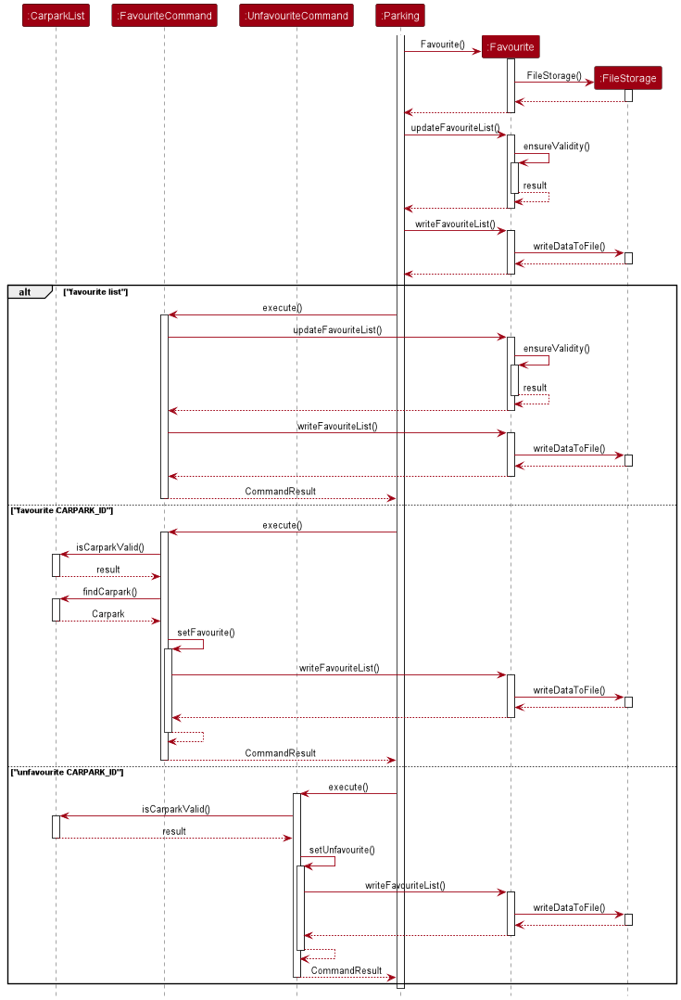

#### 3.1.1 Design Considerations

**Aspect: Format of input after `favourite` or `unfavourite` command**
- **Alternative 1 (current choice):** Carpark ID
    - Pros: More direct, do not need to search before favouriting
    - Cons: User has to either memorise the carpark ID they want to favourite, or search and type in the whole carparkID
- **Alternative 2:** Index of search result
    - Pros: Less time needed to favourite after a search result, do not need to key in entire carpark ID again
    - Cons: Need to search before favouriting, even if user already knows the exact carpark ID

### 3.2 Update Data from LTA API Feature

Before going deep into how the data is fetched from the LTA API, we will run through how the API component of data fetching works.

1. The initialisation of the class will make an instance of the `Storage`, `HttpClient` and `Ui` class.
2. If the program just started, the Parking class will call the `loadApiKey` method.
    - If no file called `secret.txt` is found, file will be created.
    - If the file is empty, default key will be loaded to the Api instance (but not written to the local file).
3. To get a certain data set from the Api Service,
    - Call `asyncExecuteRequest` method to construct the HTTP request packet header and sends the request
      asynchronously.
    - Call `fetchData` method to get response immediately from the Api.
        - This method will also validate the response from the Api by identifying the response code.
        - Unless its 401 Unauthorised Access (due to invalid Api key), the method will try to fetch data
          at most 5 times.

Since each API call only returns 500 data, we need to make multiple api calls. Thus, there is another function
that handles the API calls all at once. The process is still similar.
1. Same step 1 and 2 above.
2. Call `syncFetchData` method, which calls both the `asyncExecuteRequest` and `fetchData` five times (LTA only has less
   than 2500 Parking lot data)
    - This method makes all 5 request asynchronously and receives the response in sequence.
    - The method will concatenate the data together for data processing by other parts of the program.
    - The processed data will then be stored in a local data file.

The following sequence diagram shows how data is fetched using the `update` command.
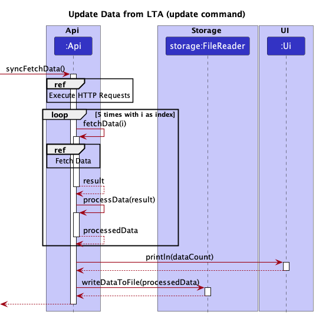

These are the reference sequence diagram to complement the above diagram.
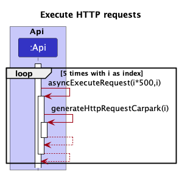
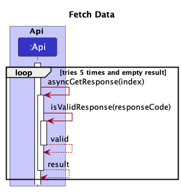

### 3.2.1 Design Considerations

**Asynchronous request**

We chose Land Transport Authority's API service to provide us with the carpark availability due to
it having access to multiple agency's database. Thus by using only one API we can get more carpark
lots. Government API services usually utilise pagination (in this case the `skip` parameter), such that
each query only gives you a maximum of 500 data. As a result, multiple calls are needed to capture
the complete database that the API service can offer.

Thus, we utilise asynchronous calls to make all the HTTP request first, and then fetch the response
one by one. This means that the responses coming into our program are not bottlenecked and will be
faster than if we were to use synchronous request.

After receiving all the data from the responses, we need to concatenate them into one file 
such that the parser only needs to read from one file. This is done so as to minimise the possibility
of read failure or exception being thrown.

**Synchronous request capability**

Although we focus more on the asynchronous part, the program right now also supports synchronous calls
for future development such as updating a specific value instead of the whole data. By calling the 
`asyncExecuteRequest` and `fetchData` function we can simulate synchronous HTTP request.

### 3.2.2 Limitations of the LTA API

**Inconsistent dataset received**

During the course of our development, we found out that sometimes the responses we receive are not the
full set of 500 data per call. This led to some confusion at first but the behaviour seems random
and definitely not caused by our program. Thus, we have to do multiple checks such as checking whether 
any data is being send over (even if response is 200 OK) and tabulate the number of carpark that exists
in the response.

**Dataset does not adhere to the documentation**

Coming to the end of our development where we place more emphasis on unit testing, we found out
that LTA may give us invalid data. For example, in the documentation, only 3 types 
of carpark lot type exists: C (Car), H (Heavy Vehicles) and Y (Motorcycle). However, upon further inspection
we found out that there is a fourth type, M.

Another problem we found out is that LTA does not do its own data validation. Thus we found some 
carparks having negative number of available lots. This is a big problem as from the user's perspective
it can be that our program is at fault. 

Due to such bug discoveries, we made our carparkList parser much more robust and it now does data
validation internally to ensure no such data is presented to the user.

### 3.3 Updating CarparkList with JSON file from API 
The following is an overview of the sequence of what is called at initialization and with the use of the `update` command:

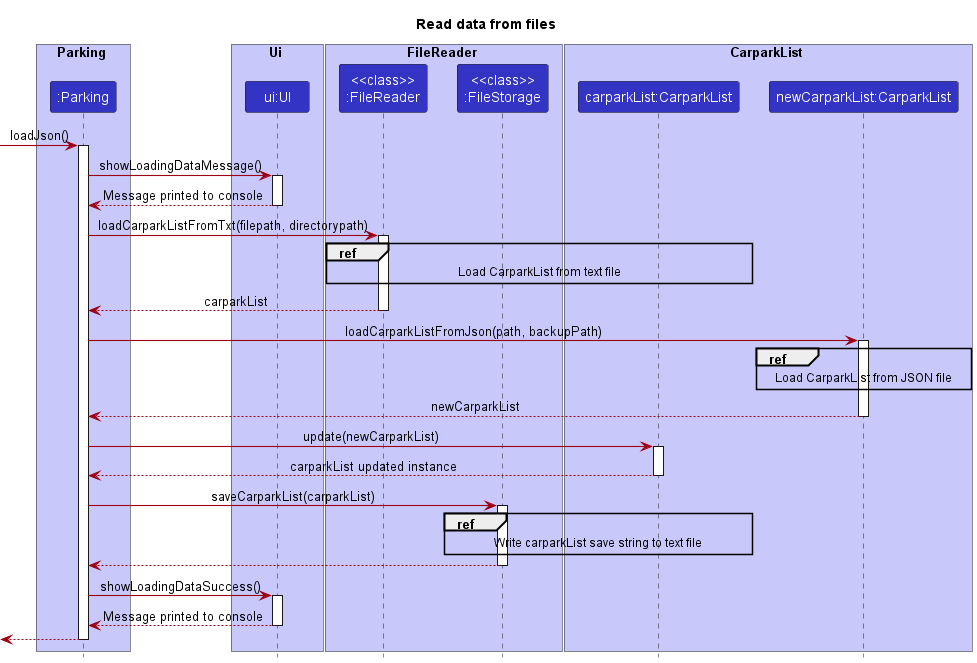

The sequence can be summarized as follows:
1. Read and parse a .txt file containing save information into `carparkList` as a `CarparkList` object
2. Read and parse a JSON file containing new availability information into `newCarparkList`, also a `CarparkList` object
3. Update `carparkList` with new availability information from `newCarparkList`
4. Write the save string generated from `carparkList` into a .txt file

> NOTE: For viewing ease the list of carparks inside the carparkList will be sorted upon generation by carpark ID.

More detailed information including exception handling will be in the sections below:

#### 3.3.1 Loading CarparkList from text file
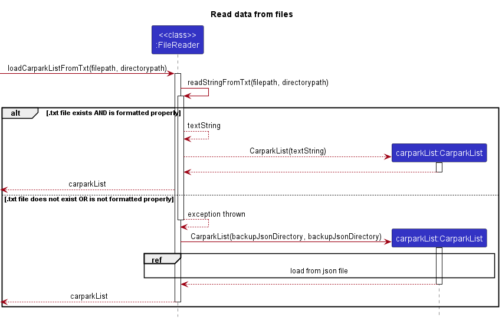

The program will attempt to read from a .txt file. This .txt file contains a save string
of the CarparkList as last modified by the program. Additionally, the user can customise this by changing some fields
(for example, renaming a carpark to "Near my house" for convenient viewing later), while will be loaded and stored by the program.

The sequence of events is as follows: 
1. The program attempts to read a save string from the given filepath (of the `carparkList.txt` file).
2. If the text file exists and is of a valid format, the text string is returned to the method, which is then parsed
into a valid CarparkList object, and then returned to the program.
3. If the text file doesn't exist or has an invalid format, the text string is not written, and the Load JSON method is called instead
to generate from a backup. This backup is guaranteed to be valid, as explained in [3.3.2 Loading CarparkList from JSON file](#332-loading-carparklist-from-json-file)

##### 3.3.1.1 Design Considerations
**Choice of "last resort" backup loading**

The reason for reading from the backup JSON as a last resort is so that no loss of information is found: the LTA API on occasion
will only return 500 or a variable number of carparks. If the last resort is to parse the fresh JSON from the LTA API into 
program, if the new CarparkList only has 500 objects, some objects in the `Favourites` list may become invalid, and more than that, 
a large portion of carpark information will not be available at all.

As such, we elected to use the backup JSON as a base as a verifiable comprehensive sampling of carparks, so no information
will be invalid and users can still filter and search for these carparks that might be unable if the freshly fetched API was used.
To allow users to work around this, we have a "Last Updated" field in the detail view to allow users to see if the carpark
has been just updated or was not updated by the API call.

**Invalid format behaviour**
Invalid formatting may result when users tamper with the file by adding or removing delimiters (`||`), or entering data that will result
in an improperly formatted CarparkList object. For example, changing the carparkId field for a carpark such that
two carparks clash will result in the `find` command not working properly as the HashMap will not be able to take
duplicate values.

It was decided for the same reason above that rather than just ignoring single rows and using new ones, any invalid formatting at all
will cause the entire text string to be ignored (and overwritten later). This is because a user causing a single row to be invalid may cause
that row to be skipped, and if the `Favourites` list includes that particular row, it may cause a mismatch in expected information
between the user and the program.

#### 3.3.2 Loading CarparkList from JSON file
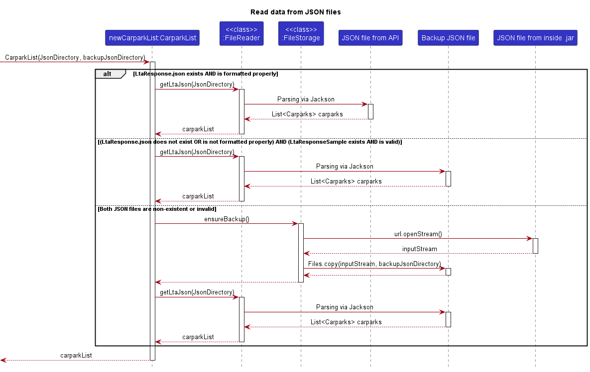
The sequence of events from loading from a JSON file is as follows:
1. The program attempts to read a JSON from the given filepath for `LtaResponse.json`.
2. If the `LtaResponse.json` file exists and is of a valid format, it is read by the Jackson parser, creating `Carpark`
   objects, which will then be returned to the program.
3. If the `LtaResponse.json` doesn't exist or has an invalid format, `LtaResponseSample.json` is read instead: a backup
file to be used if there is no internet connection or an error with the LTA file. 
4. If both the `LtaResponse.json` and `LtaResponseSample.json` file come with errors, the the `LtaResponseSample.json` is regenerated
by copying from within the .jar file. It is then read again, and the `CarparkList` object is returned.

**Invalid format behaviour**
In the UG, users are warned not to tamper with these two files as it may result in regeneration of the files due to invalid format. As with the
`carparkList.txt` file, any errors at all will cause the entire file to be ignored and the backup to be used instead. The backup `LtaResponseSample.json` should not be tampered with either, but if it is will always be regenerated from the `.jar`, which should never fail.

#### 3.3.3 Writing to text file
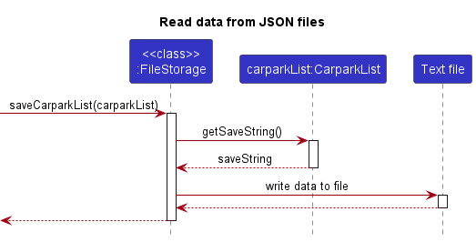
The sequence of events for writing to a text file is as follows:
1. The program calls the `getSaveString()` method inside of the `carparkList` passed in as a parameter.
2. This save string is written to the text file.

If the file cannot be found or the appropriate directories are missing, the file structure and new text file will be regenerated and then written to.

### 3.4 The `filter` command
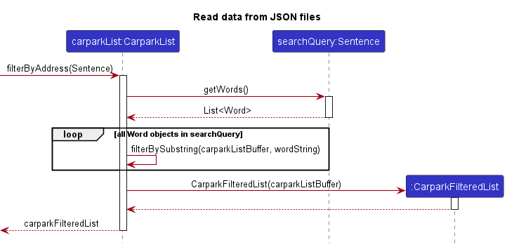
The `filter` command is one of the more complicated functions of the program. The sequence diagram above shows the sequence of events when the `filterByAddress` method inside of `carparkList` is called.

The private `filterBySubstring` method assigns a `HashSet<Carpark>` object `carparkListBuffer`, all carparks with development sentences that 
match the substring. At the same time, the `Word` object inside that `Carpark` object's developmentSentence that matches the substring is marked as bold, for use with the Jansi formatting later on, where words that match the query are marked with a different colour for easy viewing.

The `Argument` class that the `filter` command uses for error checking is an extension of the `Sentence` class with additional methods to count dashed arguments. This is to ensure that the appropriate number of arguments and dashed arguments are in the command.

> Note: Only prefixing substrings (substrings in the beginning of the word) will be counted as a match.

### 3.5 Jansi formatting

The `Ui` class makes use of the `jansi.render()` function to render strings that were formatted earlier with codes to mark which text should be coloured. 

The Jansi library does not work within the IDE (tested in IntelliJ), but works with consoles in Mac, Linux and Windows 10 and above. If the console environment is currently not supported, `jansi.render()` strips all formatting and returns just the plain text, resulting in clean but uncoloured text.

Future plans will support more extensive colouring of the UI.

### 3.6 Exception Handling

All custom exceptions within the program inherit from the abstract `ParkingException` class. The majority of custom exceptions have a built-in message in the class itself rather than loading a message in via a constructor. This is to encourage specific exceptions that should only have a message for one problem, and to prevent rewriting the same error message if the Exception is thrown in multiple files. In some cases, this string requires a `String.format()` method call to format properly - for example, with the `InvalidCommandException`.

Exceptions are generally handled by using the `Ui.printError()` method which takes one parameter of type  `ParkingException`. This method will print the string by calling `getMessage()` in the exception and formatting it red so the user can recognise it is an error easily.  

Some exceptions to the method is `InvalidFormatException` and `NoFileFoundException`. These exceptions, while being a specific
problem, are wide enough in scope for messages to vary wildly depending on the nature of the file exception or the invalid format.

# Appendix
## Appendix A:  Product scope
###  Target user profile

The target user that we have in mind is a driver who needs to find a carpark slot and wants to find the carpark 
information so he knows where he can park. We want to make the data from LTA easier to read for users who are able to 
use CLI. This would be a more efficient way for Singaporean drivers to be able to obtain information regarding their 
desired carpark and also for them to be able to filter our carparks based on their addresses. Most importantly, it
does not require any internet connection to use if users want to search carpark information (based on what was last updated).

### Value proposition

parKING is a desktop app that helps Singaporean drivers find and filter out carpark information easily, and is optimized
for use via a Command Line Interface (CLI).

## Appendix B: User Stories

| Version | As a ... | I want to ...                                                  | So that I can ...                                           |
|---------|------|----------------------------------------------------------------|-------------------------------------------------------------|
| v1.0    |Driver| Search lot availability by 5 digit code for a specific carpark | Know where I can park                                       |
| v1.0    |User with no internet| Access a list of available carparks on the app offline         | Estimate where I can park based on last updated information |
| v2.0    |Driver| Be able to save favourites                                     | Monitor carparks important to me                            |
| v2.0    |Driver| Import my favourite carparks                                   | Use my saved settings/preferences across different devices  |
| v2.0    |Driver| Filter the carparks based on their address                     | Search for carparks without knowing the carpark Id          |
| v2.1    |Driver| Search for carparks based on carpark ID                 | Search for carparks without knowing the carpark address     |
| v2.1    |Driver| Have my carpark information be colour coordinated              | Look at carpark information with ease                       |

## Appendix C: Non-Functional Requirements

{Give non-functional requirements}

## Appendix D: Glossary

* *glossary item* - Definition

## Appendix E: Instructions for manual testing

The following command(s) do not take any arguments:
- `list`
- `help`
- `exit`
- `update`

The following command(s) take only 1 argument:
- `find`
- `auth`
- `favourite`

The following command(s) take in more than 1 argument:
- `filter`
- `filter -id`
- `filter -address`

Users can test both Favourite.txt and CarparkList.txt to modify the data being passed to the program.

Refer to the User Guide for accurate information regarding the valid and invalid inputs. Users can try giving carpark IDs or addresses that do not exist.