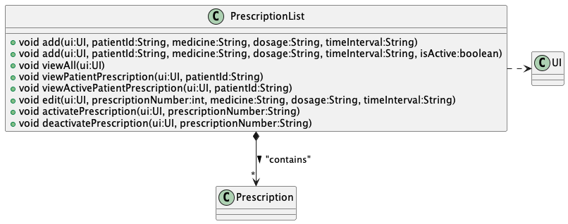

# Developer Guide

## Acknowledgements

{list here sources of all reused/adapted ideas, code, documentation, and third-party libraries -- include links to the original source as well}

## Design & implementation

The Patient and PatientList classes are used in conjunction to manage patients, and the list of patients. Each patient has a name,
an ID, a date of birth and gender. The PatientList class holds an ArrayList of Patients and manipulates them accordingly.

At the start of the program, a new PatientList object is instantiated. Through methods in the Storage class, data is read from the
relevant text files to create Patients that existed prior to the last closure of the program, and then adds these patients to the
ArrayList in PatientList. This finishes the initial set-up.

Methods in PatientList class:

addPatient - this method takes in the aforementioned variables through UI class and parses them. If they are all valid, a new
Patient is created and added to the ArrayList in PatientList.

findPatient - this method takes in an ID, iterates through the ArrayList of Patients and compares the ID with the ID of each of the
existing Patients in the list. If there is a match, the corresponding Patient is returned. Else, returns null.

retrievePatient - this method is very similar to findPatient, but instead of returning the Patient found, it prints out the details
of the Patient using the toString method in the Patient class.

listPatients - this method first checks if the ArrayList of Patients is non-empty. If not so, it prints a message that there are
no patients in the system currently and terminates.
Else, it iterates through the ArrayList of Patients and uses the toString method in Patient to print out the details of each Patient.

modifyPatientDetails - this method takes in name, birthDate, gender and ID. It tries to find the patient with a matching ID.
If the patient is not found, returns. Else, if the name is not an empty String, replace the existing name with the input name.
Repeat for birthDate and gender.

### VisitList Component
The `VisitList` Component,
* stores the list of visits
* can add new visit to the list
* can edit reason for a existing visit in the list
* can view all visits in the list
* can view visits for a specific patient, based on their id

### PrescriptionList component
**API**: `PrescriptionList.java`

The `PrescriptionList` component,
* stores the list of prescriptions
* can add new prescription to the list
* can edit existing prescriptions inside the list
* can change the status of prescription inside the list
* can view all prescriptions, view a patient's prescription or view a patient's active prescription 
* depends on `UI` class (because the `PrescriptionList` component needs to interact with user through the `UI` 
component)

**Methods in `PrescriptionList` class:**

* **`add`** - This method allow user to add prescription into the list by specifying `patientId`, `medicine`, `dosage` and 
`timeInterval`.
* **`viewAll`** - This methods iterates through the list of all prescriptions and print the details of prescriptions from
all patients.
* **`viewPatientPrescription`** - This method iterates through the list of prescriptions and print the details of 
prescriptions from the specified `patientId`.
* **`viewActivePatientPrescription`** - This method iterates through the list of prescriptions and print the details of
all active prescriptions with the specified `patientId`
* **`edit`** - This method allows user to edit the `medicine`, `dosage` or `timeInterval` of the prescription of the 
specified index
* **`activatePrescription`** - This method allows user to set the prescription of specified index as active.
* **`deactivatePrescription`** - This method allows user to set the prescription of specified index as inactive.

## Product scope
### Target user profile

{Describe the target user profile}

### Value proposition

{Describe the value proposition: what problem does it solve?}

## User Stories

|Version| As a ... | I want to ... | So that I can ...|
|--------|----------|---------------|------------------|
|v1.0|new user|see usage instructions|refer to them when I forget how to use the application|
|v2.0|user|find a to-do item by name|locate a to-do without having to go through the entire list|

## Non-Functional Requirements

{Give non-functional requirements}

## Glossary

* *glossary item* - Definition

## Instructions for manual testing

{Give instructions on how to do a manual product testing e.g., how to load sample data to be used for testing}
