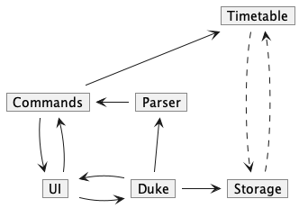
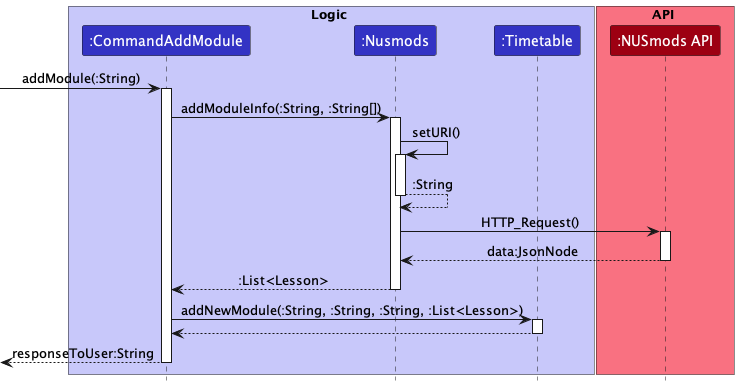

# Developer Guide

## Acknowledgements
Ideas for this project partly comes from NUSmods at https://nusmods.com/

API and library used includes the following:
- [NUSMods API](https://api.nusmods.com/v2/) - To extract information about modules in NUS
- [FasterXML](https://github.com/FasterXML/jackson) - Helps parse json files from the NUSMods API

## Design & implementation
#### Architecture

The ***Architecture Diagram*** given above presents the high-level design of the product. The main components included are as follows:
1. `Duke`: Initialised when launch and acts as the main logic component of the program.
2. `UI`: Handles all user interaction, including printing responses and receiving user inputs.
3. `Parser`: Parses main user commands and calls for appropriate functions.
4. `commands`: Exists as a package which includes all command functions.
5. `Timetable`: Contains all the data in the current session. (Data can only be accessed and manipulated by commands)
6. `data`: Manages the saving and loading of the current session data.
7. `Nusmods`: Handles all communication to the NUSMods API and extracts useful information that is used for the rest of
   the program.

The design of the product focuses on low coupling and high cohesion. Following as closely to the Single Responsibility Principle (SRP) as possible, each major component explained above has unique roles which is not overlapped by another component. For example, printing of all responses go through the UI class, which handles all interactions with user, including the display of program responses.

---

#### Key Features
##### Adding modules to current timetable

The ***Sequence Diagram*** above is a simplified depiction of how new modules are added to the user current session timetable. The feature is rather complex due to the need to query, extract, and check the data before adding it to the timetable. Thus, a few design decisions were made:

* The class CommandAddModule manages the key actions (as explained above) from a higher level.
* The class Nusmods manages all interactions with the NUSmods API and deals with JsonNode objects.
* Any particular module is only added to the current session timetable through the Timetable class after all relevant data has been extracted, packaged and checked.
* Module object consists of all relevant data for the module, including code, name, details, all available lessons, and lessons that is to be attented by the user.

The class CommandAddModule provides control abstraction to the comlpex operation as it abstracts away lower level data items such as the day and time of a specific tutorial class for a particular module.

By having a separate class Nusmods deal with all API calls and JsonNode objects, it allows the other classes/components to only have to work with simpler data types and native objects (such as Module and Lesson objects).

Other alternatives considered includes having the CommandAddModule class handle the API call but it would have resulted in the code being even more convoluted and less readable.

In the current design, we keep all data within the Timetable class 'clean', in other words, no program failure should occur when working with the data. Thus all checks, such as if the module exists for the semester indicated, are done before adding the module to the timetable. This gives the assurance that other functions executed by the program will not fail due to invalid data.

Lastly, the objects in the program is designed in such a way where it is possible to pass a single larger object rather than many smaller objects each containing different data. Thus, by adding an entire Module object into an ArrayList in the Timetable class, other operations can access the required data more easily without uneccessary coupling.

---

#### Data
The `data` component:
* Saves module and information on which lessons the user is attending into a text file which is read during a app relaunch.
* Makes the API calls based on which modules were present in the previous save.
* Has 3 static classes that manage data:
  * `DataManager`: Handles and manages the saving and loading of data. It uses the other two classes to do so.
  * `ModuleManager`: Handles information regarding the modules the user has selected. Information is stored in `ModuleData.txt`
  * `AttendingManager`: Handles information regarding the lessons the user is attending. Information is stored in `AttendingData.txt`

Design Decision:
* The data component is designed in such a way where there is a balance between how much data is stored and how easy it is to manage the data.
* An alternative approach is to hardsave the entire session data, including lesson information, into a text file. However, this introduces additonal steps to parse the data and makes the code less readable and more prone to bugs.
* The method which uses API calls is chosen. This reduces the amount of data that needs to be written into the textfile and allows for reusing the addModule function of the program.
* The drawback of this is that the API call msut be successful and internet connection is required.

## Product scope
### Target user profile

The target user profile is as follows:
* Comfortable with using Desktop CLI apps
* Prefers typing over mouse interactions
* A student of National University of Singapore (NUS)
* Takes official valid NUS modules
* Has a need to manage and plan his/her timetable

### Value proposition

The value proposition of the product lies in its ability to aid the management and planning of a university timetable containing NUS modules.

## User Stories

| Version | As a ...     | I want to ...                                                  | So that I can ...                                             |
|---------|--------------|----------------------------------------------------------------|---------------------------------------------------------------|
| v1.0    | NUS Student  | See all the timings of the tutorials/lectures I am involved in | Plan my work schedule conveniently                            |
| v1.0    | NUS Student  | View the details of any module                                 | Get an overview of what the module is about                   |
| v1.0    | NUS Student  | Keep track of the modules I want to take                       | Better plan out my schedule                                   |
| v1.0    | NUS Student  | Remove the modules I do not wish to take                       | Keep only the modules that I am interested in                 |
| v1.0    | NUS Student  | Plan my schedule for the semester                              | Better prepare myself for the semester                        |
| v1.0    | NUS Student  | Preserve my timetable information across program runs          | Plan my timetable once and never have to worry about it again |
| v2.0    | user         | find a to-do item by name                                      | locate a to-do without having to go through the entire list   |

## Non-Functional Requirements

1. Program should run on any mainstream OS that runs Java 11 and have a stable internet connection
2. Users should be able to easily use all functionalities if they have a general idea of module codes in NUS.

## Glossary

* *glossary item* - Definition

## Instructions for manual testing

Given below are instructions to test the app manually.

**Note:** These instructions only provide a starting point for testers to work on;
testers are expected to do more *exploratory* testing.

#### Launch and shutdown

1. Ensure that you have Java 11 or above installed.
2. Down the latest version of `tp` from [here](http://link.to/duke).
3. Copy the jar file into an empty folder.
4. Open a command window or terminal for mac in that folder.
5. Run the command `java -jar tp.jar` in the same folder.
6. To shutdown, either enter `0` when prompted to enter a semester, or `quit` as a command in the main program.

#### Adding a module

1. Adding a module when module already exists in Timetable

  1. Prerequisites: List all persons using the `list` command. There should already exist the module that is to be double added.

  2. Test case: `add`, then `exampleModuleCode`
       Expected: Module should not be double added. Use `list` command again to check.
       
#### Deleting a module
1. Deleting a module when module already exists in Timetable

   1. Prerequisites: List all persons using the `list` command. There should already exist the module that is to be deleted.
   
   2. Test case: `delete`, then `exampleModuleCode`
       Expected: Module should be deleted. Use `list` command again to check.
   
   3. If there is no module in the list, user will be prompt that no module exists in the list.

### Saving data

1. Dealing with missing data files
  - Make a manual deletion of any saved data file with either name `Sem1DataDirectory` or `Sem2DataDirectory`.
  - Run the program, there should not be any errors and a new directory with the correct files should be created.

2. Dealing with corrupted module data files
  - Add "abc" as a random string inside the data file `ModuleData.txt`.
  - Run the program and enter the semester corresponding to the data file. The program should quit and indicate that the API call failed.

3. Dealing with corupted attending data files
  - Add "abc" as a random string inside the data file `AttendingData.txt`.
  - Run the program and enter the semester corresponding to the data file. The program should quit and indicate that there is file corruption.
