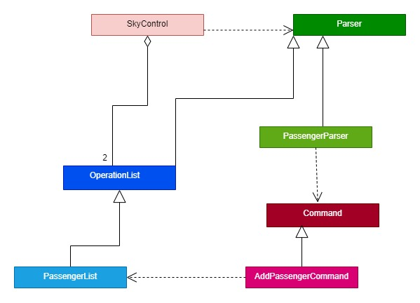

# Developer Guide

- [Acknowledgements](#acknowledgements)
- [Design](#design)
    1. [Architecture](#architecture)
    2. [Ui component](#ui-component)
    3. [Parser component](#parser-component)
    4. [Command component](#command-component)
    5. [OperationList component](#operationlist-component)
    6. [Storage component](#storage-component)
    7. [Common classes](#common-classes)
- [Implementation](#implementation)
- [Product scope](#product-scope)
    1. [Target user profile](#target-user-profile)
    2. [Value proposition](#value-proposition)
- [User Stories](#user-stories)
- [Non-Functional Requirements](#non-functional-requirements)
- [Glossary](#glossary)
- [Instructions for manual testing](#instructions-for-manual-testing)

## Acknowledgements

* The code package command was inspired by a similar package of [@ivanthengwr](https://github.com/ivanthengwr)'s
  [command package](https://github.com/ivanthengwr/ip/tree/master/src/main/java/duke/command) in his ip.
* The style of document for the developer guide is inspired by the DG of
  [AY2122S1-CS2113T-T10-3](https://github.com/AY2122S1-CS2113T-T10-3/tp/blob/master/docs/DeveloperGuide.md#purpose-of-this-guide)

## Design

### Architecture

The ***Architecture Diagram*** given above explains the high-level design of the application.

Given below is a quick overview of the main components and how they work with each other.

**Main components of the architecture**

`SkyControl` is responsible for:

- At application launch: Initialises the components in the correct sequence, and connects them up with each other.
- At shut down: Shuts down the components and exits the application safely.

The rest of the app consists of five components.

- [Ui](#ui-component) : Handles user input and message output to the console
- [Parser](#parser-component) : Reads the user's input and converts it to a functional command
- [Command](#command-component) : Contains the various commands
- [OperationList](#operationlist-component) : Contains the various operations to be executed based on the commands,
  also holds the data of the App in memory
- [Storage](#storage-component) : Reads data from, and writes data to the hard disk

**How the architecture components interact with each other**

The sequence diagram below shows how the components interact with each other for the scenario where the user issues
a valid `flight add` command.

Each of the component is initialised in `SkyControl`, the `parse` , `execute` and `insertIntoFile` methods are
called by the `run` method in `SkyControl` which continuously takes in user input and executes accordingly until the app
is shut down.

### Ui component

Here is a partial class diagram of the `Ui` component.

The `Ui` component consists of:

- `Ui`: Manages access to the `Scanner` object that reads user input and also contains all the methods
  for printing to the user.
  It also contains methods which return strings to be printed to the user.

### Parser component

Below is a partial class diagram that shows an overview of the `Parser` component.

Certain boolean methods and variables in `Parser` class used to classify the user input are not included for simplicity.

The `Parser` component consists of:

- `Parser`: Handles the user input and determines which specific parser class's method to be used
- `FlightParser`: Takes in the parsed user input from `Parser` and instantiates a new `AddFlightCommand`,
  or `DeleteFlightCommand`, or `ListFlightCommand` to be executed.
- `PassengerParser`: Takes in the parsed user input from `Parser` and instantiates a new `AddPassengerCommand`,
  or `DeletePassengerCommand`, or `ListPassengerCommand` to be executed.
- `ModificationParser`: Takes in the parsed user input from `Parser` and instantiates a new `ModifyFlightNumCommand`,
  or `ModifyGateNumCommand`, or `DelayFlightCommand` to be executed.

### Command component

Here is a partial class diagram that shows an overview of the `Command` component.

Trivial methods such as getters are omitted from the diagram for simplicity. The overriden `execute()` method
is also taken out to improve visibility of the association.

The `Command` component consists of:

- `Command`: An abstract class that standardises the format of a command with the abstract method `execute()`
  , the other specific command classes override `execute()` to call the corresponding
  operations such as adding or deleting.
- `AddFlightCommand`: Handles the case when the command is to add a flight
- `DeleteFlightCommand`: Handles the case when the command is to delete a flight
- `ListFlightCommand`: Handles the case when the command is to list all the flights
- `DelayFlightCommand`: Handles the case when the command is to delay a flight
- `ModifyFlightNumCommand`: Handles the case when the command is to change the flight number
- `ModifyGateNumCommand`: Handles the case when the command is to change the gate number
- `AddPassengerCommand`: Handles the case when the command is to add a passenger
- `DeletePassengerCommand`: Handles the case when the command is to delete a passenger
- `ListPassengerCommand`: Handles the case when the command is to list all the passengers
- `ExitCommand`: Handles the case when the command is to exit the application.

### OperationList component

Below is a partial class diagram that shows an overview of the `OperationList` component.

The various methods implemented to ensure the operations are done correctly are not included to
maintain simplicity.

The `OperationList` component consists of:

- `OperationList`: An abstract class that contains the flight and passengers information.
  It also contains abstract methods of the operations to be implemented
  by the `FlightList` or `PassengerList` class.
- `FlightList`: Implements the various operations such as adding, deleting and listing of flights
  by inheriting the abstract methods provided in `OperationList`.
  Contains various methods to check the validity of the operation called, throws an exception otherwise.
- `PassengerList`: Implements the various operations such as adding `AddOperation()`, deleting `DeleteOperation()`
  of passengers by inheriting the abstract methods provided in `OperationList`.
  Contains various methods to check the validity of the operation called, throws an exception otherwise.

### Storage component

Below is a partial class diagram that shows an overview of the `Storage` component.

The `Storage` component consists of:

- `Storage`: Handles the file related operations such as creation of files and reading from files or saving to files.

To add on, the `Storage` component is designed to only access the following folders:

1.`data/`:For SkyControl.txt file.

> The rationale behind standardizing a specific folder to read/save to, is to ensure that
> all relevant files can be found in the same location, which makes it easier for users
> to find the files they are looking for.

### Common classes

The `seedu.duke.exceptions` package contains the `SkyControlException` class and `SyncException` class which are used
by the various components to be thrown as exceptions and print specific error messages to the console.

## Implementation

This section would focus on explaining the application flow and the specifics on how the features are implemented.

**List of Commands**

The following sequence diagrams to showcase the list of commands,
parser() method will not be reflected in order to improve readability.

1. [Add a passenger feature](#add-a-passenger-feature)
2. [Delete a passenger feature](#delete-a-passenger-feature)
3. [List passengers feature](#list-passengers-feature)
4. [Add a flight feature](#Add-a-flight-feature)
5. [Delete a flight feature](#Delete-a-flight-feature)
6. [List flights feature](#List-flights-feature)

---

### Add a passenger feature

The command Add a passenger adds passenger details of a particular passenger to the passenger list.

**Overview of relevant classes**

**_NOTE:_** Minimal representation of structure of `AddPassengerCommand`

When the main class `SkyControl` receives a user input, it parses the input with the
help of the `Parser` class which then forwards the input to the `Passenger Parser` class accordingly.
The `Passenger Parser` retrieves the command `AddPassengerCommand` and returns it to `SkyControl` where
further methods will be triggered as explained below.

**Sequence Diagram**

**_NOTE:_** Exceptions are omitted for readability.

1. Once the `AddPassengerCommand` is instantiated, the `execute` method is called from the `SkyControl`
   class with passenger list and user input as method parameters.
2. Within `AddPassengerCommand` the method `getPassengerDetail(String lineInput)` is called to extract the String
   consisting of passenger details from the line input.
3. `AddPassengerCommand` then calls the method `addOperation(String passengerDetail)` within the `PassengerList` class.
4. `getPassengerDetails(String passengerDetail)` method then extracts each of the passenger detail into an attribute in
   the `PassengerList` class
5. `passenger` object of the class `PassengerInfo` is instantiated using the attributes retrieved from the method in
   Step 4. The `passenger` object is then added to the list of passengers
6. `Ui` class level method `showAddedPassenger(PassengerInfo passenger)` is used to display to the user that passenger
   has been added to the list successfully.

---

### Delete a passenger feature

  

A delete function that removes a passenger's detail from the passenger's log book is
facilitated by `DeletePassengerCommand`. It extends an abstract `Command` with an override method called `execute`.
The abstract `Command` extends a `Parser` which holds and validates the User input to determine the type of command.

  

Furthermore, `DeletePassengerCommand` implements the following operation:

* `execute(OperationList passengers, String lineInput)` &#8594; An override method inherited from `command`
  to execute the delete operation that should remove a passenger from the logbook

  
The class diagram as depicted below shows the behaviour of the passenger delete operation explained in two parts.  
This scenario assumes that the manager have input a valid `passenger delete` command for easier readability.  

  

Part 1:

* The valid `passenger delete` command is passed as a `String lineInput` into the function `parse` to valid
  the type of command that needs to be executed.
* Once validated, a new Command called `DeletePassengerCommand` should be instantiated.

Part 2:

* `DeletePassengerCommand` would then call `execute(passengers, lineInput)`,
  associating itself with PassengerList to obtain the existing `ArrayList<FlightInfo> passengers`.
* From there, `deleteOperation` method would run within method `execute` and terminate only when there is no such
  passenger
  found or when a passenger is removed.

**Sequence diagram**

**_NOTE:_** Exceptions are omitted for readability.

When `paser` verifies that the command is an entity `passenger` and `delete` operation,
`DeletePassengerCommend` is instantiated.

1. `execute(passenger, lineInput)` will run within `DeletePassengerCommend`
   which in turn would call on `deleteOperation(passengerDetail)` in `PassengerList` class.
2. Within `deleteOperation(passengerDetail)`, it would loop the arraylist `passengers` obtained from `OperationList`.
3. If passenger is found, delete object `passenger` from `passengers`. ELse, return without deletion.

---

### List passengers feature

  

A list function lists out all passengers' details in table form which is facilitated by `ListPassengerCommand`. It
extends an abstract `Command` with an override method called `execute`.
The abstract `Command` extends a `Parser` which holds and validates the User input to determine the type of command.

  

Furthermore, `ListPassengerCommand` implements the following operation:

* `execute(OperationList passengers, String lineInput)` &#8594; An override method inherited from `command`
  to execute the list operation that should list out all the passengers from the logbook.

  
The class diagram as depicted below shows the behaviour of the passenger list operation explained in two parts.  
This scenario assumes that the manager have input a valid `passenger list` command for easier readability.  

Part 1:

* The valid `passenger list` command is passed as a `String lineInput` into the function `parse` to valid
  the type of command that needs to be executed.
* Once validated, a new Command called `ListPassengerCommand` should be instantiated.

Part 2:

* `ListPassengerCommand` would then call `execute(passengers, lineInput)`,
  associating itself with PassengerList to obtain the existing `ArrayList<FlightInfo> passengers`.
* From there, `listOperation` method would run within method `execute` and
  prints out all `passengers` details on a table format.

**Sequence diagram**

When `paser` verifies that the command is an entity `passenger` and `list` operation,
`ListPassengerCommend` is instantiated.

1. `execute(passenger, lineInput)` will run within `ListPassengerCommend`
   which in turn would call on `listOperation()` in `PassengerList` class.
2. Within `listOperation()`, it would first check if arraylist `passengers` obtained
   from `OperationList` is empty or not.
3. If `passengers` is empty, prints empty table, else prints respective passenger details in table form.
4. The sequence diagram assumes that a passenger detail is present in the list to be deleted. 

---

### Add a flight feature

The Add a flight function adds a flight with its corresponding details to the flight list.

**Sequence Diagram**

**_NOTE:_** Exceptions are omitted for readability.

When the `Parser` recognizes the `add flight` command, `AddFlightCommand` is instantiated.

1. The `AddFlightCommand` then implements a new `addOperation(lineInput:String)` in `FlightList`
2. `FlightList` then instantiates the `FlightInfo` Object using the attributes retrieved from the
   user input in the previous step.
3. `Ui` class level method `showFlightAddedMessage()` is used to inform the user they have added a flight.

---

### Delete a flight feature

A delete function which allows the user to delete a flight specified with its flight number and
departure time from the flight list.

This feature is facilitated by `DeleteFlightCommand`. It extends an abstract `Command` with an override
method `execute`. The abstract `Command` extends a `Parser` which holds and validates the User input
to determine the type of command.

`DeleteFlightCommand` implements the following operation:

* execute(OperationList flights, String lineInput) &#8594; An override method inherited from
  `command` to execute the delete operation that should delete the specified flight from the logbook.

The sequence diagram shown below describes the behaviour of the flight delete operation. This scenario
assumes that the manager has given a valid 'flight delete' command as an input for easier readability.

**Sequence Diagram**

Assuming that the manager has entered a valid 'flight delete' command, `parser()` will verify that the command
is an entity `flight` and a `delete` operation. `executeEntity()` runs within SkyControl which will
create an instantiation of `DeleteFlightCommand`.

1. `execute(flights, lineInput)` will run within `DeleteFlightCommand` which calls
   `deleteOperation(lineInput)` in `FlightList` class.
2. Within `deleteOperaton(lineInput)`, it will check whether the flight number given is valid or not.
3. Given a valid flight number, `findAndRemoveFlight(flightNumber)` will search through the entire arraylist `flights`
   to find if the flight number exists and remove it from the arraylist.
4. Upon successful deletion, `showFlightRemovedMessage()` is called which prints a message to the user to indicate a
   successful delete operation
5. `deletePassengersOnSameFlightNumber(flightNumber)` will also run in `deleteOperation(lineInput)` to find and delete
the information of the passengers which contain the flight number that has been successfully removed.

---

### List flights feature

The list function lists out all flight details in a table form which is facilitated by `ListFlightCommand`.
It extends an abstract `Command` class with an override method called `execute`.

When the `Parser` recognizes the `flight list` command, `ListFlightCommand` is instantiated.

1. The `ListFlightCommand` would call on the `listOperation()` method in the `FlightList`.
2. In turn, the method calls `showListOfFlights` in the Ui class. It calls `checkEmptyFlightList` to check if the flight
   OperationList is empty.
3. If the `numOfFlights == 0`, an empty table is printed. Else, it would print the respective flight details in a table
   form.

## Product scope

### Target user profile

1. Required to keep track of flight schedule and passenger information in a single working day
2. Has experience using CLI 
3. Can type fast
4. Prefer using CLI over other types (such as GUI)

### Value proposition

This application helps users(specifically an Airport Operations Planning & Airside Manager) to store and view
flight information and passenger information. It includes features such as the ability to add, delete, modify
a flight's details or a passenger's details.

To sum it up, this application helps an Airport Operations Planning & Airside Manager(AOM) have an easier time keeping
track of constant changes in flight scheduling and the relevant passenger details.

## User Stories

| Version | As a ... | I can ...                                                         | So that I can ...                                                               |
|---------|----------|-------------------------------------------------------------------|---------------------------------------------------------------------------------|
| v1.0    | AOM      | add a passenger details                                           | be able to manually add a passenger details                                     |
| v1.0    | AOM      | delete a passenger details                                        | be able to delete a passenger details manually                                  |
| v1.0    | AOM      | add flight detail                                                 | be able to manually add flight details                                          |
| v1.0    | AOM      | remove flight details                                             | be able to manually remove flight details                                       |
| v1.0    | AOM      | view the details of a passenger                                   | see the details of passengers and identify each passenger                       |
| v1.0    | AOM      | view the flight schedule and their timings for each day           | see the details of each flight                                                  |
| v2.0    | AOM      | include the flight details before inputting the passenger details | there is no confusion to flight availability                                    |
| v2.0    | AOM      | change the flight number of different airlines                    | fix any modifications to the flight information easily                          |
| v2.0    | AOM      | change one or many passenger's boarding gate number               | fix any modifications to the passenger information easily                       |
| v2.0    | AOM      | include a delay in departure/arrival time for flights             | accommodate for any delays in the flights                                       |
| v2.0    | AOM      | save the flight and passenger details that have been entered      | still access them after closing and reopening the program                       |
| v2.1    | AOM      | automatically sync up passenger details with flight details       | prevent any error in input between passenger and flight detail for same details |

## Non-Functional Requirements

1. User should work on Windows, Linux or OS-X as long as `Java-11` or above has been installed.
2. Should be able to hold up to a hundred flights in a day without any noticeable decrease in processing speed.
3. User should be able to understand and be familiar with airport scheduling operations prior to the usage of this bot.
4. A user with an above average typing speed for regular english text 

## Glossary

* *AOM* - Airport Operations Manager (A person responsible for scheduling and directing airport operations.)
* *v1.0* - Version 1.0

## Instructions for manual testing

### Launch and Exit

1. Launch
    
    To launch SkyControl, please follow the instruction on our [Quick Start Guide](#).
2. Exit

    Enter the command `quit` to close the program.

### Deleting passenger list till empty

- Delete a passenger in an empty list
   1. Prerequisites: There should be no passengers present in the passenger list.
   2. Test case: `passenger delete n/Ivan Theng fn/SQ17 sn/17A`  
   Expected: An error would be printed to inform the manager that no such passenger exist or that the list is empty  

### Empty List  

- List all passenger when there are no passengers
   1. Prerequisites: There should be no passengers present in the passenger list. 
   2. Test case: `passenger list`  
   Expected: SkyControl would print out an empty list, stating that its empty  

### Non-existent flight
- Add passenger with a flight number that has not been tracked in the flight list
    1. Prerequisites: The flight number of testing should not be present in the flight list
   2. Test case: `passenger add n/Ivan Theng fn/sq832 bg/01 sn/17d` where fn/sq832 should not be added in the flight list yet.  
   Expected: SkyControl would print an error informing the manager that he needs to flight add an existing flight number into
   the list first before being able to add a passenger of the existing flight number into the logbook.  

### Automated setting for boarding time  

- Automated boarding time of 45minutes earlier than departure time placement
   1. Prerequisites: User should intend to add a passenger into the passenger logbook, and flight number must exist.
   2. Test case: `passenger add n/Ivan Theng fn/sq832 bg/01 sn/17d` then `passenger list`  
   Expected: SkyControl should set the boarding time automatically to 45 minutes before the departure time that the manager has input.  

### Syncing boarding time with delayed departure time  

- Automated boarding time of 45minutes earlier than delayed departure time placement
   1. Prerequistes: Existing flight details and passenger details of that particular flight should be present.
   2. Test case: `delay KE632 dt/2100` then `passenger list`
   Expected: The passenger's boarding time would automatically change to 45 minutes earlier of
   the tracked delayed departure time.
    

| Command                | Format                                                                                                    | Example                                                              |
|:-----------------------|:----------------------------------------------------------------------------------------------------------|:---------------------------------------------------------------------|
| `passenger add`        | `passenger add n/PASSENGER_NAME fn/FLIGHT_NUMBER bg/BOARDING_GROUP sn/SEAT_NUMBER`                        | `passenger add n/Ivan Theng fn/sq832 bg/01 sn/17d`                   |
| `flight add`           | `flight add fn/FLIGHT_NUMBER a/AIRLINE d/DESTINATION dt/DEPARTURE_TIME gn/GATE_NUMBER c/CHECKIN_ROW_DOOR` | `flight add fn/KE632 a/Korea Airlines d/Korea dt/1200 gn/32 c/12-03` |
| `passenger delete`     | `passenger delete n/PASSENGER_NAME fn/FLIGHT_NUMBER sn/SEAT_NUMBER`                                       | `passenger delete n/Ivan Theng fn/sq832 sn/17d`                      |
| `flight delete`        | `flight delete fn/FLIGHT_NUMBER`                                                                          | `flight delete ke632`                                                |
| `passenger list`       | `passenger list`                                                                                          | `passenger list`                                                     |
| `flight list`          | `flight list`                                                                                             | `flight list`                                                        |
| `modify flight number` | `modify FLIGHT_NUMBER fn/NEW_FLIGHT_NUMBER`                                                               | `modify SQ832 fn/SQ654`                                              |
| `modify gate number`   | `modify FLIGHT_NUMBER gn/NEW_GATE_NUMBER`                                                                 | `modify SQ654 gn/08`                                                 |
| `delay`                | `delay FLIGHT_NUMBER dt/NEW_DEPARTURE_TIME`                                                               | `delay KE632 dt/2100`                                                |
