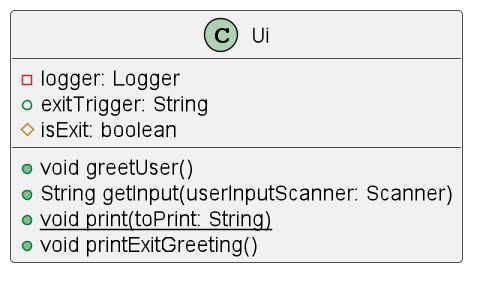
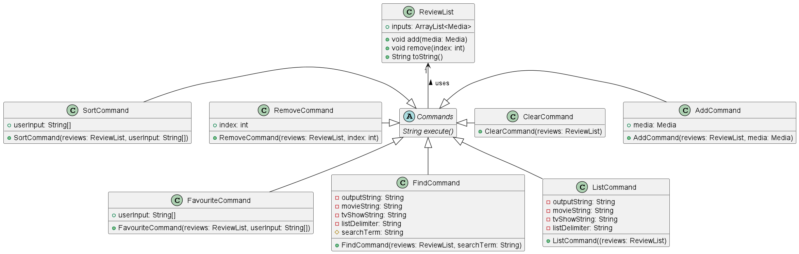
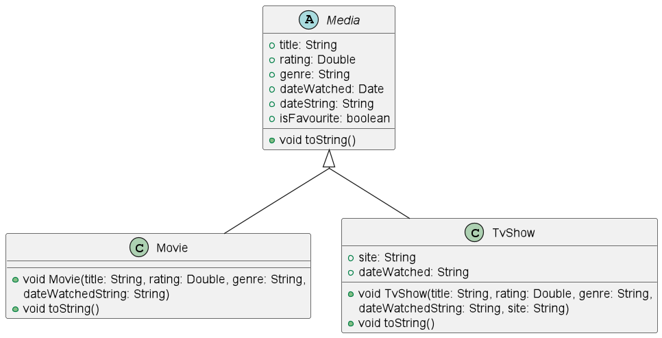
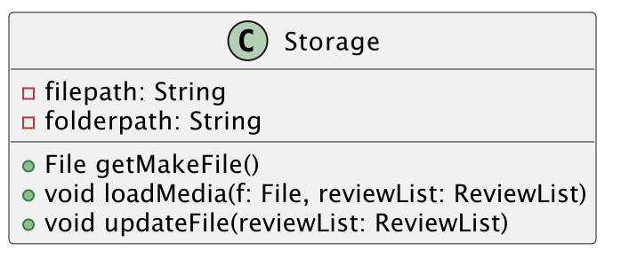

# Developer Guide

## Acknowledgements

AddressBook-Level3 https://github.com/se-edu/addressbook-level3

## Design & implementation

## Design
{Describe the design and implementation of the product. Use UML diagrams and short code snippets where applicable.}
### Ui component

### Commands component

### Movie Classes

### Storage Class

## Implementation
### Clearing the review list

## Product scope
### Target user profile

{Describe the target user profile}
The target user profile is ideally individuals who are well-versed in the command line
and are avid movie watchers. Therefore this app is customised to their preferences.

### Value proposition

{Describe the value proposition: what problem does it solve?}

## User Stories

|Version| As a ... | I want to ...                    | So that I can ...                            |
|--------|---------|----------------------------------|----------------------------------------------|
|v1.0|user| add movies to a list             | keep track of which movies I have watched.   |
|v1.0|user| add ratings out of 10 to a movie | remember how much I enjoyed the movie.       |
|v1.0|user| remove movies from my list       | delete erroneous entries.                    |
|v1.0|user| list the movies I have added       | view what movies I have watched              |
|v1.0|user| enter the date I watched the movie       | recall when I watched the movie.             |
|v2.0|user| arrange my review list by worst or best ratings        | see the shows that I like or hate the most.  |
|v2.0|user| star/favorite a movie        | mark shows that I would like to watch again. |
|v2.0|user| display a list that displays starred movies and shows        | view which are my favorites.|
|v2.0|user| be able to save my information after I exit the program   | offload it from my mind. |

## Non-Functional Requirements

{Give non-functional requirements}

## Glossary

* *glossary item* - Definition

## Instructions for manual testing

{Give instructions on how to do a manual product testing e.g., how to load sample data to be used for testing}

