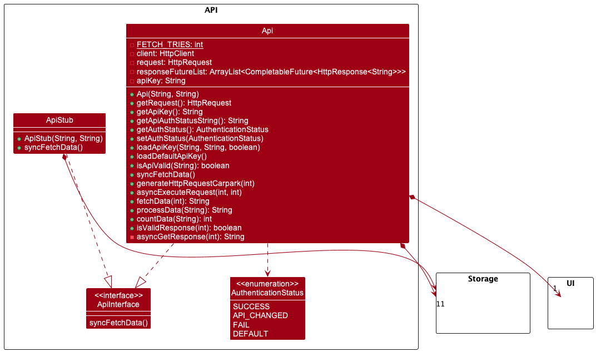

# Developer Guide

## Acknowledgements
Our project uses external libraries and services from:
1. Land Transport Authority DataMall API Service ([link](https://datamall.lta.gov.sg/content/datamall/en.html)).
2. Jackson JSON Parser ([link](https://fasterxml.github.io/jackson-core/javadoc/2.8/com/fasterxml/jackson/core/JsonParser.html))

## Design 

### Architecture Level

### Component Level

#### Model Component

The model component consists of a `CarparkList` (and `CarparkFilteredList`) class that contains
instances of `Carpark`, under the package `seedu.data`. 

This component: 
* Stores all carpark data (all `Carpark` objects), contained in a `CarparkList` object.
* Stores filtered carpark data to be used in other components (in `CarparkFilteredList`).
* Contains methods for selecting a `Carpark` object based on a unique code (for the `find` command) as well
as filtering by a substring or set of substrings (`search` command).
* Is independent of other components except the API component, which is used to generate it.
* Group objects with the same code by enum `LotType` (Car, Motorcycle, Heavy Vehicle) and places them in a HashMap 
for easy access. For example: Three `carpark` objects may have the same unique carpark code as they are the same carpark,
but contain available lot information for different types of lot. These three objects will be grouped under one object
with the HashMap `allAvailableLots` containing a breakdown of lots by type.

Note: The `Carpark` class contain many getters, setters and annotations to be used with the `jackson` module. 
See [`FileLoader`](#FileLoader) for more information.

#### API Component

The model component consists of a `Api` class that supports API call to LTA DataMall Services, under the
package `seedu.api`.

This component:
* Focuses on communicating with an external Api by using HTTP requests. 
* JSON response will be stored in the local JSON file as long as the response is `200 OK` and not empty.
* Only reads from the secret.txt file once and stores the API as a variable (will only read from the file
if requested again).

How the API component of data fetching works
1. The initialisation of the class will make an instance of the `Storage`, `HttpClient` and `Ui` class.
2. If the program just started, the Parking class will call the `loadApiKey` method.
   - If no file called `secret.txt` is found, file will be created.
   - If the file is empty, default key will be loaded to the Api instance (but not written to the local file).
3. To get data from the Api Service,
   - Call `asyncExecuteRequest` method to construct the Http request packet header and sends the request
     asynchronously.
   - Call `fetchData` method to get response immediately from the Api.
      - This method will also validate the response from the Api by identifying the response code.
      - Unless its 401 Unauthorised Access (due to invalid Api key), the method will try to fetch data
        at most 5 times.
      - If data is valid and not empty, it will write the data to the local JSON file.

The API component is also able to:
- Loads in key from a local file storage (in txt format).
- Authenticate user API key. If no user key inputted, default key will be loaded.
- Get API authentication status.
- Do synchronous data fetching.
   - Done by combining step 2 and 3 above.

##### [Proposed] Append parameters to the HTTP request
The current LTA Api only provides up to 500 data set per request. We can get the next 500 set of data by appending a
`$skip` parameter to the end of the URL. It requires an additional parameter on the `generateHttpRequestCarpark()`
method and concatenating data set of multiple HTTP responses.
Fetching data from LTA API

#### Storage Component

##### FileWriter

##### FileLoader

#### UI Component

User-facing parts of the program

#### Logic Component

Parsing, commands

### Favourite / Unfavourite feature

#### Implementation

The favourite / unfavourite feature is implemented with the Favourite class.

It uses the FileReader and FileStorage classes to read and write carpark IDs to a .txt file so that user favourited
carparks can be saved locally and retrieved even after the user exits the application.

It implements the following operations:

- setFavourite() - Inserts a carpark into the favourite list.
- setUnfavourite() - Remove a carpark from the favourite list.
- updateFavouriteList() - Reads in data from favourite.txt file and saves it to this object.
- writeFavouriteList() - Writes all favourite carpark IDs to favourite.txt file.
- getCarparkId() - Returns the carpark ID requested.
- showList() - Returns the carpark IDs of all favourited carparks in a string.

Given below is an example of how the Favourite class is used to perform favourite / unfavourite operations:

Step 1. On startup, the Favourite is initialised with a directory and file path to the file that contains data, and a favouriteList attribute.
The Favourite class calls `updateFavouriteList()` shortly after to populate its ArrayList with the carpark IDs in the file.

Step 2. The user executes `favourite 1` to favourite the carpark with carpark ID `1`. The command is passed to the Parser class which returns a Command with value `FAVOURITE`.
The main program first checks if the second argument in the command is equal to `list`. If so, the main program calls `showList()` and passes it output to the Ui class for printing.
Else, the main program checks if there exists a carpark with carpark ID `1` by calling `findCarpark()` from the CarparkList class, which throws `NoCarparkFoundException` if no carpark was found.
`setFavourite()` is then called to add the valid carpark ID into `favouriteList`, which searches `favouriteList` for any identical carpark IDs and throws `DuplicateCarparkException` if found, to prevent addition of duplicates.
`1` is then added into `favouriteList` and `setFavourite()` calls `writeFavouriteList()` which overwrites data from `favouriteList` to the favourites file.

> Note: If any exception is thrown, `1` will not be added into `favouriteList`, and `writeFavouriteList()` will not be called, hence preserving the validity of the carpark IDs.

Step 3. The user executes `favourite 2` to favourite the carpark with carpark ID `2`. Same as Step 2.

Step 4. The user realises he/she made a mistake and wants to unfavourite the carpark with carpark ID `2`, and executes `unfavourite 2`.
The command is passed to the Parser class which returns a Command with value `UNFAVOURITE`. The main program calls `setUnfavourite()`,
which first checks if `favouriteList` contains an entry that matches `2`, and throws `NoCarparkFoundException` if none is found.
Next, `2` is removed from `favouriteList` and `setUnfavourite()` calls `writeFavouriteList()` which overwrites data from `favouriteList` to the favourites file.

Step 5. The user wants to view all favourited carparks and executes `favourite list`. The command is passed to the Parser class which returns a Command with value `FAVOURITE`.
The main program calls `showList()` this time as the second argument in the command is `list`. The `showList()` method
uses StringBuilder to format all the contents of `favouriteList` into a user-friendly string, and returns it for printing.

#### Design considerations

**Aspect: Format of input after `favourite` or `unfavourite` command**
- **Alternative 1 (current choice):** Carpark ID
    - Pros: More direct, do not need to search before favouriting
    - Cons: User has to either memorise the carpark ID they want to favourite, or search and type in the whole carpark ID
- **Alternative 2:** Index of search result
    - Pros: Less time needed to favourite after a search result, do not need to key in entire carpark ID again
    - Cons: Need to search before favouriting, even if user already knows the exact carpark ID

#### Common Files

## Implementation

## Product scope
### Target user profile

{Describe the target user profile}

### Value proposition

{Describe the value proposition: what problem does it solve?}

## User Stories

|Version| As a ... | I want to ... | So that I can ...|
|--------|----------|---------------|------------------|
|v1.0|new user|see usage instructions|refer to them when I forget how to use the application|
|v2.0|user|find a to-do item by name|locate a to-do without having to go through the entire list|

## Non-Functional Requirements

{Give non-functional requirements}

## Glossary

* *glossary item* - Definition

## Instructions for manual testing

{Give instructions on how to do a manual product testing e.g., how to load sample data to be used for testing}
