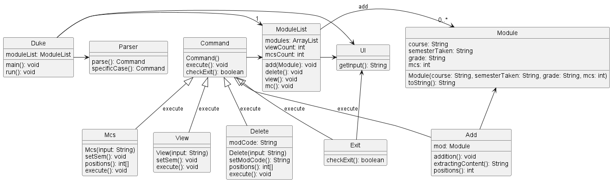
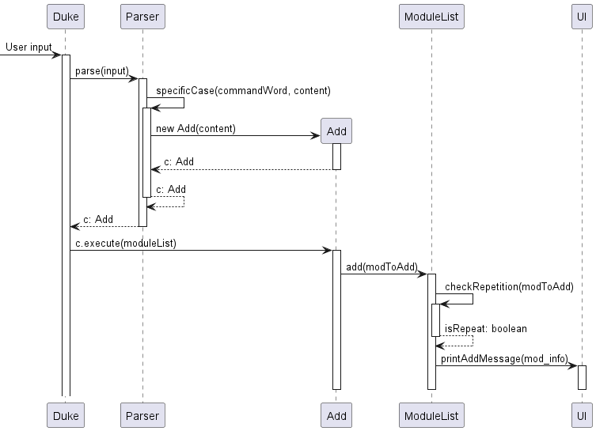
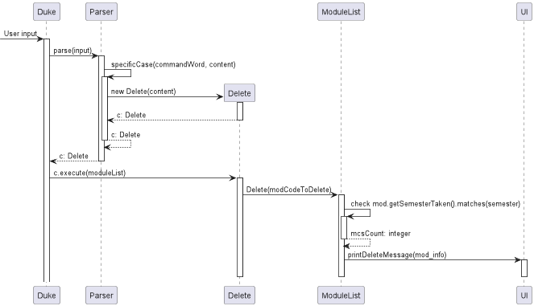
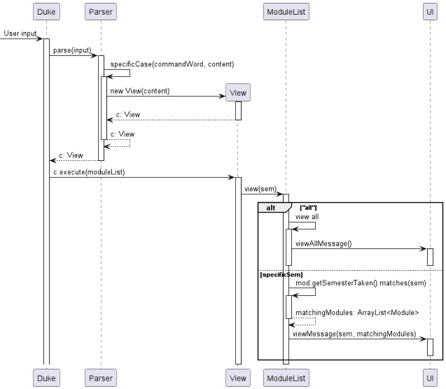
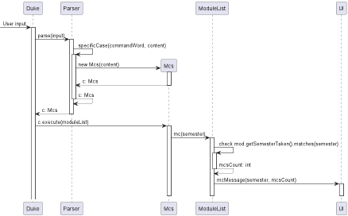
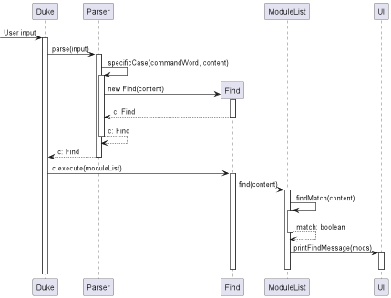
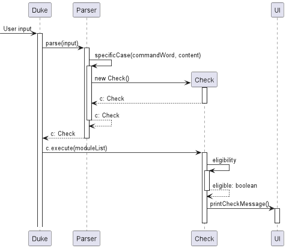
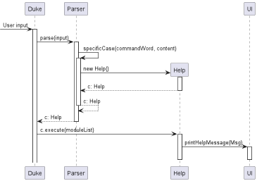
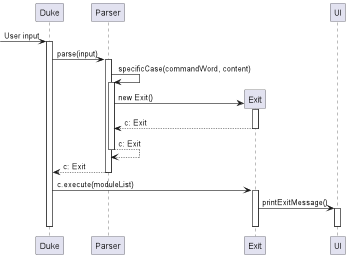

# Developer Guide

## Acknowledgements

{list here sources of all reused/adapted ideas, code, documentation, and third-party libraries -- include links to the original source as well}

## Design & implementation

Our program is structured as pictured in the following class diagram:

All the inheritors of Command are features that will be described below.

### Addition feature

The addition mechanism is facilitated by 'Parser', 'Add', 'ModuleList' and 'UI', where a Module object will be created according to the content inputted by the user and stored in the module list.

Below is an example usage scenario and how the addition mechanism behaves at each step:

Step 1: The user launches the application for the first time. A ModuleList object will be initiated with empty content.

Step 2: The user input of "add m/cs2113 s/y2s1 mc/4 g/a" will be taken in for parser and an object of class 'Add' will be returned.

Step 3: The execute method in the Add class that is overrides will be called with parameter of moduleList and module to be added passed. This will add the Module into the module list created in step 1.

The sequence diagram below illustrates this add mechanism:

### Deletion feature

The deletion mechanism is facilitated by 'Parser', 'Add', 'ModuleList' and 'UI', where a Module object will be deleted according to the module code inputted by the user and removed from the module list.

Below is an example usage scenario and how the addition mechanism behaves at each step:

Step 1: Assume that the user has already added a module named CS2113 into the ModuleList using the following command, "add m/cs2113 s/y2s1 mc/4 g/a"

Step 2: The user input of "delete m/cs2113" will be taken in for the parser and an object of class 'Delete' will be returned.

Step 3: The execute method in the Delete class that is overrides will be called with parameter of the modCode and will iterate through moduleList looking for a Module that matches. It will then remove the Module from the moduleList.

The sequence diagram below illustrates this delete mechanism:

### View feature

The View mechanism is facilitated by 'Parser', 'View', 'ModuleList', and 'UI', where the user enters
a semester and the total number of mcs taken that semester is calculated and displayed.

Below is an example usage scenario and how the view mechanism behaves at each step.

Step 1: Assume that the user has already added two modules to y2s1:
The first module is CS2113, a 4 MC module which was added using the following command "add m/cs2113 s/y2s1 mc/4 g/a"
The second module is CS2030, a 4 MC module which was added using the following command "add m/cs2030 s/y2s1 mc/4 g/a"

Step 2: The user input of "view s/y2s1" will be taken in for the parser and an object of class 'View' will be returned.

Step 3: The execute method of View class that is overrides will be called with parameter of the semester and will iterate through
the moduleList. If the semester in which a particular module is taken matches the semester given as the argument, then the module will be added to an ArrayList called matchingModules. In the end, the arrayList matchingModules will be returned.

The sequence diagram below illustrates this view mechanism.

### Mcs feature

The mcs mechanism is facilitated by 'Parser', 'Mcs', 'ModuleList', and 'UI', where the user enters
a semester and the total number of mcs taken that semester is calculated and displayed. 

Below is an example usage scenario and how the mcs mechanism behaves at each step.

Step 1: Assume that the user has already added two modules to y2s1:
The first module is CS2113, a 4 MC module which was added using the following command "add m/cs2113 s/y2s1 mc/4 g/a"
The second module is CS2030, a 4 MC module which was added using the following command "add m/cs2030 s/y2s1 mc/4 g/a"

Step 2: The user input of "mcs s/y2s1" will be taken in for the parser and an object of class 'Mcs' will be returned.

Step 3: The execute method of MCs class that is overrides will be called with parameter of the semester and will iterate through 
the moduleList. If the semester in which a particular module is taken matches the semester given as the argument, then mcsCount variable 
will be increased by the number of Mcs of the module taken. In the end, mcsCount will be returned.

The sequence diagram below illustrates this mcs mechanism.

### Find feature

The find mechanism is facilitated by 'Parser', 'Find', 'ModuleList', and 'UI', where the user enters
a keyword and the modules containing the keyword in one of its fields will be displayed.

Below is an example usage scenario and how the find mechanism behaves at each step.

Step 1: Assume that the user has already added two modules to y2s1:
The first module is CS2113, a 4 MC module which was added using the following command "add m/cs2113 s/y2s1 mc/4 g/a"
The second module is CS2030, a 4 MC module which was added using the following command "add m/cs2030 s/y2s1 mc/4 g/b"

Step 2: The user input of "find a" will be taken in for the parser and an object of class 'Find' will be returned.

Step 3: The execute method of Find class that is overrides will be called with parameter of the keyword inputted and will iterate through
the moduleList. If the keyword matches a field of a particular module, the module will be added to a separate array list 
which will then be displayed to the user.

The sequence diagram below illustrates this find mechanism.

### Check feature

The help mechanism is facilitated by 'Parser', 'Check' and 'UI', where the user enters the check command and the resulting 
eligibility status will be displayed.

The sequence diagram below illustrates this help mechanism.

### Help feature

The help mechanism is facilitated by 'Parser', 'Help' and 'UI', where the user enters the word 'help' and a help message with 
the various commands summary will be displayed.

The sequence diagram below illustrates this help mechanism.

### Exit feature

The exit mechanism is facilitated by 'Parser', 'Exit' and 'UI'. 
This allows the program to exit smoothly with an exit message displayed when the user input is 'exit'.

The sequence diagram below illustrates this exit mechanism.

## Product scope
### Target user profile

Our target user profile are NUS students who are still unsure of what module they will be taking and/or are targeting one of the exchange programs that NUS has to offer (NOC/SEP).
Through our program students will be able to ensure that they are eligible for these programmes and ensure that they make the most out of their studies in NUS.

### Value proposition

It is often very confusing for students to plan out the full four years of their studies due to the sheer amount of modules they will be taking.
Students might also have doubts of their eligibility for the exchange programs. Our program allows users to ensure that they will be eligible for these programs when the time comes.

## User Stories

|Version| As a ... | I want to ... | So that I can ...|
|--------|----------|---------------|------------------|
|v1.0|new user|see usage instructions|refer to them when I forget how to use the application|
|v2.0|user|find a to-do item by name|locate a to-do without having to go through the entire list|

## Non-Functional Requirements

{Give non-functional requirements}

## Glossary

* *Module* - A class that a student takes for their current semester in NUS

## Instructions for manual testing

{Give instructions on how to do a manual product testing e.g., how to load sample data to be used for testing}
