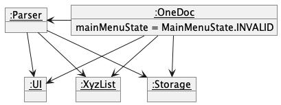
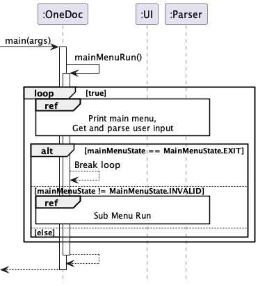
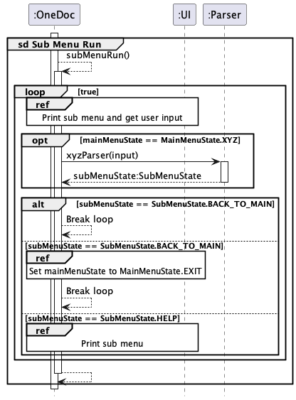
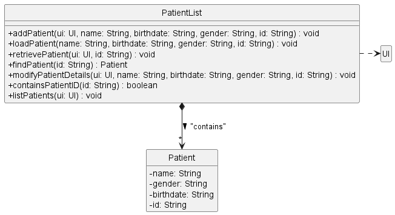
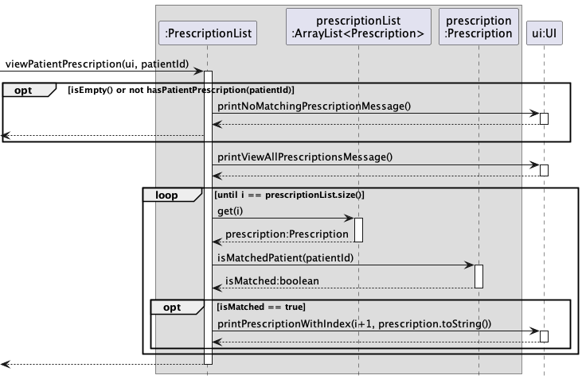
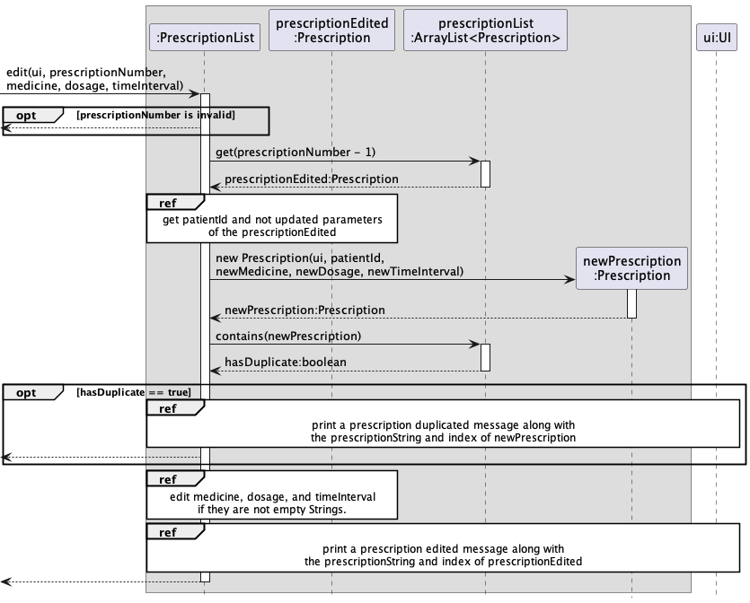
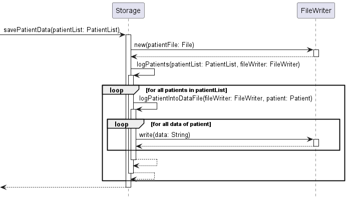
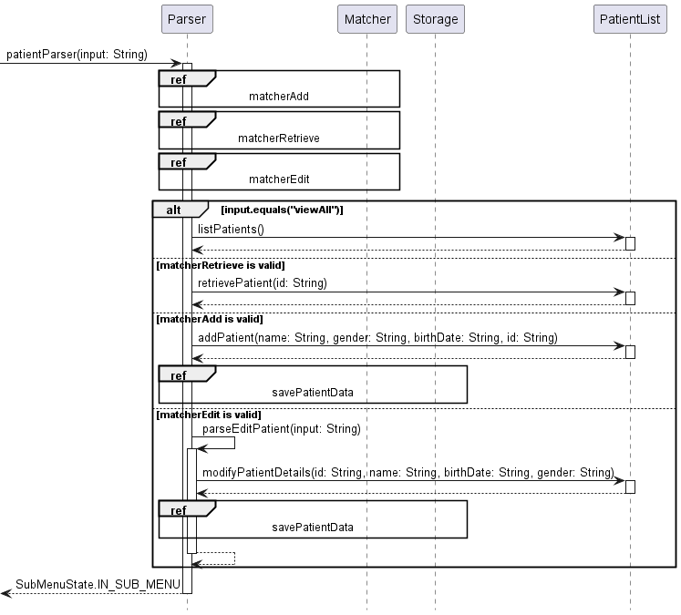

# Developer Guide

## Table of Contents

* [Acknowledgements](#acknowledgements)
* [Quick Start](#quick-start)
* [Design & implementation](#design--implementation)
  * [Architecture](#architecture)
    * [Main components of the architecture](#main-components-of-the-architecture)
    * [Interaction between the architecture components](#interaction-between-the-architecture-components)
  * [PatientList Component](#patientlist-component)
    * [Important methods in `PatientList` class](#important-methods-in-patientlist-class)
  * [VisitList Component](#visitlist-component)
    * [Important methods in `VisitList` class](#important-methods-in-visitlist-class)
    * [Adding a new visit](#adding-a-new-visit)
  * [PrescriptionList component](#prescriptionlist-component)
    * [Important Methods in `PrescriptionList` class](#important-methods-in-prescriptionlist-class)
    * [Members in `Prescription` class](#members-in-prescription-class)
    * [Adding a new prescription](#adding-a-new-prescription)
    * [Viewing prescriptions](#viewing-prescriptions)
    * [Editing a prescription](#editing-a-prescription)
    * [Activating / Deactivating a prescription](#activating--deactivating-a-prescription)
  * [Storage Component](#storage-component)
  * [UI Component](#ui-component)
    * [Important methods in the `UI` class](#important-methods-in-the-ui-class)
  * [Parser Component](#parser-component)
    * [Important methods in the `Parser` class](#important-methods-in-the-parser-class)
* [Product scope](#product-scope)
  * [Target user profile](#target-user-profile)
  * [Value proposition](#value-proposition)
* [User Stories](#user-stories)
* [Non-Functional Requirements](#non-functional-requirements)
  * [Index Reference](#index-reference)
* [Glossary](#glossary)
* [Instructions for manual testing](#instructions-for-manual-testing)

## Acknowledgements

Parser class and its functions are adapted with inspiration from [Ria's IP](https://github.com/riavora/ip) and help
from [regex101](https://regex101.com/).

Storage class and its functions are largely adapted from [Dhanish's IP](https://github.com/dhanish265/ip) on Duke.

## Quick Start

1. Ensure that you have Java 11 or above installed.
2. Download the latest version of `OneDoc` from [here](https://github.com/AY2223S1-CS2113-F11-4/tp/releases/tag/v2.1).

## Design & implementation

### Architecture

The architecture diagram above shows the high-level design of the application.

Below is a quick overview of the main components and how each component interacts with one another.

#### Main components of the architecture

**`OneDoc`** is the main class of the application. It is responsible for
* At app launch: Initializes the components in the correct sequence, connect them up with each other, load the storage
data and start the main loop.

The rest of the app consists of six components, with three of them having a similar nature.
* **`UI`**: The user interface of the app.
* **`Parser`**: Parses the user commands and initiates different action to the list.
* **`XyzList`**: The lists for manipulating patients, visits and prescriptions. (Xyz is a placeholder for `Patient`, 
`Visit` or `Prescription`) 
* **`Storage`**: Reads data from and writes data to the hard disk.

The object diagram below shows how are the instances of the components are connected on initialization.

#### Interaction between the architecture components 

The following two sequence diagrams shows how the main flow of the app is navigating between main menu and the three sub
menus. `OneDoc` component mainly interacts with `UI` and `Parser` components. (Xyz is a placeholder for `Patient`,
`Visit` or `Prescription`. For example for `Patient`, the main menu state enum is `MainMenuState.PATIENT` and the parser
function is `patientParser(input)`)

The sequence diagram below shows how the components interact with each other for the scenario where the user issues the
command `activate x/1` in the Prescription Sub Menu. 

Each of the main components defines its API in a class with the same name as the component. 
The sections below give more details of each component.

### PatientList Component

The `PatientList` Component,
* stores the list of patients
* can add new patients to the list
* can modify the details of patients
* allows users to view all patients
* allows users to find a particular patient given ID

The Patient and PatientList classes are used in conjunction to manage patients, and the list of patients. Each patient has a name,
a unique ID, a date of birth and gender. The PatientList class holds an ArrayList of Patients and manipulates them accordingly, using a 
UI object to print output where necessary.

At the start of the program, a new PatientList object is instantiated. Through methods in the Storage class, invalid data is ignored
while valid data is read from the relevant text files to create Patients that existed prior to the last closure of the program. The patients are then added to the
ArrayList in PatientList. A final call to savePatientData rewrites the data files such that only valid data remain in them. This finishes the initial set-up.

The above is a summary of the aforementioned process, omitting some commands in the code that has to do with Visits, Prescriptions and UI classes
and related methods.

#### Important methods in `PatientList` class
* `addPatient` - this method takes in the aforementioned variables through UI class and parses them. If they are all valid, a new
`Patient` is created and added to the list of `Patient`s in PatientList.
* `findPatient` - this method takes in an `ID`, iterates through the list of Patients and compares the `ID` with the `ID` of each of the
existing `Patient`s in the list. If there is a match, the corresponding `Patient` is returned. Else, returns null.
* `retrievePatient` - this method is very similar to findPatient, but instead of returning the Patient found, it prints out the details
of the `Patient` using the `toString` method in the `Patient` class.
* `listPatients` - this method first checks if the list of `Patient`s is non-empty. If not so, it prints a message that there are
no patients in the system currently and terminates.
Else, it iterates through the list of `Patient`s and uses the `toString` method in `Patient` to print out the details of each `Patient`.
* `modifyPatientDetails` - this method takes in `name`, `birthDate`, `gender` and `ID`. It tries to find the patient with a matching `ID`.
If the `Patient` is not found, returns. Else, if the name is not an empty `String`, replace the existing `name` with the input `name`.
Repeat for `birthDate` and `gender`.

### VisitList Component
The `VisitList` Component,
* stores the list of visits
* can add new visit to the list
* can edit reason for an existing visit in the list
* can delete reason for an existing visit with reason in the list
* can view all visits in the list
* can view all visits for a patient
* can view a specific visit
* depends on `UI` class (as the `VisitList` component interacts with user through the UI component, and makes use of its methods to print details)

#### Important methods in `VisitList` class
* `addVisit` - This method allows user to add a visit to the `VisitList` by specifying `id` of patient, `dateOfVisit`, `timeOfVisit` 
and `reason`. `reason` is optional, and it can be left blank, and be modified later on via the `editReason` method.
* `editReason` - This method allows user to edit reason for an existing visit, by specifying `index` of visit and `reason` for visit. `reason` must not be left blank here, 
as it is equivalent to deleting a reason, for which a user should use the `deleteReason` method instead.
* `deleteReason` - This method allows user to delete reason for an existing visit, by specifying `index` of the visit.
* `viewAll` - This method iterates through the list of all visits, and prints each visit record
* `viewPatient` - This method iterates through the list of all visits, and prints the visit records that match the specified `id` of patient
* `viewVisit` - This method iterates through the list of all visits, and prints the visit record that matches the specified `index` of the visit

#### Adding a new visit

1. `VisitList` is first called to add a new visit with the required details. This calls the constructor class of `Visit` class to create an instance of `Visit`
2. The new visit is then added to the `ArrayList<Visit>`
3. Lastly, the 'UI' class is called, to print a confirmation message that the visit has been added, and prints out the details of this new visit.

### PrescriptionList component
**API**: `PrescriptionList.java`

The `PrescriptionList` component,
* stores the list of prescriptions
* can add new prescription to the list
* can edit existing prescriptions inside the list
* can change the status of prescription inside the list
* can view all prescriptions, view a patient's prescription or view a patient's active prescription 
* depends on `UI` class (because the `PrescriptionList` component needs to interact with user through the `UI` 
component)

#### Important Methods in `PrescriptionList` class

* `add` - This method allow user to add prescription into the list by specifying `patientId`, `medicine`, `dosage` and 
`timeInterval`.
* `viewAll` - This method iterates through the list of all prescriptions and print the details of prescriptions from
all patients.
* `viewPatientPrescription` - This method iterates through the list of prescriptions and print the details of 
prescriptions from the specified `patientId`.
* `viewActivePatientPrescription` - This method iterates through the list of prescriptions and print the details of
all active prescriptions with the specified `patientId`
* `edit` - This method allows user to edit the `medicine`, `dosage` or `timeInterval` of the prescription of the 
specified index
* `activatePrescription` - This method allows user to set the prescription of specified index as active.
* `deactivatePrescription` - This method allows user to set the prescription of specified index as inactive.
* `loadPrescription` - This method assists the `Storage` component to load prescriptions from the .txt storage.

#### Members in `Prescription` class

* `medicine` - Stores the medicine name
* `timeInterval` - The time Interval the medicine is taken between
* `patientId` - The identification number of patient 
* `dosage` 
* `isActive` - Whether is the prescription currently active or not

#### Adding a new prescription
Users are allowed to add new prescriptions. The action works as follows:

1. When `PrescriptionList` is called to add a new prescription with the given details, it calls the constructor of the 
`Prescription` class to create the `Prescription` instance.
2. If the new prescription has no duplicates in the `prescriptionList`, then it is added to the list. And
`ui` prints an acknowledgement message of what the new prescription has.
3. Else, `ui` prints a message that the prescription is already existing, and print the details of the existing 
prescription.

#### Viewing prescriptions

There are 3 viewing methods that users can view a list of prescriptions in different filter. The filters are:
* No filters: `viewAll`
* Patient prescription filter: `viewPatientPrescription`
* Patient active prescription filter: `viewActivePatientPrescription`

Here is an example of how viewing with a patient prescription filter works:
1. When the function `viewPatientPrescription(ui, patientId)` is called, it first checks whether the list is empty and
has no prescription associated with the given `patientId`. If either case is satisfied, `ui` prints a no
matching prescription message and returns.
2. If not, then `prescriptionList` is iterated. Whenever a `prescription`'s `patientId` matches the given `patientId`, 
`ui` prints the `prescription` details.

The other 2 filters work similarly with slightly different conditions checked.

#### Editing a prescription
Users are allowed to edit the medicine name, dosage and time interval of the prescription. However, it is only allowed
if the updated prescription does not repeat other existing prescriptions. The action works as follow:

1. When the `edit` function is called, it returns if the `prescriptionNumber` is invalid.
2. If `prescriptionNumber` is valid, `prescriptionEdited` is retrieved from the `ArrayList<>`, and `newPrescription` 
object is created to represent the updated prescription.
3. If `newPrescription` has a duplicate in the list, it returns with a prescription duplicated message from `ui`.
4. If not, then `prescriptionEdited` is updated with a confirmation message from `ui`.

#### Activating / Deactivating a prescription
Users are allowed to activate or deactivate a prescription to track whether a prescription is currently being prescribed
to patients or not. Both actions work in a similar manner. The action works as follows:

1. When `activate(ui, prescriptionNumber)` initiates an action in the `PrescriptionList`, it converts the 
`prescriptionNumber` into the index in the array.
2. If the index is `null`, i.e invalid, the function is returned.
3. Else, it gets the `prescriptionEdited` from the `ArrayList<>` with the resolved index.
4. Then, the `prescriptionEdited` is set active.
5. Lastly, `UI` prints an acknowledgement message of the most updated details of the prescription.

### Storage Component

The `Storage` component,
* initialises the files required for data transcription
* reads the relevant data files (if previously existent) and loads them into the program during the start of the program
* saves data into files whenever changes are made (through operations such as add and edit)

The class diagram summarises the functions of the `Storage` component at a glance. 
The `Storage` class has dependencies on the `Scanner` (used to read files) and `FileWriter` (used to write to files) classes.
It also has a composition relationship with 3 `File` objects, that are used to store data.

**Important methods in the `Storage` class:**

* `loadData` - This method initializes the data file objects that are to be read from, and calls the relevant methods to
load pre-existing data. Subsequently, it makes a call to relevant methods to rewrite the text files such that only valid
data remain in them.
* `loadPatients`, `loadVisits`, `loadPrescriptions` - each of these methods read data from corresponding text files and 
check if they are valid. If so, initialise a relevant `Patient`, `Visit`, or `Prescription` and adds them to the relevant lists.
* `savePatientData`, `saveVisitData`, `savePrescriptionData` - each of these methods take in the list of `Patient`s, `Visit`s, 
or `Prescription`s, processes them one by one and calls the relevant helper method to log its data into the appropriate data 
file in a pre-specified format.

In particular, we can observe exactly how, for instance, `savePatientData` works.

1. The method, once called, creates a new `FileWriter` object used to write data.
2. It calls `logPatients`, passing in the list of `Patient`s and the `FileWriter` object created.
3. This method, process the list of `Patient`s one by one, calling another method called `logPatientIntoDataFile`, 
passing the `Patient` and `FileWriter` objects.
4. The most recently called method writes the data of this `Patient` attribute by attribute in a pre-specified format.
5. After all iterations, control is returned to the class that called the `savePatientData` method.

### UI Component
* handles printing messages to the user
* handles printing errors to the user

#### Important methods in the `UI` class
* `printWelcomeMessage` - prints logo and welcome message to the user when opening "OneDoc"
* `printObject` - prints object - patient/visit/prescription and their corresponding index 
* `printMessageAndObject` - prints object - patient/visit/prescription and their corresponding index, given message and object type
* `printErrorMessage` - prints error to the user

### Parser Component

The `Parser` component,
* Interprets user input to identify the correct command
* Parses the parameters and ensures correct typing of information
* Identifies and runs the subsequent method in PatientList, VisitList, or PrescriptionList with the parsed parameters
* Provides relevant error messages (specific to each command) based on incorrect user input

The `Parser` class has dependencies on the `Pattern` (used to create regular expression patterns) and `Matcher`
(used to find regular expressions in Strings) classes.

#### Important methods in the `Parser` class

* `mainMenuParser` - This method interprets the initial user input to identify the correct submenu, and return that 
state to the UI
* `patientParser` - Once within the Patient Submenu, this method is called from the `UI` class on each user input.
The user input is then parsed into an `add`, `edit`, `retrieve`, or `viewall` command. If the input is incorrect, it
concludes as an error with a specific error message. Based on the command, the method will call the relevant method
from the `PatientList` class with the parsed parameters. This method also checks for a call to `help`, `main`, or `bye`
at the start.
* `visitParser` - Once within the Visit Submenu, this method is called from the `UI` class on each user input
The user input is then parsed into an `add`, `edit`, `deleteReason`, `viewPatient`, `viewVisit`, or `viewAll` command.
If the input is incorrect, it concludes as an error with a specific error message. Based on the command, the method will
call the relevant method from the `VisitList` class with the parsed parameters.  This method also checks for a call to
`help`, `main`, or `bye` at the start.
* `prescriptionParser` - Once within the Prescription Submenu, this method is called from the `UI` class on each user
input. The user input is then parsed into an `add`, `edit`, `viewPatientPres`, `viewActPatientPres`, `activate`,
`deactivate`, or `viewAll` command. If the input is incorrect, it concludes as an error with a specific error message. 
Based on the command, the method will call the relevant method from the `PrescriptionList` class with the parsed
parameters. This method also checks for a call to `help`, `main`, or `bye` at the start.

In particular, we can observe exactly how, for instance, `patientParser` works.

1. The method, once called, creates 3 new `Matcher` objects used to identify if there is a correctly-formatted command
in the user's input of type `add`, `edit`, or `retrieve`. Since `viewAll` is a single word command, there doesn't need
to be a Matcher for it.
2. It checks for `viewAll`, and then checks for each `Matcher`.
3. Based on the valid `Matcher` or `viewAll`, it calls the relevant method from `PatientList`
4. The `PatientList` method performs the subsequent actions on `Patient`/s, and returns the result.
5. The method then returns the result to the UI, which presents it to the user.
6. If there is an error, the specific relevant command is identified in this method, and the format guide is returned
to the user.

## Product scope
### Target user profile

Our target user profile is a doctor in need of quick access to information about his/her patients, visits, and
prescriptions. The doctor can quickly see all of the prescriptions that have been given, when a patient has visited, 
what their reasons were, etc. through this interface. The doctor can also quickly update this before, during, or after
each visit and prescription to ensure that it stays up to date and easy-to-use.

### Value proposition

Doctors tend to use sticky notes or quick pieces of paper to jot down notes such as prescriptions, reason for visit, etc.
This platform allows a doctor to quickly reference basic information about a patient, find their previous prescriptions
and visits, and look at the history to make a decision. A doctor can mark a prescription as active or inactive, allowing
a consistent history. Moreover, the only part of these records that a doctor can delete is a reason, ensuring continuity
of information.

## User Stories

| Version | As a ...    | I want to ...                                               | So that I can ...                                                                   |
|---------|-------------|-------------------------------------------------------------|-------------------------------------------------------------------------------------|
| v1.0    | user        | exit the program                                            | leave the program without damage                                                    |
| v1.0    | doctor/user | add a new patient                                           | have the patient record saved to the list of patients                               |
| v1.0    | doctor/user | see all patients                                            | see all the patients that are saved in the program i.e. are treated by me           |
| v1.0    | doctor/user | see all the information about a patient                     | refer to them to see all the patients that are being treated by me                  |
| v1.0    | doctor/user | edit a patients record                                      | change his record to reflect changes in the patient                                 |
| v1.0    | doctor/user | add a patient visitation record                             | refer later on for future care for the patient                                      |
| v1.0    | doctor/user | add a reason for visit to the existing record               | have on record the reason the patient came for treatment for future use             |
| v1.0    | doctor/user | edit a patient visitation record                            | change the visit information in case error was entered                              |
| v1.0    | doctor/user | add new prescription for a patient                          | add a new prescription for treatment for the patient                                |
| v1.0    | doctor/user | edit a prescription                                         | changes a prescription in case of a change in treatment or error in the current one |
| v1.0    | doctor/user | view list of existing prescriptions for a patient           | refer to them for future patient treatments                                         |
| v2.0    | doctor/user | view information for patient specific visit                 | refer to the visit in case i want to reflect on the visit                           |
| v2.0    | doctor/user | view all patients visit                                     | see the patient and where treated and are on record                                 |
| v2.0    | doctor/user | view list of all existing prescriptions for all of patients | see which prescription the patient was ever prescribed                              |
| v2.0    | doctor/user | view list of all active prescriptions for all of patients   | see which prescription the patient is currently taking                              |
| v2.0    | doctor/user | change a prescription status to active                      | have on record that the patient is currently taking the prescription                |
| v2.0    | doctor/user | change a prescription status to inactive                    | have on record that the patient is currently not taking the prescription            |

## Non-Functional Requirements

* Should work on any mainstream OS as long as it has Java 11 or above installed.
* A doctor with above-average typing speed for regular English text and numbers (i.e. not code or system commands)
should  be able to add, retrieve, and edit information faster using these commands than with a mouse.
* Should be able to hold up to 1000 patients, with overall 1000 visits and 1000 prescriptions without a noticeable
sluggishness in performance for typical usage.
* Data is unable to be deleted on the program (besides directly editing the data files), preventing malicious actors
from deleting essential health records

### Index Reference

We utilize both ID and index reference in this tP, which may look confusing at first.
Indices for visit and prescription are unique when created, and can be found when adding, editing, or viewing
a visit or prescription. If you want to find a visit, you can search for a patient's visits through viewPatient in the
visit menu, and then use the given index of the visit you find to edit it. The same workflow applies for prescription.

## Glossary

* *patient* - A single individual with a unique ID
* *visit* - A single visit of one existing patient on a specific date and time
* *prescription* - A single prescription of one existing patient, active based on in the patient is currently using it

## Instructions for manual testing

To load sample data, please reference the following formats:

`patient.txt`: `Name | DOB | G | ID`
 Example: `Jane Doe | 09-09-1978 | F | T1`

`visit.txt`: `ID | Reason | Date | Time`
 Example: `T1 | checkup | 08-11-2022 | 08:00`

`prescription.txt`: `ID | Name | Dosage | Time Interval | Active Status (T or F)`
 Example: `T2 | penicillin | 1 tablet | every 3 days | T`

