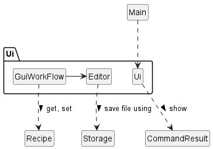
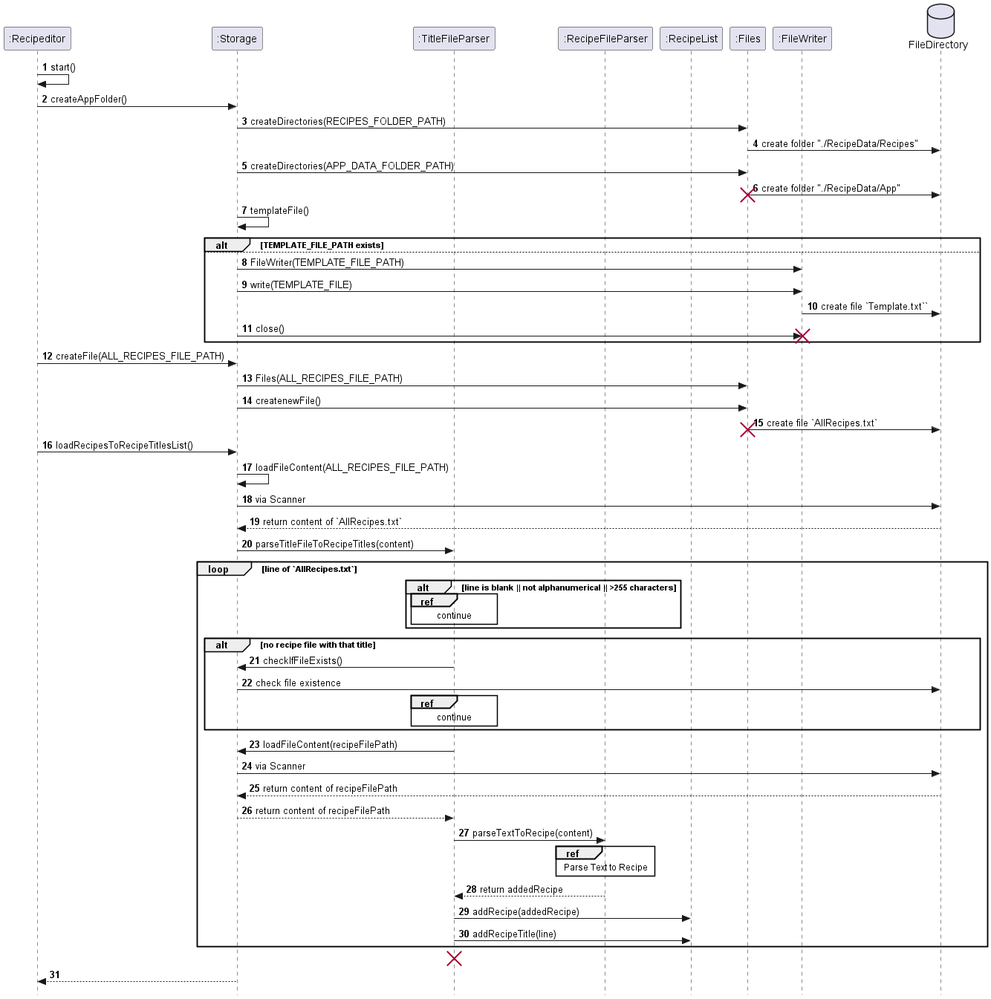

# Developer Guide

The aim of this guide is to help readers understand how the system and components of RecipEditor
is designed, implemented and tested. This developer guide also serves to help
developers to understand the architecture of RecipEditor and some design considerations.
Click to view the latest release of [RecipEditor]((https://github.com/AY2223S1-CS2113-T18-2/tp/releases)).

## Content page

- [Design](#design)
    - [Architecture](#architecture) - Qian Hui
    - [Ui Component](#ui-component) - Qian Hui
    - [Parser Component](#parser-component) - Bian Rui
    - [Storage Component](#storage-component) - Qian Hui
    - [Command Component](#command-component) Bian Rui
    - [Recipe Component](#recipe-module) - William
    - [Edit CLI Component](#edit-component) - William
    - [GUI Component](#gui-component) - Huy
- [Implementation](#implementation)
    - [Data on Startup and Exit](#data-on-startup-and-exit) - Huy
    - [Parsing of Commands](#parsing-of-commands) - Bian Rui
    - [Add Recipe](#add-recipe) - Huy
    - [GUI WorkFlow](#gui-workflow) - Huy
    - [Parse Text to Recipe](#parse-text-to-recipe) - Huy
    - [Edit an Existing Recipe](#edit-an-existing-recipe) - William
    - [Find Recipe](#find-recipe) - Qian Hui
    - [Delete Recipe](#delete-recipe) - Bian Rui
- [Product Scope](#product-scope)
    - [Target User Profile](#target-user-profile)
    - [Value Proposition](#value-proposition)
- [User Stories](#user-stories)
- [Non-Functional Requirements](#non-functional-requirements)
- [Glossary](#glossary)
- [Instructions for manual testing](#instructions-for-manual-testing)

## Acknowledgements

### External Libraries

- org.apache.commons:commons-lang3:3.0 [link](https://mvnrepository.com/artifact/org.apache.commons/commons-lang3/3.0)
- org.apiguardian:apiguardian-api:1.1.0 [link](https://mvnrepository.com/artifact/org.apiguardian/apiguardian-api)

## Design

### Architecture

  

`Recipeditor` calls to various class a perform all the tasks assigned by the user.

- `Ui`: handles interactions with users, including printing messages and reading of inputs
- `Storage`: manages the storage of the list of recipes by reading and writing data
- `Command`: command executor to instruct what task to perform
- `Parser`: interprets the user input into different commands
- `Recipe`: main entrypoint of the program.
- `Exception`: exceptions thrown by the program.

#### Happy user workflow

Here is an example happy user workflow and a brief explanation of the working of the program

1. Start the program
    - If the RecipeData folder does not exist, create them
    - Check `AllRecipes.txt` for recipe titles and add to `RecipeList.recipeTitle`
    - Check the recipe files with the title (added above), parse and add to `RecipeList.recipes`
2. Commands
    - `/add` [Add](#)
        - Call [GUI Workflow](#)
        - Call `Storage` to delete, overwrite recipe files
        - Call `RecipeList` to change `RecipeList.recipeTitle` and `RecipeList.recipes`
    - `/edit`[Edit](#)
        - CLI:
        - GUI: [GUI Workflow](#)
        - Call `Storage` to delete, overwrite recipe files
        - Call `RecipeList` to change `RecipeList.recipeTitle` and `RecipeList.recipes`
    - `/list` [List](#)
        - Access `RecipeList`
    - `/view` [View](#)
        - Call `RecipeList`
    - `/find` [Find](#)
        - Call `RecipeList`
    - `/delete` [Delete](#)
        - Call `RecipeList` to change `RecipeList.recipeTitle` and `RecipeList.recipes`
        - Call `Storage` to delete
3. Exit
    - Generate `AllRecipes.txt` from `RecipeList.recipeTitle` for the next run
    - Overwrite recipe files from `RecipeList.recipes`

### Ui Component

The UI component is responsible for all user interfaces of the application.

  

**API:** `Ui.java`

1. `Ui` takes `CommandResult` as a parameter to show the output message after a command is completed.
2. `AddMode` calls `Recipe` to add new recipe into the list.
3. `AddMode` calls `Ingredient` to parse ingredients according to its name, amount and unit.
4. `Editor` takes `Storage` as a parameter to access the temporary file path, where the recipe will be
   temporarily stored at.

### Parser Component

Parser class parses user input to various `command`. It parses user's input into commands through
respective parsing functions.

  

**API:** `Parser.java`

`parseCommand` will takes in the user input for parsing, and call respective parsing functions
after identifying the type of `command`. Then a `command` will be returned as the result of parsing.

### Storage Component

The storage component allows data to be read from and saved to a storage file.

  

**API:** `Storage.java`

1. `Storage` calls `Recipe` when saving data from `RecipeList` to an external storage file.
2. `Storage` calls `RecipeList` when loading recipe data from external storage file to.
3. `Storage` calls `Ui` to show relevant messages to the user.
4. `Storage` calls `ParserFileException` when there is an error in parsing recipe file content.
5. `Storage` uses a method in `RecipeFileParser` to parse the content in the individual recipe text file
   into recipe.
6. `Storage` uses a method in `TitleFileParser` to parse the title of the text file into recipe title.

The external storage file contains:

1. Individual Recipe Text File
    - Recipe Name
    - Recipe Description
    - Recipe Ingredients (name, amount, unit)
    - Recipe Steps

2. All Recipe Text File - that contains the recipe title of all the recipes in the list.

### Command Component

The command component features a list of commands falls under `Command`,
identified from user input for the software to carry out certain tasks.
A `CommandResult` is returned from `execute()` method call of each `Command`.
The `CommandResult` consists of a single error message in `String`.

  

Each subclass of `Command` has their own attributes and `CommandResult`
from `Execute` method, allowing them to perform respective tasks.

All types of`Command`and their functionalities are explained below:

`AddCommand`: Add a valid `Recipe` to `RecipeList`, otherwise shows error message
for `invalid Recipe`

`DeleteCommand`: Remove an existing `Recipe` at a valid index from `RecipeList`,
otherwise show error message on `index out of bound`

`ExitCommand`: Deliver a `CommandResult` to terminate software run.

`InvalidCommand`: Deliver a `CommandResult` of invalid command

`ListCommand`: Print all formatted `Recipe` in `RecipeList` to screen

`ViewCommand`: View an existing `Recipe` at a valid index from `RecipeList`,
otherwise show error message on `index out of bound`

### Recipe Component

The recipe module encapsulates the array, recipe and ingredient objects.

  

**API:** `RecipeList.java`

1. `RecipeList` calls `Recipe` to add, edit or delete recipes

**API:** `Recipe.java`

1. `Recipe` calls `Ingredient` to add, edit or delete ingredients

### Edit CLI Component

  

The edit component consists of three parts:

- Parser
    - Parses the user input, instantiates the EditCommand class
- EditModeCommand
    - Handles the edit functions (Add, Swap, Change, Delete, Invalid)
- EditCommand
    - Instantiated by parser whenever /edit is called, instantiates the flag parser, switches the flow between GUI and
      CLI,
      handles saving the edited recipe

#### Parser

The FlagParser contains several functions to extract flags from the user input in the FlagType format. It is used to
instantiate the necessary EditModeCommand.
GuiWorkFlow bypasses this parsing step since there is nothing to be parsed (given that only the index is provided).

#### EditModeCommand

An abstract class instantiated by EditCommand in CLI mode. It takes in the old recipe and, once executed,
returns a new recipe which will be saved to Storage.

#### EditCommand

Handles the branching of commands, once executed it will save the new recipe to Storage or returns an error.

The following illustrates the work sequence to edit a recipe.

  

The user first call the edit command from the Main class which will then be passed to the Parser class. It decides
whether the GUI or CLI should be called through the number of arguments passed by the user.

#### GUI Edit

- GUI window is called by GuiWorkFlow
- After the GUI edit has finished, EditCommand is instantiated and the new recipe is saved to Storage through the
  RecipeList class

#### CLI Edit

- EditCommand is instantiated with the corresponding flags parsed from the arguments provided by the user
- Depending on the flags passed, it instantiates the abstract class EditModeCommand using different constructors
  (Add, Delete, Swap, Change)
- Once it has been executed, it returns the new edited recipe, which will be saved to Storage through the RecipeList
  class

### GUI Component

  

The GUI component consists of 2 main classes: `Editor` and `GuiWorkFlow`

- `Editor` extends `Jframe` and implements `ActionListener`: This is the class that brings up the GUI
- `GUIWorkFlow` is the class that call `Editor`: This class have various methods that handle the transition between CLI
  and GUI
- Check [GUI WorkFlow](#gui-workflow), for the implementation

## Implementation

### Data on Startup and Exit

#### Startup

  

When the program starts, it will

- First run
    - Create the storage folders
        - `./RecipeData/App`: to store `Template.txt` and `Temporary.txt`
        - `./RecipeData/Recipes`: to store recipe files
    - Create `AllRecipes.txt` file to keep track of the recipe titles
    - Create `Template.txt` file for Add Command
- Subsequent run
    - Load the recipe titles from `Tempate.txt` into ArrayList `RecipeList.recipeTitles`
    - It will **check for the validity** of the titles
        - Title is not blank
        - Title is alphanumeric
        - Title does not exceed 255 characters
        - Title has an corresponding recipe file in `./RecipeData/Recipes`
    - Load the recipe file in `./RecipeData/Recipes` into ArrayList `RecipeList.recipes`
        - The recipe file content is parsed by the `RecipeFileParser` class.
          Check [Parse Text to Recipe](#parse-text-to-recipe)

#### Exit

  

Before exiting, the program will

- Regenerate the `AllRecipes.txt`
- Delete existing all recipe files
- Generate the recipe files from RecipeList Model

This is to prevent manual tampering of the data that might affect the data in the next run

### Parsing of Commands
The following sequence diagram shows the usage of relavent classes and methods when trying to parse
an arbitrary intput into an executable `command` by software.

  

### Add Recipe

  

- When the `Parser` parsed the AddCommand, an instance of `GuiWorkFlow` will be created
- The internal working of `GuiWorkFlow` is elaborated in [GUI WorkFlow](#gui-workflow)
- `Parser` will call `getValid()` and `getRecipe()` from the `GuiWorkFlow`
    - After the user interact with the GUI, if the text the user provides is a valid recipe, the Add command will be
      valid
- If the recipe is valid
    - The recipe title is added to `AllRecipes.txt` file
    - A recipe file will be saved to the FileDirectory
    - A `CommandResult` instance is returned with a successful message

### GUI WorkFlow

  

1. GUI is only triggered by Add and Edit command

   - Add command will pass the path of the `Template.txt` file
   - Edit command will pass the path of the recipe the user wants to edit

2. From the path, `GuiWorkFlow` class can detect whether it is `Mode.ADD` or `Mode.EDIT`

   - `Mode.ADD` throws an exception when the recipe title already exist in the `RecipeList.recipes`
   - `Mode.EDIT` overwrite the recipe title that already exist `RecipeList.recipes`

3. There are an initial entry to `Editor` and a loop for subsequent entry to `Editor` if the user choose to fix the
   content of the recipe
4. When exiting the `Editor`, the user can choose to SAVE or EXIT

   - SAVE will return `saveToTemp = True` and save the content in the `Editor` to `Temporary.txt`
   - EXIT will return `saveToTemp = False`
   - if `saveToTemp = False`, program flow will exit the loop
   - if `saveToTemp = False`, program flow will exit the loop

5. The loop is a PARSE and RE-ENTRY

- it wil parse the `Temporary.txt` file. Check [Parse Text to Recipe](#parse-text-to-recipe)
- if parsing is valid and there is no duplicate recipe
    - exit the loop and set `isValid = True`
- else if parsing is invalid or there is a duplicate recipe
    - Ask the user if they want to fix the file
        - if yes (fix the invalid recipe)
            - re-enter `Editor` and the workflow is similar as point 4. above
        - if no (recipe remains invalid)
            - exit the loop and set `isValid = False`

### Parse Text to Recipe

- The parsing of is solely handled by `RecipeFileParser` with little interaction with other classes. Hence there will be
  no diagram.
- The parser has variables and counter to keep track of the parsing process
  - `lineType`:`TITLE`, `DESCRIPTION`, `INGREDIENT`, `STEP`, `NORMAL`
  - `stage`: `TITLE_START`, `TITLE`, `TITLE_END`,  `DESCRIPTION`, `INGREDIENT`, `STEP`, `NORMAL`
  - `stageCounter = {0,0,0,0}`: count the occurrence of {TITLE, DESCRIPTION, INGREDIENT, STEP}
  - `ingredientIndex`: keep track of the increment of INGREDIENT index
  - `stepIndex`: keep track of the correct increment of STEP index

- Go through the text line by line 
- Detect whether the line is a Heading (denoted by `#`) and assign the `lineType` for that line
   - if `lineType` is a heading, assign `stage` appropriately, and increment `stageCounter` 
   - else, the `lineType` is `NORMAL`
- Parsing of line with `NORMAL` type is dependent on the `stage`
  - If the line is blank, it does not affect the parsing
- For `TITLE`:
  - Perform validity check as the recipe title is a text file
    - Alphanumerical
    - less than 255 character
- For `DESCRIPTION`:
  - Allow all characters, including blank lines 
  - Blank lines will be recorded to give the user some freedom in describing the recipe
- For `INGREDIENT`:
  - Check for the appropriate format `INDEX. INGREDIENT_NAME / AMOUNT / UNIT`
    - Positive integer index
    - Positive double amount
  - Check for the correct index increment based on `ingredientIndex`
- For `STEP`
  - Check for the appropriate format `INDEX. STEP_DESCRIPTION`
    - Positive integer index
  - Check for the correct index increment based on `stepIndex`

- Check if the correct number of Heading occurrence is correct
- Because of the `stage`, Headings are **parseable** in different order (but highly discouraged)
- Check if the recipe is empty
  - Because the blank lines are disregarded

### Edit an Existing Recipe

#### GUI

- The workflow is similar to [Add Recipe](#add-recipe), check [GUI WorkFlow](#gui-workflow)
- Instead of loading `Template.txt`, the recipe file with the title name corresponding to the index will be loaded

#### CLI

### Find Recipe

#### Based on Recipe Name

#### Based on Recipe Ingredient

### Delete Recipe

## Product scope

### Target user profile

Avid cook who wants to organize their recipe list for ease of reference and search. The user is also a fast typer who can quickly type out all the part of the recipe

### Value proposition

Helps people who cook often to keep track of the many recipes that they have so that they don't have to go about
memorising all the recipe details. RecipEditor helps to manage all these recipes where users can add, edit and
delete recipes of their choice. Furthermore, they can find relevant recipes quickly using RecipEditor. For example,
if the user wants to make a dish with tomato, he/she can use RecipEditor to find recipes that uses tomato as ingredient
quickly.

## User Stories

| Version | As a ... | I want to ...                                 | So that I can ...                                                                                           |
|---------|----------|-----------------------------------------------|-------------------------------------------------------------------------------------------------------------|
| v1.0    | new user | see usage instructions                        | refer to them when I forget how to use the application                                                      |
| v1.0    | user     | add new recipes                               | store recipes that I need without having to remember everything                                             |
| v1.0    | user     | delete existing recipes                       | remove recipes that I no longer use so that the list will not be cluttered                                  |
| v1.0    | user     | show all recipes in my list                   | see the overview of what recipes I have added beforehand                                                    |
| v1.0    | user     | exit the application                          | close the entire application                                                                                |
| v2.0    | user     | edit a previously saved recipe                | update the recipe without having go through the trouble to delete and add the updated version of the recipe |
| v2.0    | user     | find recipe by recipe name or ingredient name | locate a recipe without having to go through the entire list                                                |
| v2.0    | user     | show detailed recipe that I specified         | view detailed recipe (name, description, ingredients and steps) of the one that I am interested             |
| v2.0    | new user | view the list of available commands           | use the appropriate command according to my needs                                                           |

## Non-functional Requirement
- Work on all popular Operating System: Windows, Mac, Linux
## Glossary

## Instructions for manual testing

1. Go to our latest release [Releases](https://github.com/AY2223S1-CS2113-T18-2/tp/releases)
2. Download the "ManualTestData.rar" and unzip it
3. Inside,there are

    - Recipes folder: with 3 sample recipes
    - `AllRecipes.txt` with 3 sample recipe titles

4. Run the program for the first time, so that the program generates the `RecipeData` folder and `/exit` the program
5. Copy the folder and file in 3. to `RecipeData`, overwriting existing files
6. This gives you 3 sample recipes so you don't have to manually add recipes all the time
7. Run the program, it should load and recognize the 3 recipes

