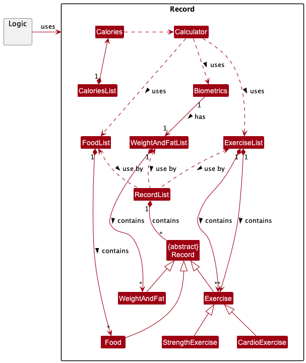
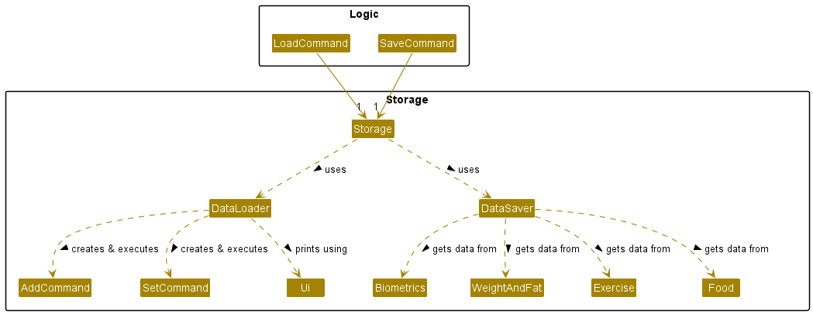
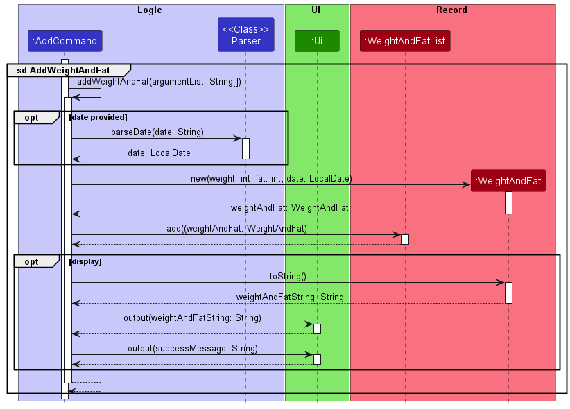
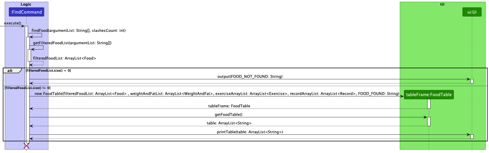
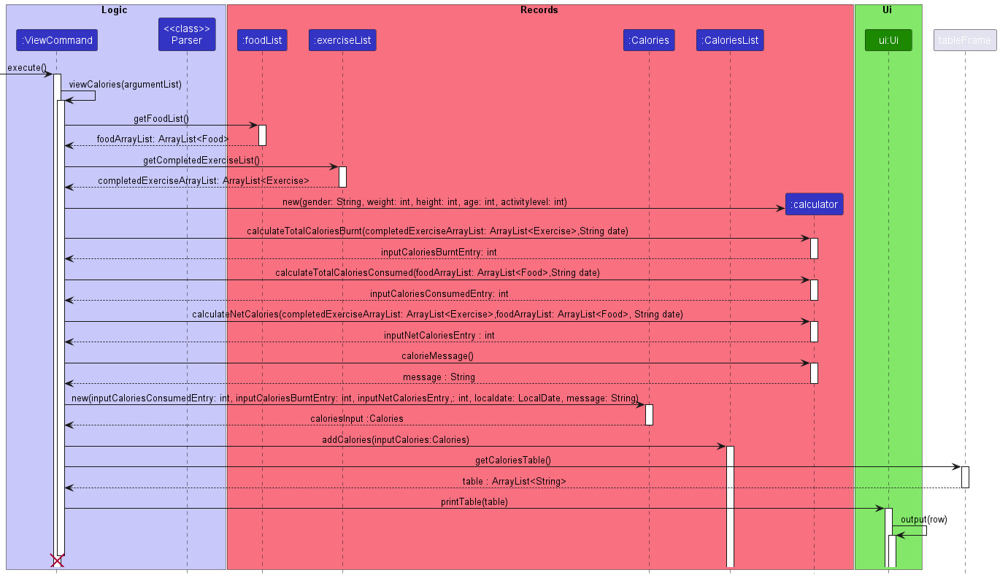
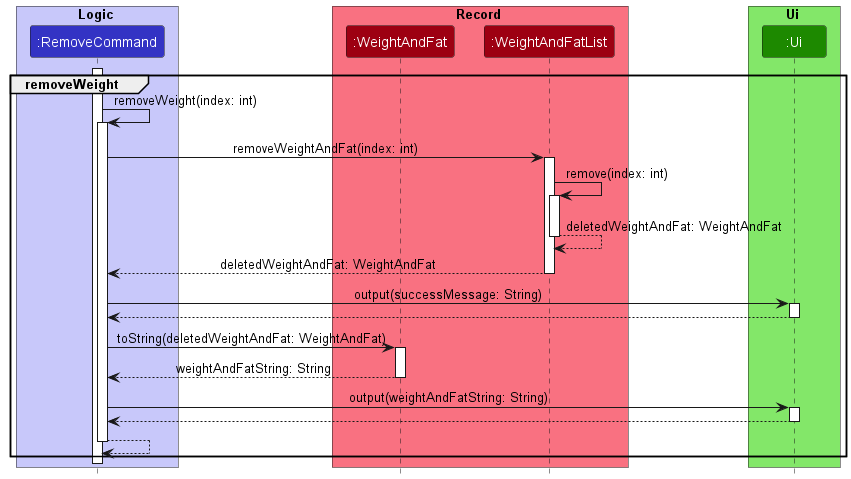

# Developer Guide

## Acknowledgements

Zhou Zhou's Individual Project: https://github.com/maanyos/ip \
Nay Chi's Individual Project: https://github.com/NayChi-7/ip \
Addressbook-level3:https://github.com/se-edu/addressbook-level3

## Design

### Architecture

The Architecture Diagram given above explains the high-leve design of the App.

Given below is an overview of main components and how they interact with each other.

`Duke:`

* At Launching: Initialise the components in the correct sequence and connects them with each other.
* At shut down: Shuts down the components and invokes cleanup methods where necessary.

`Ui:`

* Reading inputs from user and printing feedbacks to the user

`Logic:`

* The command executor

`Records:`

* Holds the data of the App in memory

`Storage:`

* Reads data and writes data to the hard disk.

`Exception:`

* Stores the exception classes for the app.

### Logic component

Here's a class diagram of the logic component.

How the logic component works:

* After taking in the input from the user, it is parsed to the Parser class of the Logic component
  to interpret the user's command.
* This results in a Command object (more precisely, an object of one of its subclasses
  e.g., AddCommand), which would then be executed by Duke.
* The command can communicate with the Records when it is executed (e.g. adding a new food record or finding an
  exercise record).
* The command can also communicate with the Storage Component when it is executed (e.g. saving and loading records).
* Additionally, the command also communicates with Ui Component to display the results of the execution back to the
  user.
* The command is validated by the Validator class to handle user's input accurately and prevent bad commands from being
  executed.
* Finally, in case of command execution failures, Exception Object (more precisely, an object of one of its subclasses,
  e.g. Duke Exception) is thrown.

### Record component

The record component,

* calls by logic components
* stores the exercise list data, all `Exercise` objects
* stores the food list data, all `Food` objects
* stores the biometrics data, in `Biometrics` object.
* stores wight and fat list data, all `WeightAndFat` objects.
* calculates calories for the calories object based on biometrics, exercise and food data to be store in the calories
  list

### Storage component

The storage component of TracknFit is responsible for loading data from the save file when the program starts,
and saves the data into the save file when the program stops. The Storage class uses the static methods in
DataLoader and DataSaver to load and save data respectively.   
Data is loaded by directing the text input into AddCommand and SetCommand classes as if they were user inputs.
If an error is encountered when loading, the line is printed to inform the user and logged at warning level. Remaining
data continues to load.  
Data is saved by calling the save methods for the different data types, which return Strings in the same format
as the user input.

**UI component**

The API of this component is specified in UI package.

The UI consists of a TableFrame.
Parts such as FoodTable, ExerciseTable, CaloriesTable, AllRecordsTable inherit from the TableFrame class.

The UI component,

* executes user commands from the logic component.
* listens for changes to records data so that the UI can be updated with the modified data.
* keeps a reference to the logic component, because the UI relies on the logic to execute commands.

## Implementation

### Add Feature

The add feature in TracknFit is split to 4 main components, food, strength, cardio and weight. After the object of the
respective class is created, it will be added to the respective list based on the add command input from the user.

We will use the sequence diagrams below to show how the add operation works.

#### Adding a new record

The Duke will call execute() for the AddCommand object after the Parser class parsed the input is an add command. The
number of slashes in the input is determined by calling Parser.getArgumentsCount(argumentList) for input validation. The
execute() will then proceed to call Parser.getArgumentList to split the inputs into parameters. Parser.gtClassType()
will be called to obtain the type of addCommand. Specific type of add command will then
be called.

#### Adding weight and fat record

When the add command type is WeightAndFat, AddWeightAndFat method will be called. Date will be initialised to current
date.If date is provided in the input, parseDate method in Parser will be called
and update the date parameter.
*WeightAndFat object will then be created and added to the WeightAndFatList If is display to the user,weightAndFat will
be converted to string, print to the user and then follow by success
message.

#### Adding food record

AddFood method is being called to add food. After parameters from the user input is being parsed and verified, new Food
object is being created. Food is then added to the FoodList. If is display,food is converted to string and output to
user, followed by success message.

#### Adding strength exercise

The addStrengthExercise method is being called to add strength exercise. First, validateAddStrengthExerciseCommand is
called by addStrengthExercise to validate the correctness of the input for add strength. Then,
executeAddStrengthExercise will be called to create a strength exercise, add to the exercise list, mark it done if it
being marked as done during loading. Then, the exercise is converted to string and display to the user, followed by the
success add message.

### Mark Feature

Marking exercise
The sequence diagrams below represent the interactions when a user marks an exercise record as done or undone.

The Duke will call execute() for the FindCommand object after the Parser class parsed the input is a mark command.
First, to validate the accuracy of the input command, Parser.getArgumentsCount(arguments) is executed to obtain the
number of slashes. Then, The execute() will call Parser.getArgumentList to split the inputs into an array containing
parameters. Then, markExercise(argumentList, slashesCount) will be called to obtain the type of markCommand for
that correct type of mark command to be executed.

If the mark command type is of "done", the calories burnt via the exercise would be determined by executing
calculateExerciseCalories(biometrics, time, met). Then, the exercise at the given index would be mark done and
a corresponding message regarding the information of the exercise that is marked "done" will be printed via the Ui
Component.

If the mark command type is of "undone", then the exercise would be mark undone at the given index and a corresponding
message regarding the information of the exercise that is marked "undone" will be printed via the Ui Component.

### Find Feature

Finding a record

The sequence diagrams below represent the interactions when a user find a record.

In the case that user removes a weight and fat record, the removeWeight method in removeCommand is executed.
As shown in the sequence diagram below, after the record is removed from the weightAndFatList, it is returned to
removeCommand to be printed on the ui.

  
In the case that user finds a food record, the findFood method in findCommand is executed, which will then execute
getFilteredFoodList(argumentList) to get arrayList of food records which contain the keyword that the user has parsed
in. If the filtered list is empty, a "Food not found" message is printed via the Ui Component. However, if the filtered
list is not empty, a table is created and filled with the data from the list. The table is then printed via the Ui
Component.

The interactions for finding other types of records are similar.

<<<<<<< HEAD
=======

### View Feature

> > > > > > > master
> > > > > > > There is a choice to view food, exercise, weight, strength, cardio, bmi, maintenance, all.
> > > > > > > The Duke will call execute() for the ViewCommand object after the Parser class parsed the input is a view
> > > > > > > command
> > > > > > > The following sequence diagram shows how the view operation works:

Viewing historical records  

The following sequence diagram shows how the view operation works after `view biometrics` is executed.

The most recent weight and fat records are retrieved. Then, the most recently set biometrics of the user will be
displayed.

Viewing biometrics

The following sequence diagram shows how the view operation works after `view calories` is executed.

The calorie consumption, calorie burnt and net calories as well as a message with the corresponding date will be
displayed.
The calorie consumption is accumulated from the food list, the calorie burnt is accumulated from the
CompletedExerciseList and
the net calories can then be calculated from the two, according to a date.

These values are stored in a Calories object and output by a CaloriesList by calling ui.

Viewing calories

The following sequence diagram shows how the view operation works after `view all` is executed.

Food records are retrieved from FoodList, exercises are retrieved from ExerciseList and records are retrieved from
RecordList and these data are output by outputAllRecords.

Viewing all historical records sorted by date  

### Removing records

The sequence diagrams below represent the interactions when a user removes a record.  
  
In the case that user removes a weight and fat record, the removeWeight method in removeCommand is executed.
As shown in the sequence diagram below, after the record is removed from the weightAndFatList, it is returned to
removeCommand to be printed on the ui.
  
The interactions for removing other types of records are similar.

### Design considerations

**Saving data:**

* Option 1 (current implementation): Saves data only when user exits from TracknFit
    * Pros: Better efficiency for executing each command, easier to implement
    * Cons: If user exits TracknFit incorrectly or TracknFit crashes, all changes made in the session are lost
* Option 2: Saves the data to save file after every user command
    * Pros: All changes are saved even if TracknFit closes incorrectly or crashes
    * Cons: High overhead in executing each command, always O(N) time, where N is total number of records

## Product scope

### Target user profile

TracknFit is designed for fitness enthusiasts who are new or moderately experienced in fitness
and do not require specialised fitness advice

### Value proposition

TracknFit helps the user track their exercise routines, dietary habits and biometrics, allowing them
to better understand their journey and progress towards their fitness goals.

## User Stories

| Version | As a ...              | I want to ...                                                                       | So that I can ...                                                  |
|---------|-----------------------|-------------------------------------------------------------------------------------|--------------------------------------------------------------------|
| v1.0    | new user              | see usage instructions                                                              | refer to them when I forget how to use the application             |
| v1.0    | user                  | add my food consumption                                                             | to keep track of my food consumptions over time                    |
| v1.0    | user                  | view my food consumption                                                            | to see my record of food consumptions                              |
| v1.0    | new user              | add any exercises                                                                   | can keep track of all my exercises to be done                      |
| v1.0    | long term user        | mark my exercise done                                                               | so that I track my progress over time.                             |
| v1.0    | long term user        | view my remaining exercises                                                         | so that I can know what are the exercise to be done.               |
| v1.0    | long term user        | view my completed exercises                                                         | so that I can plan for the next workout                            |
| v2.0    | user                  | have my records saved                                                               | see my past records                                                |
| v2.0    | long term user        | record my weight and fat over time                                                  | see how I am progressing in my fitness journey                     |
| v2.0    | long term user        | find certain food consumption                                                       | to see my consumption of certain food over time                    |
| v2.0    | user                  | remove a record                                                                     | rectify incorrect entries                                          |
| v2.0    | long term user        | have my records displayed by descending date                                        | see the most relevant records easily                               |
| v2.0    | new user              | set my biometrics                                                                   | receive personalised recommendations                               |
| v2.0    | gym user              | record weight, set and reps for the exercise                                        | so that I reference the intensity for next work out                |
| v2.0    | fitness enthusiastic  | estimate my calories for the workout based the time and intensity of the workout    | so that I can use it to estimate calories intake based on my goals |
| v2.0    | long term user        | find strength exercise based on the name                                            | so that I can view my progress for that exercise over time         |
| v2.1    | fitness beginner      | receive calorie recommendations                                                     | set a target to hit every day                                      |
| v2.1    | long term user        | check my overall calorie usage                                                      | monitor my daily calorie intake and burn over time                 |
| v2.1    | user                  | find my calorie usage by date                                                       | monitor my overall calorie usage on a certain date                 |

## Non-Functional Requirements

1. This app should work on all OS (Linux, Mac, Windows) that has JDK 11 installed.
2. This app is meant for a single user (will not be able to keep track of different user's records).
3. This app is targeted towards users with above-average typing speed, especially those who prefer typing over other
   means of input.

## Glossary

* *glossary item* - Definition
* *biometrics* - age, gender, height, weight and fat percentage of user
* *fat* - fat and fat percentage are used interchangeably to improve consistency in variable names

## Instructions for manual testing

Given below are instructions to test the app manually. Please utilize these instructions as a starting point for your
testing.

### Launch and Shutdown

* Initial launch
    * Download the jar file and copy into an empty folder
    * Open your terminal and redirect it to the folder that you previously downloaded the jar file into
    * Please type in "java -jar tp.jar" and press "Enter" to run the file. (Expected: A data.txt file will be created).

Saving window preferences

Resize the window to an optimum size. Move the window to a different location. Close the window.

Re-launch the app by double-clicking the jar file.
Expected: The most recent window size and location is retained.

### Adding a food record

Adding a food record

Test case: `add food /ice cream /300`

Expected: Ice cream is added to the food list. Details of the added food are shown in the status message.

Test case: `add food /dummy /dummy`

Expected: No food is added. Error details shown in the status message.

Other incorrect add food commands to try: `add food`, `add food /x`, `...` (where x is larger than the 10000)
Expected: Similar to previous.

### Adding a strength exercise

Adding a strength exercise

Test case: `add strength /press /5 /5 /5 /01-11-2022`

Expected: press is added to the exercise list. Details of the added exercise are shown in the status message.

Test case: `add strength / /5 /dummy /5 /01-11-2022`

Expected: No strength exercise is added. Error message shown in the status message

### Mark exercise

Mark exercise in the exercise list as done or done.

Prerequisites:
List all exercises using the view exercise command for mark done.
List all completed exercises using the view exercise /done command
Ensure index is not out of range for each exercise list.

Test case: `mark done /1`

Expected: First exercise in the current exercise is mark as done

Test case: `mark undone /1`

Expected: First exercise in the completed exercise is mark as undone

### Removing an exercise record

Removing an exercise record while all exercise records are being shown

Prerequisites: List all exercises using the view exercise command. Multiple exercises in the list.

Test case: `remove exercise /1`

Expected: First exercise is deleted from the list. Details of the deleted exercise shown in the status message.

Test case: `remove exercise /0`

Expected: No exercise is deleted. Error details shown in the status message.

Other incorrect remove commands to try: `remove exercise`, `remove exercise /x`, `...` (where x is less than 0)
Expected: Similar to previous.

### Saving data

Data will be saved ./data.txt after exiting the programme

### Dealing with missing/corrupted data files

Delete the ./data.txt file for corrupted data and restart the programme.

  
