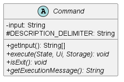
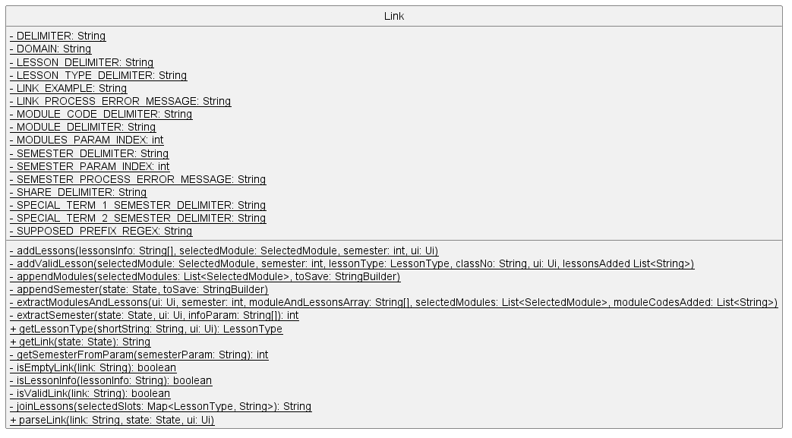

# Developer Guide for Yet Another Module Organiser / Manager

## Table Of Contents

- [Developer Guide for Yet Another Module Organiser / Manager](#developer-guide-for-yet-another-module-organiser--manager)
  - [Table Of Contents](#table-of-contents)
  - [1. Introduction](#1-introduction)
    - [1.1. Welcome!](#11-welcome)
  - [2. Setting up](#2-setting-up)
    - [2.1. Prerequisites](#21-prerequisites)
    - [2.2. Setting up the project locally](#22-setting-up-the-project-locally)
    - [2.3. Configure the coding style](#23-configure-the-coding-style)
  - [3. Design](#3-design)
    - [3.1 Architecture](#31-architecture)
    - [3.2 Model Component](#32-model-component)
    - [3.3 Parser Component](#33-parser-component)
    - [3.4 Command Component](#34-command-component)
    - [3.5 Utils Component](#35-utils-component)
      - [3.5.1 UI Component](#351-ui-component)
      - [3.5.2 Link Component](#352-link-component)
      - [3.5.3 Storage Component](#353-storage-component)
        - [Why it is implemented this way](#why-it-is-implemented-this-way)
        - [Alternatives considered](#alternatives-considered)
  - [4. Implementation](#4-implementation)
    - [Storage feature](#storage-feature)
    - [Target user profile](#target-user-profile)
    - [Value proposition](#value-proposition)
  - [5. Documentation](#5-documentation)
  - [6. Testing](#6-testing)
  - [6.1. Running tests](#61-running-tests)
  - [6.2 Instructions for manual testing](#62-instructions-for-manual-testing)
  - [Appendix A: Product scope](#appendix-a-product-scope)
  - [Appendix B: User Stories](#appendix-b-user-stories)
  - [Appendix C: Non-Functional Requirements](#appendix-c-non-functional-requirements)
  - [Appendix D: Glossary](#appendix-d-glossary)
  - [Appendix E: Acknowledgements](#appendix-e-acknowledgements)
    - [Third-party libraries](#third-party-libraries)

[Appendix A: Product Scope](#appendix-a-product-scope)  
[Appendix B: User Stores](#appendix-b-user-stories)  
[Appendix C: Non-Functional Requirements](#appendix-c-non-functional-requirements)  
[Appendix D: Glossary](#appendix-d-glossary)  
[Appendix E: Acknowledgements](#appendix-e-acknowledgements)  

## 1. Introduction

### 1.1. Welcome!

Welcome, and thank you for choosing to help contribute to Yet Another Module Organiser/ Manager!
Yet Another Module Organizer and Manager (YAMOM) is an all-in-one desktop app featuring
a full course catalogue, module search and timetable builder for the National University of Singapore, optimized for use via a Command Line Interface.

This document intends to onboard developers onto YAMOM. We hope to bring you in to fix bugs, or even adding
new features and dimensions to YAMOM!
It gives insights on how the project is set up, the architecture used,
and the code style one should adopt when contributing to the project.

## 2. Setting up

This section describes the development tools used in the creation of YAMOM.

### 2.1. Prerequisites

1. **JDK** 11
2. **IntelliJ** IDEA
3. **Gradle** 6.2

### 2.2. Setting up the project locally

1. **Fork** this repo, and **clone** the fork into your computer.
2. Open IntelliJ (if you are not in the welcome screen, click **`File`** > **`Close Project`** to close the existing project dialog first).
3. Set up the correct JDK version for Gradle  
   a.To set up the correct project structure **`Configure`** > **`Project Defaults`** > **`Project Structure`**  
   b. Under **`New...`** find the directory of the appropriate JDK version.
4. Click **`Import Project`**.
5. Find the **`build.gradle`** file and select it. Click **`OK`**.
6. Click **`Open as Project`**.
7. Click **`OK`** and accept the default settings.

### 2.3. Configure the coding style

In IntelliJ's IDEA we adopt [[se-edu/guides] IDEA: Configuring the code style](https://se-education.org/guides/tutorials/intellijCodeStyle.html)
to set up IDEA’s coding style to match ours.

> Optionally, you can follow the guide [[se-edu/guides] Using Checkstyle](https://se-education.org/guides/tutorials/checkstyle.html)
> to find how to use the CheckStyle within IDEA e.g., to report problems as you write code.

## 3. Design

<!-- {Describe the design and implementation of the product. Use UML diagrams and short code snippets where applicable.} -->

### 3.1 Architecture

**How the architecture components interact with each other**

Core program flow is managed by the Duke class.

The Duke class delegates work to the Ui class to handle user input.

User input is passed to the Parser class to parse the input as a command.

Each command subclass handles its own execution.

<code>Storage</code>: Reads and writes data to the hard disk in a NUSMods export link format.

### 3.2 Model Component

The Model component is responsible for dealing with any module related data. It consists of the following classes:

- `Day`: Represents a day in the timetable.
- `LessonType`: Represents the type of lesson.
- `Module`: Represents a module in NUS.
- `ModuleLoader`: Loads the module information from the NUSMods resource file.
- `RawLesson`: Represents a single block in a timetable representing one lesson slot. Properties are meant to be
  freely accessed but not modified.
- `SelectedModule`: Represents a module selected by the user that is to be added into his or her timetable.
- `SemesterData`: Semester data contains all the module information pertaining to a single semester.
- `Timetable`: Creates a timetable for the user with their selected modules and in their planning semester.

### 3.3 Parser Component

  

The <code>Parser</code> component can:

- return the correct command type based on user input.

### 3.4 Command Component

The <code>Command</code> component can:
- execute and return the command type based on the first word of the user input.

Below is a table of command subclasses and their respective command type. The different command types extends from the
Command class and are all in the command package.

| Command Word | Command Subclass                   | Intended Outcome                                                   |
|--------------|------------------------------------|--------------------------------------------------------------------|
| `add`        | `AddModuleCommand`                 | Adds the user input module into their timetable.                   |
| `delete`     | `DeleteModuleCommand`              | Deletes the user input module from their timetable.                |
| `list`       | `DisplaySelectedModuleListCommand` | Display all the module and slot selected by user                   |
| `bye`        | `ExitCommand`                      | Exits the program.                                                 |
| `export`     | `ExportCommand`                    | Creates a portable NUSMod link to create their timetable on NUSMod |
| `get`        | `GetCommand`                       | Display all details about a module.                                |
| `help`       | `HelpCommand`                      | Display all possible command words and their usage to user.        |
| `import`     | `ImportCommand`                    | Import user's timetable from a NUSMod share timetable link.        |
| `search`     | `SearchModuleCommand`              | Searches similar modules based on code, title, semester or level.  |
| `semester`   | `SelectSemesterCommand`            | Selects the semester that the user want.                           |
| `select`     | `SelectSlotCommand`                | Selects the time slot for the different lesson types.              |
| `view`       | `ViewCommand`                      | Views the user timetable with user's selected modules.             |

<!--
##### How the feature is implemented

##### Why it is implemented this way.

##### Alternatives considered.
-->

#### 3.4.1 AddModuleCommand

The <code>AddModuleCommand</code> class extends from the <code>Command</code> class and adds the user input module into
their timetable.

##### How the feature is implemented
The `AddModuleCommand` class extends the `Command` class.
The constructor `AddModuleCommand()` parses the user `input` module code `.toUpperCase()` as the format to fetch an
instance of `module` from its class. Boolean `successful` field is used to flag successfully added modules in comparison
to instances where it is not possible to add the `module` as it already exists in the `state`'s `selectedModuleList`.
It overrides the `execute()` method from the `Command` class, and updates `successful` accordingly, which will later be
passed on to the overridden `getExecutionMessage()` which displays the result of data validation that new `selectedModule`
added are unique.

##### Why it is implemented this way.
In order to be able to be able to compare the new instance of `selectedModule` created of the module code the user wants to delete,
in the constructor against an instance of the module the user has previously added into the `selectedModuleList`, the `equals()`
method extended from super class `Object` has been overridden to return `true` for instances where `semester` and `module`
(specifically `moduleCode` attribute from the parent class) are the same, allowing us to validate and add the desired module.

The following sequence diagram shows how the undo operation works:

##### Alternatives considered.
Initially, data validation was being handled by the `Parser` class, however in the principles of avoiding tight coupling
and improving cohesion, it was moved back under the `AddModuleCommand` class.

#### 3.4.2 DeleteModuleCommand

The <code>DeleteModuleCommand</code> class extends from the <code>Command</code> class and deletes the user input module
from their timetable.

##### How the feature is implemented
The `DeleteModuleCommand` class extends the `Command` class.
Similar to `AddModuleCommand` class, the constructor `DeleteModuleCommand()` parses the user `input` module code `.toUpperCase()` as the format to fetch an
instance of `module` from its class. Boolean `successful` field is used to flag successfully added modules in comparison
to instances where it is not possible to add the `module` as it already exists in the `state`'s `selectedModuleList`.
It overrides the `execute()` method from the `Command` class, and updates `successful` accordingly, which will later be
passed on to the overridden `getExecutionMessage()` which displays the result of data validation that the `selectedModule`
instance is only removed from the `selectedModuleList` if it exists.

##### Why it is implemented this way.
In order to be able to be able to compare the new instance of `selectedModule` created of the module code the user wants to delete,
in the constructor against an instance of the module the user has previously added into the `selectedModuleList`, the `equals()`
method extended from super class `Object` has been overridden to return `true` for instances where `semester` and `module`
(specifically `moduleCode` attribute from the parent class) are the same, allowing us to validate and remove the desired module.

##### Alternatives considered.
Once again, data validation was being handled by the `Parser` class, however in the principles of avoiding tight coupling
and improving cohesion, it was moved back under the `DeleteModuleCommand` class.

#### 3.4.3 HelpCommand

The <code>HelpCommand</code> class extends from the <code>Command</code> class and displays the help message.

##### How the feature is implemented
The `HelpCommand` class extends the `Command` class
The `HelpCommand` class compiles the description of each command keyword and their usages by invoking `getDescription` 
and `getUsage` of the other command subclass.
Within `HelpCommand` there are other messages that help to make it more user-friendly and intuitive to read.
Among the message that `HelpCommand` contains, it has a link to the user guide that aim to direct user to the project repository,
where user are able to read about the various commands in further details.

##### Why it is implemented this way.
It is to encapsulate the process of getting useful information within one class, where the class only focuses on compiling
the information and formatting it in a way that makes most intuitive sense to the user.

##### Alternatives considered.
Each command class to print the messages sequentially, this creates unnecessary complexity when printing information as changing
the number of commands available will involve refactoring at multiple parts of the codebase.

#### 3.4.4 SearchModuleCommand

##### How the feature is implemented
The <code>SearchModuleCommand</code> class extends the <code>Command</code> class.
It overrides the <code>execute()</code> method from the <code>Command</code> class.
The <code>execute()</code> method will search for the user input module primarily based on either module code or title,
with additional parameters of semester and level to narrow down the search results.

##### Why it is implemented this way.
User may or may not know the exact module code or title. As such, the user can search for the module based on optional
parameters such as semester or level. However, the user must input at least the module code or title before additional
parameters can be added in order to refine the search.

##### Alternatives considered.
We thought of implementing the search feature in a way that the required user for multiple inputs and displaying all the
different results after each input. However, we decided against it as it would be too tedious for the user to input
multiple times and the search process will be too long.

#### 3.4.5 SelectCommand

The <code>SelectCommand</code> class extends from the <code>Command</code> class and selects the time slot for the different
lesson types.

#### 3.4.6 SelectSemesterCommand

The <code>SelectSemesterCommand</code> class extends from the <code>Command</code> class and selects the semester that the
user wish to plan for.

#### 3.4.7 GetCommand

The <code>GetCommand</code> class extends from the <code>Command</code> class and gets all the details of the module 
that the user wants.

##### How the feature is implemented
The <code>GetCommand</code> class extends the <code>Command</code> class.
It overrides the <code>execute()</code> method from the <code>Command</code> class.
The <code>execute()</code> method will get all the module details from the user input module code.

##### Why it is implemented this way.
This function was implemented this way as it is the most intuitive way to get the module details. It also displays all
the different lesson types and their respective time slots. However, if the user is planning in a semester that the
module is not offered, the user will be notified that the module is not offered in the current semester and timings will
not be shown. This is to prevent the user from selecting a time slot that is not offered in the current semester, which
will reduce the chance of having an error if the user tries to select a time slot of the module that is not offered in
the current semester.

##### Alternatives considered.
We thought of displaying the full module details from the search results. However, we decided against it as it would be
too tedious for the user to search for the **exact module code** first before getting the details. The user may
not know the exact module code, which is not very user-friendly and takes up a lot of time just to get the module
details for 1 module.

#### 3.4.8 ViewCommand

The <code>ViewCommand</code> class extends from the <code>Command</code> class and displays the timetable of the current state's semester
selected modules.

#### 3.4.9 ExitCommand
The <code>ExitCommand</code> class extends from the <code>Command</code> class and exits the program.

### 3.5 Utils Component

#### 3.5.1 UI Component

The <code>UI</code> component can:
- read input from the user
- store and print out messages to the user

##### Why it is implemented this way
To comply with the Model-View Controller Framework
To separate the internal representations and processing of information from the presentation and acceptance of
information from the user

##### Alternative Considered
Each component to handle the presentation of information to the user

- Increase coupling between components
- Hard to define the sequence that information being presented to user

#### 3.5.2 Link Component

The <code>Link</code> component can:
- create a [NUSmod](https://nusmods.com/) link to be used in a browser
- Parse a NUSmod link to import modules into YAMOM

##### Why is it implemented this way
To separate out the handling of NUSmod compatibility

##### Alternative Considered
To implement the handling of export in Storage class and import in Command class

- Increase coupling between components
- Decrease reusability of NUSmod link processing

#### 3.5.3 Storage Component

The <code>Storage</code> component can:

- read from the hard disk a single line which is supposed to be a NUSMods export link
- save to the hard disk

Different checks have been implemented to ensure that even
if the data file is modified in any way, it would not crash the programme.

##### Why it is implemented this way

To facilitate easy transfer of information from NUSMods to YAMOM.

##### Alternatives considered

Storing as <code>.json</code> file

- would not be readable by the user
- would have to implement another function for export/import function

## 4. Implementation

This section describes how key features of YAMOM are implemented in the latest release V1.0

### Storage feature

  
When the application starts up, the storage openPreviousState function will be called
to load previous state

### Target user profile

<!-- {Describe the target user profile} -->

### Value proposition

<!-- {Describe the value proposition: what problem does it solve?} -->

## 5. Documentation

The following section describes how documentation for the project should be written. Note: documentation is all
written in [GitHub-Flavoured Markdown](https://github.github.com/gfm/).

## 6. Testing

The following section describes the testing methodologies followed in this project to ensure high-quality, bug-free
code as far as possible.

## 6.1. Running tests

## 6.2 Instructions for manual testing

<!-- {Give instructions on how to do a manual product testing e.g., how to load sample data to be used for testing} -->

## Appendix A: Product scope

## Appendix B: User Stories

| Version | As a ... | I want to ...                                      | So that I can ...                               |
|---------|----------|----------------------------------------------------|-------------------------------------------------|
| v1.0    | student  | search for modules by module code, name or faculty | quickly add them to my planner                  |
| v1.0    | new user | view my timetable                                  | visualise my school schedule                    |
| v1.0    | new user | add and remove modules to my planner               | customise and organise my modules this semester |
| v1.0    | new user | view a short description of each module            | plan what modules to take                       |
| v1.0    | student  | select timetable slots                             | plan my schedule                                |
| v2.0    | student  | select semester                                    | plan my schedule in different semesters         |
| v2.0    | student  | read details about a particular module             | know more about a module                        |
| v2.0    | student  | export my timetable                                | share my timetable with my friend               |
| v2.0    | student  | import timetable                                   | plan my timetable that is still in progress     |
| v2.0    | user     | get help                                           | know how to use the application                 |

## Appendix C: Non-Functional Requirements

- YAMOM should display a colorful timetable to enhance readability

## Appendix D: Glossary

- _glossary item_ - Definition

## Appendix E: Acknowledgements

Special thanks to the author of the following sources for inspiration and ideas that contributed to the development of 
**YAMOM**
- https://stackoverflow.com/questions/25853393

### Third-party libraries

- Jackson Databind 2.14.0-rc1 [maven](https://mvnrepository.com/artifact/com.fasterxml.jackson.core/jackson-databind)
- Apache Common Langs 3.12.0 [maven](https://mvnrepository.com/artifact/org.apache.commons/commons-lang3)
