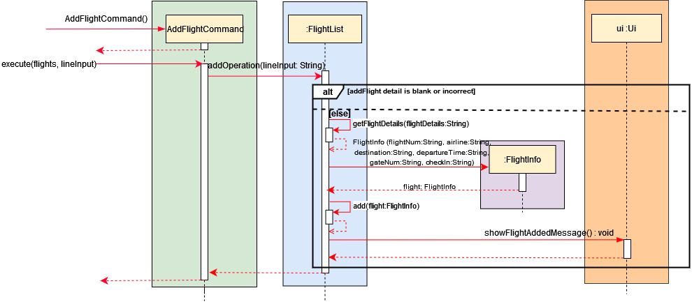

# Developer Guide

- [Acknowledgements](#acknowledgements)
- [Design](#design)
    1. [Architecture](#architecture)
    2. [Ui component](#ui-component)
    3. [Parser component](#parser-component)
    4. [Command component](#command-component)
    5. [OperationList component](#operationlist-component)
    6. [Storage component](#storage-component)
    7. [Common classes](#common-classes)
- [Implementation](#implementation)
- [Product scope](#product-scope)
    1. [Target user profile](#target-user-profile)
    2. [Value proposition](#value-proposition)
- [User Stories](#user-stories)
- [Non-Functional Requirements](#non-functional-requirements)
- [Glossary](#glossary)
- [Instructions for manual testing](#instructions-for-manual-testing)
  - [Add a flight](#add-a-flight)
  - [Delete a flight](#delete-a-flight)
  - [Modify a flight](#modify-a-flight)
  - [Delay a flight](#delete-a-flight)
  - [Add a passenger](#add-a-passenger)
  - [Delete a passenger](#delete-a-passenger)
  - [Automated boarding time](#automated-setting-for-boarding-time)
  - [Syncing passenger boarding time and flight departure time](#syncing-passenger-boarding-time-with-delayed-departure-time)
  - [Listing flights and passenger](#listing-flights-and-passengers)
  - [SkyControl Storage](#storage-of-flights-and-passengers)

## Acknowledgements

* The code package command was inspired by a similar package of [@ivanthengwr](https://github.com/ivanthengwr)'s
  [command package](https://github.com/ivanthengwr/ip/tree/master/src/main/java/duke/command) in his ip.
* The style of document for the developer guide is inspired by the DG of
  [AY2122S1-CS2113T-T10-3](https://github.com/AY2122S1-CS2113T-T10-3/tp/blob/master/docs/DeveloperGuide.md#purpose-of-this-guide)

<div style="page-break-after: always;"></div>  

## Design

### Architecture


The ***Architecture Diagram*** given above explains the high-level design of the application.

Given below is a quick overview of the main components and how they work with each other.

**Main components of the architecture**

`SkyControl` is responsible for:

- At application launch: Initialises the components in the correct sequence, and connects them up with each other.
- At shut down: Shuts down the components and exits the application safely.

The rest of the app consists of five components.

- [Ui](#ui-component) : Handles user input and message output to the console
- [Parser](#parser-component) : Reads the user's input and converts it to a functional command
- [Command](#command-component) : Contains the various commands
- [OperationList](#operationlist-component) : Contains the various operations to be executed based on the commands,
  also holds the data of the App in memory
- [Storage](#storage-component) : Reads data from, and writes data to the hard disk

<div style="page-break-after: always;"></div>  
  

**How the architecture components interact with each other**

The sequence diagram below shows how the components interact with each other for the scenario where the user issues
a valid `flight add` command.


Each of the component is initialised in `SkyControl`, the `parse` , `execute` and `insertIntoFile` methods are
called by the `run` method in `SkyControl` which continuously takes in user input and executes accordingly until the app
is shut down.

### Ui component

Here is a partial class diagram of the `Ui` component.


The `Ui` component consists of:

- `Ui`: Manages access to the `Scanner` object that reads user input and also contains all the methods
  for printing to the user.
  It also contains methods which return strings to be printed to the user.

<div style="page-break-after: always;"></div>  

### Parser component

Below is a partial class diagram that shows an overview of the `Parser` component.


Certain boolean methods and variables in `Parser` class used to classify the user input are not included for simplicity.

The `Parser` component consists of:

- `Parser`: Handles the user input and determines which specific parser class's method to be used
- `FlightParser`: Takes in the parsed user input from `Parser` and instantiates a new `AddFlightCommand`,
  or `DeleteFlightCommand`, or `ListFlightCommand` to be executed.
- `PassengerParser`: Takes in the parsed user input from `Parser` and instantiates a new `AddPassengerCommand`,
  or `DeletePassengerCommand`, or `ListPassengerCommand` to be executed.
- `ModificationParser`: Takes in the parsed user input from `Parser` and instantiates a new `ModifyFlightNumCommand`,
  or `ModifyGateNumCommand`, or `DelayFlightCommand` to be executed.

<div style="page-break-after: always;"></div>

### Command component

Here is a partial class diagram that shows an overview of the `Command` component.


Trivial methods such as getters are omitted from the diagram for simplicity. The overriden `execute()` method
is also taken out to improve visibility of the association.

The `Command` component consists of:

- `Command`: An abstract class that standardises the format of a command with the abstract method `execute()`
  , the other specific command classes override `execute()` to call the corresponding
  operations such as adding or deleting.
- `AddFlightCommand`: Handles the case when the command is to add a flight
- `DeleteFlightCommand`: Handles the case when the command is to delete a flight
- `ListFlightCommand`: Handles the case when the command is to list all the flights
- `DelayFlightCommand`: Handles the case when the command is to delay a flight
- `ModifyFlightNumCommand`: Handles the case when the command is to change the flight number
- `ModifyGateNumCommand`: Handles the case when the command is to change the gate number
- `AddPassengerCommand`: Handles the case when the command is to add a passenger
- `DeletePassengerCommand`: Handles the case when the command is to delete a passenger
- `ListPassengerCommand`: Handles the case when the command is to list all the passengers
- `ExitCommand`: Handles the case when the command is to exit the application.

<div style="page-break-after: always;"></div>

### OperationList component

Below is a partial class diagram that shows an overview of the `OperationList` component.


<div style="page-break-after: always;"></div>  


The various methods implemented to ensure the operations are done correctly are not included to
maintain simplicity.

The `OperationList` component consists of:

- `OperationList`: An abstract class that contains the flight and passengers information.
  It also contains abstract methods of the operations to be implemented
  by the `FlightList` or `PassengerList` class.
- `FlightList`: Implements the various operations such as adding, deleting and listing of flights
  by inheriting the abstract methods provided in `OperationList`.
  Contains various methods to check the validity of the operation called, throws an exception otherwise.
- `PassengerList`: Implements the various operations such as adding `AddOperation()`, deleting `DeleteOperation()`
  of passengers by inheriting the abstract methods provided in `OperationList`.
  Contains various methods to check the validity of the operation called, throws an exception otherwise.

### Storage component

Below is a partial class diagram that shows an overview of the `Storage` component.


The `Storage` component consists of:

- `Storage`: Handles the file related operations such as creation of files and reading from files or saving to files.

To add on, the `Storage` component is designed to only access the following folders:

1.`data/`:For SkyControl.txt file.

> The rationale behind standardizing a specific folder to read/save to, is to ensure that
> all relevant files can be found in the same location, which makes it easier for users
> to find the files they are looking for.

### Common classes

The `seedu.duke.exceptions` package contains the `SkyControlException` class and `SyncException` class which are used
by the various components to be thrown as exceptions and print specific error messages to the console.

<div style="page-break-after: always;"></div>

## Implementation

This section would focus on explaining the application flow and the specifics on how the features are implemented.

**List of Commands**

The following sequence diagrams to showcase the list of commands,
> ⚠️**NOTE FOR ALL SEQUENCE DIAGRAM**  
> - Exceptions are omitted for readability.
> - parser() method will not be reflected in order to improve readability.

1. [Add a passenger feature](#add-a-passenger-feature)
2. [Delete a passenger feature](#delete-a-passenger-feature)
3. [List passengers feature](#list-passengers-feature)
4. [Add a flight feature](#add-a-flight-feature)
5. [Delete a flight feature](#delete-a-flight-feature)
6. [Modify flight features](#modify-flight-features)
7. [Delay a flight feature](#delay-a-flight-feature)
8. [List flights feature](#list-flights-feature)

---  

<div style="page-break-after: always;"></div>  

### Add a passenger feature

The command Add a passenger adds passenger details of a particular passenger to the passenger list.

**Sequence Diagram**


1. SkyControl first retrieves the parameters `departureTime` and `gateNumber` from the respective flight detail
   in FlightList and appends the details to the lineInput.
2. Once the `AddPassengerCommand` is instantiated, the `execute` method is called from the `SkyControl`
   class with passenger list and user input as method parameters.
3. `AddPassengerCommand` then calls the method `addOperation(String passengerDetail)` within the `PassengerList` class.
4. `getPassengerDetails(String passengerDetail)` method then extracts each of the passenger detail into an attribute in
   the `PassengerList` class
5. `passenger` object of the class `PassengerInfo` is instantiated using the attributes retrieved from the method in
   Step 4. The `passenger` object is then added to the list of passengers
6. `Ui` class level method `showAddedPassenger(PassengerInfo passenger)` is used to display to the user that passenger
   has been added to the list successfully.

---
<div style="page-break-after: always;"></div>  

### Delete a passenger feature

A delete function that removes a passenger's detail from the passenger's log book is
facilitated by `DeletePassengerCommand`. It extends an abstract `Command` with an override method called `execute`.
The abstract `Command` extends a `Parser` which holds and validates the User input to determine the type of command.

Furthermore, `DeletePassengerCommand` implements the following operation:

* `execute(OperationList passengers, String lineInput)` &#8594; An override method inherited from `command`
  to execute the delete operation that should remove a passenger from the logbook.

**Sequence diagram**


When `Parser` verifies that the command is an entity `passenger` and `delete` operation,
`DeletePassengerCommend` is instantiated.

1. `execute(passenger, lineInput)` will run within `DeletePassengerCommend`
   which in turn would call on `deleteOperation(passengerDetail)` in `PassengerList` class.
2. Within `deleteOperation(passengerDetail)`, it would loop the arraylist `passengers` obtained from `OperationList`.
3. If passenger is found, delete object `passenger` from `passengers`. ELse, return without deletion.
4. The sequence diagram above assumes that a valid passenger is present in the passenger list to be deleted.

---  
<div style="page-break-after: always;"></div>  

### List passengers feature

A list function lists out all passengers' details in table form which is facilitated by `ListPassengerCommand`. It
extends an abstract `Command` with an override method called `execute`.
The abstract `Command` extends a `Parser` which holds and validates the User input to determine the type of command.

Furthermore, `ListPassengerCommand` implements the following operation:

* `execute(OperationList passengers, String lineInput)` &#8594; An override method inherited from `command`
  to execute the list operation that should list out all the passengers from the logbook.

**Sequence diagram**


When `Parser` verifies that the command is an entity `passenger` and `list` operation,
`ListPassengerCommend` is instantiated.

1. `execute(passenger, lineInput)` will run within `ListPassengerCommend`
   which in turn would call on `listOperation()` in `PassengerList` class.
2. Within `listOperation()`, it would first check if arraylist `passengers` obtained
   from `OperationList` is empty or not.
3. If `passengers` is empty, prints empty table, else prints respective passenger details in table form.
4. The sequence diagram assumes that a passenger detail is present in the list to be deleted. 

---  
<div style="page-break-after: always;"></div>  

### Add a flight feature

The Add a flight function adds a flight with its corresponding details to the flight logbook.

**Sequence Diagram**



When the `Parser` recognizes the `add flight` command, the `AddFlightCommand()` is instantiated.

1. The `AddFlightCommand` then implements a new `addOperation(lineInput:String)` in `FlightList`
2. Flight List will then check if the lineInput is empty or inputted incorrectly.
If it is, it will not continue to make any changes to the flight logbook.
3. If the user has inputted correctly, `getFlightDetails(flightDetails:String)` extracts the various flight details into an attribute.
4. The `FlightInfo` is then instantiated using the details retrieved from the previous step. And the flight Object can then be added to the flight array list.
5. Finally,`showFlightAddedMessage()` in the UI class prints a message to inform the user that they have added the flight.

---  
<div style="page-break-after: always;"></div>  

### Delete a flight feature

A delete function which allows the user to delete a flight specified with its flight number and
departure time from the flight logbook.

This feature is facilitated by `DeleteFlightCommand`. It extends an abstract `Command` with an override
method `execute`. The abstract `Command` extends a `Parser` which holds and validates the User input
to determine the type of command.

`DeleteFlightCommand` implements the following operation:

* execute(OperationList flights, String lineInput) &#8594; An override method inherited from
  `command` to execute the delete operation that should delete the specified flight from the logbook.

The sequence diagram shown below describes the behaviour of the flight delete operation. This scenario
assumes that the manager has given a valid 'flight delete' command as an input for easier readability.

**Sequence Diagram**


Assuming that the manager has entered a valid 'flight delete' command, `parser()` will verify that the command
is an entity `flight` and a `delete` operation. `executeEntity()` runs within SkyControl which will
create an instantiation of `DeleteFlightCommand`.

1. `execute(flights, lineInput)` will run within `DeleteFlightCommand` which calls
   `deleteOperation(lineInput)` in `FlightList` class.
2. Within `deleteOperaton(lineInput)`, it will check whether the flight number given is valid or not.
3. Given a valid flight number, `findAndRemoveFlight(flightNumber)` will search through the entire arraylist `flights`
   to find if the flight number exists and remove it from the arraylist.
4. Upon successful deletion, `showFlightRemovedMessage()` is called which prints a message to the user to indicate a
   successful delete operation
5. `deletePassengersOnSameFlightNumber(flightNumber)` will also run in `deleteOperation(lineInput)` to find and delete
the information of the passengers which contain the flight number that has been successfully removed.

---  
<div style="page-break-after: always;"></div>  

### Modify flight features
There are 2 modify features:
* `ModifyFlightNumCommand` - Allows the Airport Operations Manager(AOM) to modify the flight number of an existing flight
in the flight list. The changes will be reflected in the passenger list as well for passengers on that flight.
* `ModifyGateNumCommand` - Allows the AOM to modify the gate number of a particular flight and changes will be
reflected for the passengers, similar to `ModifyFlightNumCommand`.
> ⚠️**NOTE:** Since the two features have the same code structure, we will only be going through the implementation
of `ModifyFlightNumCommand` to avoid repetition.

**Sequence Diagram**


1. The `ModifyFlightNumCommand` class is instantiated in SkyControl by the `Parser` classes.
2. `execute(passengers, lineInput)` is then called from SkyControl. Then, `ModifyFlightNumCommand` extracts the 
existing flight number and new flight number parameters from the lineInput before
calling the `modifyFlightNum(flightNum, newFlightNum)` method in FlightList.
3. In `FlightList`, if the input parameters are incorrect, a relevant exception is raised and the command terminates.
4. If the input parameters are correct, the `findFlightInfo(flightNum)` and `getFlightAttributes(flight)` methods are
called. The former retrieves the FlightInfo object while the latter 
extracts the flight attributes of the FlightInfo object.
5. After the FlightInfo object is retrieved, the new flight number is set 
using the `setFlightNum(newFlightNum)` method.
6. The changes are reflected in the CLI using the `Ui` class.
7. Finally, `execute(passengers, lineInput)` method is called from SkyControl to reflect the changes in flight number
for the respective passengers as well. 

---  

<div style="page-break-after: always;"></div>  

### Delay a flight feature
In the event of a flight not being able to depart on time and needs to be delayed,
the `flight delay` command allows AOM to delay the departure time of an existing flight.

**Sequence Diagram**


When the `Parser` recognizes the `delay` command has been inputted, `DelayFlightCommand` is instantiated.

1. `execute(entityList, lineInput)` will run in the `DelayFlightCommand` and call on the `delayFLightDeparture`
    method which helps extract the flight number to be changed and new departure timing from the user lineInput.
2. Once FlightList Class has this information, it will check if the lineInput was empty or entered incorrectly. If it is empty or incorrect,
no delay changes will be made.
3. Else, the method `findFlightInfo` will find the index of the flight to change.
4. Once it is found, `getFLightAttributes` is called to retrieve all the relevant flight details from `FlightInfo`.
5. Using the information retrieved, `setDepartureTime(newDepartureTime)` appends the flight records and change the departure time.
6. Finally, `showUpdatedDepartureTime(flightNum, oldDepartureTime, newDepartureTime` informs the user the flight delay has been saved.

---  
<div style="page-break-after: always;"></div>  

### List flights feature

The list function lists out all flight details in a table form which is facilitated by `ListFlightCommand`.
It extends an abstract `Command` class with an override method called `execute`.


When the `Parser` recognizes the `flight list` command, `ListFlightCommand` is instantiated.

1. The `ListFlightCommand` would call on the `listOperation()` method in the `FlightList`.
2. In turn, the method calls `showListOfFlights` in the Ui class. It calls `checkEmptyFlightList` to check if the flight
   OperationList is empty.
3. If the `numOfFlights == 0`, an empty table is printed. Else, it would print the respective flight details in a table
   form.

<div style="page-break-after: always;"></div>  

## Product scope

### Target user profile

1. Required to keep track of flight schedule and passenger information in a single working day
2. Has experience using CLI 
3. Can type fast
4. Prefer using CLI over other types (such as GUI)

### Value proposition

This application helps users(specifically an Airport Operations Planning & Airside Manager) to store and view
flight information and passenger information. It includes features such as the ability to add, delete, modify
a flight's details or a passenger's details.

To sum it up, this application helps an Airport Operations Planning & Airside Manager(AOM) have an easier time keeping
track of constant changes in flight scheduling and the relevant passenger details.

## User Stories

| Version | As a ... | I can ...                                                         | So that I can ...                                                               |
|---------|----------|-------------------------------------------------------------------|---------------------------------------------------------------------------------|
| v1.0    | AOM      | add a passenger details                                           | be able to manually add a passenger details                                     |
| v1.0    | AOM      | delete a passenger details                                        | be able to delete a passenger details manually                                  |
| v1.0    | AOM      | add flight detail                                                 | be able to manually add flight details                                          |
| v1.0    | AOM      | remove flight details                                             | be able to manually remove flight details                                       |
| v1.0    | AOM      | view the details of a passenger                                   | see the details of passengers and identify each passenger                       |
| v1.0    | AOM      | view the flight schedule and their timings for each day           | see the details of each flight                                                  |
| v2.0    | AOM      | include the flight details before inputting the passenger details | there is no confusion to flight availability                                    |
| v2.0    | AOM      | change the flight number of different airlines                    | fix any modifications to the flight information easily                          |
| v2.0    | AOM      | change one or many passenger's boarding gate number               | fix any modifications to the passenger information easily                       |
| v2.0    | AOM      | include a delay in departure/arrival time for flights             | accommodate for any delays in the flights                                       |
| v2.0    | AOM      | save the flight and passenger details that have been entered      | still access them after closing and reopening the program                       |
| v2.1    | AOM      | automatically sync up passenger details with flight details       | prevent any error in input between passenger and flight detail for same details |

<div style="page-break-after: always;"></div>  

## Non-Functional Requirements

1. User should work on Windows, Linux or OS-X as long as `Java-11` or above has been installed.
2. Should be able to hold up to a hundred flights in a day without any noticeable decrease in processing speed.
3. User should be able to understand and be familiar with airport scheduling operations prior to the usage of this bot.
4. A user with an above average typing speed for regular english text

## Glossary

* *AOM* - Airport Operations Manager (A person responsible for scheduling and directing airport operations.)
* *v1.0* - Version 1.0

## Instructions for manual testing

### Launch and Exit

1. Launch

    To launch SkyControl, please follow the instructions on our [Getting Started](https://ay2223s1-cs2113-t17-1.github.io/tp/UserGuide.html#getting-started).
2. Exit

    Enter the command `quit` to close the program.

### Commands

To specify a command for flights or passengers, the word `flight` and `passenger` has to be added in front respectively.

### Add a flight
Adding a new flight can be done using the `flight add fn/FLIGHT_NUMBER a/AIRLINE d/DESTINATION dt/DEPARTURE_TIME gn/GATE_NUMBER c/CHECKIN_ROW_DOOR` command.

1. Add a flight with all details filled in correctly.
   1. Prerequisite: Any flight with the same flight number as the test case should not be in the flight logbook.
   2. Test Case:
`flight add fn/sq832 a/Singapore Airlines d/bangkok dt/1600 gn/05 c/03-03`
   3. Expected Output:
    ```
    +++++++++++++++++++++++++++++++++++++++++++++++++++++++++++++++++
    Flight added!
    ```
2. Add a flight with missing details.
   1. Test Case:`flight add fn/sq832 a/Singapore Airlines`
   2. Expected Output:
    ```
    +++++++++++++++++++++++++++++++++++++++++++++++++++++++++++++++++
    The system is unable to read your command, please try again.
    ```

<div style="page-break-after: always;"></div>  

3. Add a flight with invalid details. 
SkyControl checks for valid, flight numbers, 24HR timing, gate numbers and check in numbers.
   1. Test Case with invalid departure time outside the 24HR format:
`flight add fn/sq832 a/Singapore Airlines d/bangkok dt/7200 gn/05 c/03-03`
   2. Expected Output:
    ```
    +++++++++++++++++++++++++++++++++++++++++++++++++++++++++++++++++
    Stop! The departure time input format is wrong.
    Please try again in 24Hr time format.
    ```
   1. Test Case with wrong flight number:
   `flight add fn/WRONG123 a/Singapore Airlines d/bangkok dt/1200 gn/05 c/03-03`
   2. Expected Output:
   ```
   +++++++++++++++++++++++++++++++++++++++++++++++++++++++++++++++++
    Stop! The flight number input format is wrong.
    Please try again with the following format:
    'SQ12' - For international flights
    'SQ123' - For regional flights
    'SQ1234' - For domestic flights
   ```
4. Other incorrect flight add commands to try:
    1. Test Case: `flight add fn/sq832 a/Singapore Airlines d/bangkok dt/7200 gn/x c/y`
       (where x is not within 00 to 99 while y is not a valid row-door number)
    2. Expected Output: Similar to previous with slight variation specifying the correct gate number or check-in row/door format user should use.

### Delete a flight
1. Deleting an existing flight 
   1. Test Case: `flight delete sq832`
   2. Expected Output:
    ```
    +++++++++++++++++++++++++++++++++++++++++++++++++++++++++++++++++
    FLIGHT SQ832 HAS BEEN DELETED.
    ```
2. Deleting a flight that does not exist
   1. Test Case: `flight delete sq456`
   2. Expected Output:
    ```
    +++++++++++++++++++++++++++++++++++++++++++++++++++++++++++++++++
    FLIGHT SQ832 NOT FOUND.
    ```

### Modify a flight
- There are 2 flight attributes which the user can modify. They are the flight number and gate number. 
Both values have to follow the format specified in our table of parameters.

1. Modify flight number
   1. Test Case: `modify SQ832 fn/SQ654`
   2. Expected Output:
    ````
    +++++++++++++++++++++++++++++++++++++++++++++++++++++++++++++++++
    Flight number of flight SQ832 is updated to SQ654.
    ````

2. Modify gate number
   1. Test Case: `modify SQ654 gn/08`
   2. Expected Output:
    ````
    +++++++++++++++++++++++++++++++++++++++++++++++++++++++++++++++++
    Gate number of flight SQ654 is updated to 08.
    ````

### Delay a flight
- In the event the flight cannot depart on time and needs to be delayed, users can use this input to delay the flight to a later timing within the same day.
1. Delaying an existing flight with a later timing .
   1. Test Case: `delay sq654 dt/2100`
   2. Expected Output:
    ```
    +++++++++++++++++++++++++++++++++++++++++++++++++++++++++++++++++
    Departure time of flight SQ654 is delayed from 1600 to 2100.
    ```

2. Delaying an existing flight but with an earlier invalid timing.
   1. Test Case: `delay sq654 dt/0800`
   2. Expected Output:
    ````
    +++++++++++++++++++++++++++++++++++++++++++++++++++++++++++++++++
    Stop! Please enter a valid departure time for flight SQ654. 
    Time must be later than 2100.
    ````

### Add a passenger
1. Adding a passenger to an existing flight with all details filled in correctly.
   1. Prerequisite: No passenger in the same flight should be occupying the seat specified in the test case.
   2. Test Case: `passenger add n/Ivan Theng fn/sq654 bg/06 sn/17d`
   3. Expected Output: 
    ````
    +++++++++++++++++++++++++++++++++++++++++++++++++++++++++++++++++
    Passenger IVAN THENG of SQ654 17D has been added.
    ````
2. Adding a passenger to a flight that does not exist in the flight logbook.
   1. Test Case: `passenger add n/Susan Lee fn/ke987 bg/34 sn/22e`
   2. Expected Output: SkyControl would print an error informing the manager that he needs to flight add an existing flight number into
the list first before being able to add a passenger of the existing flight number into the logbook.
   ```
   +++++++++++++++++++++++++++++++++++++++++++++++++++++++++++++++++
    Stop! The input passenger detail does not have a flight number that exist yet.
    Flight detail of the specific flight number should input first.
   ```
### Delete a passenger
1. Deleting an existing passenger with all details filled in correctly.
   1. Test Case: `passenger delete n/Ivan Theng fn/sq654 sn/17d`
   2. Expected Output:
    ````
    +++++++++++++++++++++++++++++++++++++++++++++++++++++++++++++++++
    Passenger IVAN THENG from SQ654 of seat number 17D have been
    deleted from the passenger list.
    1 passenger(s) left on the passenger list.
    ````

2. Deleting a passenger that does not exist or passenger list is empty.
   1. Prerequisites: There should be no passengers present in the passenger list.
   2. Test Case: `passenger delete n/Ivan Theng fn/sq654 sn/17d`
   3. Expected Output: An error would be printed to inform the manager that no such passenger exist or that the list is empty
    ```
   +++++++++++++++++++++++++++++++++++++++++++++++++++++++++++++++++
    The system is unable to delete the specified passenger
    as he/she is not found in the passenger list or his/her
    detail have been input incorrectly.
   ```

### Automated setting for boarding time

- Automated boarding time of 45minutes earlier than departure time placement
    1. Prerequisites: User should intend to add a passenger into the passenger logbook, and flight number must exist.
    2. Test case: `passenger add n/Ivan Theng fn/sq832 bg/01 sn/17d` followed by `passenger list`  
       Expected: SkyControl should set the boarding time automatically to 45 minutes before the departure time that the manager has input.

### Syncing passenger boarding time with delayed departure time

- Automated boarding time of 45minutes earlier than delayed departure time placement
    1. Prerequisites: Existing flight details and passenger details of that particular flight should be present.
    2. Test case: `delay KE632 dt/2100` then `passenger list`
       Expected: The passenger's boarding time would automatically change to 45 minutes earlier of
       the tracked delayed departure time.

### Listing Flights and Passengers
The list command has 2 variations:

- `flight list`
- `passenger list`

The first command lists all flights in the flight logbook 
while the second commands lists all passengers in the passenger logbook.

1. Listing Flights
   1. Test Case: `flight list`
   2. Expected Output:
   ```
   +----------------------------------------------------------------------------------------------------------------------------------+
    |                                                  FLIGHT DETAILS LOGBOOK FOR TERMINAL 1                                         |
    +----------------------------------------------------------------------------------------------------------------------------------+
    | FLIGHT NUM | DEPARTURE DATE |        AIRLINE         |      DESTINATION      | DEPARTURE TIME | GATE NUM |  CHECK-IN ROW/DOOR  |
    +----------------------------------------------------------------------------------------------------------------------------------+
    |      SQ654 |       06-11-22 |     SINGAPORE AIRLINES |               BANGKOK |           2100 |       08 |               03-03 |
    +----------------------------------------------------------------------------------------------------------------------------------+
   ```
2. Listing Passengers
   1. Test Case: `passenger list`
   2. Expected Output:
   ````
   +------------------------------------------------------------------------------------------------------------------------------+
    |                                                  PASSENGER DETAILS LOGBOOK                                                   |
    +------------------------------------------------------------------------------------------------------------------------------+
    |           NAME           | DEPARTURE DATE | DEPARTURE TIME | FLIGHT NUM | GATE NUM | BOARDING GRP | SEAT NUM | BOARDING TIME |
    +------------------------------------------------------------------------------------------------------------------------------+
    | IVAN THENG               | 06-11-22       | 2100           | SQ654      | 08       | 6            | 17D      | 2015          |
    +------------------------------------------------------------------------------------------------------------------------------+
   ````

3. Empty Flight List
   1. Prerequisite: There should be no flight present in the flight logbook. (All flight have been deleted or no flight has been inputted into SkyControl.txt)
   2. Test case: `flight list`
   3. Expected Output: SkyControl would print out an empty list, stating that its empty
   ```
   +----------------------------------------------------------------------------------------------------------------------------------+
    |                                                  FLIGHT DETAILS LOGBOOK FOR TERMINAL 1                                         |
    +----------------------------------------------------------------------------------------------------------------------------------+
    | FLIGHT NUM | DEPARTURE DATE |        AIRLINE         |      DESTINATION      | DEPARTURE TIME | GATE NUM |  CHECK-IN ROW/DOOR  |
    +----------------------------------------------------------------------------------------------------------------------------------+
    |                                             The flight details logbook is empty.                                               |
    +----------------------------------------------------------------------------------------------------------------------------------+
   ```

4. Empty Passenger List
   1. Prerequisite: There should be no passengers present in the passenger list.
   2. Test case: `passenger list`
   3. Expected Output: SkyControl would print out an empty list, stating that its empty
   ```
   +------------------------------------------------------------------------------------------------------------------------------+
    |                                                  PASSENGER DETAILS LOGBOOK                                                   |
    +------------------------------------------------------------------------------------------------------------------------------+
    |           NAME           | DEPARTURE DATE | DEPARTURE TIME | FLIGHT NUM | GATE NUM | BOARDING GRP | SEAT NUM | BOARDING TIME |
    +------------------------------------------------------------------------------------------------------------------------------+
    |                                          The passenger details logbook is empty.                                             |
    +------------------------------------------------------------------------------------------------------------------------------+
   ```
   
Below is a summary of all the possible commands that you can execute in SkyControl as well as their required formats and an example. 
Followed by the format that each parameter should adhere to.

| Command                | Format                                                                                                    | Example                                                              |
|:-----------------------|:----------------------------------------------------------------------------------------------------------|:---------------------------------------------------------------------|
| `passenger add`        | `passenger add n/PASSENGER_NAME fn/FLIGHT_NUMBER bg/BOARDING_GROUP sn/SEAT_NUMBER`                        | `passenger add n/Ivan Theng fn/sq832 bg/01 sn/17d`                   |
| `flight add`           | `flight add fn/FLIGHT_NUMBER a/AIRLINE d/DESTINATION dt/DEPARTURE_TIME gn/GATE_NUMBER c/CHECKIN_ROW_DOOR` | `flight add fn/KE632 a/Korea Airlines d/Korea dt/1200 gn/32 c/12-03` |
| `passenger delete`     | `passenger delete n/PASSENGER_NAME fn/FLIGHT_NUMBER sn/SEAT_NUMBER`                                       | `passenger delete n/Ivan Theng fn/sq832 sn/17d`                      |
| `flight delete`        | `flight delete FLIGHT_NUMBER`                                                                             | `flight delete ke632`                                                |
| `passenger list`       | `passenger list`                                                                                          | `passenger list`                                                     |
| `flight list`          | `flight list`                                                                                             | `flight list`                                                        |
| `modify flight number` | `modify FLIGHT_NUMBER fn/NEW_FLIGHT_NUMBER`                                                               | `modify SQ832 fn/SQ654`                                              |
| `modify gate number`   | `modify FLIGHT_NUMBER gn/NEW_GATE_NUMBER`                                                                 | `modify SQ654 gn/08`                                                 |
| `delay`                | `delay FLIGHT_NUMBER dt/NEW_DEPARTURE_TIME`                                                               | `delay KE632 dt/2100`                                                |

**Table of parameters:**

| Parameter          | Format to adhere by                                                                                                                                                                                         | Example                             |
|:-------------------|:------------------------------------------------------------------------------------------------------------------------------------------------------------------------------------------------------------|:------------------------------------|
| PASSENGER_NAME     | Input name should be no more than 24 characters                                                                                                                                                             | `Ivan Lim`                          |
| DEPARTURE_TIME     | Input departure time should be in 24 Hours format                                                                                                                                                           | `2100`                              |
| NEW_DEPARTURE_TIME | Input departure time should be in 24 Hours format and later than the existing departure time                                                                                                                | `2200`                              |
| FLIGHT_NUMBER      | Input flight number should start with 2 letter character, followed either by <br/>Two numbers for international flights <br/>Three numbers for regional flights<br/> Four numbers for domestic flights <br> | `SQ12`</br>`SQ123`</br>`SQ1234`<br> |
| NEW_FLIGHT_NUMBER  | Input flight number should follow FLIGHT_NUMBER constraints but must not be the same flight code                                                                                                            | `KE356`                             |
| GATE_NUMBER        | Input gate number should be 2 digits and between ranges 00 and 99                                                                                                                                           | `05`                                |
| NEW_GATE_NUMBER    | Input gate number should follow GATE_NUMBER constraints but must not be the same value                                                                                                                      | `22`                                |
| BOARDING_GROUP     | Input boarding Group should not be more than 10 and should be in digit form                                                                                                                                 | `01`                                |
| SEAT_NUMBER        | Input Seat number should range between 00A to 99Z                                                                                                                                                           | `B01`                               |


### Storage of flights and passengers
* Storage will automatically update in the `SkyControl.txt` file found in the `data` directory.
* Both flight and passenger are stored in the same text file. 
However, after running SkyControl, the flight and passenger lists wil update automatically.
* It is highly not advised to tamper this file but to use SkyControl to view and edit the passenger and flight logbooks.


