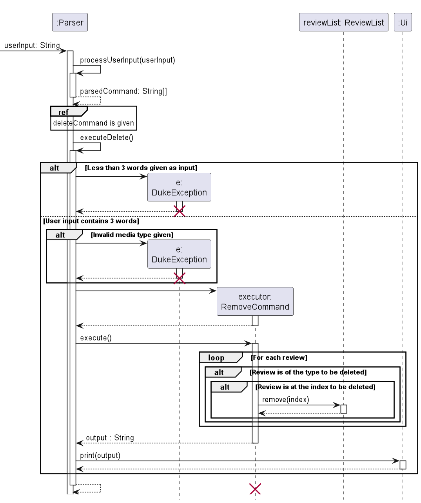
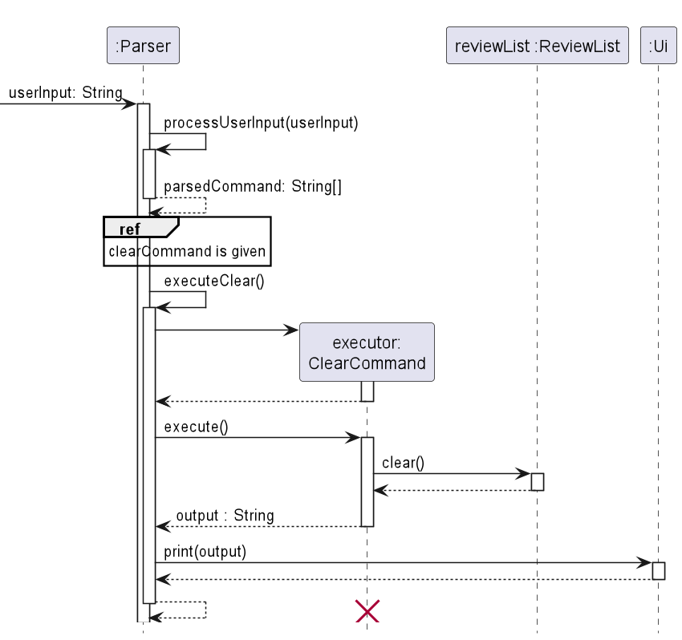
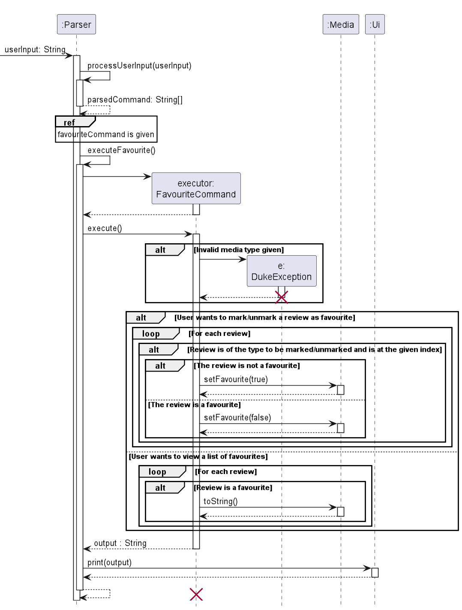

# Developer Guide

## Design & Implementation

### Ui
The `Ui` class handles user input and basic output messages. It can
* Read user input
* Output various messages to the user

### Storage Class

### Media Classes

### Commands
The command component enables users to make changes to their review list. The command word is taken from the first word
of the user input, and is processed through the `Parser` class. The class diagram shows how the Commands parent class is
implemented, as well as its extended classes.

#### Add
The `add` command enables users to create new movie or TV Show reviews and add them to their review list. The following 
is how the `add` command works:
1. The `Parser` class takes in the user input, and parses this by using its `processUserInput` function.
2. If the parsed command word is recognised to be the `add` command, the `executeAdd` function is called.
3. Using the parsed command, `Parser` then determines whether the review to be added is a movie or Tv show. Otherwise, a 
DukeException error is thrown.
4. A new variable of type Media parent class, `toAdd`, is then created. The `AddCommand` function is then called to add
the Movie or Tv Show `toAdd` into the review list, `reviewList`.

#### Find
The find command enables users to search for existing reviews that contains a given keyword. This is done through the
following steps: 
1. The `Parser` class takes in the user input, and parses this by using its `processUserInput` function.
2. If the parsed command word is recognised to be the `add` command, the `executeFind` function is called and extracts
the keyword to search for from the user input.
3. `Parser` then creates an `executor` object by creating a new `FindCommand`. `Parser` then calls the `execute` 
function from `executor` which loops through all reviews in the list and displays those containing the given keyword
using the `toString()` function found in both the `Movie` and `TvShow` subclasses.

#### List

#### Sort

#### Remove

#### Clearing the review list

### Marking favourite reviews and listing all favourites

## Product scope
### Target user profile

{Describe the target user profile}
The target user profile is ideally individuals who are well-versed in the command line
and are avid movie or TV show watchers. Therefore, this app is customised to their preferences.

### Value proposition

{Describe the value proposition: what problem does it solve?}

## User Stories

|Version| As a ... | I want to ...                    | So that I can ...                            |
|--------|---------|----------------------------------|----------------------------------------------|
|v1.0|user| add movies to a list             | keep track of which movies I have watched.   |
|v1.0|user| add ratings out of 10 to a movie | remember how much I enjoyed the movie.       |
|v1.0|user| remove movies from my list       | delete erroneous entries.                    |
|v1.0|user| list the movies I have added       | view what movies I have watched              |
|v1.0|user| enter the date I watched the movie       | recall when I watched the movie.             |
|v2.0|user| arrange my review list by worst or best ratings        | see the shows that I like or hate the most.  |
|v2.0|user| star/favorite a movie        | mark shows that I would like to watch again. |
|v2.0|user| display a list that displays starred movies and shows        | view which are my favorites.|
|v2.0|user| be able to save my information after I exit the program   | offload it from my mind. |
|v2.0|user| list the movies I have watched                        | view what movies I have watched              |
|v2.0|user| list the tv shows I have watched                      | view what tv shows I have watched            |
|v2.0|user| search movies using a keyword                         | to find a specific movie I have watched      |
|v2.0|user| search tv show using a keyword                        | to find a specific tv show I have watched    |
|v2.0|user| clear movies that I have watched                      | to clear my watch history                    |
|v2.0|user| clear tv shows that I have watched                    | to clear my watch history                    |

## Non-Functional Requirements

{Give non-functional requirements}

## Glossary

* *glossary item* - Definition

## Instructions for manual testing

- Load Main 
- Add a movie or tv show 
  - Command:
    - add /movie test /rating 5  /date 02-02-2022 /genre horror)
    - add /tvshow test /rating 5  /date 02-02-2022 /genre horror /site e
- List movies and tv shows 
  - Command: list
- Remove a movie or tv show
  - Command: remove (index #)
- Clear history
  - Command: clear

