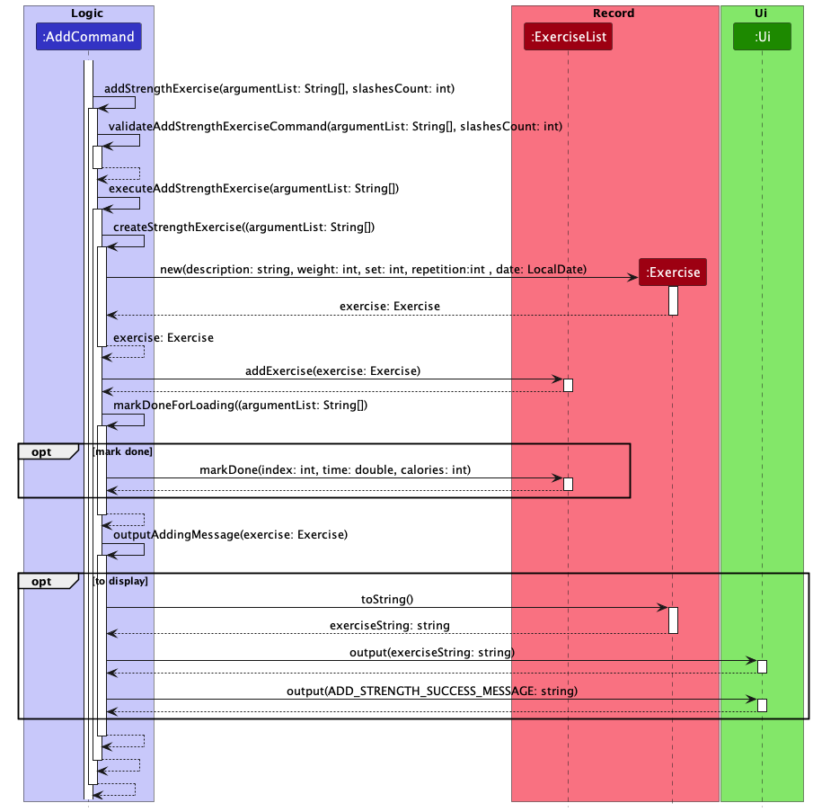
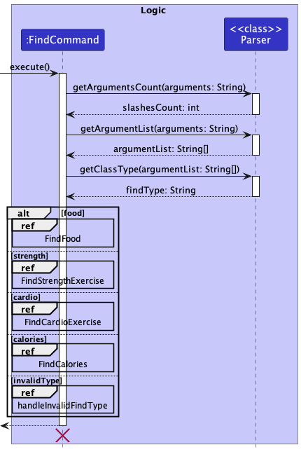
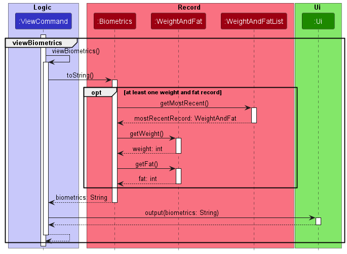

# Developer Guide

## Acknowledgements

Zhou Zhou's Individual Project: https://github.com/maanyos/ip \
Nay Chi's Individual Project: https://github.com/NayChi-7/ip \
Addressbook-level3:https://github.com/se-edu/addressbook-level3

## Design

### Architecture

The Architecture Diagram given above explains the high-leve design of the App.

Given below is an overview of main components and how they interact with each other.

`Duke:`

* At Launching: Initialise the components in the correct sequence and connects them with each other.
* At shut down: Shuts down the components and invokes cleanup methods where necessary.

`Ui:`

* Reading inputs from user and printing feedbacks to the user

`Logic:`
Here's a class diagram of the logic component.

How the logic component works:

* After taking in the input from the user, it is parsed to the Parser class of the Logic component
  to interpret the user's command.
* This results in a Command object (more precisely, an object of one of its subclasses
  e.g., AddCommand), which would then be executed by Duke.
* The command can communicate with the Records when it is executed (e.g. adding a new food record or finding an
  exercise record).
* The command can also communicate with the Storage Component when it is executed (e.g. saving and loading records).
* Additionally, the command also communicates with Ui Component to display the results of the execution back to the
  user.
* The command is validated by the Validator class to handle user's input accurately and prevent bad commands from being
  executed.
* Finally, in case of command execution failures, Exception Object (more precisely, an object of one of its subclasses,
  e.g. Duke Exception) is thrown.

`Records:`

* Holds the data of the App in memory

`Storage:`

* Reads data and writes data to the hard disk.

`Exception:`

* Stores the exception classes for the app.

### Record component

The record component,

* calls by logic components
* stores the exercise list data, all `Exercise` objects
* stores the food list data, all `Food` objects
* stores the biometrics data, in `Biometrics` object.
* stores wight and fat list data, all `WeightAndFat` objects.
* calculates calories for the calories object based on biometrics, exercise and food data to be store in the calories
  list

### Storage component

The storage component of TracknFit is responsible for loading data from the save file when the program starts,
and saves the data into the save file when the program stops. The Storage class uses the static methods in
DataLoader and DataSaver to load and save data respectively.   
Data is loaded by directing the text input into AddCommand and SetCommand classes as if they were user inputs.
If an error is encountered when loading, the line is printed to inform the user and logged at warning level. Remaining
data continues to load.  
Data is saved by calling the save methods for the different data types, which return Strings in the same format
as the user input.

### Class Diagrams

**Biometrics component:**  
The Biometrics component stores information about the user's biometrics and holds a reference
to an ArrayList of the user's weight and fat records under WeightAndFatList class.  
WeightAndFatList is separated from Biometrics for better abstraction and cohesion.  
Weight and fat records are associated with a date, and the WeightAndFatList class
stores records in descending order of date for viewing purposes.

**Food component:**

Food and FoodList are two classes implemented for storing user's food consumption.
The interaction between the Food, FoodList class and Command classes(Addcommand, RemoveCommand,
FindCommand and ViewCommand). Only food related details(i.e. methods and attributes) are added in the
diagram below for readability.  

\
[Proposed] Food records will be associated with a date, and the FoodList class
stores records in descending order of date for viewing purposes.

**CardioExercise/StrengthExercise and ExerciseList components:**

CardioExercise/StrengthExercise and ExerciseList are classes to store user's cardio/strength training exercises.
Both CardioExercise and StrengthExercise inherit from Exercise and work similarly.
CardioExercise/StrengthExcises are added, removed, found , mark done, mark undone and viewed from the ExerciseList with
the use
of AddCommand, RemoveCommand, FindCommand, MarkCommand and ViewCommand.\
ExerciseList stores Exercise objects in two Arraylist based on the status of the exercise to save the time needed to
filter exercise based on its status when user want to view the exercises based on its status.

[Proposed] StrengthExercise will be associated with a date, and the exercises will be displayed in descending order of
date for viewing purposes.

## Implementation

### Add Feature

The add feature in TracknFit is split to 4 main components, food, strength, cardio and weight. After the object of the
respective class is created, it will be added to the respective list based on the add command input from the user.

We will use the sequence diagrams below to show how the add operation works.

Adding a new record

The Duke will call execute() for the AddCommand object after the Parser class parsed the input is an add command. First,
the number of slashes in the input is deterined by calling Parser.getArgumentsCount(argumentList) for input validation.
The
execute() will then proceed to call Parser.getArgumentList to split the inputs into parameters. Parser.gtClassType()
will be called to obtain the type of addCommand. Respective type of add command will then be called.

Adding weight and fat record  

Adding food record  

Adding strength exercise  

Marking exercise  

Finding a record
The sequence diagrams below represent the interactions when a user find a record.

In the case that user removes a weight and fat record, the removeWeight method in removeCommand is executed.
As shown in the sequence diagram below, after the record is removed from the weightAndFatList, it is returned to
removeCommand to be printed on the ui.
  
The interactions for removing other types of records are similar.

Viewing historical records  

Viewing biometrics  

Viewing calories  

Viewing all historical records sorted by date  

**Removing records**  
The sequence diagrams below represent the interactions when a user removes a record.  
  
In the case that user removes a weight and fat record, the removeWeight method in removeCommand is executed.
As shown in the sequence diagram below, after the record is removed from the weightAndFatList, it is returned to
removeCommand to be printed on the ui.
  
The interactions for removing other types of records are similar.

### Design considerations

**Saving data:**

* Option 1 (current implementation): Saves data only when user exits from TracknFit
    * Pros: Better efficiency for executing each command, easier to implement
    * Cons: If user exits TracknFit incorrectly or TracknFit crashes, all changes made in the session are lost
* Option 2: Saves the data to save file after every user command
    * Pros: All changes are saved even if TracknFit closes incorrectly or crashes
    * Cons: High overhead in executing each command, always O(N) time, where N is total number of records

## Product scope

### Target user profile

{Describe the target user profile}  
TracknFit is designed for fitness enthusiasts who are new or moderately experienced in fitness
and do not require specialised fitness advice

### Value proposition

{Describe the value proposition: what problem does it solve?}  
TracknFit helps the user track their exercise routines, dietary habits and biometrics, allowing them
to better understand their journey and progress towards their fitness goals.

## User Stories

| Version | As a ...       | I want to ...                     | So that I can ...                                           |
|---------|----------------|-----------------------------------|-------------------------------------------------------------|
| v1.0    | new user       | see usage instructions            | refer to them when I forget how to use the application      |
| v1.0    | user           | add my food consumption           | to keep track of my food consumptions over time             |
| v1.0    | user           | view my food consumption          | to see my record of food consumptions                       |
| v1.0    | new user       | add any exercises                 | can keep track of all my exercises to be done               |
| v1.0    | long term user | view my remaining exercises       | so that I can know what are the exercise to be done.        |
| v1.0    | long term user | view my completed exercises       | so that I can plan for the next workout                     |
| v2.0    | old user       | record my biometrics over time    | see how I am progressing in my fitness journey              |
| v2.0    | user           | find a to-do item by name         | locate a to-do without having to go through the entire list |
| v2.0    | long term user | save my food consumptions         | to keep a record of all my food data over time              |
| v2.0    | long term user | find certain food consumption     | to see my consumption of certain food over time             |
| v2.0    | long term user | save my strength/cardio trainings | monitor my strength/cardio progress over the time           |
| v2.1    | new user       | set my biometrics                 | receive personalised recommendations                        |

## Non-Functional Requirements

1. This app should work on all OS (Linux, Mac, Windows) that has JDK 11 installed.
2. This app is meant for a single user (will not be able to keep track of different user's records).
3. This app is targeted towards users with above-average typing speed, especially those who prefer typing over other
   means of input.

## Glossary

* *glossary item* - Definition
* *biometrics* - age, gender, height, weight and fat percentage of user
* *fat* - fat and fat percentage are used interchangeably to improve consistency in variable names

## Instructions for manual testing

{Give instructions on how to do a manual product testing e.g., how to load sample data to be used for testing}
