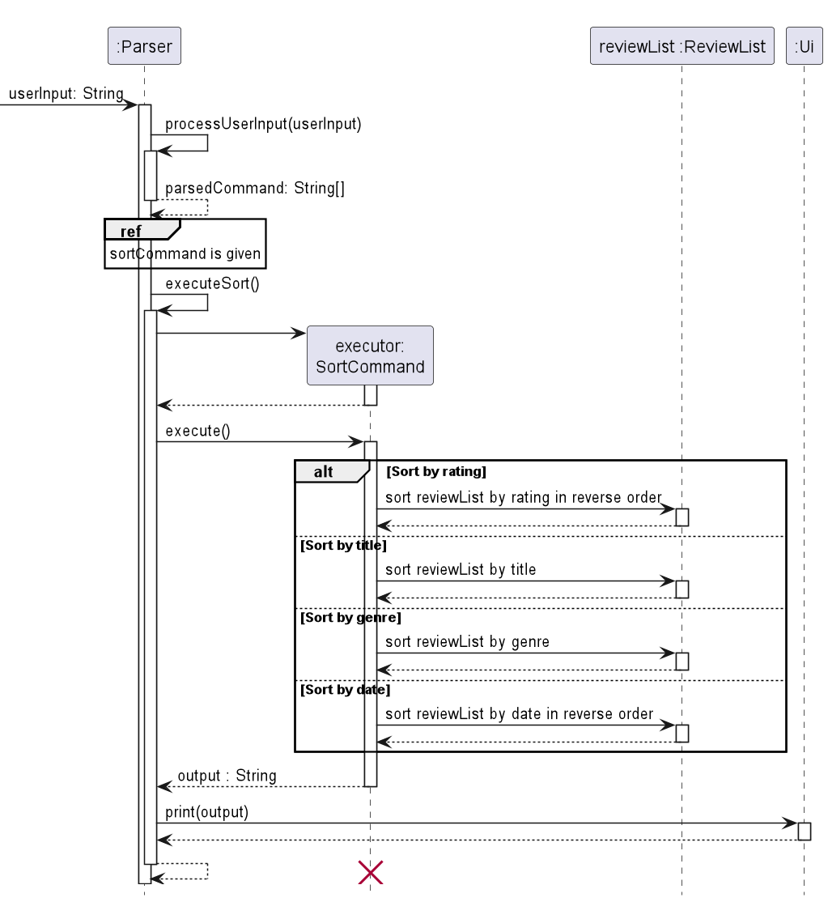

# Developer Guide

## Design & Implementation

### Ui
The `Ui` class handles user input and basic output messages. It can
* Read user input
* Output various messages to the user

### Storage Class
The `Storage` class handles the storing and retrieval of users' information. When the program is first
started, the program checks for whether there is a file from which to extract the saved information.
If there is not, a new file and folder will be created. The saved information is then loaded in to the reviewList
which the user can maniuplate. Upon exit, all the user's information and attributes are saved into local storage on the txt file.

### Media Classes

### Commands
The command component enables users to make changes to their review list. The command word is taken from the first word
of the user input, and is processed through the `Parser` class. The class diagram shows how the Commands parent class is
implemented, as well as its extended classes.

#### Add
The `add` command enables users to create new movie or TV Show reviews and add them to their review list. The following 
is how the `add` command works:
1. The `Parser` class takes in the user input, and parses this by using its `processUserInput` function.
2. If the parsed command word is recognised to be the `add` command, the `executeAdd` function is called.
3. Using the parsed command, `Parser` then determines whether the review to be added is a movie or Tv show. Otherwise, a 
DukeException error is thrown.
4. A new variable of type Media parent class, `toAdd`, is then created. The `AddCommand` function is then called to add
the Movie or Tv Show `toAdd` into the review list, `reviewList`.

#### Find
The find command enables users to search for existing reviews that contains a given keyword. This is done through the
following steps: 
1. The `Parser` class takes in the user input, and parses this by using its `processUserInput` function.
2. If the parsed command word is recognised to be the `add` command, the `executeFind` function is called and extracts
the keyword to search for from the user input.
3. `Parser` then creates an `executor` object by creating a new `FindCommand`. `Parser` then calls the `execute` 
function from `executor` which loops through all reviews in the list and displays those containing the given keyword
using the `toString()` function found in both the `Movie` and `TvShow` subclasses.

#### List
The list command outputs all inputted reviews per category:

1. The list command sequence begins with a `Parser` object.
2. The `Parser` object calls on `executeList` which is responsible for creating a `ListCommand` Object. It then calls on its `execute` method to execute the proper actions.
3. In this `execute` function, it loops through all the stored reviews and separates each review based on category and formats using the proper `toString` method.
4. Finally, an output string is returned and the `Parser` class calls on the `UI` object to print the output to the user.  

#### Sort
The sort command sorts reviews based on a given input. 

1. The sort command sequence begins with a `Parser` object.
2. The `Parser` object calls on `executeSort` which is responsible for creating a `SortCommand` Object. Then it calls on `SortCommands`'s `execute` method to execute the proper actions.
3. The `execute` function returns the sorted outputted string.
4. Finally, the `Parser` class calls on the `UI` object to print out the output to the user.

#### Remove
When the user wants to delete a specific review from the review list, they will use the following command: "delete 
[mediaType] [index]" which triggers the executeDelete() method in Parser. For example, "delete movie 2" will delete the 
review at index 2 of movie section of the review list.

1. To check that the command given by the user is valid, the program checks for the condition that the user input 
array contains exactly three String objects, failing which a DukeException will be thrown.

2. The program then checks if a valid media type is given i.e. "movie" or "tv", failing which a DukeException will 
also be thrown. 

3. If the previous conditions are successfully met, a RemoveCommand object is created and its execute() method is 
called. This method loops through the review list, first checking whether the review is of the given media type, then 
whether the review is at the given index.

4. If both conditions are met, the review is successfully removed from the review list.

5. A string confirming the successful removal of the review is generated and printed for the user.

#### Clearing the review list

When the user wants to remove every review from the review list, they will use the following command: "clear", which 
triggers the executeClear() method in Parser.

1. A ClearCommand object is created and its execute() method is called.

2. The ArrayList method clear() is called on the review list, removing every Media object from the review list.

3. A string confirming the successful clearing of the review list is generated and printed for the user.

### Marking favourite reviews or listing all favourites

The "favourite" command covers two user scenarios:
1) The user wants to mark or unmark a specific review as favourite.
2) The user wants to list all favourites.

**Scenario 1**:
To mark or unmark a review, the user will use the following command: "favourite [index]", which triggers the 
executeFavourite() method in Parser. For example, "favourite 3" mark the review at index 3 if it has not been marked as 
favourite, or unmark it if it has already been marked as favourite.

Step 1: A FavouriteCommand object is created and its execute() method is called.

Step 2: The program checks that an index is given in the user input.

Step 3: If the review at the given index has not been marked as favourite, the setFavourite(true) method of the Media 
class is called to mark the review as favourite. Conversely, if the review at the given index has already been marked 
as favourite, the setFavourite(false) method of the Media class is called to unmark the review as favourite.

Step 4: A string confirming the successful marking or unmarking of the review as favourite is generated and printed for 
the user.

**Scenario 2**:
To list all favourites in the review list, the user will use the following command: "favourite list", which triggers 
the executeFavourite() command in Parser.

Step 1: A FavouriteCommand object is created and its execute() method is called.

Step 2: The program checks that the user input contains the "list" keyword.

Step 3: The program loops through the review list and checks whether the review has been marked as favourite. If the 
review has been marked as favourite, the toString() method of the Media class is called on that review so that the 
stringified version of that review can be added to a String object, which will be returned to the Parser.

Step 4: The String object which was returned to the Parser and contains the list of reviews marked as favourite is 
printed for the user.

## Product scope
### Target user profile

{Describe the target user profile}
The target user profile is ideally individuals who are well-versed in the command line
and are avid movie or TV show watchers. Therefore, this app is customised to their preferences.

### Value proposition

{Describe the value proposition: what problem does it solve?}

## User Stories

|Version| As a ... | I want to ...                    | So that I can ...                            |
|--------|---------|----------------------------------|----------------------------------------------|
|v1.0|user| add movies to a list             | keep track of which movies I have watched.   |
|v1.0|user| add ratings out of 10 to a movie | remember how much I enjoyed the movie.       |
|v1.0|user| remove movies from my list       | delete erroneous entries.                    |
|v1.0|user| list the movies I have added       | view what movies I have watched              |
|v1.0|user| enter the date I watched the movie       | recall when I watched the movie.             |
|v2.0|user| arrange my review list by worst or best ratings        | see the shows that I like or hate the most.  |
|v2.0|user| star/favorite a movie        | mark shows that I would like to watch again. |
|v2.0|user| star/favorite a tv show        | mark tv shows that I may want to watch again. |
|v2.0|user| see a display of my favourited items       | I can quickly refer to the shows I have marked.|
|v2.0|user| be able to save my information after I exit the program   | offload it from my mind. |
|v2.0|user| be able to retrieve my last saved list   | I do not have to remember it myself. |
|v2.0|user| list the movies I have watched                        | view what movies I have watched              |
|v2.0|user| list the tv shows I have watched                      | view what tv shows I have watched            |
|v2.0|user| search movies using a keyword                         | to find a specific movie I have watched      |
|v2.0|user| search tv show using a keyword                        | to find a specific tv show I have watched    |
|v2.0|user| clear movies that I have watched                      | to clear my watch history                    |
|v2.0|user| clear tv shows that I have watched                    | to clear my watch history                    |

## Non-Functional Requirements

{Give non-functional requirements}

## Glossary

* *glossary item* - Definition

## Instructions for manual testing

- Load Main 
- Add a movie or tv show 
  - Command:
    - add /movie test /rating 5  /date 02-02-2022 /genre horror)
    - add /tvshow test /rating 5  /date 02-02-2022 /genre horror /site e
- List movies and tv shows 
  - Command: list
- Remove a movie or tv show
  - Command: remove (index #)
- Clear history
  - Command: clear

