# Developer Guide

## Table of contents

### 1. [General Overview](#1-general-overview-1)

### 2. [Design & Implementation](#2-design--implementation-1)

2.1 [Database](#21-database)\
2.2 [User Storage](#22-user-storage)\
2.3 [Timetable](#23-timetable)\
2.4 [Delete History](#24-delete-history)\
2.5 [Ui](#25-ui)\
2.6 [Commands](#26-commands)\
2.7 [User Module Mapping](#27-usermodulemappinglist)\
2.8 [User University List Manager](#28-useruniversitylistmanager)

### 3. [Product Scope](#3-product-scope-1)

3.1 [Target User Profile](#31-target-user-profile)\
3.2 [Value Proposition](#32-value-proposition)\
3.3 [Problem Addressed](#33-problem-addressed)

### 4. [User Stories](#4-user-stories-1)

### 5. [Non-functional Requirements](#5-non-functional-requirements-1)

### 6. [Glossary](#6-glossary-1)

### 7. [Instructions for Manual Testing](#7-instructions-for-manual-testing-1)

## 1. General Overview

Below is an architecture diagram that provides a brief overview of how the program works.

The program will first make use of the save file and database file to populate its internal memory. This is stored in the program's user storage and database storage respectively. When the user then interacts with the program's UI, the program logic will take over and make use of the information from database storage to update the user storage. The user storage then updates the save file accordingly. This process will continue until the user makes no further inputs and exits the program.

## 2. Design & implementation

### 2.1 Database

The database reads in SEP module data from `data.csv` and stores the useful data into an ArrayList of module mappings and universities.

Upon starting easySEP, the DatabaseStorage will load each line from `data.csv`, parse the line using DatabaseParser, and store the data into the Database.

Relevant exceptions are thrown when there are unexpected scenarios. For instance, if `data.csv` cannot be found at the given file path, a FileNotFoundException is thrown.

The DatabaseStorage will read the information from `data.csv`, using the DatabaseParser to make sense of the information, and then store it in the Database class. The Database class will then be used by other parts of the program to reference information. This is done to achieve the Separations of Concerns principle since the code related to loading the data, parsing the data, and referencing the data is all separated from each other.

The following diagram illustrates the relationships between the three main database classes - DatabaseStorage, DatabaseParser, and Database.

The following diagram illustrates the flow of the program, from the initial loadDatabase call to the eventual completion of updating the entire database.

### 2.2 User Storage

User storage refers to saving and loading the necessary user information into text files. It mainly involves two classes, UserStorage and UserStorageParser.
UserStorage handles extracting and storing information from the various text files while UserStorageParser handles the exchange of information between String and UserUniversityListManager formats.
Saving of user information into text file occurs when user inputs an add/delete/create command. Loading of user information from text files occurs at the start of the program.

Based on the user's saved university lists, user storage will save each university list's information in a separate text file.
Each text file is named after the partner university (ie. `Boston University.txt`) and will contain the user's favourites, saved modules, timetable information.
An example of a text file will look like [this](../data/Example University.txt).

Here is how the information is stored:

- First line contains 'T' indicated this list is favourited by the user, and 'F' otherwise.
- From second line to '#', each line contains a partner university's module code and a comment if it was added to the module, which is separated by a ';'.
- From '#' to end of file, each line contains a partner university's module code, lesson day, start time and end time, which are separated by ';'.
- Every line is separated by a '%'.

Only the partner university's module code is stored to prevent storing excessive information, avoiding potential tampering or corrupting of information.
To retrieve the other information (ie. partner university's module title, NUS module code, NUS module title etc.), UserStorageParser will call Database to get the relevant information.

Upon starting easySEP, UserStorage will first load its private `HashMap` called filePaths, which stores all mappings of university name to the corresponding file path.
UserStorage will also extract all valid information from the text files into a `String` and convert them into a `UserUniversityListManager` to be used in the main Duke class.

InvalidUserStorageFileException is thrown when there are unexpected scenarios. Such instances include

- File name not found in database
- Module code not found in corresponding university in database
- Incorrect number of fields of information
- Module code exists in timetable portion but missing in saved modules portion
- Invalid day or time for lessons

During these situations, the corresponding text file for the university will be deleted, and an error messgae will inform the user of the invalid file format and deletion.

During the duration of the program, whenever the user decides to alter the data corresponding to UserUniversityListManager
(ie. add / delete universities or modules, or create new university list), UserStorageParser class will update the affected university's text file accordingly.
This is achieved by converting UserUniversityListManager into a `String`, before saving it in the text file.

The following diagram illustrates the relationships between the two main user storage classes - UserStorage and UserStorageParser.

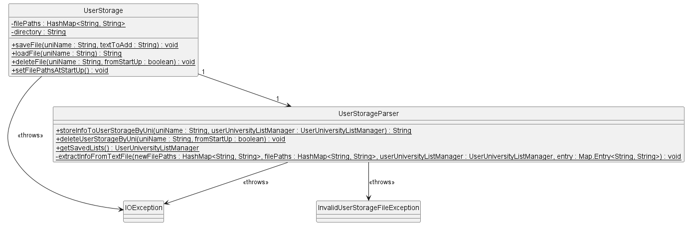

The following diagram illustrates the flow of the program, from initialisation to updating of the text files.

### 2.3 Timetable

Upon starting easySEP, a TimetableManager is created in preparation for users to begin adding Timetables. The TimetableManager is used to create new Timetables, manage existing Timetables and delete old Timetables.
These Timetables are stored in a HashMap and indexed by university name to facilitate easy reference.

For existing Timetables, they can be used to add and delete Lessons. Each Timetable is made up of a `HashMap` of `ArrayLists(type: Lesson)` indexed by weekday e.g. Monday for easy compartmentalisation.
Within Timetables, Lessons will compromise details like the day, start time and end time. The `ArrayLists(type: Lesson)` are sorted in non-descending order by the start time of the Lessons.

Relevant exceptions are thrown when unanticipated scenarios occur. For instance, if the user attempts to delete a non-existent Timetable, a TimetableNotFoundException is thrown.
Another example is the user attempting to add a lesson that is conflicting with an existing lesson in his/her timetable. In this case, a TimetableClashException is thrown.

The following diagram illustrates the relationships between the three main timetable classes - TimetableManager, Timetable and Lesson.

In chronological order, the following diagrams illustrate the flow of the program for adding lessons, deleting lessons and displaying timetables to the user.

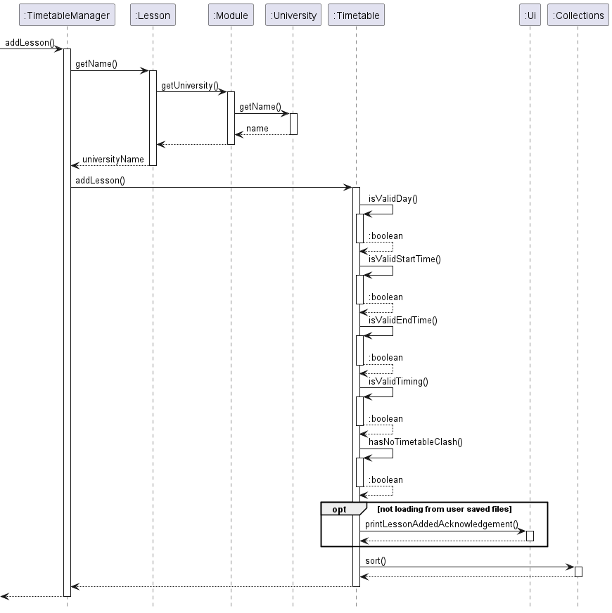
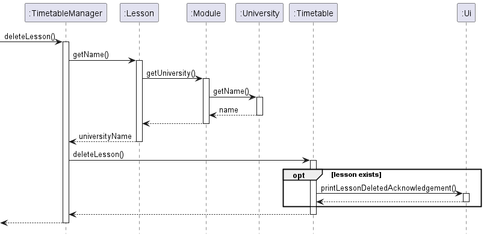
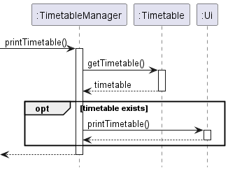

### 2.4 Delete History

To help users recall the modules that they had recently deleted, the Delete History feature allows them to view up to 5 most
recently deleted module mappings. This can help them to add the module mappings back to the lists without having to search for the specific
module code again.

The UserDeletedModules class has an `ArrayDeque`, which stores the recently deleted module mappings.
When the user deletes a module mapping, it will be added to the `ArrayDeque`.
If the `ArrayDeque` already contains 5 module mappings, the last one (least recent) will be deleted, before the addition of a new module mapping.
Do note that delete history information is not stored upon exiting the app (ie. it is not stored in User Storage).

The following diagram illustrates the relationship between UserUniversityListManager and UserDeletedModules classes.

The following diagram illustrates the flow of the program, when a user deletes a module.

### 2.5 Ui

The Ui class is the cornerstone of the Duke program to facilitate interaction with the user. It is used to scan and collect user input, print error messages to the user upon invalid input commands,
and display the appropriate acknowledgements or required information based on the user's command.

The following diagram illustrates the methods within the Ui class that can be invoked by the other classes in Duke for the purpose of user interaction.

### 2.6 Commands

To interact with easySEP, users have to input commands specified with parameters to perform operations which will be passed to the CommandParser to generate a corresponding Command according to their input.
The Command will then be executed to perform the operation on the other classes managing the timetables and databases. Error checking is handled to throw InvalidUserCommandException if the user's input does not match
the specified Command format. To deal with parsing parameters, spaces in University names and Module codes are to be replaced with underscores.

The following class diagram illustrates the relationship between Command class and its subclasses as well as other classes related to Commands.
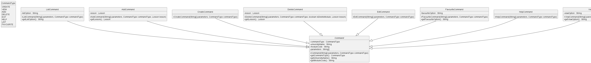

#### 2.6.1 Create Command

A Create command can be used to create a university list and its corresponding timetable.

The following sequence diagram illustrates the relationship between the respective classes involved in the creation and execution of a create command.

#### 2.6.2 Exit Command

An Exit command can be used to exit the application.

The following sequence diagram illustrates the relationship between the respective classes involved in the creation and execution of an exit command.

#### 2.6.3 Help Command

A Help command can be used to exit the application.

The following sequence diagram illustrates the relationship between the respective classes involved in the creation and execution of a help command.

#### 2.6.4 Add Command

An add command can be used to add a lesson to the timetable, add a module mapping to the user university list, or add a note for an existing module mapping in the user university list.

The following sequence diagram illustrates the relationship between the respective classes involved in the creation and execution of an add command.

#### 2.6.5 Delete Command

A delete command can be used to delete a lesson from the timetable, delete a module mapping from the user university list or delete an entire user created university list.

The following sequence diagram illustrates the relationship between the respective classes involved in the creation and execution of a delete command.

#### 2.6.6 View Command

A view command can be used to view all user created university lists, view user's delete history, view user's selected university list or view all the user's created university lists' timetables.

The following sequence diagram illustrates the relationship between the respective classes involved in the creation and execution of a view command.

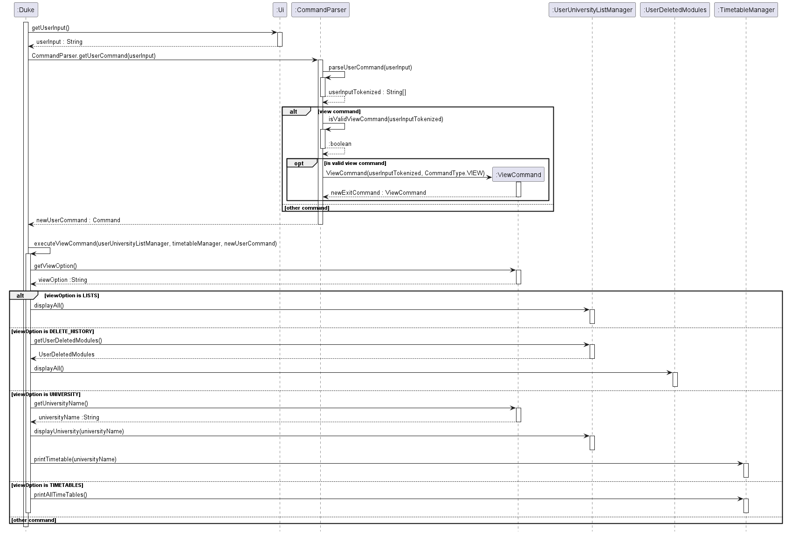

#### 2.6.7 List Command

A list command can be used to display all the module mappings in the database, all the universities in the database, or allow users to filter by NUS module code or partner university name.

The following class diagram illustrates the relationship between the respective classes involved in the creation and execution of a list command.

To differentiate between the various functions of the list command, a variable `listOption` is used. This variable signals Duke to execute the relevant commands accordingly.

The following sequence diagram illustrates the flow of the program to read in the user input, parse the user input, check if it is a valid list command, and execute the relevant list command based on the `listOption`.

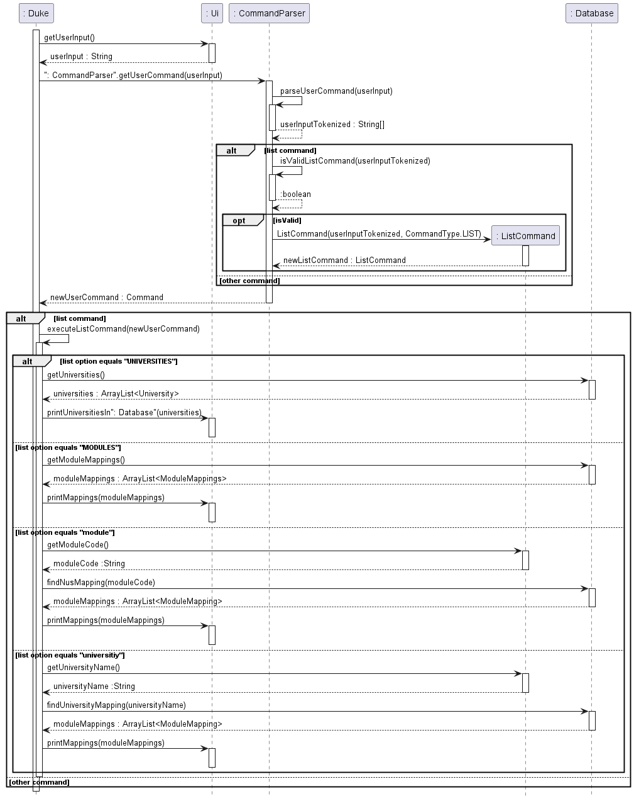

#### 2.6.8 Favourite Command

A favourite command can be used by the user to favourite or un-favourite lists of module mappings that they have curated. It can also be used to display all of the user's favourite lists and the module mappings they contain.

To differentiate between the various functions of the favourite command, a variable `favouriteOption` is used. This variable signals Duke to execute the relevant commands accordingly.

The following class diagram illustrates the relationship between the respective classes involved in the creation and execution of a favourite command.

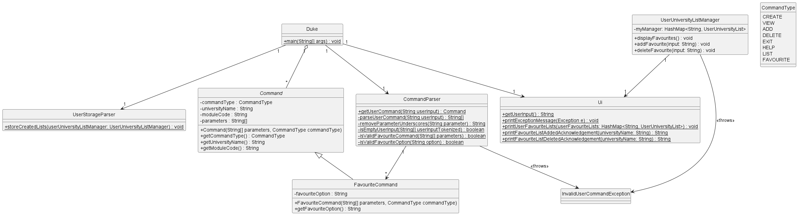

The following sequence diagram illustrates the flow of the program to read in the user input, parse the user input, check if it is a valid favourite command, and execute the relevant favourite command.

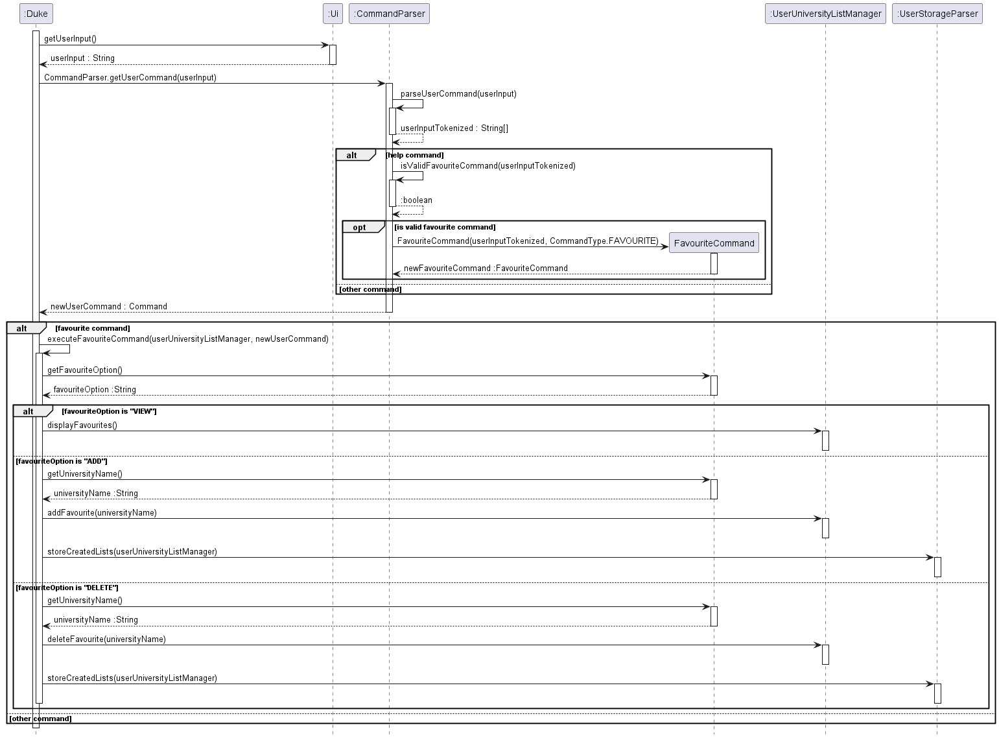

### 2.7 UserModuleMappingList

#### 2.7.1 UserModuleMapping

The UserModuleMapping class aims to bridge 2 modules (one from NUS and one from a Partner University). It is initialized by a constructor
requiring the module code, title, and university name for both NUS and partner university. This aims to simulate a real life example of users
mapping an NUS module to a foreign university's.

#### 2.7.2 UserModuleMappingList

The UserModuleMappingList class consists of stores a list of UserModuleMapping in an ArrayList. Users are able to add new modules using the `addModule`
function, search for matching modules using `findModuleByCode` and delete modules using `deleteModule`. Additionally, users are also able to search
for modules using keywords to filter out the modules currently stored that are related using `findModuleByTitle`

The following class diagram illustrates the relationship between UserModuleMappingList and UserModuleMapping.

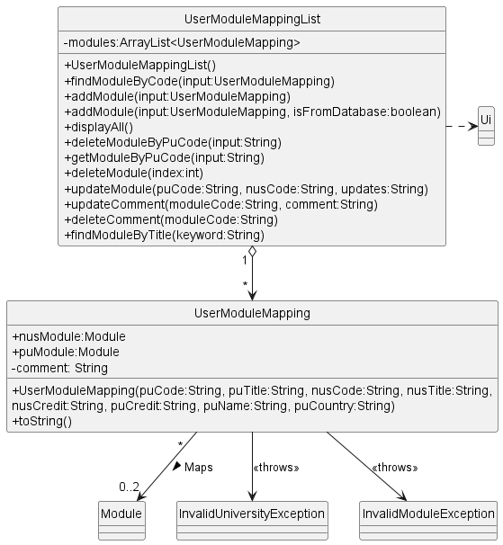

### 2.8 UserUniversityListManager

#### 2.8.1 UserUniversityList

The UserUniversityList class stores 2 important things the `universityName` and a list of UserModuleMapping under `myModules`
Each list is identified using the universityName. Users can only create 1 list for each partner university and this is managed by the
UserUniversityListManager in 1.8.2. A notable function in UserUniversityList is `setFavourite` which will be used in the favourite function
to help users manage multiple lists and note down their favourites

#### 2.8.2 UserUniversityListManager

The UserUniversityListManager manages a hashmap of lists, with the `universityName` as the key. This prevents duplicates and unnecessary space
wastage. HashMap is also an efficient data structure to obtain the UserUniversityList as the value in constant time. The UserUniversityListManager
has the notable functions `addModule` and `deleteModule` which allows users to add and delete module in a specific list. It also has the `addFavourite`
and `deleteFavourite` function which helps the users to organise their lists.

The following class diagram illustrates the relationship between UserUniversityListManager and UserUniversityList as well as other relevant classes.

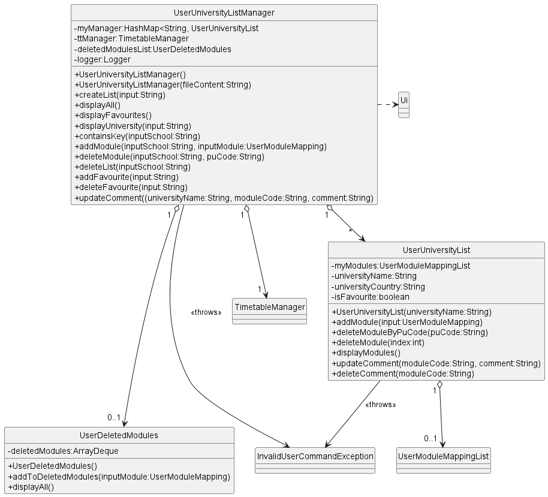

The following sequence diagram helps explain the key steps behind the main functions in UserUniversityListManager.

## 3. Product Scope

### 3.1 Target User Profile

NUS SoC undergraduates intending to embark on a Student Exchange Programme

### 3.2 Value Proposition

- SoC students are able to efficiently query their local database of past mappings for EE, CG, and CS-coded modules at one go and store their shortlisted modules locally, allowing for ease of reference and follow-up at a later time. This will improve on the shortcomings of EduRec.
- Users can view potential partner universities for SEP and the modules offered.
- Users can create university lists for their desired partner universities, add modules, delete modules and delete lists.
- Users can create timetables, add class timings and plan out their schedules at desired partner universities.
- Users can save their current university lists after exiting the app and load it again next time.
- Users can favorite their top university picks.

### 3.3 Problem Addressed

The module mapping support provided by the EduRec website is not helpful, allowing students to only search for past mappings either by Faculty or by University. This makes the module mapping process very time-consuming, with the slow response of the EduRec website adding fuel to the fire. Moreover, the website does not allow for the searching of modules to map to begin with, much less so for searching multiple modules at one go (which is exactly what most users would be looking for). EduRec does not give students the option of saving shortlisted modules either.

## 4. User Stories

| Version | As a ...              | I want to ...                                                            | So that I can ...                                                         |
| ------- | --------------------- | ------------------------------------------------------------------------ | ------------------------------------------------------------------------- |
| v1.0    | interested user       | use a program that provides feedback to my actions                       | feel my commands being acknowledged                                       |
| v1.0    | interested user       | have my commands understood by the program                               | use the easySEP to plan my SEP modules                                    |
| v1.0    | user                  | save my shortlisted modules and their associated partner universities    | continue my module mapping search at a later time                         |
| v1.0    | user                  | create a listing for my target university                                | track whatever modules I am interested in for my target university so far |
| v1.0    | user                  | add a module that I am interested in to a list                           | track what I have seen so far                                             |
| v1.0    | potential SEP student | plan my schedule based on the most up-to-date information                | ensure the currency of my plans                                           |
| v1.0    | user                  | be able to delete modules that I am no longer interested in from my list | ignore them in my planning                                                |
| v1.0    | user                  | edit my previous modules that I have added                               | make changes to my plans whenever needed                                  |
| v1.0    | user                  | be able to view my past modules that I have saved                        | refer back to my previous lists                                           |
| v2.0    | user                  | see the list of valid commands                                           | review the valid commands                                                 |
| v2.0    | potential SEP student | be able to view the full list of modules available                       | consider all my available options                                         |
| v2.0    | potential SEP student | be able to view the full list of partner universities available          | consider all my available options                                         |
| v2.0    | user                  | be able to view all module mappings for an NUS module code               | consider modules to map                                                   |
| v2.0    | user                  | be able to view all module mappings offered by a partner university      | consider modules to map                                                   |
| v2.0    | user                  | see my most 5 recent deleted modules                                     | check my history                                                          |
| v2.0    | user                  | be able to favourite my lists                                            | keep that of my priorities                                                |
| v2.0    | user                  | various search functions for my lists                                    | search for information faster                                             |
| v2.0    | user                  | be able to add class timings and create a timetable for SEP              | keep track of my timetable                                                |
| v2.1    | new user              | use a program that does not fail unexpectedly                            | do not have to deal with handling crashes                                 |

## 5. Non-Functional Requirements

1. Java 11 or above installed
2. Program built to support only single user

## 6. Glossary

- HU: home university
- PU: partner university
- u/ - university
- m/ - modules

## 7. Instructions for Manual Testing

1. Download the `.jar` file from [this link](https://github.com/AY2223S1-CS2113-W13-2/tp/releases).
1. Open the folder that that the `.jar` file is in and run the program using `java -jar easySEP.jar`.
1. View all commands and the correct command format using `/help`. Below are a few examples to consider.
1. The list of valid universities and module mappings can be found using `/list UNIVERSITIES` and `/list MODULES` respectively.
1. The commands `/list m/CS2113` and `/list u/Aalto_University` can be used to list all module mappings for `CS2113` and `Aalto University` in the database.
1. Create a new university list using `/create u/Aalto_University`.
1. Add a new module using `/add u/Aalto_University m/C3130`.
1. Add a new lesson using `/add u/Aalto_University m/C3130 d/Monday st/08:00 en/10:00`.
1. Add a new comment using `/add u/Aalto_University m/C3130 note/{this is a note}`.
1. Favourite a university list using `/favourite add/Aalto_University`.
1. Use `/favourite VIEW` to see the list of favourite university lists.
1. Un-favourite a university list using `/favourite del/Aalto_University`.
1. View all university lists using `/view LISTS` and all timetables using `/view TIMETABLES`.
1. For a specific university list, use `/view u/Aalto_University` to see modules added.
1. Delete a comment using `/delete u/Aalto_University m/C3130 note/`.
1. Delete a lesson using `/delete u/Aalto_University m/C3130 d/Monday st/08:00 en/10:00`.
1. Delete a module using `/delete u/Aalto_University m/C3130`.
1. Delete university list using `/delete u/Aalto_University`.
1. Input `/view DELETE_HISTORY` to view recently deleted modules.
1. Use `/exit` to end the program.
