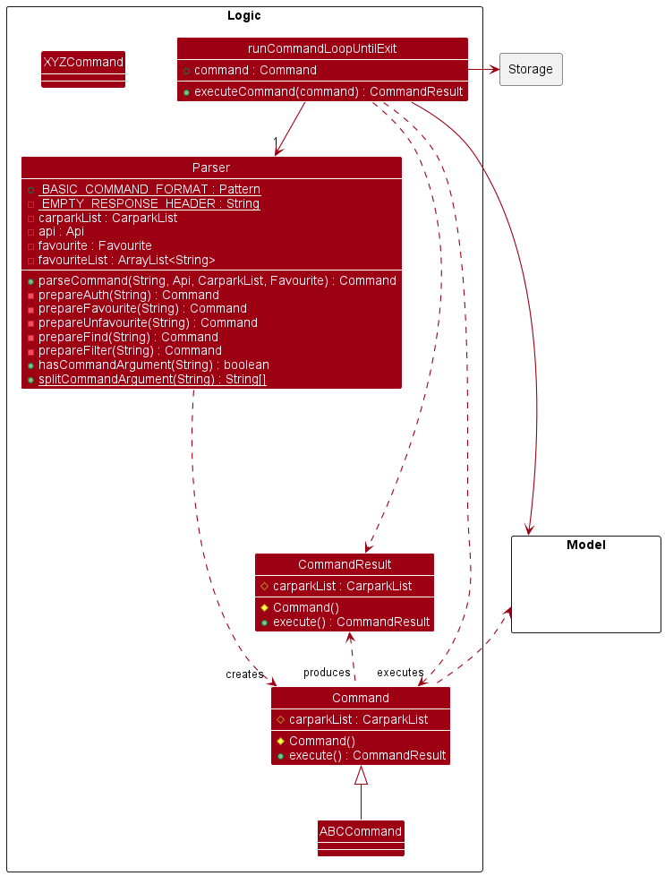

# Developer Guide

## Contents

- [1 Acknowledgments](#1-acknowledgements) 
- [2 Design](#2-design)
  - [2.1 Architecture Level](#21-architecture-level)
    - [2.1.1 Main Components of the Architecture](#211-main-components-of-the-architecture)
  - [2.2 Model Component](#22-model-component)
  - [2.3 API Component](#23-api-component)
  - [2.4 Storage Component](#24-storage-component)
    - [2.4.1 FileWriter](#241-filewriter)
    - [2.4.3 FileLoader](#242-fileloader)
  - [2.5 UI Component](#25-ui-component)
  - [2.6 Logic Component](#26-logic-component)
- [3 Implementation](#3-implementation)
  - [3.1 Favourite / Unfavourite Feature](#31-favourite--unfavourite-feature)
    - [3.1.1 Design Considerations](#311-design-considerations)
  - [3.2 Common Files](#32-common-files)
- [4 Project Scope](#4-product-scope)
  - [4.1 Target user profile](#41-target-user-profile)
  - [4.2 Value Proposition](#42-value-proposition)
- [5 User Stories](#5-user-stories)
- [6 Non-Functional Requirements](#6-non-functional-requirements)
- [7 Glossary](#7-glossary)
- [8 Instructions for Manual Testing](#8-instructions-for-manual-testing)

## 1 Acknowledgements
Our project uses external libraries and services from:
1. Land Transport Authority DataMall API Service ([link](https://datamall.lta.gov.sg/content/datamall/en.html)).
2. Jackson JSON Parser ([link](https://fasterxml.github.io/jackson-core/javadoc/2.8/com/fasterxml/jackson/core/JsonParser.html))

## 2 Design 

### 2.1 Architecture Level
The Architecture Diagram below explains the high level design of the app.

Given below is a quick overview of the main components and how they interact with one another.
#### 2.1.1 Main Components of the Architecture
Our program flow is managed by the Parking class.

User input is passed to the Command class, which then calls the Parser to parse the user input string as a command. 
Each command subclass handles its own execution.

Below are the main subcomponents that Parking and the command subclass delegate work to:
* `Ui`: Deals with user interaction, such as reading input and printing output.
* `CommandResult`: Returns the results of the command instructed.
* `Parser`: Takes in the user input string to determine what is the command the user has instructed the program to do.

### 2.2 Model Component

The model component consists of a `CarparkList` (and `CarparkFilteredList`) class that contains
instances of `Carpark`, under the package `seedu.data`. 

This component: 
* Stores all carpark data (all `Carpark` objects), contained in a `CarparkList` object.
* Stores filtered carpark data to be used in other components (in `CarparkFilteredList`).
* Contains methods for selecting a `Carpark` object based on a unique code (for the `find` command) as well
as filtering by a substring or set of substrings (`search` command).
* Is independent of other components except the API component, which is used to generate it.
* Group objects with the same code by enum `LotType` (Car, Motorcycle, Heavy Vehicle) and places them in a HashMap 
for easy access. For example: Three `carpark` objects may have the same unique carpark code as they are the same 
carpark, but contain available lot information for different types of lot. These three objects will be grouped under 
one object with the HashMap `allAvailableLots` containing a breakdown of lots by type.

Note: The `Carpark` class contain many getters, setters and annotations to be used with the `jackson` module. 
See [`FileLoader`](#FileLoader) for more information.

### 2.3 API Component

The model component consists of a `Api` class that supports API call to LTA DataMall Services, under the
package `seedu.api`.

This component:
* Focuses on communicating with an external Api by using HTTP requests. 
* JSON response will be stored in the local JSON file as long as the response is `200 OK` and not empty.
* Only reads from the secret.txt file once and stores the API as a variable (will only read from the file
if requested again).

How the API component of data fetching works
1. The initialisation of the class will make an instance of the `Storage`, `HttpClient` and `Ui` class.
2. If the program just started, the Parking class will call the `loadApiKey` method.
   - If no file called `secret.txt` is found, file will be created.
   - If the file is empty, default key will be loaded to the Api instance (but not written to the local file).
3. To get a certain data set from the Api Service,
   - Call `asyncExecuteRequest` method to construct the HTTP request packet header and sends the request
     asynchronously.
   - Call `fetchData` method to get response immediately from the Api.
      - This method will also validate the response from the Api by identifying the response code.
      - Unless its 401 Unauthorised Access (due to invalid Api key), the method will try to fetch data
        at most 5 times.

Since each API call only returns 500 data, we need to make multiple api calls. Thus, there is another function 
that handles the API calls all at once. The process is still similar.
1. Same step 1 and 2 above.
2. Call `syncFetchData` method, which calls both the `asyncExecuteRequest` and `fetchData` five times (LTA only has 2312 
Parking lot data)
   - This method makes all 5 request asynchronously and receives in sequence.
   - The method will concatenate the data together for data processing by other parts of the program.
   - The processed data will then be stored in a local data file.
   
The following sequence diagram shows how data is fetched using the `update` command.

The API component is also able to:
- Loads in key from a local file storage (in txt format).
- Authenticate user API key. If no user key inputted, default key will be loaded.
- Get API authentication status.

The following sequence diagram shows how the API key is loaded.

### 2.4 Storage Component

##### 2.4.1 FileWriter

##### 2.4.2 FileLoader

### 2.5 UI Component

The user-facing parts of the program are implemented with the Ui class.

It implements the following main functions:

- `print()` - Prints a string to System.out.
- `getLine()` - Asks user for input and returns input.
- `getCommand()` - Asks user for a command input and returns input.
- `showLogo()` - Prints ASCII art of a car and parKING logo.
- `printResult()` - Shows the result of a command execution to the user. Includes additional formatting of the results of 
different commands.
- `printError()` - Print exception message.
- `changeScanner()` - Changes the scanner for the Ui object. To be used for JUnit testing.
- `getSeparatorString()` - Returns a separator string.

### 2.6 Logic Component
How the parsing works:

* When called upon to parse a user command, the `Parser` class creates an `ABCCommandParser` (`ABC` is a placeholder 
for the specific command name eg. `FindCommandParser`) which uses the other classes to parse the user command and
create an `ABCCommand` object (eg. `FindCommand`), which the `Parser` returns back as a `Command` object.

* All `ABCCommandParser` classes (eg. `FindCommandParser`, ``SearchCommandParser` etc) inherit from the `Parser` 
interface so that they can be treated similarly where possible.

How the command works:

* When the `Parser` returns back as a `Command` object, it will run `execute`, which is a method to execute the command
and return the intended result. `Execute` returns a `CommandResult`, which is an object that takes in `String` and
`CarparkList` and returns what the user will be seeing on the terminal.
* Each command will have its own class `ABCCommand` (`ABC` is a placeholder for the specific command name eg. 
`FindCommand`) as an extension of the `Command` class.
* All `ABCCommand` classes will have an override `execute` method, which will override the `execute` method in `Command` 
and return the respective `CommandResult` result of the Command.

## 3 Implementation
This section describes some noteworthy details on how certain features are implemented.

### 3.1 Favourite / Unfavourite feature

The Favourite class uses the FileReader and FileStorage classes to read and write carpark IDs to a .txt file so that
user favourited carparks can be saved locally and retrieved even after the user exits the application.

It implements the following operations:

- updateFavouriteList() - Reads in data from favourite.txt file and saves it to this object.
- writeFavouriteList() - Writes all favourite carpark IDs to favourite.txt file.
- showList() - Returns the carpark IDs of all favourited carparks in a string.

The favourite feature is implemented using the FavouriteCommand Class.

It uses the Favourite class to update the favouriteList and to write to the favouriteList.

It implements the following operations:

- setFavourite() - Inserts a carpark into the favourite list.

The unfavourite feature is implemented using the unfavouriteCommand Class.

It uses the Favourite class to update the favouriteList and to remove favourited carparks from  the favouriteList.

It implements the following operations:

- setUnfavourite() - Removes a carpark from the favourite list.

Given below is an example of how the Favourite class is used to perform favourite / unfavourite operations:

Step 1. On startup, the Favourite is initialised with a directory and file path to the file that contains data, and a
favouriteList attribute.
The Favourite class calls `updateFavouriteList()` shortly after to populate its ArrayList with the carpark IDs in the
file.

Step 2. The user executes `favourite 1` to favourite the carpark with carpark ID `1`. The command is passed to the
Parser class which returns a Command with value `FAVOURITE`.
The main program first checks if the second argument in the command is equal to `list`. If so, the main program calls
`showList()` and passes it output to the Ui class for printing.
Else, the main program checks if there exists a carpark with carpark ID `1` by calling `findCarpark()` from the
CarparkList class, which throws `NoCarparkFoundException` if no carpark was found.
`setFavourite()` is then called to add the valid carpark ID into `favouriteList`, which searches `favouriteList` for
any identical carpark IDs and throws `DuplicateCarparkException` if found, to prevent addition of duplicates.
`1` is then added into `favouriteList` and `setFavourite()` calls `writeFavouriteList()` which overwrites data from
`favouriteList` to the favourites file.

> Note: If any exception is thrown, `1` will not be added into `favouriteList`, and `writeFavouriteList()` will not be
> called, hence preserving the validity of the carpark IDs.

Step 3. The user executes `favourite 2` to favourite the carpark with carpark ID `2`. Same as Step 2.

Step 4. The user realises he/she made a mistake and wants to unfavourite the carpark with carpark ID `2`, and executes
`unfavourite 2`.
The command is passed to the Parser class which returns a Command with value `UNFAVOURITE`. The main program calls
`setUnfavourite()`,
which first checks if `favouriteList` contains an entry that matches `2`, and throws `NoCarparkFoundException` if none
is found.
Next, `2` is removed from `favouriteList` and `setUnfavourite()` calls `writeFavouriteList()` which overwrites data from
`favouriteList` to the favourites file.

Step 5. The user wants to view all favourited carparks and executes `favourite list`. The command is passed to the
Parser class which returns a Command with value `FAVOURITE`.
The main program calls `showList()` this time as the second argument in the command is `list`. The `showList()` method
uses StringBuilder to format all the contents of `favouriteList` into a user-friendly string, and returns it for
printing.

The following sequence diagrams shows how a favourite / unfavourite command works:

#### 3.1.1 Design considerations

**Aspect: Format of input after `favourite` or `unfavourite` command**
- **Alternative 1 (current choice):** Carpark ID
    - Pros: More direct, do not need to search before favouriting
    - Cons: User has to either memorise the carpark ID they want to favourite, or search and type in the whole carparkID
- **Alternative 2:** Index of search result
    - Pros: Less time needed to favourite after a search result, do not need to key in entire carpark ID again
    - Cons: Need to search before favouriting, even if user already knows the exact carpark ID

### 3.2 Common Files

## 4 Product scope
### 4.1 Target user profile

{Describe the target user profile}

### 4.2 Value proposition

{Describe the value proposition: what problem does it solve?}

## 5 User Stories

|Version| As a ... | I want to ... | So that I can ...|
|--------|----------|---------------|------------------|
|v1.0|new user|see usage instructions|refer to them when I forget how to use the application|
|v2.0|user|find a to-do item by name|locate a to-do without having to go through the entire list|

## 6 Non-Functional Requirements

{Give non-functional requirements}

## 7 Glossary

* *glossary item* - Definition

## 8 Instructions for manual testing

{Give instructions on how to do a manual product testing e.g., how to load sample data to be used for testing}
