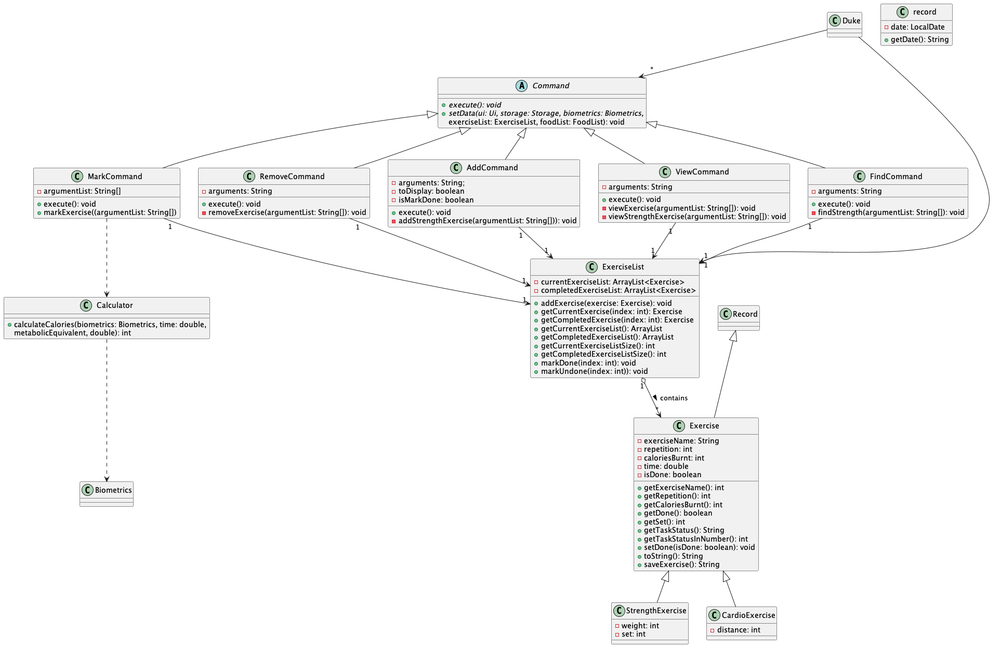
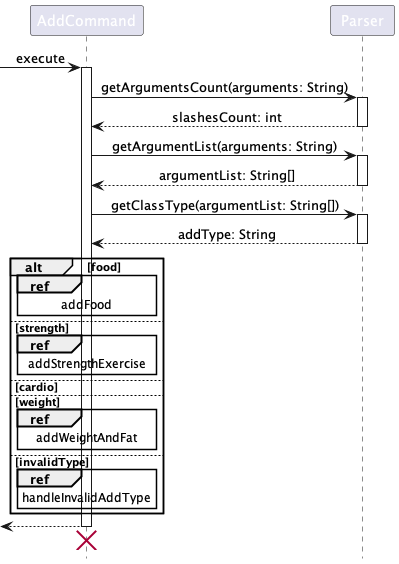

# Developer Guide

## Acknowledgements

{list here sources of all reused/adapted ideas, code, documentation, and third-party libraries -- include links to the
original source as well}  
Zhou Zhou's Individual Project: https://github.com/maanyos/ip \
Nay Chi's Individual Project: https://github.com/NayChi-7/ip

## Design & implementation

{Describe the design and implementation of the product. Use UML diagrams and short code snippets where applicable.}

### Class Diagrams

Biometrics component:  
The Biometrics component stores information about the user's biometrics and holds a reference
to an ArrayList of the user's weight and fat records under WeightAndFatList class.  
WeightAndFatList is separated from Biometrics for better abstraction and cohesion.  
[Proposed] Weight and fat records will be associated with a date, and the WeightAndFatList class
stores records in descending order of date for viewing purposes.

Food component:

Food and FoodList are two classes implemented for storing user's food consumption.
The interaction between the Food, FoodList class and Command classes(Addcommand, RemoveCommand,
FindCommand and ViewCommand). Only food related details(i.e. methods and attributes) are added in the
diagram below for readability.  

\
[Proposed] Food records will be associated with a date, and the FoodList class
stores records in descending order of date for viewing purposes.

CardioExercise/StrengthExercise and ExerciseList components:

CardioExercise/StrengthExercise and ExerciseList are classes to store user's cardio/strength training exercises.
Both CardioExercise and StrengthExercise inherit from Exercise and work similarly.
CardioExercise/StrengthExcises are added, removed, found , mark done, mark undone and viewed from the ExerciseList with
the use
of AddCommand, RemoveCommand, FindCommand, MarkCommand and ViewCommand.\
ExerciseList stores Exercise objects in two Arraylist based on the status of the exercise to save the time needed to
filter exercise based on its status when user want to view the exercises based on its status.

[Proposed] StrengthExercise will be associated with a date, and the exercises will be displayed in descending order of
date for viewing purposes.

### Sequence diagrams

Adding a new record  

Adding weight and fat record

Adding food record

Adding strength exercise

Marking exercise

Viewing historical records

Viewing all historical records sorted by date

## Product scope

### Target user profile

{Describe the target user profile}  
TracknFit is designed for fitness enthusiasts who are new or moderately experienced in fitness
and do not require specialised fitness advice

### Value proposition

{Describe the value proposition: what problem does it solve?}  
TracknFit helps the user track their exercise routines, dietary habits and biometrics, allowing them
to better understand their journey and progress towards their fitness goals.

## User Stories

| Version | As a ...       | I want to ...                     | So that I can ...                                           |
|---------|----------------|-----------------------------------|-------------------------------------------------------------|
| v1.0    | new user       | see usage instructions            | refer to them when I forget how to use the application      |
| v1.0    | user           | add my food consumption           | to keep track of my food consumptions over time             |
| v1.0    | user           | view my food consumption          | to see my record of food consumptions                       |
| v1.0    | new user       | add any exercises                 | can keep track of all my exercises to be done               |
| v1.0    | long term user | view my remaining exercises       | so that I can know what are the exercise to be done.        |
| v1.0    | long term user | view my completed exercises       | so that I can plan for the next workout                     |
| v2.0    | old user       | record my biometrics over time    | see how I am progressing in my fitness journey              |
| v2.0    | user           | find a to-do item by name         | locate a to-do without having to go through the entire list |
| v2.0    | long term user | save my food consumptions         | to keep a record of all my food data over time              |
| v2.0    | long term user | find certain food consumption     | to see my consumption of certain food over time             |
| v2.0    | long term user | save my strength/cardio trainings | monitor my strength/cardio progress over the time           |
| v2.1    | new user       | set my biometrics                 | receive personalised recommendations                        |

## Non-Functional Requirements

1. This app should work on all OS (Linux, Mac, Windows) that has JDK 11 installed.
2. This app is meant for a single user (will not be able to keep track of different user's records).
3. This app is targeted towards users with above-average typing speed, especially those who prefer typing over other
   means of input.

## Glossary

* *glossary item* - Definition
* *biometrics* - age, gender, height, weight and fat percentage of user
* *fat* - fat and fat percentage are used interchangeably to improve consistency in variable names

## Instructions for manual testing

{Give instructions on how to do a manual product testing e.g., how to load sample data to be used for testing}
