# Moolah Manager - Developer Guide

<p align="center">
    
</p>

- [1. Preface](#1-preface)
- [2. Acknowledgements](#2-acknowledgements)
- [3. Setting Up the Project](#3-setting-up-the-project)
- [4. Design](#4-design)
  * [4.1. Architecture](#41-architecture)
  * [4.2. Command Component](#42-command-component)
  * [4.3. Data Component](#43-data-component)
  * [4.4. Storage Component](#44-storage-component)
  * [4.5. Parser Component](#45-parser-component)
  * [4.6. UI Component](#46-ui-component)
  * [4.7. Common Component](#47-common-component)
- [5. Implementation for Managing Transactions](#5-implementation-for-managing-transactions)
  * [5.1. Overview for Transaction](#51-overview)
  * [5.2. Implementation for Transaction](#52-proposed-implementation)
  * [5.3. Add Command](#53-add-command)
  * [5.4. Edit Command](#54-edit-command)
  * [5.5. List Command](#55-list-command)
  * [5.6. Find Command](#56-find-command)
  * [5.7. Delete Command](#57-delete-command)
  * [5.8. Purge Command](#58-purge-command)
- [6. Implementation for Budgeting and Financial Insights](#6-implementation-for-budgeting-and-financial-insights)
  * [6.1. Overview for Budgeting And Insights](#61-overview)
  * [6.2. Proposed Implementation](#62-proposed-implementation)
  * [6.3. Stats Command](#63-stats-command)
  * [6.4. Budget Command](#64-budget-command)
- [7. Implementation for Miscellaneous Operations](#7-implementation-for-miscellaneous-operations)
  * [7.1. Help Command](#71-help-command)
  * [7.2. Bye Command](#72-bye-command)
  * [7.3. Storage Operations](#73-storage-operations)
  * [7.4. Logging Operations](#74-logging-operations)
- [Appendix A: Product scope](#appendix-a-product-scope)
  * [A.1. Target user profile](#a1-target-user-profile)
  * [A.2. Value proposition](#a2-value-proposition)
- [Appendix B: User Stories](#appendix-b-user-stories)
- [Appendix C: Non-Functional Requirements](#appendix-c-non-functional-requirements)
- [Appendix D: Glossary](#appendix-d-glossary)
- [Appendix E:  Instructions for Manual Testing](#appendix-e--instructions-for-manual-testing)
  * [E.1. Launch and Shutdown](#e1-launch-and-shutdown)
  * [E.2. Storage](#e2-storage)
    
## 1. Preface

Moolah Manager is a desktop application for managing one's finances, optimised for use via a Command Line Interface (CLI). Designed for IT professionals who are
fast typists, it can help to process day-to-day monetary transactions that are classified into income and expense. Users can expect to get an overview of their transactions
at a glance and be provided with valuable insights into their spending habits. They are also encouraged to set budget goals to minimise their spending.

This developer guide for Moolah Manager V2.1 illustrates the high-level architecture and how the features are implemented within the application. Moreover, it specifies the 
scope and requirements of the product that were established prior to the development of features. We hope that this guide will assist developers in understanding how the
application works and be able to maintain it seamlessly. 

You may [click here](https://github.com/AY2223S1-CS2113-W12-2/tp) to visit the GitHub repository of this project.

_Written by: Brian Wong Yun Long_

## 2. Acknowledgements

The format of this developer guide was adapted from [SE-EDU AddressBook Level 3 Developer Guide](https://se-education.org/addressbook-level3/DeveloperGuide.html).
The class diagrams are styled using the Cyborg Outline theme by Brett Schwarz.

Some parts of the source code in this application were reused and adapted from the team's individual projects during the CS2113 IP phase. 

_Written by: Brian Wong Yun Long_

## 3. Setting Up the Project

Before setting up the project on your computer, kindly check that you have installed:

* Java JDK 11
* Intellij IDEA - highly recommended

Firstly, you should fork this repo, before cloning the fork to your computer.

Next,

1. **Ensure that Intellij JDK 11 is defined as an SDK**, as described in this [[Set up JDK guide]](https://www.jetbrains.com/help/idea/sdk.html#set-up-jdk) -- this step is not needed if you have used JDK 11 in a previous Intellij project.
    * You _might need to set the Project language level_ section to the SDK default option.
2. **Import the project _as a Gradle project_**, as described in
[[se-edu's Import Gradle Project guide]](https://se-education.org/guides/tutorials/intellijImportGradleProject.html).
3. **Running the project**: After finishing the import, locate the `src/main/java/seedu.duke/Duke.java` 
file in this project, right-click it, and choose `Run Duke.main()`.

_Written by: Paul Low_

## 4. Design

### 4.1. Architecture

<p align="center">
    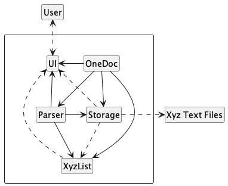
    <br />
    <i>Figure 1: Architecture Diagram</i>
</p>

The Architecture Diagram shown above explains the high-level design of Moolah Manager. 
The `Duke` class contain the main method which holds the responsibility for the following:
1. On application launch, it will initialise the `UI`, `Storage` and `Data` components. 
2. During application execution, it will interact with `UI`, `Parser`, `Command` components 
to execute the command entered by the users.
3. On any exception caught, it will handle the exception and interact with the `UI` to display the error message.

`Common` represents a collection of classes or enums used by multiple components.

The rest of the application consists of six components:
 - `UI`: The user interface of Moolah Manager
 - `Parser`: Parser for user's entered command.
 - `Command`: The command executor.
 - `Data`: Holds the data of the application in memory.
 - `Storage`: File I/O to store the data onto the hard disk.

#### How the Architecture Components Interact with Each Other:

The sequence diagram below shows how the components interact on command `budget b/1000`.

<p align="center">
    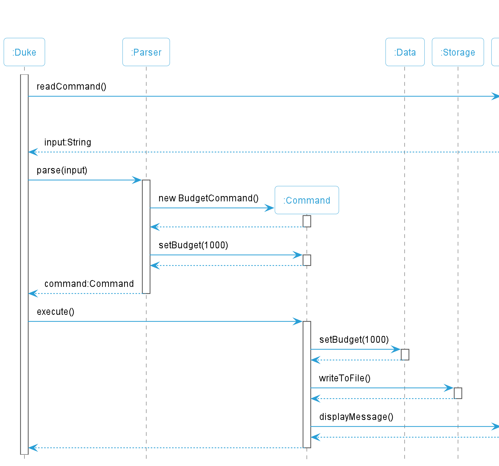
    <br />
    <i>Figure 2: Architecture Interaction</i>
</p>

The section below gives more detailed description of each component.

_Written by: Chia Thin Hong_

### 4.2. Command Component

The `Command` component is represented by a `command` package and a `ListAndStats` package. The packages contain all the 
classes that is part of the data stored by Moolah Manager. Within the `command` package, there are many classes, 
each corresponding to all of our commands which are supported by the application. The other package contains the
`ListCommand` and `StatsCommand` commands.

The `AddCommand` class contains the operations pertaining to adding a transaction into the list of transactions.

The `BudgetCommand` class contains the operations pertaining to setting the budget for the user.

The `ByeCommand` class contains the operations pertaining to exiting the program.

The `CommandTag` class consists of all the tags that the program parses.

The `DeleteCommand` class contains the operations pertaining to deleting a transaction from the list of transactions.

The `EditCommand` class contains the operations pertaining to editing a transaction from the list of transactions.

The `FindCommand` class contains the operations pertaining to searching the list of transactions for transactions that 
match the inputted keywords.

The `HelpCommand` class contains the operations pertaining to displaying help messages for the user.

The `ListCommand` class contains the operations pertaining to listing all transactions.

The `PurgeCommand` class contains the operations pertaining to deleting all transaction from the list of transactions.

The `StatsCommand` class contains the operations pertaining to getting statistics based on your list of transactions.

The structure of the command component in Moolah Manager is illustrated in the class diagram below:

<p align="center">
    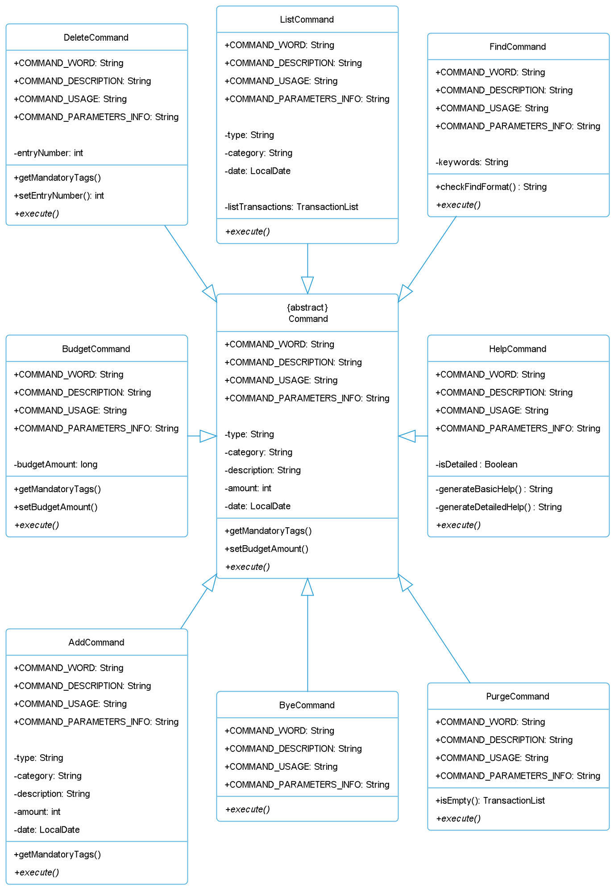
    <br />
    <i>Figure 3: Class Diagram for Command Component</i>
</p>

_Written by: Brian Wong Yun Long_

### 4.3. Data Component 

The `Data` component is represented by a `data` package which consists of all the classes that is part of the data stored 
by Moolah Manager. Within the `data` package, a transaction package, a budget class and a transactionList class is 
stored. 

The `budget` class is a representation of the monthly budget of the users. Operations related to viewing the budget
and generating budget reminders, tips and advices are implemented within this class.

The `transactionList` class is a representation of a list of transactions, and the
operations related to the transaction list are implemented within this class.

Within the transaction package, the following classes are stored: 
1. Transaction 
2. Income 
3. Expense

The structure of the data component in Moolah Manager is illustrated in the class diagram below:

<p align="center">
    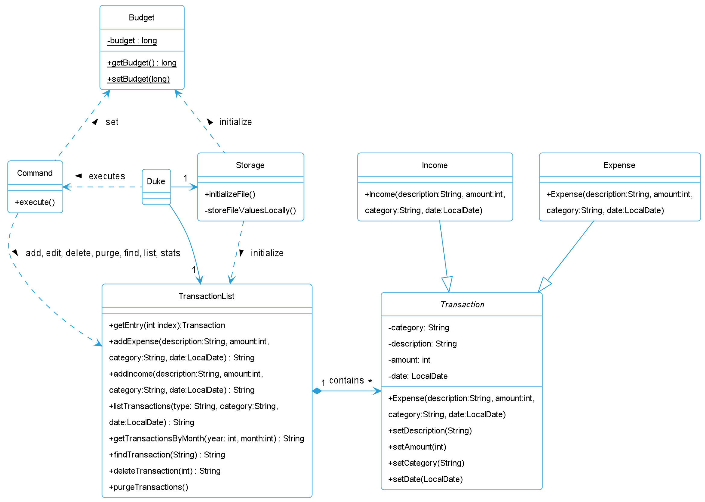
    <br />
    <i>Figure 4: Class Diagram for Data Component</i>
</p>

From the class diagram, it can be seen that the transactionList contain the methods for CRUD operations to the list, 
such as getting, adding, editing, deleting and purging of transaction(s) in the list.

The `Transaction` class is the abstract class of an `Income` or an `Expense`. A more detailed explanation on the 
implementation on the transactions can be viewed under Section [Implementation for Transaction](#5-implementation-for-managing-transactions).

#### How the Data Component Interacts:

- When MoolahManager starts running, the `Duke` class will initialize a `Storage` object which will attempt to 
read from the file and initialize both `budget` and `transactionList`. The temporary `transactionList` containing all the stored 
transaction records will be returned by the `Storage`. 
Based on the whether the initialization is successful, the corresponding constructor will be called to initialize a 
`transactionList` object which will be used throughout the application running time to hold the `transactions` added.

<p align="center">
    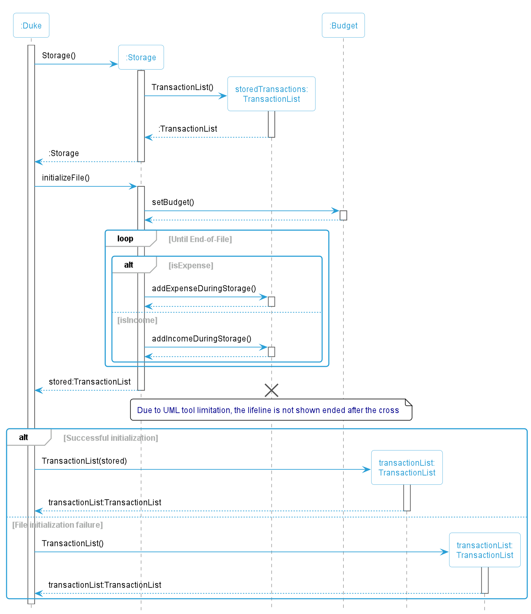
    <br />
    <i>Figure 5: Sequence Diagram for Creation of Transaction List</i>
</p>

- A transaction (either an income or expense) is created by an `addCommand` class, can be modified by an `editCommand` 
class and can be deleted by a `deleteCommand` or `purgeCommand` class. These interactions are described in further detail
under each command section below.

- The monthly budget can be updated by `budget` command.

_Written by: Chia Thin Hong_

### 4.4. Storage Component

The `Storage` component is a standalone class. It utilises its sub-methods and methods from external classes to perform it's read and write functions.

The structure of `Storage` can be seen below.

<p align="center">
    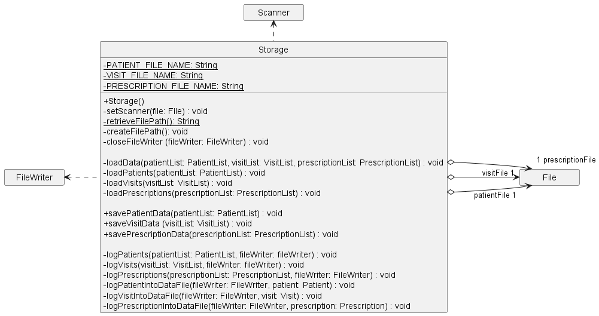
    <br />
    <i>Figure 6: Class Diagram for Storage Component</i>
</p>

1. `Duke` initializes `Storage` and `Storage#initializeFile` is called.
2. During the initialization , parser methods from `CommandParser` and `ParameterParser` would be used to process the entries within `Duke.txt`.
Methods from `Budget` and `TransactionList` would be used for the storage of `Budget` amount and `TransactionList` entries into the program.
3. `TransactionList` is returned to `Duke` after the storage of entries within `Duke.txt`.
4. After initialization and upon user input, `Command` classes such as `AddCommand`can call for `Storage#writeToFile` method in order to update the contents within `Duke.txt`.

_Written by: Yong Chin Han_

### 4.5. Parser Component

The `Parser` component consists of two main parsers: `CommandParser` and `ParameterParser`. Together, both these 
parsers are used to generate a command object with its accurate parameters according to the input from the UI. 

The structure of the data component in Moolah Manager is illustrated in the class diagram below:

<p align="center">
    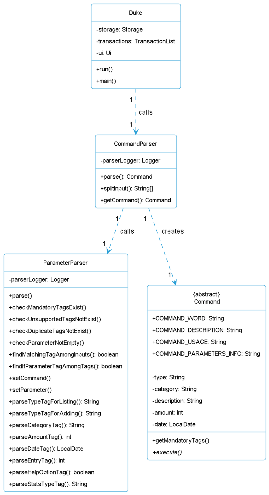
    <br />
    <i>Figure 7: Class Diagram for Parser Component</i>
</p>

After `run()` is called by `main()` in Duke, the `CommandParser` is first called to parse the command. The initial
 input is split into the commandWord and parameters using `splitInput()`. Next, the command word is parsed using 
 `getCommand()`. With the new command created, the parameters are then parsed by calling `ParameterParser.parse()`
 
In `ParameterParser`, multiple checks are done to ensure that the userInput is accurate. For example, checks are done 
to confirm that all mandatory tags are filled, that no unsupported tags are used, no duplicate tags, no tags are
without parameters and finally that the formats of parameters are accurate. After all the checks are done`setCommand` 
is called to customize the command accordingly.

With the checked and accurate commands and parameters, the command is then executed by `Duke`

_Written by: Paul Low_

### 4.6. UI Component

The `UI` component is represented by a `Ui` class that handles the retrieval of user input and display of relevant information and error messages for the application. 
Static messages are pre-defined in the `HelpMessages`, `InfoMessages` and `ErrorMessages` enum classes belonging to the `Common` package, while dynamic messages 
such as the transactions list and statistics are generated during the execution of the application. 

There are three types of pre-defined static messages:

- Help messages detail the available commands and usage examples for the application. 
- Info messages describe the functionalities of the application. 
- Error messages provide user-friendly information about the exceptions that have been caught.

The structure of the UI component in Moolah Manager is illustrated in the class diagram below:

<p align="center">
    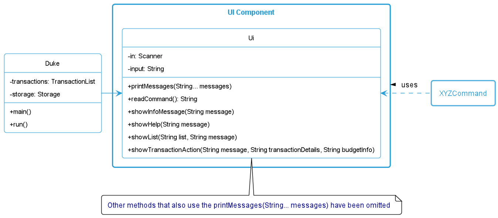
    <br />
    <i>Figure 8: Class Diagram for UI Component</i>
</p>

As seen from the class diagram, every command that needs to print to the system output will have to call the methods from the `Ui` class. There are two important methods that 
developers should take note of.

- The `readCommand()` method is only called from the `Duke` class to read user input. 
- The `printMessages()` method is called by all other methods in the `Ui` class to print messages to the system output. Examples of the caller methods include `showInfoMessage()`,
`showHelp()`, `showList()` and `showTransactionAction()`. These caller methods are called from the rest of the application depending on what type of messages are to be printed
to the user.

_Written by: Chua Han Yong Darren_

### 4.7. Common Component 

The `Common` component consists of the classes that are used by multiple components.

- `Constants` class represents all the constant settings of the application.
- `DateFormats` enum class provides the approved date formats for input and output.
- `HelpMessages` enum class stores the help messages that detail the available commands and usage examples for the application.
- `InfoMessages` enum class stores the info messages that describe the functionalities of the application.
- `ErrorMessages` enum class store the error messages that provide information on exceptions that have been caught.

The class diagram below shows some types of information that are stored for the `Add` command in these classes.

<p align="center">
    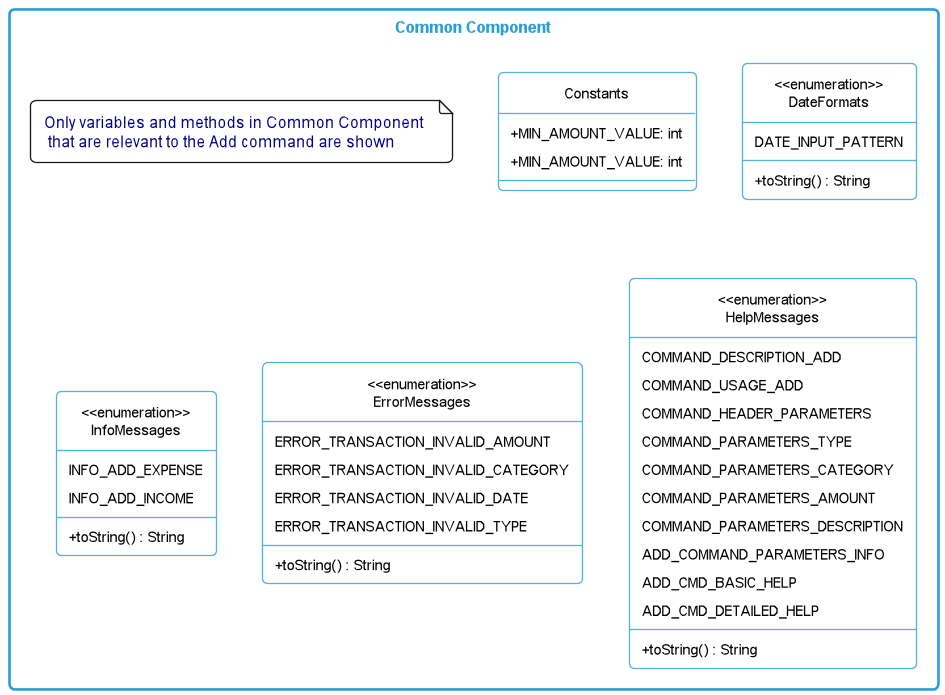
    <br />
    <i>Figure 9: Class Diagram for Common Component</i>
</p>

_Written by: Chua Han Yong Darren_

## 5. Implementation for Managing Transactions

### 5.1. Overview

Moolah Manager enables users to add, delete and edit their monetary transaction entries on a regular basis  to keep their records up-to-date.
Some of the information that needs to be stored include the type of transaction, category it belongs to, amount, date and its description.
As users eventually need to view their past records, it is imperative that these records are stored in a central list that is easily retrievable when needed.

_Written by: Brian Wong Yun Long_

### 5.2. Proposed Implementation

Each `Transaction` object in Moolah Manager represents a transaction record, which can be of `Income` or `Expense` type. Below is a class diagram that illustrates
the attributes that are contained within each transaction and how they are associated with the `TransactionList`. Note that non-important methods and variables have been omitted 
from the class diagram below for simplicity.

<p align="center">
    
    <br />
    <i>Figure 10: Class Diagram for Transaction</i>
</p>

The `TransactionList` represents a dynamic array list that can store multiple `Transaction` objects, whereby each object contain the following mandatory attributes:

| Attribute     | Description                                                                                            |
|---------------|--------------------------------------------------------------------------------------------------------|
| `category`    | The type of transaction. It should either be `expense` or `income`.                                    |
| `description` | A category for the transaction. It can be any word without numeral, symbol or spacing.                 |
| `amount`      | The amount of the transaction. It is a positive whole number ranging from 1 to 10000000 (Ten Million). | 
| `date`        | The date when the transaction took place on. It must be in ddMMyyyy format, e.g. 29102022.             |                                                                                                 
| `description` | More information regarding the transaction. It is any word without any spacing.                        | 

The main CRUD operations in `TransactionList` that facilitates the data manipulation of `Transaction` object(s) include:

- `addIncome()` - Adds an income `Transaction` entry into the `TransactionList`.
- `addExpense()` - Adds an expense `Transaction` entry into the `TransactionList`.
- `editIncome()` - Edits an income `Transaction` entry from the `TransactionList`.
- `editExpense()` - Edits an expense `Transaction` entry from the `TransactionList`.
- `deleteTransaction()` - Deletes a `Transaction` entry from the `TransactionList`.
- `purgeTransactions()` - Deletes all `Transaction` entries from the `TransactionList`.
- `getEntry()` - Gets a specific `Transaction` entry from the `TransactionList`.

Following which, `TransactionList` provides methods such as `listTransactions()`, `findTransactions()`, `getTransactionsByMonth()`, `getTransactionsByYear()`, 
`getTransactionsByDayRange()`, `getTransactionsByWeekRange()` and `getTransactionsByMonthRange()` to enable users to view their past transaction records.
Users will be able to retrieve transactions over the last N days, weeks or months as the `getTransactionsByXRange()` computes the difference in the dates between
today's date and the previous date.

_Written by: Chua Han Yong Darren_

### 5.3. Add Command

**This feature allows the local and external (handled by Storage class) storage of transaction entries by the user.**

The `AddCommand` inherits properties from the abstract `Command` class.

`AddCommand` is dependent on `CommandParser` which accesses its `COMMAND_WORD` and creates a new `AddCommand` object which would be returned to `Duke`.
`Duke` is associated to `AddCommand` by calling for `AddCommand#execute()`.
It is also associated with `TransactionList`, `Ui`, `Storage`, which are used within `AddCommand` methods like `AddCommand#execute()` and `AddCommand#addTransaction()`.
Lastly it is also associated with `ParameterParser` which calls for`AddCommand#getMandatoryTags()` that retrieves the mandatory tags (which itself is taken from `CommandTag`). 

The relationship between the classes are shown below. Non-essential info has been omitted for simplification purposes.

<p align="center">
    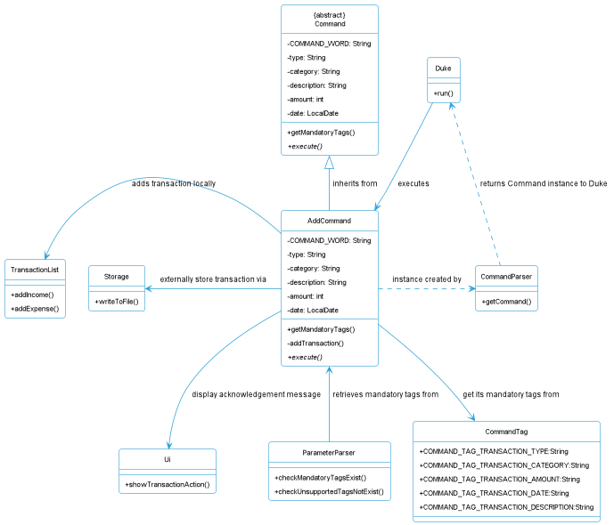
    <br />
    <i>Figure 11: Class Diagram for Add Command and Related Classes</i>
</p>

These are the important operations performed within the `AddCommand` class, with task description:

- `AddCommand#execute(TransactionList transactions, Ui ui, Storage storage)` - Adds a `Transaction` object to the
  `TransactionList transactions` ArrayList via `AddCommand#addTransaction()` that calls for `transactions#addIncome()` 
or `transactions#addExpense()` based on the type of transaction. For successful additions of the Transaction object to the Arraylist, The UI
  would be called to display the acknowledgement message to the interface. Also, the storage#writeToFile() method would
  be called to store the newly updated transactions values in the duke.txt file.

- `AddCommand#getMandatoryTags()` - This method returns the mandatory tags which should be used in the user input.
  It is used externally by ParameterParser to verify if the user input contains the mandatory command tags, to correctly
  store the Transaction object in the program.

The structure of the application focusing on the Add command is illustrated in the simplified sequence diagram below:

<p align="center">
    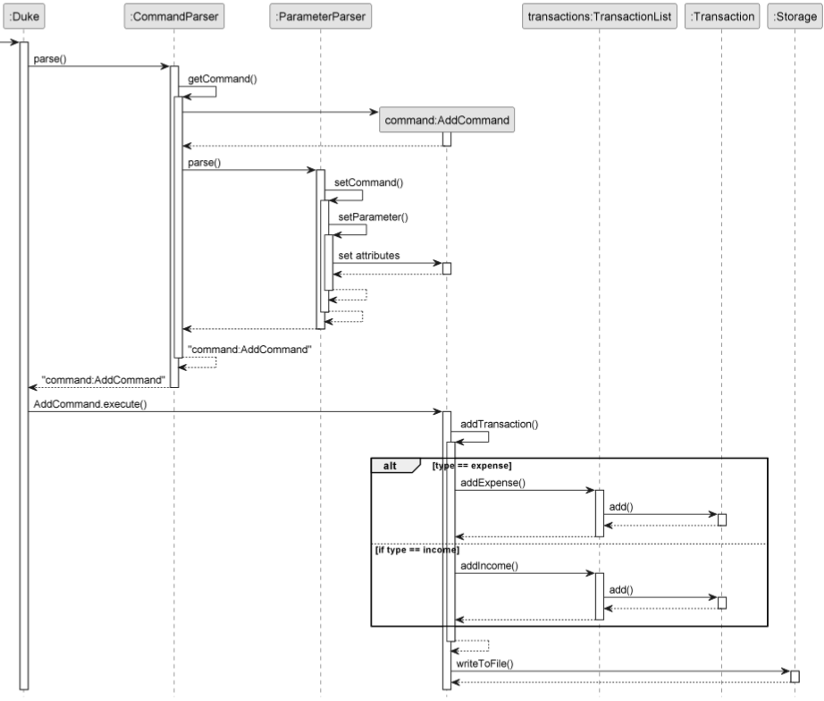
    <br />
    <i>Figure 12: Sequence Diagram for Add Command</i>
</p>

In a command like `add t/expense c/food a/20 d/13092022 i/NIL` OR `add t/income c/salary a/2000 d/30092022 i/jan_salary`
1. The user input would be parsed via `CommandParser.parse()` method. 
2. In `CommandParser.parse()`, `getCommand()` would be called which initializes `AddCommand`. Then it would call `ParameterParser.parse()`.
3. In `ParameterParser.parse()`, the user input will be parsed further before the data is stored into `AddCommand` via  `ParameterParser.setCommand()` , 
which calls for  `ParameterParser.setParameter()` to set the attributes within the AddCommand instance. 
4. The `CommandParser.parse()`, would then return the instance of `Addcommand` to Duke class.
5. `AddCommand.execute()` would be called, in which it will attempt to add its objects to the `TransactionList` based on the type of transaction, either income or expense.  
6. After the storage or the user input into `TransactionList`, `Storage.writeToFile()` would write the contents of `TransactionList` to the storage file, duke.txt.

_Written by: Yong Chin Han_

### 5.4. Edit Command

The `EditCommand` inherits properties from the abstract `Command` class. The inheritance of `Command` from `EditCommand` is
shown below.

<p align="center">
    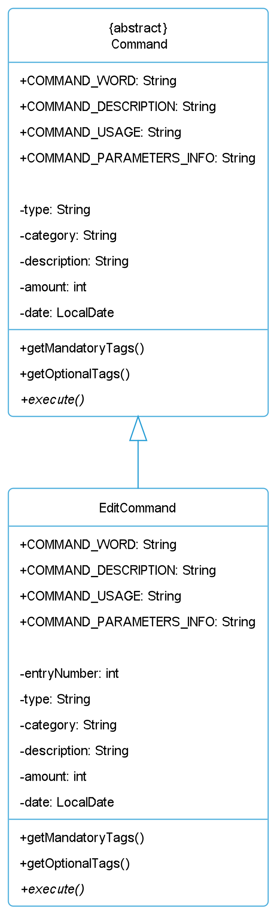
    <br />
    <i>Figure 13: Class Diagram for Edit Command</i>
</p>

The full command for `edit` is `edit [e/ENTRY] [t/TYPE] [c/CATEGORY] [a/AMOUNT] [d/DATE] [i/DESCRIPTION]`.

For example, if 'edit' is called, the specific entry inputted in the command is edited based on the parameters inputted.
Only the entry and at least one tag is needed for this command to work.

In a command like `edit e/2 t/expense c/food a/10 d/20102022 i/chicken`:

1. The `main()` method in Duke calls `run()` in Duke. The `ui` reads the command via `ui.readCommand()` and parses it
   through `CommandParser.parse()`.

2. Within `CommandParser.parse()`, a few functions are called internally.
    1. `spiltInput()` is called which splits the command from the parameter.
    2. `getCommand()` is called which searches for the command.
    3. `ParameterParser.parse()` is called.

3. Within `ParameterParser.parse()`, a few functions are called internally as well.
    1. `checkMandatoryTagsExist()` is called where the parameters are checked for all required tags exist based on the command.
    2. `checkUnsupportedTagsNotExist()` is called to check if the parameter do not contain any unsupported tags based on the command.
    3. `checkDuplicateTagsNotExist()` is called to check if the parameter do not contain any duplicate tags.
    4. `checkParameterNotEmpty()` is called to check that the parameter inputted is not empty.
    5. Once all these checks are successful, `setCommand()` is called.

4. Within `setCommand()`, more functions are called internally.
    1. `setParameter()` is called to set the index of the transaction to be deleted.
    2. The setting is done via `command.setEntryNumber()` which takes in the parameter and executes it in the DeleteCommand Class.
    3. The parameter, however, needs to be further parsed through the execution of the `parseEntryTag()` function.
    4. It converts the parameter, which is currently a `String`, to a `Int`.

5. The edit command is undergoing execution in `command.execute()` which will call functions within the EditCommand Class.
    1. The index, which is the local `entryNumber` variable, goes under further checks by ascertaining whether it is greater than the total
       number of transactions in the list or lesser than or equal to zero.
    2. It tells the total size via the local `numberOfTransactions` variable which takes the value called by `transactions.size()`
       which is located in the TransactionList class.
    3. If the checks fail, i.e. the index is invalid, `isInputValid` is set as false.

6. The if-else statements does the following:
    1. Retrieves the transaction to be edited via `transactions.getEntry()`.
    2. Checks if the local variable `newType` is `null`. This implies that no `t/expense` or `t/income` was indicated by the user.
       The program then retrieves the type of transaction via `entry.getType()`
    3. It then splits to another if-else branches which handles the edits using either `transactions.editExpense()` or `transactions.editIncome()`.
    4. For each of these branches, should the optional tag be left blank, retrieves the relevant field using the getter functions.
    5. In order to edit the following transaction, it has to be deleted first and then reinserted. This is done by calling `transactions.deleteTransaction()`
       and then inserts back in at the same spot which is handled by `transactions.add()` at the specific entry.

7. The display shows the successful deletion via `ui.showTransactionAction()` and writes it to file by `storage.writeToFile()`.

The sequence diagram below shows the interactions of a successful execution of the `EditCommand`.

<p align="center">
    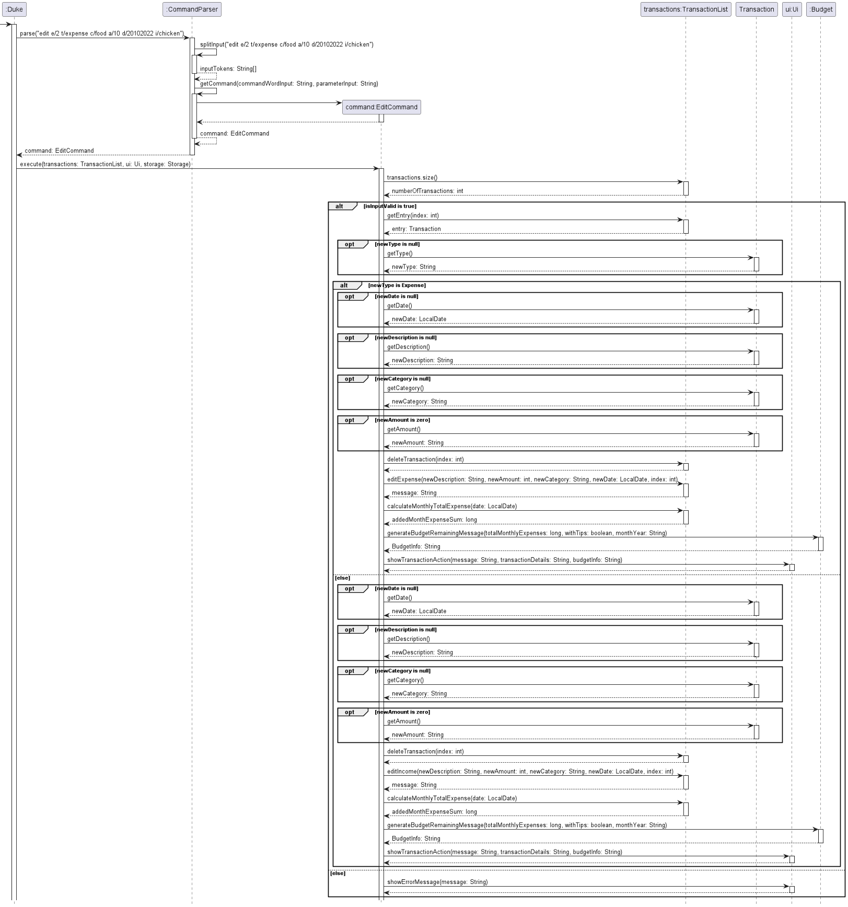
    <br />
    <i>Figure 14: Sequence Diagram for Edit Command</i>
</p>

_Written by: Brian Wong Yun Long_

### 5.5. List Command

The full command for list is `list [t/TYPE] [c/CATEGORY] [d/DATE]`
For example, if 'list' is called, all transactions that are present in Moolah Manager will be listed out
Adding tags such as year, month, day, type, category will list all transactions that apply to that tag.

The structure of the application focusing on the list command is illustrated in the class diagram below:

<p align="center">
    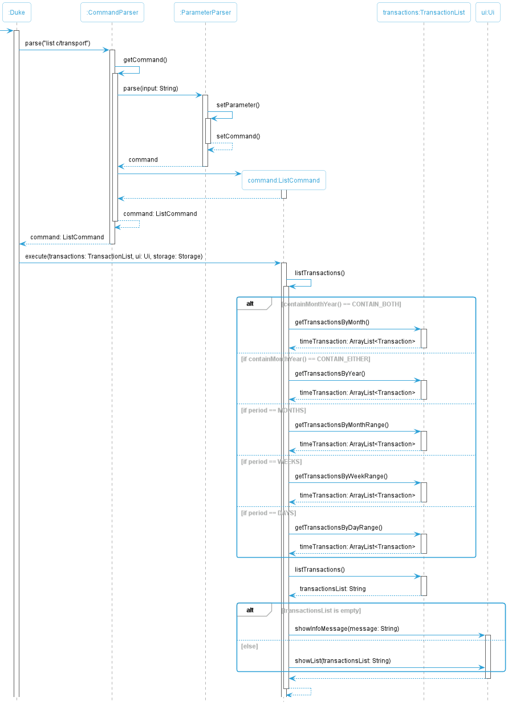
    <br />
    <i>Figure 15: Sequence Diagram for List Command</i>
</p>

In a command like `list c/transport`

1. The `main()` method in Duke calls `run()` in Duke. The command is parsed through `CommandParser.parse()`.
2. Within `CommandParser.parse()`, `getCommand()` is called to obtain the command, before `ParameterParser.parse()`
   is called
3. Various checks are done through functions within `parameter.parse()`
4. The list command is undergoing execution in `command.execute()` which will call `listTransactions()` in ListCommand
5. Depending on the various tags that could be used in list Command, the List Class will call the relevant 
`getTransaction` function to obtain an ArrayList of time Transactions.
6. Next, `getCommand()` is called to obtain a String of transactionList from the ArrayList.
7. `ui.showTransactionsList()` is then executed since parameters are present, causing the matching transactions to be displayed.

_Written by: Paul Low_

### 5.6. Find Command

The `FindCommand` class provides the search functionality for finding a specific or few transactions from the list of transactions in Moolah Manager. 
Using the command `find k/KEYWORD`, the criteria for retrieving the matching transactions is based upon the partial or full match of the user `KEYWORD` input 
compared with the description of each transaction object.

Figure 16 below is a class diagram for the `Find` command class and its associations with other classes that contribute to the listing of filtered
transactions. Some methods and variables have been omitted from the class diagram for simplicity.

<p align="center">
    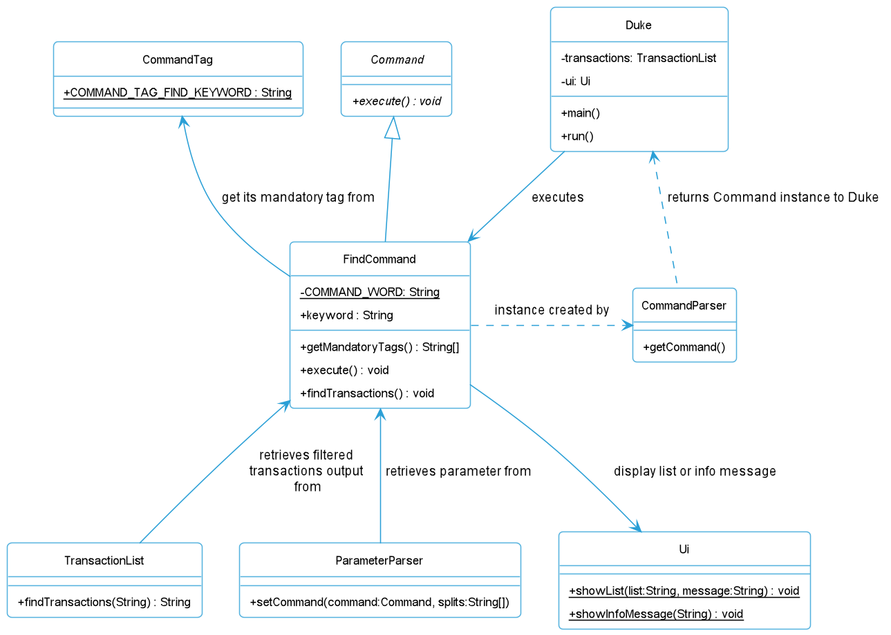
    <br />
    <i>Figure 16: Class Diagram for Find Command</i>
</p>

The sequence diagram below shows the interactions of a successful execution of the `FindCommand`, using an example of `find k/bus_fare`.

<p align="center">
    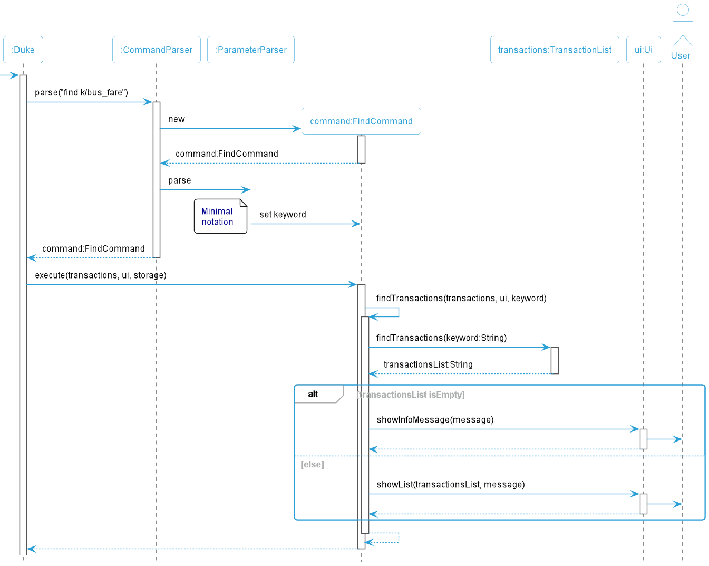
    <br />
    <i>Figure 17: Sequence Diagram for Find Command</i>
</p>

Referring to Figure 17, the following is a summarized steps of the interactions that `FindCommand` performs, with some higher level details in `CommandParser` and `ParameterParser`
omitted for simplicity.

1. The user executes `find k/KEYWORD` command with an intent to view a filtered list of transactions that match the search keyword, e.g. `bus_fare`.
2. The `CommandParser#parse()` method will initialize the `Command` object with `FindCommand`, and thereafter, the initialization of the `keyword` variable is performed in the `ParameterParser` class.
3. In the `ParameterParser` class, various checks are performed to ensure that only a single search keyword without spaces has been entered.
4. Once all checks have passed, `FindCommand` class will `execute()` whereby it will call `FindTransactions()` twice (once within itself, and the other on the `TransactionList` class)
to generate the list of filtered transactions. The purpose of `TransactionList#findTransactions()` is to loop through all `Transaction` objects from `ArrayList<Transaction> transactions`, checking if their 
description match the keyword given. Note that it is checked on a case-insensitive basis.
5. Matching `Transaction` objects will be appended into a formatted string and returned to the `FindCommand` class.
6. If `FindCommand` class checks that `transactionsList` string is empty, it will call `Ui#showInfoMessage()`. Otherwise, `Ui#showList()` method is called to display the transactions. 

_Written by: Chua Han Yong Darren_

### 5.7. Delete Command

The `DeleteCommand` inherits properties from the abstract `Command` class. The inheritance of `Command` from `DeleteCommand` is
shown below.

<p align="center">
    
    <br />
    <i>Figure 18: Class Diagram for Delete Command</i>
</p>

The full command for `delete` is `delete [e/ENTRY]`.
For example, if 'delete' is called, the specific entry inputted in the command is deleted from the list of transactions in
Moolah Manager.

In a command like `delete e/2`:

1. The `main()` method in Duke calls `run()` in Duke. The `ui` reads the command via `ui.readCommand()` and parses it
   through `CommandParser.parse()`.

2. Within `CommandParser.parse()`, a few functions are called internally.
    1. `spiltInput()` is called which splits the command from the parameter.
    2. `getCommand()` is called which searches for the command.
    3. `ParameterParser.parse()` is called.

3. Within `ParameterParser.parse()`, a few functions are called internally as well.
    1. `checkMandatoryTagsExist()` is called where the parameters are checked for all required tags exist based on the command.
    2. `checkUnsupportedTagsNotExist()` is called to check if the parameter do not contain any unsupported tags based on the command.
    3. `checkDuplicateTagsNotExist()` is called to check if the parameter do not contain any duplicate tags.
    4. `checkParameterNotEmpty()` is called to check that the parameter inputted is not empty.
    5. Once all these checks are successful, `setCommand()` is called.

4. Within `setCommand()`, more functions are called internally.
    1. `setParameter()` is called to set the index of the transaction to be deleted.
    2. The setting is done via `command.setEntryNumber()` which takes in the parameter and executes it in the DeleteCommand Class.
    3. The parameter, however, needs to be further parsed through the execution of the `parseEntryTag()` function.
    4. It converts the parameter, which is currently a `String`, to a `Int`.

5. The delete command is undergoing execution in `command.execute()` which will call functions within the DeleteCommand Class.
    1. The index, which is the local `entryNumber` variable, goes under further checks by ascertaining whether it is greater than the total
       number of transactions in the list or lesser than or equal to zero.
    2. It tells the total size via the local `numberOfTransactions` variable which takes the value called by `transactions.size()`
       which is located in the TransactionList class.
    3. Should the above condition be true, it is no longer a valid input and the local `isInputValid` variable is set as false.
    4. An exception is thrown if `isInputValid` is false. Otherwise, `transactions.deleteTransaction()` is called to remove it.

6. The above function is called in the TransactionList class which does the following:
    1. Retrieves the transaction to be deleted via `transactions.get()`.
    2. Removes it via `transactions.remove()`.

7. The display shows the successful deletion via `ui.showTransactionAction()` and writes it to file by `storage.writeToFile()`.

The sequence diagram below shows the interactions of a successful execution of the `DeleteCommand`.

<p align="center">
    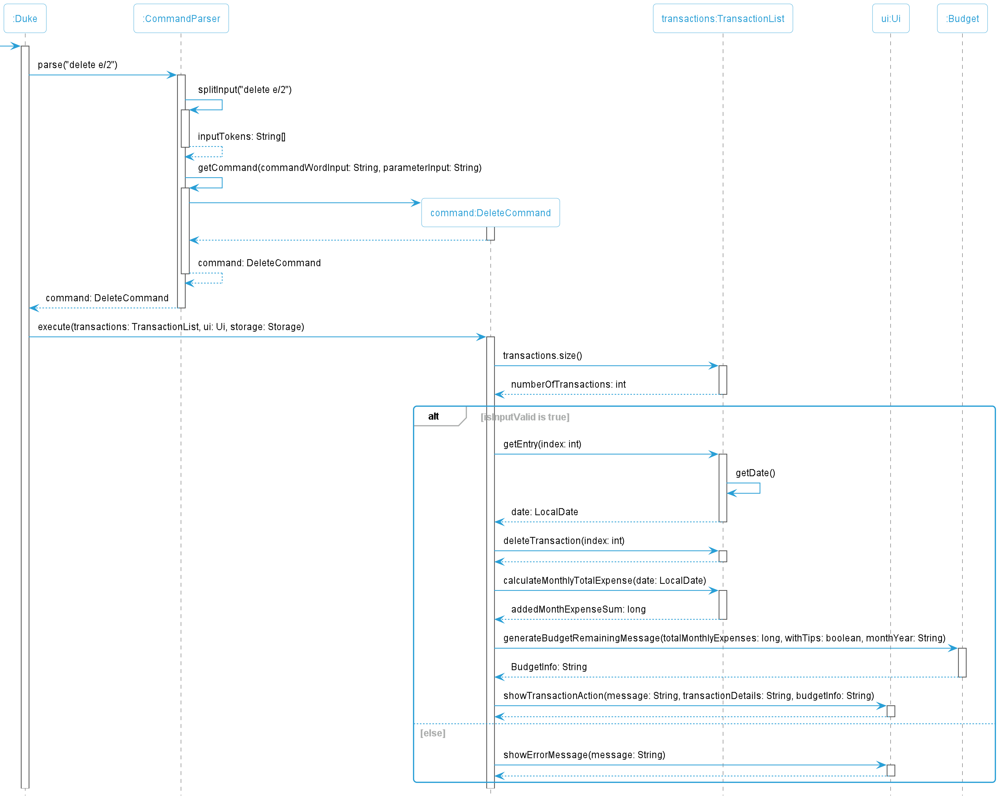
    <br />
    <i>Figure 19: Sequence Diagram for Delete Command</i>
</p>

_Written by: Brian Wong Yun Long_

### 5.8. Purge Command

The `PurgeCommand` inherits properties from the abstract `Command` class. The inheritance of `Command` from `PurgeCommand` is
shown below.

<p align="center">
    
    <br />
    <i>Figure 20: Class Diagram for Purge Command</i>
</p>

The full command for `purge` is `purge`.
For example, if 'purge' is called, all transactions in Moolah Manager are removed.

This is how the command works:

1. The `main()` method in Duke calls `run()` in Duke. The `ui` reads the command via `ui.readCommand()` and parses it
   through `CommandParser.parse()`.

2. Within `CommandParser.parse()`, a few functions are called internally.
    1. `spiltInput()` is called which splits the command from the parameter.
    2. `getCommand()` is called which searches for the command.
    3. `ParameterParser.parse()` is called.

3. Within `ParameterParser.parse()`, a few functions are called internally as well.
    1. `checkMandatoryTagsExist()` is called where the parameters are checked for all required tags exist based on the command.
    2. `checkUnsupportedTagsNotExist()` is called to check if the parameter do not contain any unsupported tags based on the command.
    3. `checkDuplicateTagsNotExist()` is called to check if the parameter do not contain any duplicate tags.
    4. `checkParameterNotEmpty()` is called to check that the parameter inputted is not empty.
    5. Once all these checks are successful, `setCommand()` is called.

4. Within `setCommand()`, there is no parameters required to be set for `purge`.

5. The purge command is undergoing execution in `command.execute()` which will call functions within the PurgeCommand Class.
    1. The function calls `isEmpty()` which returns `true` if the list of transactions is zero, `false` otherwise. It is stored
       in the local `check` variable.
    2. The above function compares the size of the transactions list through the `transactions.size()` which is executed in
       the TransactionList class and see if both are equal to zero.
    3. The display will show an empty message if `isEmpty()` returns `true` via `ui.showInfoMessage()`, which exits the command.
    4. Otherwise, a warning is displayed through `ui.showInfoMessage()` and reads in an input for the user to respond through `ui.readCommand()`.
    5. If the input is `Y`, the command goes ahead and executes the `transactions.purgeTransactions()`. Any other input will
       abort the command and the display will show an aborted message through `ui.showInfoMessage()`.

6. The `transactions.purgeTransactions()` function is executed in the TransactionList class.
    1. The `transactions.clear()` function is called which deletes every single entry in Moolah Manager

7. The display shows the successful purging via `ui.showInfoMessage()` and writes it to file by `storage.writeToFile()`.

The sequence diagram below shows the interactions of a successful execution of the `PurgeCommand`.

<p align="center">
    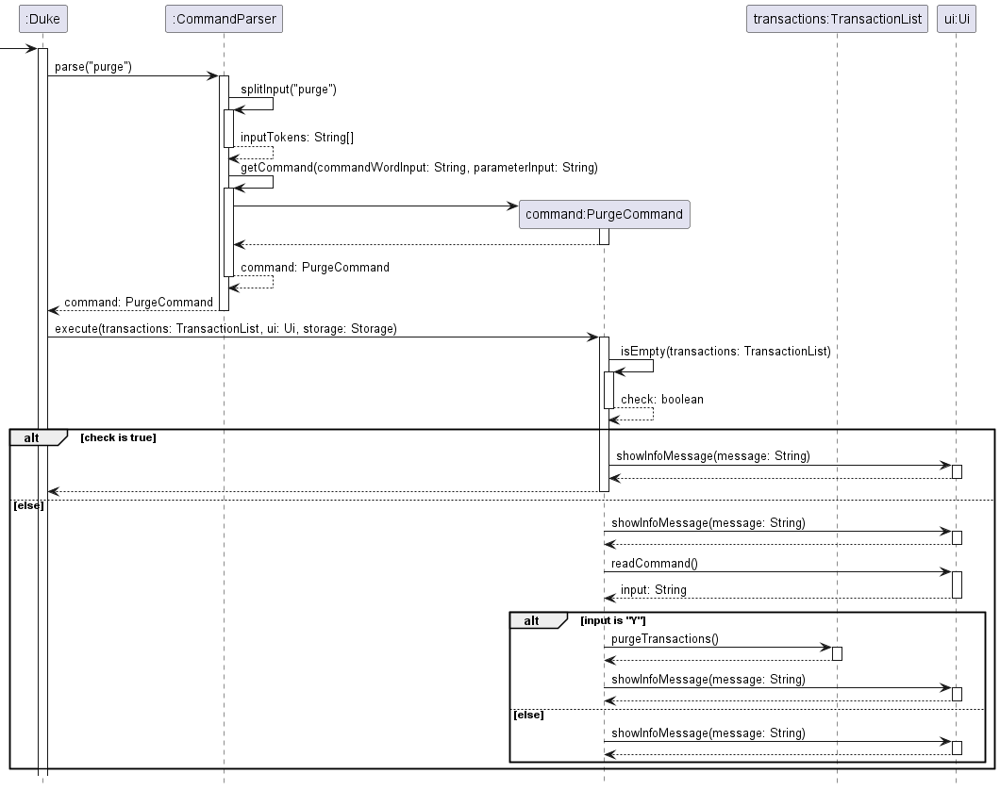
    <br />
    <i>Figure 21: Sequence Diagram for Purge Command</i>
</p>

_Written by: Brian Wong Yun Long_

## 6. Implementation for Budgeting and Financial Insights

### 6.1. Overview 

Moolah Manager supports the viewing of summarised expenses in daily, weekly and monthly formats to show categorical savings or overall expenditure. 
As such, we have developed streamlined methods to filter the transactions by time period prior to passing them into the `Stats` command class for generating insights.
Beyond gathering of these insights, users can also allocate a monthly budget to help them manage their spending.

_Written by: Chua Han Yong Darren_

### 6.2. Proposed Implementation

The `List` and `Stats` command classes inherit their methods from the `ListAndStats` command class when setting global tags (year, month, number, period) and performing checks on their usage.
Likewise, retrieval of filtered transactions by time periods is also done in `ListAndStats` command class, streamlining the workflow for both the `List` and `Stats` commands.
This way, the `Stats` command class focuses on generating the different types of statistics rather than having to deal with an overhead of needing to consolidate the transaction entries of different time periods.

Figure 22 below is a class diagram that illustrates the inheritance for the `Stats` command class.

<p align="center">
    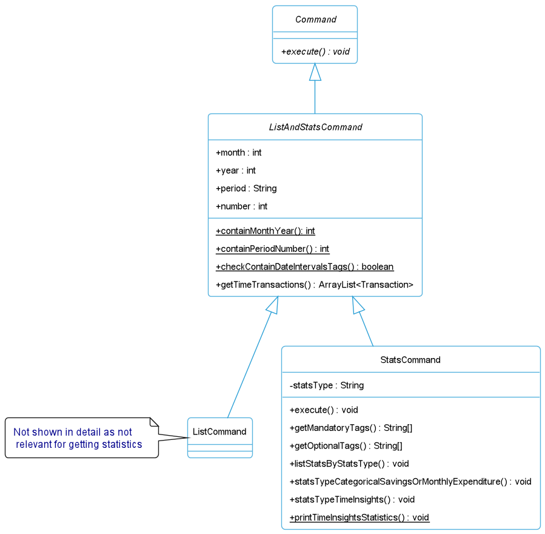
    <br /> 
    <i>Figure 22: Class Diagram for Stats Command</i>
</p>

Elaborating on the checks for date interval tags and retrieval of the filtered transactions by time periods, the two significant methods are `checkContainDateIntervalsTags()` and `getTimeTransactions()`.
The table below depicts the possible scenarios that may arise upon validation of these tags in the `ListAndStats` command class. These tags are used with `list` or `stats s/time_insights` commands.

| Date Interval Tags | Purpose                                         | Outcome                                                                                                                                                          |
|--------------------|-------------------------------------------------|------------------------------------------------------------------------------------------------------------------------------------------------------------------|
| `y/<YYYY>`         | View financial insights for a particular year.  | `TransactionList#getTransactionsByYear()` will be called for list of transactions filtered by year.                                                              |
| `y/<YYYY> m/<N>`   | View financial insights for a particular month. | `TransactionList#getTransactionsByMonth()` will be called for a list of transactions filtered by month.                                                          |
| `p/days n/<N>`     | View financial insights for the last N days.    | `TransactionList#getTransactionsByWeekRange()` will be called for a list of transactions filtered by last N days (backdated from today).                         |
| `p/months n/<N>`   | View financial insights for the last N months.  | `TransactionList#getTransactionsByMonthRange()` will be called for a list of transactions filtered by last N months (backdated from first day of current month). |
| `p/weeks n/<N>`    | View financial insights for the last N weeks.   | `TransactionList#getTransactionsByDayRange()` will be called for a list of transactions filtered by last N weeks (backdated from Monday of current week).        |

If no date interval tags are used together with `s/time_insights` or they are combined incorrectly (i.e. their usage does not appear in the table above), exceptions will be thrown. This prevents an incorrect transactions list from being further passed to other
methods within the `Stats` command class.

The `budget` is a static variable stored inside the `Budget` class. The budget variable is checked during the following 
phase of the applications, with relevant reminder, tips and advices displayed:

| Application Phase                           | Display                       | Purpose                                                                   |
|---------------------------------------------|-------------------------------|---------------------------------------------------------------------------|
| Program starts                              | Budget Reminder               | To remind user on the budget remained for the current month.              |
| Adding, editing or deleting of transactions | Budget Tip                    | To alert user on the effect of the new transaction on the month's budget. |
| Monthly expenditure or insight              | Spending habit, budget advice | To advise user on the proportion of user's spending and budget.           |

The spending habit and budget advices displayed on monthly expenditure or specific month insight are generated
dynamically based on the proportion of user's spending. This allows the application to  provide suitable advices to the user.

_Written by: Chua Han Yong Darren (List and Stats), Chia Thin Hong (Budget)_

### 6.3. Stats Command 

The `StatsCommand` class provides the functionalities for users to get an overview of their financial insights based on the statistics for the transactions. These 
statistics are generated using the list of transactions that is stored in Moolah Manager application.

The following are the available commands:
- `stats s/categorical_savings` - Displays the total savings of all transactions in each category.
- `stats s/monthly_expenditure` - Displays the total income, expense and savings of all transactions in each month.
- `stats s/time_insights y/YEAR [m/MONTH]` - Displays the categorical savings and monthly expenditure for a specific month or year.
- `stats s/time_insights p/PERIOD n/NUMBER` - Displays the categorical savings and monthly expenditure for the last N days, weeks or months.

The sequence diagram below shows the interactions of a successful execution of the `StatsCommand`, using an example of `stats s/categorical_savings`.

<p align="center">
    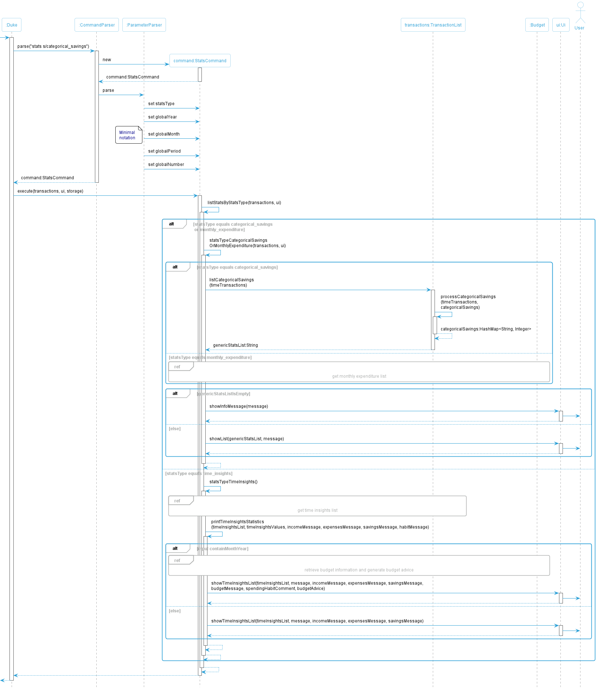
    <br />
    <i>Figure 23: Sequence Diagram for Stats Command</i>
</p>

Referring to Figure 23, the following is a summarized steps of the interactions that `StatsCommand` performs when a user is requesting for the categorical
savings. Higher level details in `CommandParser` and `ParameterParser` have been omitted for simplicity. Additionally, segments of interaction for getting monthly
expenditure and time insights have been put into isolated sequence diagrams to break down the information.

1. The user executes `stats s/categorical_savings` command with an intent to view his or her categorical savings.
2. The `CommandParser#parse()` method will initialize the `Command` object with `StatsCommand`. The initialization of the `statsType` variable is performed in the `ParameterParser` class.
3. In the `ParameterParser` class, various checks are performed to ensure that all the tags and parameters in the input have been filled up in correspondence to their respective requirements.
4. Once all checks have passed, `StatsCommand` class will `execute()` whereby it will verify the related tags for date intervals (year, month, period, number) first to ensure that they are not entered
together with the `s/categorical_savings` tag. This verification is performed in `ListAndStats` command class and is not shown in the sequence diagram for the brevity of this section. 
5. Moving on, `listStatsByStatsType()` will be called and when it confirms that the requested statistics type is `categorical_savings`, it will call `statsTypeCategoricalSavingsOrMonthlyExpenditure()`
method to produce the list of categorical savings. Here, `TransactionList#listCategoricalSavings()` will use a hashmap to store different categories from the `TransactionList` 
and append the amount for each category accordingly until all transactions are exhausted.
6. A formatted string of output collected from looping through the hashmap will be returned to the `StatsCommand` class.
7. If `StatsCommand` class checks that `genericStatsList` string is empty, it will call `Ui#showInfoMessage()`. Otherwise, `Ui#showList()` method is called to display the categorical savings.

Amongst the omitted frames in Figure 23, below two are the sequence diagrams for getting monthly expenditure and time insights.

<p align="center">
    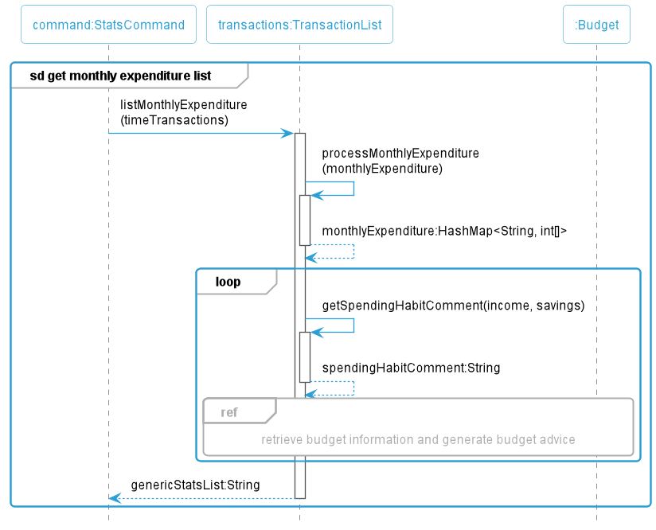
    <br />
    <i>Figure 24: Sequence Diagram for Stats Command (Getting Monthly Expenditure List) </i>
</p>

<p align="center">
    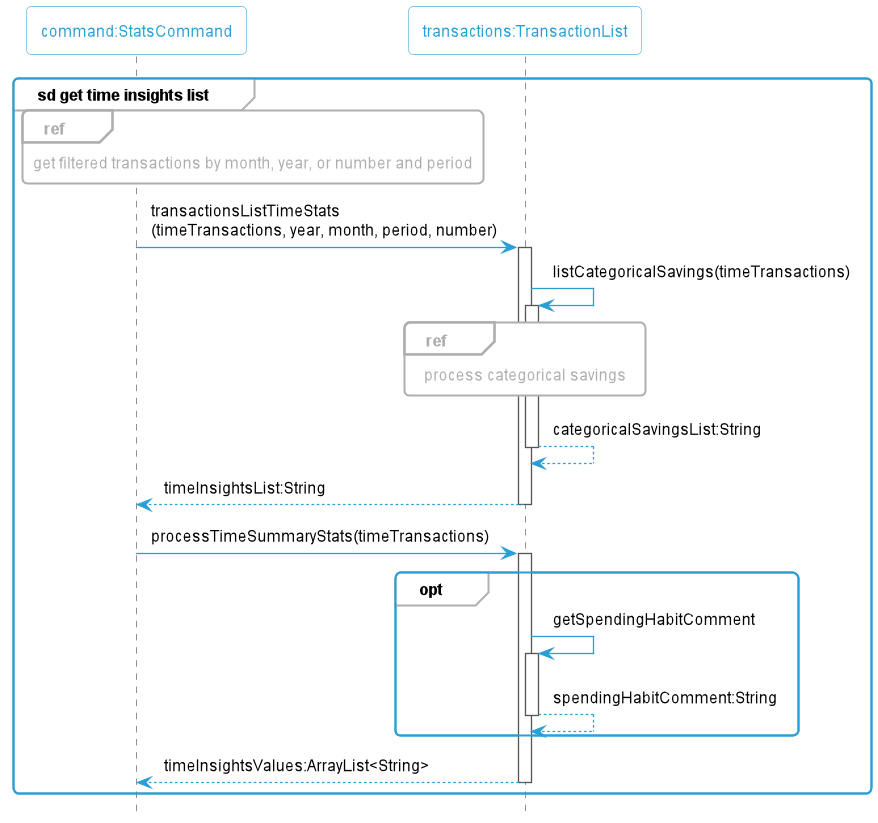
    <br />
    <i>Figure 25: Sequence Diagram for Stats Command (Getting Time Insights List)</i>
</p>

_Written by: Chua Han Yong Darren_

### 6.4. Budget Command 

The budget command allows user to set a new monthly budget. The range of accepted budget value is stored in the
`common/Constants.java` file, whereby the content of the file is as such:

```
public static int MAX_TRANSACTIONS_COUNT = 1000000;
public static int MIN_AMOUNT_VALUE = 1;
public static int MAX_AMOUNT_VALUE = 10000000;
public static int MIN_BUDGET_VALUE = 1;
public static long MAX_BUDGET_VALUE = Long.valueOf(MAX_TRANSACTIONS_COUNT) * Long.valueOf(MAX_AMOUNT_VALUE);
```

Under the default setting, the acceptable range of the monthly budget, is 0 < budget <= 10000000000000, which is 10^13,
and it ensures that no integer overflow will occur as the `long` data type is used.

To set a new budget, user can use the command `budget b/AMOUNT` where the `AMOUNT` tag is any whole number within the
valid range above.

The interaction of the components on setting a budget can be seen in the sequence diagram under 
[How the Architecture Components Interact with Each Other](#how-the-architecture-components-interact-with-each-other).

_Written by: Chia Thin Hong_

## 7. Implementation for Miscellaneous Operations 

### 7.1. Help Command 

The help command displays the help message to the users to guide them on the usage and provide descriptions for each
available command and parameter.

The help command can be run as `help [q/COMMAND]` or `help o/detailed [q/COMMAND]`, where the latter will display a more detailed version of
help messages to the users. If the user provide the optional `q/COMMAND` tag, the help command will only return the 
help message of the chosen command.

The structure of the application focusing on the help command is illustrated in the class diagram below:

<p align="center">
    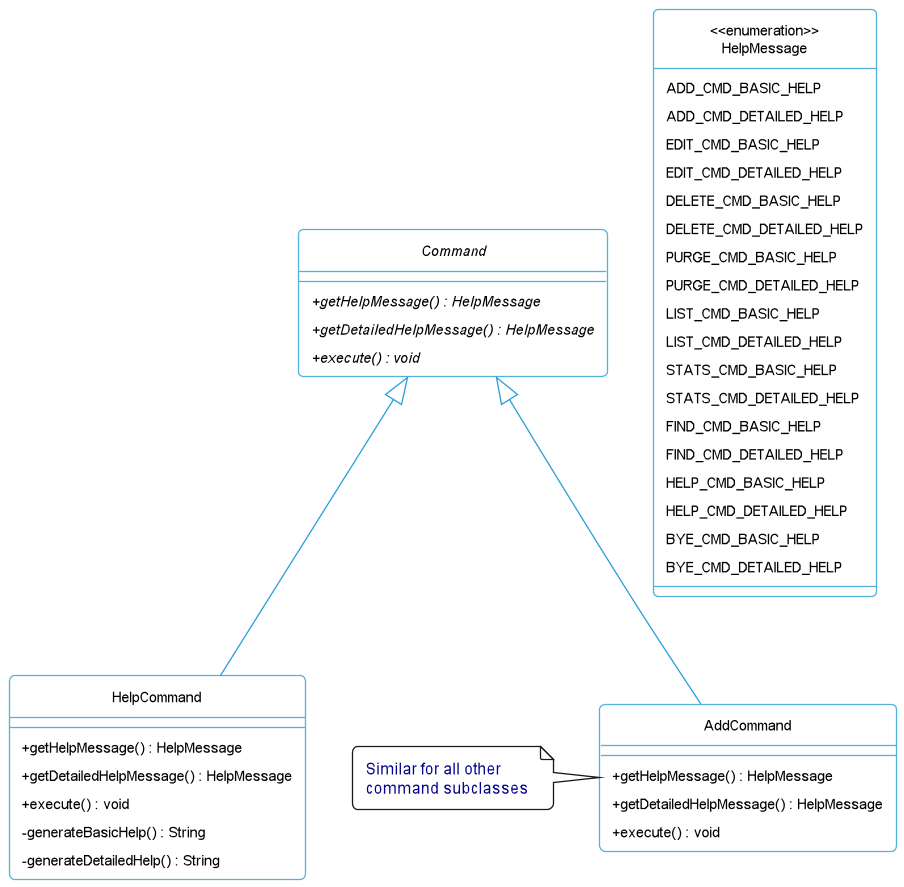
    <br />
    <i>Figure 26: Class Diagram for Help Command</i>
</p>

For each command subclass, they will implement the getHelpMessage() and getDetailedHelpMessage() methods. These methods
will contain their corresponding HelpMessage Enum that stores the help messages as strings inside the enum.

In the help command, when `execute()` is called, it will call either generateBasicHelp() or generateDetailedHelp() method
based on the help option chosen by the user.

<p align="center">
    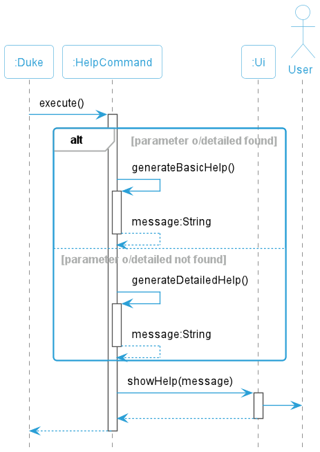
    <br />
    <i>Figure 27: Sequence Diagram for Help Command</i>
</p>

_Written by: Chia Thin Hong_

### 7.2. Bye Command

The `ByeCommand` inherits properties from the abstract `Command'` class. The inheritance of `Command` from `ByeCommand` is
shown below.

<p align="center">
    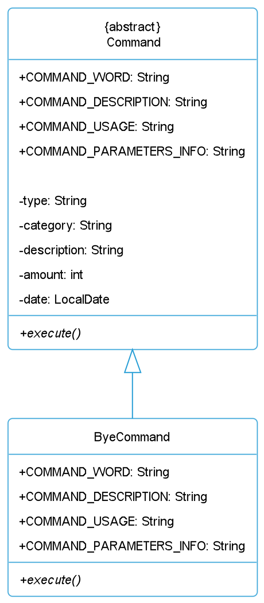
    <br />
    <i>Figure 28: Class Diagram for Bye Command</i>
</p>


The full command for `bye` is `bye`.
For example, if 'bye' is called, the program prints the exit message and terminates the program.

This is how the command works:

1. The `main()` method in Duke calls `run()` in Duke. The `ui` reads the command via `ui.readCommand()` and parses it
   through `CommandParser.parse()`.

2. Within `CommandParser.parse()`, a few functions are called internally.
    1. `spiltInput()` is called which splits the command from the parameter.
    2. `getCommand()` is called which searches for the command.
    3. `ParameterParser.parse()` is called.

3. Within `ParameterParser.parse()`, a few functions are called internally as well.
    1. `checkMandatoryTagsExist()` is called where the parameters are checked for all required tags exist based on the command.
    2. `checkUnsupportedTagsNotExist()` is called to check if the parameter do not contain any unsupported tags based on the command.
    3. `checkDuplicateTagsNotExist()` is called to check if the parameter do not contain any duplicate tags.
    4. `checkParameterNotEmpty()` is called to check that the parameter inputted is not empty.
    5. Once all these checks are successful, `setCommand()` is called.

4. Within `setCommand()`, there is no parameters required to be set for `bye`.

5. The bye command is undergoing execution in `command.execute()` which will call functions within the ByeCommand Class.
   1. It calls `ui.showInfoMessage()` which prints the exit message.
   2. `isExit()` is set as true.
   
6. Within `run()` in Duke, the loop is exited and the program ends.

The sequence diagram below shows the interactions of a successful execution of the `ByeCommand`.

<p align="center">
    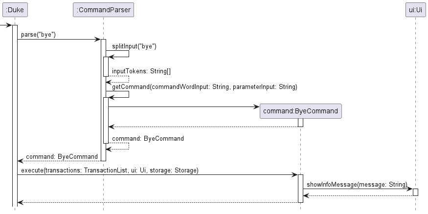
    <br />
    <i>Figure 29: Sequence Diagram for Bye Command</i>
</p>

_Written by: Brian Wong Yun Long_

### 7.3. Storage Operations

The Storage class is a standalone class that contains methods used for the storage of Transaction entries and the Budget value.

The class is first called by `Duke` during the initialising of the `TransactionList`. In this process, the existence of duke.txt will be verified.
1. If the file does not exist, an empty `Duke.txt` file would be created for the program to use. 
2. If the file exists, it's values would be parsed to verify if they have been corrupted. If corrupted, the storage of values would halt and error messages would be shown to prompt user to correct file issues.
Else, the values would update the program's `Budget` and the entries in `TransactionList`without any issues.

#### Reading From Duke.txt 

This specific operation is done during the initializing of the program. The `Budget` value and `TransactionList` entries would be parsed before their values are added into the program.
`Storage#initializeFile` is called by `Duke`.
`Storage#checkIfFileExist` is used to check if `Duke.txt` exists, and creates a new `Duke.txt` file if it does not exist.
`Storage#storeFileValuesLocally` uses sub-methods and methods from external classes to parse each line entry within `Duke.txt` and store the values in the program.

#### Writing To Duke.txt

This operation is done whenever the `TransactionList` entries or `Budget` value is changed via any of the `Command` classes;
(e.g. Add, Delete, Purge , Edit and Budget commands). 
The method `Storage#writeToFile` is used to update changes in `Budget` or `TransactionList`.

_Written by: Yong Chin Han_ 

### 7.4. Logging Operations

Our team used `java.util.logging` package for the purposes of logging. We instantiated various objects for different classes such as `parserLogger` and `addLogger` to set the log messages.

**Logging Levels**:

* `SEVERE` : Critical problem detected which may cause the termination of the application
* `ERROR`: An unexpected control flow captured
* `WARNING`: An exception has been caught by the app
* `INFO`: Information details what the app has done

_Written by: Paul Low_

## Appendix A: Product scope

### A.1. Target user profile

Moolah Manager is developed for IT professionals who prefer using Command Line Interface (CLI) applications
to quickly track and update their daily monetary transactions. They ought to be reasonably comfortable in typing over
mouse interactions and can type fast.

### A.2. Value proposition

Financial bookkeeping using a mobile application is often a hassle due to repetitive clicks. Moolah Manager  boasts a
time-saving CLI that encourages individuals to take ownership of tracking and reviewing their daily or monthly
transactions in an efficient and effective way. Moreover, it facilitates budget planning to prevent overspending.

## Appendix B: User Stories

| Version | As a ...         | I want to ...                                                                        | So that I can ...                                                                                                              |
|---------|------------------|--------------------------------------------------------------------------------------|--------------------------------------------------------------------------------------------------------------------------------|
| v1.0    | fast-typing user | type my own actions instead of having to click through different GUI pages           | have a more convenient way of managing my spending                                                                             |
| v1.0    | new user         | have similar features be grouped in the same family                                  | navigate the application easily                                                                                                |
| v1.0    | new user         | list usable commands                                                                 | better utilize the application when I unfamiliar with the commands                                                             |
| v1.0    | user             | add my income and daily expense into the application                                 | keep a record of my transaction history                                                                                        |
| v1.0    | user             | add my salary into the application                                                   | gather insights from a trend of my income                                                                                      |
| v1.0    | user             | add a category to each type of spending                                              | have an organised view of my financial statements                                                                              |
| v1.0    | user             | view my daily expenditure                                                            | plan how I want to spend my remaining income throughout the rest of the week                                                   | 
| v1.0    | user             | know which category of expenses I spend the most on                                  | better allocate my income for essential needs                                                                                  | 
| v1.0    | careless user    | delete my spending or expenses in the application                                    | remove inputs that are false or outdated                                                                                       | 
| v1.0    | careless user    | receive an error message when entering a wrong command                               | be aware that I need to rectify my incorrect input                                                                             |
| v1.0    | forgetful user   | find a specific transaction                                                          | recall how much I spent or earned for a particular situation                                                                   |
| v1.0    | busy user        | purge all my transactions at one go                                                  | refrain from deleting my transactions one by one when needed                                                                   |
| v2.0    | new user         | be guided at the initial stage of using the application                              | make good use of the features                                                                                                  |
| v2.0    | frequent user    | input a file with all my expenses for the application to retrieve data               | be more efficient and do not need to manually type my financial records into the command prompt                                |
| v2.0    | frequent user    | save my input history into a file                                                    | have the inputs automatically read again in future without having to re-enter similar expenses each time I use the application | 
| v2.0    | user             | gather a summary of my expenditure over a time period (i.e., daily, weekly, monthly) | better understand my spending habits                                                                                           |
| v2.0    | user             | know the amount of savings tabulated from income and expenditure after each month    | review my spending and plan my budget for the next month                                                                       |
| v2.0    | user             | gather individual insights of different time periods after adding my transactions    | analyze and reflect on the way I am managing my income and expenses                                                            |
| v2.0    | user             | view recommended money-managing tips from the application                            | better improve my money-managing habits                                                                                        | 
| v2.0    | user             | set up and update my budget                                                          | limit my spending against a budget                                                                                             |
| v2.0    | user             | archive my financial transactions from the previous years                            | focus on transactions that matter only for the current year                                                                    |
| v2.0    | careless user    | modify my spending or expenses in the application                                    | rectify any false input                                                                                                        |
| v2.0    | forgetful user   | receive reminders on how I should spend my allowance                                 | be consciously aware of my budget constraints                                                                                  |
| v2.1    | user             | view my remaining budget for each month                                              | better manage my expenses to keep them within my monthly budget                                                                | 
| v2.1    | user             | gather a summary of my expenditure over the last N days                              | narrow down my scope of listing my transactions to specific situations, e.g. my transactions over the past 1 week              | 
| v2.1    | user             | display my transactions and statistics in chronological order of date                | find my most recent transactions quickly                                                                                       | 
| v2.1    | lazy user        | list the help message for a specific command                                         | choose not to scroll up and down to find the command I wish to refer to                                                        | 

## Appendix C: Non-Functional Requirements

1. Should work on common operating systems including Windows, macOSX and Linux as long as it has Java 11 or above installed.
2. A user with above average typing speed for regular English text (i.e. not code, not system admin commands) should be able to accomplish most of the tasks faster using commands than using the mouse.
3. Does not require an active connection to the Internet to use the application.
4. Should respond to commands within 3 seconds with no noticeable sluggishness in performance for typical usage.

## Appendix D: Glossary

- **Transaction:** An instance when someone makes or receives a payment including deposits, withdrawals, and exchanges
- **Budget:** An estimate of expense for every month
- **Income:** Payment received from others
- **Expense:** Payment made to others
- **Savings:** Portion of income that is not spent on current expenditure

## Appendix E:  Instructions for Manual Testing

### E.1. Launch and Shutdown

- Initial Launch
  1. Download the latest [duke.jar](https://github.com/AY2223S1-CS2113-W12-2/tp/releases/download/v2.1/duke.jar) and copy it into a separate directory.
  2. Ensure that Java 11 has been installed and configured on your operating system.
  3. Launch a command prompt or terminal and run the command `java -jar duke.jar`. 
  4. **Expected Outcomes:** 
     + Moolah Manager will display a greeting message and a remaining budget for the current month.
     + A data file, `duke.txt` may be loaded if it exists in `./data/` directory.

- Shutdown
  1. Type `bye` to quit the application.
  2. **Expected Outcome:** 
     + Moolah Manager will terminate and display a goodbye message.

### E.2. Storage

- Loading Data
  1. Launch the application and change the state of the application, such as adding a new transaction. Close the window.
  2. Re-launch the application.
  3. **Expected Outcome:** 
     + Moolah Manager will load the `duke.txt` data file and the state of the application is the same as when it was closed.

- Missing Data File
  1. As per the instructions from loading data, check there is a `duke.txt` data file in `./data/` directory.
  2. In `./data/` directory, delete `duke.txt`.
  3. Re-launch the application.
  4. **Expected Outcome:** 
     + No data file will be loaded into the application, and user may not see the former state of the application.

- Corrupted Data File
  1. As per the instructions from loading data, check there is a `duke.txt` data file in `./data/` directory.
  2. In `./data/` directory, open `duke.txt` and try corrupting the records by e.g., removing the first pipe symbol from
     the first row. Save the changes to the file.
  3. Re-launch the application.
  4. **Expected Outcomes:**
     + The data file will only be partially loaded into the application, and user will be prompted to STOP the application and fix the error before reloading.
     + If users decide to continue using the application, the data would be overwritten.