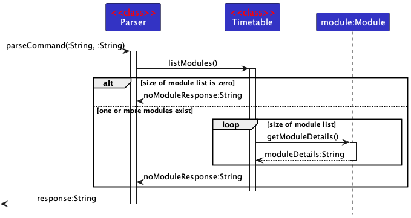
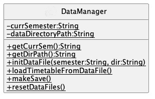

# Developer Guide
### Table of Contents
- [1. Acknowledgements](#1-acknowledgements)
- [2. Introduction](#2-introduction)
- [3. Design and Implementation](#3-design-and-implementation)
    - [3.1. Architecture](#31-architecture)
    - [3.1. Timetable Class](#32-timetable-class)
- [4. Key Features](#4-key-features)
    - [4.1. Adding modules to current timetable](#41-adding-modules-to-current-timetable)
    - [4.2. Setting lessons for individual modules](#42-setting-lessons-for-individual-modules)
    - [4.3. Auto-allocating lessons](#43-auto-allocating-lessons)
    - [4.4. Printing the timetable](#44-printing-the-timetable)
        - [4.4.1. Populate lesson data from timetable](#441-populate-lesson-data-from-timetable)
        - [4.4.2. Write day and time headers for timetable](#442-write-day-and-time-headers-for-timetable)
        - [4.4.3. Write day and time headers for timetable](#443-write-day-and-time-headers-for-timetable)
    - [4.5. Listing current modules](#45-listing-current-modules)
    - [4.6. Getting info on modules](#46-getting-info-on-modules)
    - [4.7. Deleting modules from timetable](#47-deleting-modules-from-timetable)
    - [4.8. Storage](#48-storage)
- [5. Product Scope](#5-product-scope)
    - [5.1. Target user profile](#51-target-user-profile)
    - [5.2. Value proposition](#52-value-proposition)
- [6. User Stories](#6-user-stories)
- [7. Non-Functional Requirements](#7-non-functional-requirements)
- [8. Instructions for manual testing](#8-instructions-for-manual-testing)

### 1. Acknowledgements
Ideas for this project partly comes from NUSmods at https://nusmods.com/

API and library used includes the following:
- [NUSMods API](https://api.nusmods.com/v2/) - To extract information about modules in NUS
- [FasterXML](https://github.com/FasterXML/jackson) - Helps parse json files from the NUSMods API

### 2. Introduction
Timetabler is an app that allows NUS students taking official NUS modules to view their classes and plan their timetable efficiently in AY22/23.

### 3. Design and Implementation
#### 3.1. Architecture


The ***Architecture Diagram*** given above presents the high-level design of the product. The main components included are as follows:
1. `Duke`: Initialised when launch and acts as the main logic component of the program.
2. `UI`: Handles all user interaction, including printing responses and receiving user inputs.
3. `Parser`: Parses main user commands and calls for appropriate functions.
4. `Commands`: Exists as a package which includes all command functions (explained below under each individual features).
5. `Timetable`: Contains all the data in the current session. (Data can only be accessed and manipulated by commands)
6. `Storage`: Manages the saving and loading of the current session data.


<p style='text-align: justify;'>The software design follows as closely to the Single Responsibility Principle (SRP) as possible. Each major component explained above have unique roles which is not overlapped by another component. For example, printing of all responses go through the UI class, which handles all interactions with user, including the display of program responses.</p>

---

#### 3.2. Timetable Class


Above is a ***Class Diagram*** (partial, excludes methods for readability) which gives an overview of how data is managed in the program.

At the start of the program, after the user chooses the semester, only the indicated semester's data, if any, will be loaded into the timetable.
- In the current interation of the program, user cannot change semester without quitting.
- In the current iteration, only semester 1 and 2 are available.

- `Timetable`: Represents the entire timetable of the current session.
- `TimetableDict`:
- `Module`: Represents a single NUS module, with all required information pertaining to it.
- `Lesson`: Represents a single lesson of a module. Lessons can be of different `lessonType`, for example, `Lecture` and `Tutorial`.
---

### 4. Key Features
#### 4.1. Adding modules to current timetable


The ***Sequence Diagram*** above is a simplified depiction of how new modules are added to the user current session timetable. The feature is rather complex due to the need to query, extract, and check the data before adding it to the timetable. Thus, a few design decisions were made:</p>

* The class CommandAddModule manages the key actions (as explained above) from a higher level.
* The class Nusmods manages all interactions with the NUSmods API and deals with JsonNode objects.
* Any particular module is only added to the current session timetable through the Timetable class after all relevant data has been extracted, packaged and checked.
* Module object consists of all relevant data for the module, including code, name, details, all available lessons, and lessons that is to be attented by the user.

**Design Decision:**
<p style='text-align: justify;'>The class CommandAddModule provides control abstraction to the complex operation as it abstracts away lower level data items such as the day and time of a specific tutorial class for a particular module.</p>

<p style='text-align: justify;'>By having a separate class Nusmods deal with all API calls and JsonNode objects, it allows the other classes/components to only have to work with simpler data types and native objects (such as Module and Lesson objects).</p>

<p style='text-align: justify;'>Other alternatives considered includes having the CommandAddModule class handle the API call but it would have resulted in the code being even more convoluted and less readable.</p>

<p style='text-align: justify;'>In the current design, we keep all data within the Timetable class 'clean', in other words, no program failure should occur when working with the data. Thus all checks, such as if the module exists for the semester indicated, are done before adding the module to the timetable. This gives the assurance that other functions executed by the program will not fail due to invalid data.</p>

<p style='text-align: justify;'>Lastly, the objects in the program is designed in such a way where it is possible to pass a single larger object rather than many smaller objects each containing different data. Thus, by adding an entire Module object into an ArrayList in the Timetable class, other operations can access the required data more easily.</p>

---

#### 4.2. Setting lessons for individual modules


Above is the simplified sequence diagram of the set command. This feature allows users to choose the lessons they want
and fixes it to its corresponding module. It involves interaction with the Ui class, which serves to display visual
information and receive user input. Interaction with the Timetable class serves to handle the logic involved to
associate each lesson with its module. Note that only modules that are settable can be accessed through this function,
this means that:

- Modules with no lessons cannot be accessed
- For modules with lessons, lesson types, such as tutorial and lecture, that possess less than 1 unique class number
  cannot be accessed. (See below for example)

```
CS2113
Lesson types: lecture, tutorial
Lecture : only has one lesson with class number "1" (Hence, lecture is not accessible)
Tutorial : 5 lessons with class numbers "1", "2", "3", "4" and "5" (Hence, tutorial can be accessed)
```

---

#### 4.3. Auto-allocating lessons


The sequence diagram above is a simplified illustration of how lessons are allocated. The allocation algorithm computes
all possible permutations of lesson combinations and allocated lessons in a way that minimizes clashes.

**Design Decisions:**
* The algorithm involved in allocating lessons relies heavily on the ability to check if lessons clash with each other at any point in time. Thus, the allocation algorithm is implemented in the timetableDict to allow easy
access to lessons at any point in the timetable.
* Due to some modules having an excessive amounts of lessons, leading to extremely high number of possible lesson permutations during allocation, we have set a limit of 30 possible lesson permutations for each mod to be allocated. 
Taking the maximum of 7 modules, this sets a limit of 2.187 x 10^10 total permutations for the algorithm. This prevents the program from exceeding the Java heap space memory allocated.

---

#### 4.4. Printing the timetable

The ***Activity Diagram*** below is a simplified depiction of the module `CommandPrintTimetable`.  


<details><summary>Please read the notes for the following section of 4.4</summary><p style='text-align: justify;'>

1. There is no rake symbol in PlantUML Language Reference Guide. Considering the recommendation from [this CS2103 forum](https://github.com/nus-cs2103-AY1920S2/forum/issues/105), ```[rake ⋔]``` is used in place of the rake symbol in textbook.

2. The following detailed explanations will include collapsible tabs for better navigation in this long section.

3. Original variable names in `CommandPrintTimetable` are italicized if they appear in the activity diagrams.

4. Only activities with rake symbol will have a separate section below. Steps of Declare / Initialize 2D array will be explained in section 4.4.1.

</p></details>


##### 4.4.1 Populate lesson data from timetable


 <details><summary>Activity of 4.4.1</summary><p style='text-align: justify;' markdown="1">

- Three ArrayLists are populated from ```timetable``` module.
- ```rawTimetable``` stores the ```lesson``` object for each day;
- ```emptySlotList``` stores pairs of ```integer``` of starting and ending slots for each day;
- ```clashModCodeList``` stores a list of clashed module code of ```string```, if any.

</p></details>


<details><summary>Activity of Declare / Initialize 2D Arrays</summary><p style='text-align: justify;' markdown="1">

- A 2D array,```timeTable``` of ```string``` type is declared and initialized with empty strings first. This array is for storing the output strings of the actual timetable for print later on.

</p></details>


##### 4.4.2 Write day and time headers for timetable

<details><summary>Activity of 4.4.2</summary><p style='text-align: justify;' markdown="1">

- Time headers in 24 hours, from 0800 to 2200, is written into ```timeTable```.
- Monday to Friday headers are written into ```timeTable``` as well.
- Column divider ```:``` serves as the vertical separation line among different days from Monday to Friday.
- Row divider ```=``` serves as the horizontal separation line between days of a week and the actual lessons below.


</p></details>


##### 4.4.3 Write day and time headers for timetable

<details><summary>Activity of 4.4.3</summary><p style='text-align: justify;' markdown="1">

- ```emptySlotList```, with pairs of ```integers``` of starting and ending slots for different days in a week, is sorted by the starting slot. This is to prepare for the checking and finding overlapping lesson intervals later.
- If there are clashes:

 <details><summary>&nbsp;&nbsp; (a) Get all clash intervals of the day </summary><p>

&nbsp;&nbsp; 

&nbsp;&nbsp;&nbsp;&nbsp; I.Merge all the overlapping intervals. e.g. ```[0800,1000] , [0900,1100] , [1100,1200]``` will be merged as ```[0800,1100] , [1100,1200]``` <br>
&nbsp;&nbsp;&nbsp;&nbsp; II.Re-popularize and sort ```rawTimetable``` - to make sure starting and ending slots of lessons are not affected by the merging algorithm <br>
&nbsp;&nbsp;&nbsp;&nbsp; III. Popularize ```clashSlotList``` for each day - to store the merged overlapping intervals in step I. <br>
&nbsp;&nbsp;&nbsp;&nbsp; IV. Remove un-clashed lesson slots. In the above example, ```[1100,1200]``` is not a clashed interval, which is removed in this step. <br>
&nbsp;&nbsp;&nbsp;&nbsp; V. Return ```clashSlotList```, now an ```ArrayList``` of clashed intervals. <br>
</p></details> 


&nbsp;&nbsp; (b) Write ```X``` for the clashed intervals <br>
&nbsp;&nbsp; (c) Write the clashed module code in  ```clashModCodeList``` <br>


- If there are no clashes: Get ```lesson``` objects from ```rawTimetable```. 
- If there is ```XXXX``` - activity will stop due to this unexpected behavior.
- If there are no ```XXXX```  - mark of a clash - proceed to write the lessons into ```timeTable```: <br>
&nbsp;&nbsp; &nbsp;&nbsp; (a) Upper boarder of each lesson is written. <br>
&nbsp;&nbsp; &nbsp;&nbsp; (b) Module code is written in ```timeTable```. <br>
&nbsp;&nbsp; &nbsp;&nbsp; (c) Depending on the height of the box of lessons, those with 1 hour or less have to squeeze the module code with the lesson type together. Otherwise, write module code and lesson type below in ```timeTable```. <br>


- ```timeTable``` is converted into strings for output.
- Module codes which clashes from ```clashedModCodeList``` is appended at the end of the output string
- Remarks and notes are then appended at the end of the output string
- Finally, the whole output string is returned and printed on the terminal.


</p></details> 


---

#### 4.5. Listing current modules


Above is the sequence diagram for the listing of modules in the timetable. A few points to note regarding this feature are:
* In order to accommodate a unique `noModuleResponse`, an if-else statement acting as a guard clause is used. If no modules exist, the if statement returns the `noModuleResponse`. Else, the header for the module list is appended before entering the `for` loop. Below is a snippet of the code:
    ```
    if (listOfModules.size() == 0) {
        return "You have no modules at the moment!";
    } else {
        list = new StringBuilder("Here are your modules:\n");
    }
    ```
* Each module is an object of class Module and has the `getModuleDetails` method which returns a String which includes all the required details for the list feature. This method is also reused in other features of the application.

---

#### 4.6. Getting info on modules ####


Above is the simplified sequence diagram for the command to get basic information about a single module. By using the
module code the user inputs, it will return an array of information about the module, namely:

- Module Code, example:  `CS2113`
- Module Name, example: `Software Engineering & Object-Oriented Programming`
- Module Description, example: `This module introduces the necessary skills for systematic and rigorous development of
  software systems. It covers requirements, design, implementation, quality assurance, and project management aspects of
  small-to-medium size multi-person software projects. The module uses the Object Oriented Programming paradigm. Students
  of this module will receive hands-on practice of tools commonly used in the industry, such as test automation tools,
  build automation tools, and code revisioning tools will be covered.`

As this command makes a HTTP request to the NUSMods API, different inputs will trigger different responses from the API.
In order to check for the validity of each input, the response code of each HTTP response is tracked and only a response
with a code of 200 is accepted.


---

#### 4.7. Deleting modules from timetable


The ***Sequence Diagram*** above is a simplified depiction of how modules are deleted from timetable. As this feature is implemented after function of adding module, the class `CommandDeleteModule` manages the key actions (as explained above) from a higher level.</p>

**Design Decision:**
<p style='text-align: justify;'>

The class `CommandAddModule` is a control abstraction to the operations of
(1) checking whether the timetable is empty;
(2) query the module to delete from timetable; and
(3) delete the module, if any.</p>

<p style='text-align: justify;'>

The query of user input is implemented through the UI class, instead of directly importing ```java.util.Scanner```, for more uniformed packaging of input and output commands.</p>


---

#### 4.8. Storage
**The `Storage` component:**
* Saves module and information on which lessons the user is attending into a text file which is read when the program is relaunched after quitting.
* Makes the API calls based on which modules were present in the previous save and add them into the current session timetable.
* Updates the current session timetable with information on which lessons the user is attending based on the previous save.
* Has 3 static classes that manage data:
    * `DataManager`: Handles and manages the saving and loading of data. It uses the other two classes to do so.
      
    * `ModuleManager`: Handles information regarding the modules the user has selected. Information is stored in `ModuleData.txt`
      
    * `AttendingManager`: Handles information regarding the lessons the user is attending. Information is stored in `AttendingData.txt`
      

**Design Decision:**
* The data component is designed in such a way where there is a balance between how much data is stored and how easy it is to manage the data.
* An alternative approach is to hardsave the entire session data, including lesson information, into a text file. However, this introduces additonal steps to parse the data and makes the code less readable and more prone to bugs.
* The method which uses API calls is chosen. This reduces the amount of data that needs to be written into the textfile and allows for reusing the addModule function of the program.
* The drawback of this is that the API call must be successful and internet connection is required.

**Handling Corrupted File:**
In the case of the user illegally tampering with the `.txt` data files, the program is designed handle it in a more elegant way. However, do note that the program is not designed for the user to intentionally tamper with the data file. With a corrupted file, there are 2 possibilities.

1. The file is only slightly tampered and does not affect the API calls during load up. This will not be flagged. However in future versions of the product, this can be further refined. Do note that other features such as `allocate` will be affected by this form of corruption.

2. Important data such as the module code has been affected. In this case, there might be an API call failure. However, the program cannot be certain if the failure is due to a corrupt file or absence of internet connection. The program is thus designed with a data protocol feature which checks with the user if he has stable internet.
    - If he has, the program deems the file to be corrupted and deletes all data files for the semester and continues
    - Else, the program quits and does not alter any data files to preserve the user's last successful save.

    ```
    Oops! Something went wrong. Either a file is corrupted or you are not connected to the internet.
    Enter 0 if you are sure you have internet connection - files will be deleted and recreated before continuing.
    Enter 1 if you have no internet connection - program will quit without losing data.
    ```
---

### 5. Product scope
#### 5.1. Target user profile

The target user profile is as follows:
* Comfortable with using Desktop CLI apps
* Prefers typing over mouse interactions
* A student of National University of Singapore (NUS)
* Takes official valid NUS modules
* Has a need to manage and plan his/her timetable

#### 5.2. Value proposition

The value proposition of the product lies in its ability to aid the management and planning of a university timetable containing NUS modules.

### 6. User Stories

| Version | As a ...    | I want to ...                                                  | So that I can ...                                             |
|---------|-------------|----------------------------------------------------------------|---------------------------------------------------------------|
| v1.0    | NUS Student | See all the timings of the tutorials/lectures I am involved in | Plan my work schedule conveniently                            |
| v1.0    | NUS Student | View the details of any module                                 | Get an overview of what the module is about                   |
| v1.0    | NUS Student | Keep track of the modules I want to take                       | Better plan out my schedule                                   |
| v1.0    | NUS Student | Remove the modules I do not wish to take                       | Keep only the modules that I am interested in                 |
| v1.0    | NUS Student | Plan my schedule for the semester                              | Better prepare myself for the semester                        |
| v1.0    | NUS Student | Preserve my timetable information across program runs          | Plan my timetable once and never have to worry about it again |
| v2.0    | NUS Student | Have a visual display of my timetable                          | Can better visualise my schedule                              |
| v2.0    | NUS Student | Have someone plan my schedule for me                           | Avoid the hassle of planning my schedule                      |

### 7. Non-Functional Requirements

1. Program should run on any mainstream OS that runs Java 11 and have a stable internet connection
2. Users should be able to easily use all functionalities if they have a general idea of module codes in NUS.

### 8. Instructions for manual testing

Given below are instructions to test the app manually.

**Note:** These instructions only provide a starting point for testers to work on;
testers are expected to do more *exploratory* testing.

##### Launch and shutdown

1. Ensure that you have Java 11 or above installed.
2. Down the latest version of `tp` from [here](http://link.to/duke).
3. Copy the jar file into an empty folder.
4. Open a command window or terminal for mac in that folder.
5. Run the command `java -jar tp.jar` in the same folder.
6. To shutdown, either enter `0` when prompted to enter a semester, or `quit` as a command in the main program.

##### Adding a module

1. Adding a module when module already exists in Timetable

1. Prerequisites: List all persons using the `list` command. There should already exist the module that is to be double added.

2. Test case: `add`, then `exampleModuleCode`
   Expected: Module should not be double added. Use `list` command again to check.

##### Deleting a module
1. Deleting a module when module already exists in Timetable

    1. Prerequisites: List all persons using the `list` command. There should already exist the module that is to be deleted.

    2. Test case: `delete`, then `exampleModuleCode`
       Expected: Module should be deleted. Use `list` command again to check.

    3. If there is no module in the list, user will be prompt that no module exists in the list.

##### Saving data

1. Dealing with missing data files
- Make a manual deletion of any saved data file with either name `Sem1Data` or `Sem2Data`.
- Run the program, there should not be any errors and a new directory with the correct files should be created.

2. Dealing with corrupted module data files
- Add "abc" as a random string inside the data file `ModuleData.txt`.
- Run the program and enter the semester corresponding to the data file. The program should check with the user if he has internet connection. If he has, the program deems the file to be corrupted and deletes all data files for the semester and continues. Else, the program quits and does not alter any data files to preserve the user's last successful save.

3. Dealing with corrupted attending data files
- Add "abc" as a random string inside the data file `AttendingData.txt`.
- Run the program and enter the semester corresponding to the data file. If the `module code` is corrupted, the program will continue to ask the user if he has internet connection. The behaviour afterwards should be the same as described above. If any other data is modified, the program will continue and print the modified data.