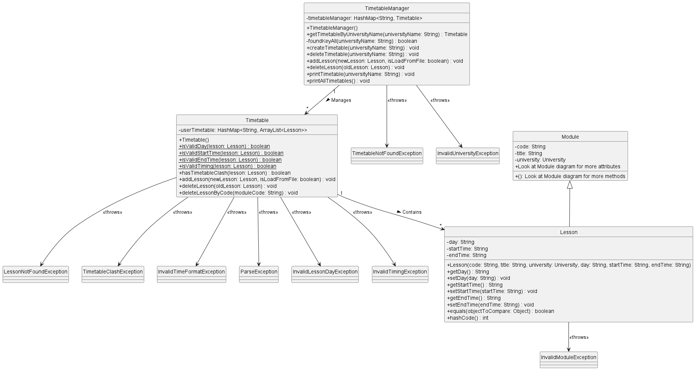
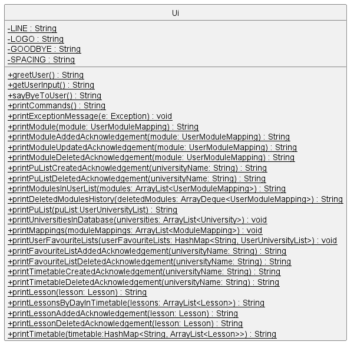
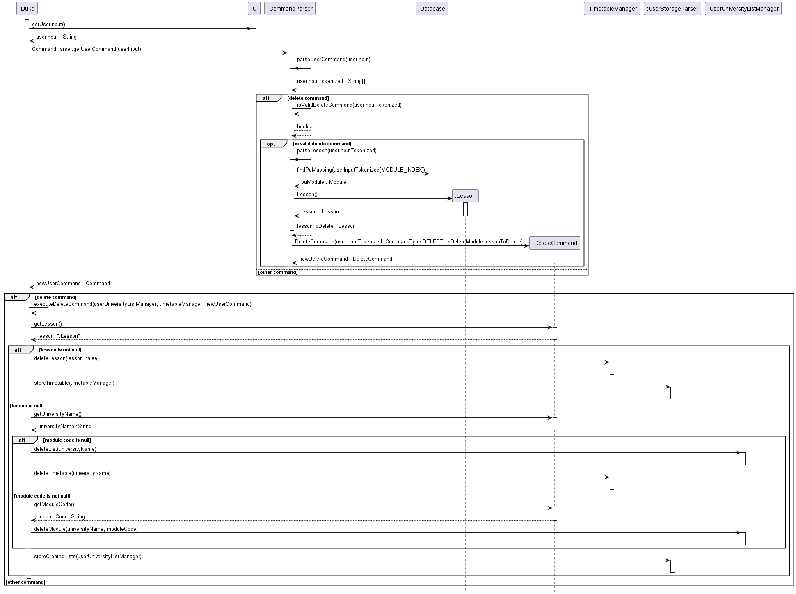

# Developer Guide

## Design & implementation

### Database

The database reads in SEP module data from data.csv and stores the useful data into an ArrayList of module mappings and universities.

Upon starting easySEP, the DatabaseStorage will load each line from data.csv, parse the line using DatabaseParser, and store the data into the Database.

Relevant exceptions are thrown when there are unexpected scenarios. For instance, if data.csv cannot be found at the given file path, a FileNotFoundException is thrown.

The following diagram illustrates the relationships between the three main database classes - DatabaseStorage, DatabaseParser, and Database.

The following diagram illustrates the flow of the program, from the initial loadDatabase call to the eventual completion of updating the entire database.

### User Storage

User Storage stores 2 different user information. University list is a list of interested universities for SEP and it is stored in a text file ("data/uni_info.txt"). For each university in the list, information includes Partner University's name, country, list of modules and their corresponding information. It also records whether the user previously added the particular university in the favourites list.

Timetable list is a list of timetables for universities that the user is interested in and it is stored in a text file ("data/timetable_info.txt"). For each timetable in the list, information includes Partner University's name, country, module information and lesson timings.

Upon starting easySEP, the UserStorage class will take in information from both text files and convert them into Strings.
UserStorageParser will create a new UserUniversityListManager, by converting the `String` into a `HashMap<String, UserUniversityList>`
which serves as myManager for the UserUniversityListManager class. UserStorageParser will also create a new TimetableManager,
and add lessons to the TimetableManager, using the String extracted from the text file.

Relevant exceptions are thrown when there are unexpected scenarios. For example, if the data in the text file is stored in an invalid format,
an InvalidUserStorageFileException will be thrown.

During the duration of the program, whenever the user decides to alter the data corresponding to UserUniversityListManager
(ie. add / delete universities or modules, or create new university list), UserStorageParser class will update "data/uni_info.txt" accordingly.
Similarly, whenever the user decides to alter the data corresponding to TimetableManager (ie. add / delete lessons), UserStorageParser class will update
"data/timetable_info.txt" accordingly. This is achieved by converting UserUniversityListManager / TimetableManager into a `String`,
before saving it in the text file.

The following diagram illustrates the relationships between the two main user storage classes - UserStorage and UserStorageParser.

The following diagram illustrates the flow of the program, from initialisation to updating of the text file.

### Timetable

Upon starting easySEP, a TimetableManager is created in preparation for users to begin adding Timetables. The TimetableManager is used to create new Timetables, manage existing Timetables and delete old Timetables.
These Timetables are stored in a HashMap and indexed by university name to facilitate easy reference.

For existing Timetables, they can be used to add and delete Lessons. Each Timetable is made up of a `HashMap` of `ArrayLists(type: Lesson)` indexed by weekday e.g. Monday for easy compartmentalisation.
Within Timetables, Lessons will compromise details like the day, start time and end time. The `ArrayLists(type: Lesson)` are sorted in non-descending order by the start time of the Lessons.

Relevant exceptions are thrown when unanticipated scenarios occur. For instance, if the user attempts to delete a non-existent Timetable, a TimetableNotFoundException is thrown.
Another example is the user attempting to add a lesson that is conflicting with an existing lesson in his/her timetable. In this case, a TimetableClashException is thrown.

The following diagram illustrates the relationships between the three main timetable classes - TimetableManager, Timetable and Lesson.

In chronological order, the following diagrams illustrate the flow of the program for adding lessons, deleting lessons and displaying timetables to the user.

### Delete History

To help users recall the modules that they had recently deleted, the Delete History feature allows them to view up to 5 most
recently deleted module mappings. This can help them to add the module mappings back to the lists without having to search for the specific
module code again.

The UserDeletedModules class has an `ArrayDeque`, which stores the recently deleted module mappings.
When the user deletes a module mapping, it will be added to the `ArrayDeque`.
If the `ArrayDeque` already contains 5 module mappings, the last one (least recent) will be deleted, before the addition of a new module mapping.
Do note that delete history information is not stored upon exiting the app (ie. it is not stored in User Storage).

The following diagram illustrates the relationship between UserUniversityListManager and UserDeletedModules classes.

The following diagram illustrates the flow of the program, when a user deletes a module.

### Ui

The Ui class is the cornerstone of the Duke program to facilitate interaction with the user. It is used to scan and collect user input, print error messages to the user upon invalid input commands,
and display the appropriate acknowledgements or required information based on the user's command.

The following diagram illustrates the methods within the Ui class that can be invoked by the other classes in Duke for the purpose of user interaction.

### Commands

To interact with easySEP, users have to input commands specified with parameters to perform operations which will be passed to the CommandParser to generate a corresponding Command according to their input.
The Command will then be executed to perform the operation on the other classes managing the timetables and databases. Error checking is handled to throw InvalidUserCommandException if the user's input does not match
the specified Command format. To deal with parsing parameters, spaces in University names and Module codes are to be replaced with underscores.

The following class diagram illustrates the relationship between Command class and its subclasses as well as other classes related to Commands.

#### Create Command

A Create command can be used to create a university list and its corresponding timetable.

The following sequence diagram illustrates the relationship between the respective classes involved in the creation and execution of a create command.

#### Exit Command

An Exit command can be used to exit the application.

The following sequence diagram illustrates the relationship between the respective classes involved in the creation and execution of an exit command.

#### Help Command

A Help command can be used to exit the application.

The following sequence diagram illustrates the relationship between the respective classes involved in the creation and execution of a help command.

#### Add Command

An add command can be used to add a lesson to the timetable or add a module mapping to the user university list.

The following sequence diagram illustrates the relationship between the respective classes involved in the creation and execution of an add command.

#### Delete Command

A delete command can be used to delete a lesson from the timetable, delete a module mapping from the user university list or delete an entire user created university list.

The following sequence diagram illustrates the relationship between the respective classes involved in the creation and execution of a delete command.

#### View Command

A view command can be used to view all user created university lists, view user's delete history, view user's selected university list or view all the user's created university lists' timetables.

The following sequence diagram illustrates the relationship between the respective classes involved in the creation and execution of a view command.

#### List Command

A list command can be used to display all the module mappings in the database, all the universities in the database, or allow users to filter by NUS module code or partner university name.

The following class diagram illustrates the relationship between the respective classes involved in the creation and execution of a list command.

To differentiate between the various functions of the list command, a variable `listOption` is used. This variable signals Duke to execute the relevant commands accordingly.

The following sequence diagram illustrates the flow of the program to read in the user input, parse the user input, check if it is a valid list command, and execute the relevant list command based on the `listOption`.

#### Favourite Command

A favourite command can be used by the user to favourite or un-favourite lists of module mappings that they have curated. It can also be used to display all of the user's favourite lists and the module mappings they contain.

To differentiate between the various functions of the favourite command, a variable `favouriteOption` is used. This variable signals Duke to execute the relevant commands accordingly.

The following class diagram illustrates the relationship between the respective classes involved in the creation and execution of a favourite command.

The following sequence diagram illustrates the flow of the program to read in the user input, parse the user input, check if it is a valid favourite command, and execute the relevant favourite command.

## Product Scope

### Target User Profile

NUS SoC undergraduates intending to embark on a Student Exchange Programme

### Value Proposition

SoC students are able to efficiently query their local database of past mappings for EE, CG, and CS-coded modules at one go and store their shortlisted modules locally, allowing for ease of reference and follow-up at a later time. This will improve on the shortcomings of EduRec.

### Problem Addressed

The module mapping support provided by the EduRec website is not helpful, allowing students to only search for past mappings by 1. Faculty or 2. University. This makes the module mapping process very time-consuming, with the slow response of the EduRec website adding fuel to the fire. Moreover, the website does not allow for the searching of modules to map to begin with, much less so for searching multiple modules at one go (which is exactly what most users would be looking for). EduRec does not give students the option of saving shortlisted modules either.

## User Stories

| Version | As a ...              | I want to ...                                                            | So that I can ...                                                         |
| ------- | --------------------- | ------------------------------------------------------------------------ | ------------------------------------------------------------------------- |
| v1.0    | interested user       | use a program that provides feedback to my actions                       | feel my commands being acknowledged                                       |
| v1.0    | interested user       | have my commands understood by the program                               | use the easySEP to plan my SEP modules                                    |
| v1.0    | user                  | save my shortlisted modules and their associated partner universities    | continue my module mapping search at a later time                         |
| v1.0    | user                  | create a listing for my target university                                | track whatever modules I am interested in for my target university so far |
| v1.0    | user                  | add a module that I am interested in to a list                           | track what I have seen so far                                             |
| v1.0    | potential SEP student | plan my schedule based on the most up-to-date information                | ensure the currency of my plans                                           |
| v1.0    | user                  | be able to delete modules that I am no longer interested in from my list | ignore them in my planning                                                |
| v1.0    | user                  | edit my previous modules that I have added                               | make changes to my plans whenever needed                                  |
| v1.0    | user                  | be able to view my past modules that I have saved                        | refer back to my previous lists                                           |
| v2.0    | user                  | see the list of valid commands                                           | review the valid commands                                                 |
| v2.0    | potential SEP student | be able to view the full list of modules available                       | consider all my available options                                         |
| v2.0    | potential SEP student | be able to view the full list of partner universities available          | consider all my available options                                         |
| v2.0    | user                  | be able to view all module mappings for an NUS module code               | consider modules to map                                                   |
| v2.0    | user                  | be able to view all module mappings offered by a partner university      | consider modules to map                                                   |
| v2.0    | user                  | see my most 5 recent deleted modules                                     | check my history                                                          |
| v2.0    | user                  | be able to favourite my lists                                            | keep that of my priorities                                                |
| v2.0    | user                  | various search functions for my lists                                    | search for information faster                                             |
| v2.0    | user                  | be able to add class timings and create a timetable for SEP              | keep track of my timetable                                                |

## Non-Functional Requirements

{Give non-functional requirements}

## Glossary

- HU: home university
- PU: partner university
- u/ - university
- m/ - modules

## Instructions for manual testing

{Give instructions on how to do a manual product testing e.g., how to load sample data to be used for testing}
