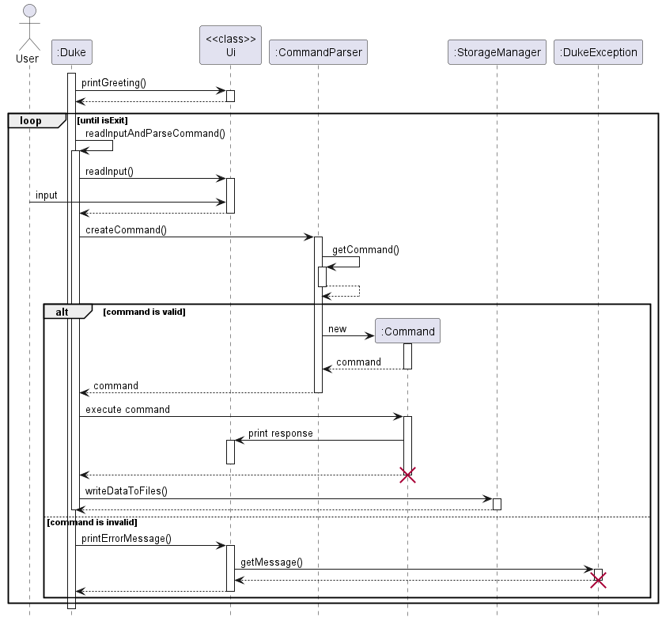

# Upcycle - Developer Guide

## Acknowledgements 

{list here sources of all reused/adapted ideas, code, documentation, and third-party libraries -- include links to the original source as well}

## Introduction

## Setup the environment

## Design  
This sector describes the architecture design of Upcycle with its components, and UML diagrams are used to support.
### Duke 

### User component
### Item component 
### Transaction component
The Class diagram below show how Transaction-related classes interact with each other. `Transaction` object contains `transactionId`, `itemName`, `itemId`, `borrower`, `duration`, `createdAt`, `returnedAt` attributes. Among those, `transactionId` is created by `IdGenerator`'s static method and dates are parsed by `DateParser`, therefore, Transaction class depends on those two classes.
Transactions are stored in `TransactionList`, which will be loaded and written on the file by `TransactionStorage` (inherits from `Storage`) whenever Upcycle runs or exits. All transaction-related commands operate mainly on a list of transaction (transactionList:TransactionList)

### Ui component 
### Storage component 
### Command component

## Implementation
This sector describe how features are implemented, where readers can get insight into the mechanisms of them with step-by-step descriptions and UML diagrams.

### User-related Features

#### Add a user
>> This feature allows user to add a new user to their list and upon successful adding, a confirmation response about the new user will be sent from Ui to user

Given below is an example usage scenario and how the command mechanism behaves at each step.

Step 1: The user types in the command in the command line. The CommandParser class checks if the command is valid through the createCommand() method, and either sends an exception, or send the input to the AddUserCommand to be processed.

Step 2: The AddUserCommand command checks if the delimiters ('n', 'a', 'c') is present in the user input through the getArgsAddUserCmd() method. If not present, an exception will be thrown. The command also checks whether the input's final argument is valid through `isValidName()`, `isValidAge()`, `isValidContactNumber()` methods. An exception will also be thrown if the final argument does not satisfy the requirements (duplicate name, wrong range or format age, wrong contact length ,...).

Step 3: If all arguments are valid, then it creates a new `User(arg[0], Integer.parseInt(args[1]), args[2])` with `args[0]` is username, `args[2]` is age, and `args[3]` is contact number

Step 4: After adding the new user, a message will be displayed to the user via `Ui.addUserMessage()` method which show the new user's details and the size of userList.

The following sequence diagram shows how the add user operation works:

#### Remove a user

>>This feature allows user to remove a user to their list and upon successful removing, a confirmation response about the deleted user will be sent from Ui to user

Given below is an example usage scenario and how the command mechanism behaves at each step.

Step 1: The user types in the command in the command line. The CommandParser class checks if the command is valid through the createCommand() method, and either sends an exception, or send the input to the RemoveUserCommand to be processed.

Step 2: The RemoveUserCommand command checks if the delimiters ('u') is present in the user input through the getArgsRemoveUserCmd() method. If not present, an exception will be thrown. The command also checks whether the input's final argument is valid (user can be deleted or not) by checking whether that user is currently borrowing or lending any item via `canDeleteUser()`, `isBorrowing()` and `isLending()` methods. An exception will also be thrown if the final argument does not satisfy the requirements (user not found, user is borrowing/lending).

Step 3: If all arguments are valid, then it finds and deletes the user in the userList by his/her name, which is unique. And all of his/her items stored in itemList are also deleted:

`userList.deleteUser(username);`

`itemList.deleteAllItemOfAnUser(username, transactionList)`

Step 4: After deleting a user, a message will be displayed to the user via `Ui.deleteUserMessage()` method which show the deleted user's details and the size of userList.

The following sequence diagram shows how the remove user operation works:

### Item-related Features 

#### Add an item 
>>This feature allows user to add a new item to their list and upon successful adding, a confirmation response about the new item will be sent from Ui to user

Given below is an example usage scenario and how the command mechanism behaves at each step.

Step 1: The user types in the command in the command line. The CommandParser class checks if the command is valid through the createCommand() method, and either sends an exception, or send the input to the AddItemCommand to be processed.

Step 2: The AddItemCommand command checks if the delimiters ('n', 'c', 'p', 'o') is present in the user input through the getArgsAddItemCmd() method. If not present, an exception will be thrown. The command also checks whether the input's final argument is valid through `isValidName()`, `isValidOwner()`, `isValidPrice()` and `isValidCatgoryNumber()` methods. An exception will also be thrown if the final argument does not satisfy the requirements (duplicate name of item of the same owner, owner not found, wrong range and format price,...).

Step 3: If all arguments are valid, then it creates a new `Item()` with `args[0]` is itemName, `args[2]` is categoryNumber, and `args[3]` is price and `args[4]` is owner's name

Step 4: After adding the new item, a message will be displayed to the user via `Ui.addItemMessage()` method which show the new item's details and the size of itemList.

The following sequence diagram shows how the add item operation works:

#### Remove an item
>>This feature allows user to remove an item to their list and upon successful removing, a confirmation response about the deleted item will be sent from Ui to user

Given below is an example usage scenario and how the command mechanism behaves at each step.

Step 1: The user types in the command in the command line. The CommandParser class checks if the command is valid through the createCommand() method, and either sends an exception, or send the input to the RemoveItemCommand to be processed.

Step 2: The RemoveItemCommand command checks if the delimiters ('i') is present in the user input through the getArgsRemoveItemCmd() method. If not present, an exception will be thrown. The command also checks whether the input's final argument is valid (item can be deleted or not) by checking whether that item is available (not in any transaction). An exception will also be thrown if the final argument does not satisfy the requirements (item not found, item is unavailable).

Step 3: If all arguments are valid, then it finds and deletes the item in the itemList by its ID, which is unique. However, finished transaction related to that items will not be deleted since if in the future we implement "get profit" feature then it still counts those finished transaction 

`itemList.deleteItem(itemId, transactionList);`

Step 4: After deleting a item, a message will be displayed to the user via `Ui.deleteItemMessage()` method which show the deleted item's details and the size of itemList.

The following sequence diagram shows how the remove item operation works:

### Transaction-related Features

#### Add a Transaction
>>This feature allows user to add a new transaction to their list and upon successful adding, a confirmation response about the new transaction will be sent from Ui to user

Given below is an example usage scenario and how the command mechanism behaves at each step.

Step 1: The user types in the command in the command line. The CommandParser class checks if the command is valid through the createCommand() method, and either sends an exception, or send the input to the AddTransactionCommand to be processed.

Step 2: The AddTransactionCommand command checks if the delimiters ('i', 'b', 'd', 'c') is present in the user input through the getArgsAddItemCmd() method. If not present, an exception will be thrown. The command also checks whether the input's final argument is valid through `isValidItem()`, `isValidBorrower()`, `isValidDuration()` and `isValidCreatedDate()` methods. An exception will also be thrown if the final argument does not satisfy the requirements (item not found, user not found, duration wrong format, createdDate wrong format...).

Step 3: If all arguments are valid, then it creates a new `transaction()` with `args[0]` is itemId, `args[2]` is borrowerId, and `args[3]` is duration and `args[4]` is createdDate

Step 4: After adding the new transaction, a message will be displayed to the user via `Ui.addTransactionMessage()` method which show the new transaction's details and the size of transactionList.

The following sequence diagram shows how the add transaction operation works:

#### Remove a Transaction
>>This feature allows user to remove a transaction to their list and upon successful removing, a confirmation response about the deleted transaction will be sent from Ui to user

Given below is an example usage scenario and how the command mechanism behaves at each step.

Step 1: The user types in the command in the command line. The CommandParser class checks if the command is valid through the createCommand() method, and either sends an exception, or send the input to the RemoveTransactionCommand to be processed.

Step 2: The RemoveTransactionCommand command checks if the delimiters ('t') is present in the user input through the getArgsRemoveTransactionCmd() method. If not present, an exception will be thrown. The command also checks whether the input's final argument is valid (transaction can be found). An exception will also be thrown if the final argument does not satisfy the requirements (transaction not found).

Step 3: If all arguments are valid, then it finds and deletes the transaction in the transactionList by its ID, which is unique. 

`transactionList.deleteTransaction(transactionId);`

Step 4: After deleting a transaction, a message will be displayed to the user via `Ui.deleteTransactionMessage()` method which show the deleted transaction's details and the size of transactionList.

The following sequence diagram shows how the remove transaction operation works:

#### View Transactions By Status
>> The viewTransactionsByStatus feature is facilitated by the TransactionList class. It extends the command class to add an additional command for users to view the history of finished or ongoing transactions for recording purposes. The feature implements the following commands:
* `find-tx /s finished`: Lists down all the transactions that have been completed.
* `find-tx /s unfinished`: Lists down all the transactions that are currently still ongoing.

Given below is an example usage scenario and how the command mechanism behaves at each step.

Step 1: The user types in the command in the command line. The CommandParser class checks if the command is valid through the createCommand() method, and either sends an exception, or send the input to the ViewTransactionsByStatus command to be processed.

Step 2: The ViewTransactionsByStatus command checks if the delimiter ('s') is present in the user input through the getArgs() method. If not present, an exception will be thrown. The command also checks whether the input's final argument is 'finished' or 'unfinish' through the isValidArgument() method. An exception will also be thrown if the final argument does not match the required words.

Step 3: Assuming the final argument is 'finish', the entire transactionList will be iterated through, and an array will store the transaction if the transaction.isFinished() status is true. 

Step 4: Once the transactionList has been completely iterated through, a message will be displayed to the user via Ui.viewcompletedTransactionsMessage() which lists down all the transactions that have their isFinished() status set to true. 

The following sequence diagram shows how the viewTransactionsByStatus operation works:

### Help Command
### Exit Command

## Product scope
### Target user profile

{Describe the target user profile}

### Value proposition

{Describe the value proposition: what problem does it solve?}

## User Stories

|Version| As a ... | I want to ... | So that I can ...|
|--------|----------|---------------|------------------|
|v1.0|new user|see usage instructions|refer to them when I forget how to use the application|
|v2.0|user|find a to-do item by name|locate a to-do without having to go through the entire list|

## Implementation

Feature: Find Item/ User by keyword.

The FindByKeyword feature is mainly facilitated by the classes ItemList and UserList. With this feature, users can search for and easily view all Users/Items that match the keyword they enter. The exact commands to be entered by the user are as follows:

find-item /k [keyword] - prints a list of items which match or contain the given keyword
find-user /k [keyword] - prints a list of users which match or contain the given keyword

The operations and functions implemented are as follows:

FindItemCommand(parts, itemList)

FindUserCommand(parts, userList)

ItemList.getItemsByKeyword(keyword, itemList)

UserList.getUsersByKeyword(keyword,userList)

Given below is an example usage scenario and how the FindItem mechanism works at each step. There are 5 Items in the ItemList, as shown in the object diagram below.

Figure: ItemList Object Diagram

The user enters the following command: “find-item /k Book”. In this case, the keyword is book. The entire ItemList is iterated through, and an ItemList containing all of the Items which contain the keyword is returned. 3 Items contain the keyword “Book”, hence these 3 items are returned by the function ItemList.getItemsByKeyword. This ItemList is then converted to a String via the method ItemList.toString, and printed by Ui.printResponse so that the user is able to see all the matching Items. The control flow is shown below.

Figure: Class Level Diagram

## Non-Functional Requirements

{Give non-functional requirements}

## Glossary

* *glossary item* - Definition

## Instructions for manual testing

{Give instructions on how to do a manual product testing e.g., how to load sample data to be used for testing}
