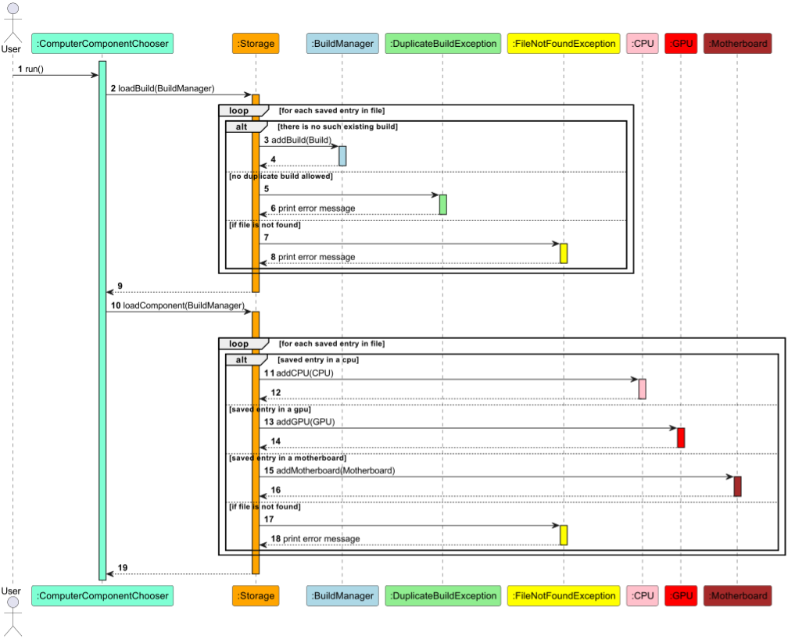

# Developer Guide

## Table of Contents
* [Design & Implementation](#design--implementation)
  * [Build Management Mode](#build-management-mode)
    * [Build Manager](#build-manager)
    * [Adding a Build](#adding-a-build)
    * [Listing all Builds](#listing-all-builds)
    * [Finding Builds](#finding-builds)
    * [Filtering Builds](#filtering-builds)
  * [Build Editing Mode](#build-editing-mode)
    * [Build](#build)
    * [Components](#components)
  * [Storage](#storage)
    * [Load](#load)
    * [Save](#save)
  * [Export](#export)
* [Appendix](#appendix)
  * [Product Scope](#product-scope)
    * [Target User Profile](#target-user-profile)
    * [Value Proposition](#value-proposition)
  * [User Stories](#user-stories)
  * [Non-Functional Requirements](#non-functional-requirements)
  * [Glossary](#glossary)
    * [PC parts](#pc-parts)
    * [PC parts parameters](#pc-parts-parameters)
* [Instructions for Manual Testing](#instructions-for-manual-testing)


## Design & implementation
### Build Management Mode

This section describes the implementation of Build Management Mode features. Build Management Mode only allows the user 
to manage the builds.
If the user wish to edit a specific build, he/she can refer to the [Build Editing Mode](#build-editing-mode).

Once the `main()` method of ComputerComponentChooser is called, instances for the `BuildManager`, `Parser`, 
`editParser`, `Storage`, `Ui` classes are initialized.


#### Build Manager


The builds are managed by the `BuildManager` class. It contains a list of builds in a `hashmap`. The class also contains
methods to find and filter builds based on user requirements. The `BuildManager` class is a singleton class, meaning that
there is only one instance of the class in the program. This is to ensure that there is only one list of builds in the
program. 

In our application, `BuildManager` is a class object that contains a hashmap of builds. The `hashmap` is used to store the
builds in the program. The key of the `hashmap` is the name of the build, and the value is the build object.

The `BuildManager` class is responsible for the following operations:
- Add a build to the list of builds
- Delete a build from the list of builds
- Get a particular build from the list of builds
- Get the list of builds
- Find build that contains a search term from the list of builds
- Filter builds based on user requirements

##### Adding a Build

This feature allows users to add a build to the list.

When the user first inputs a command for the adding of a build, the `Parser` class will parse the command and call the
method `mainParseAdd()` in the Parser Class. 

The `mainParseAdd()` will check if the provided name is valid or is blank or made up of white spaces. If the provided 
name is valid, the method will create a build with the provided name and the method will call the method `addBuild()` 
in the `BuildManager` class, passing the created build object with the provided name to the `addBuild()` method. If the provided name is 
empty or made up of whitespaces, the `BlankStringException` exception will be thrown and an error message will be printed.

The `addBuild()` method will check if the provided name is already in the list of builds. If the provided name is not
in the list of builds, the method will add the build into the list of builds. If the provided name is already in the 
list of builds, the `DuplicateBuildException` exception will be thrown and an error message will be printed.

After adding the build into the list, the program will return to the `mainParseAdd` method where the method will print
a message, telling the user the build has been added.

Finally, the `mainParseAdd` method will call the `saveBuild()` method in the `Storage` class to save the list of builds
into the data file.

The following sequence diagram shows how the add build operation works:


##### Listing all Builds

This features allow users to list all builds. 

When the user first inputs a command for the listing of all builds, the `Parser` class will parse the command and call
the method `mainParseList()` in the Parser Class. 

The `mainParseList()` method will then print the list of builds. If you have no builds, the method will print a message
telling you "You have no builds".

The following sequence diagram shows how the list operation works:


##### Finding Builds

This feature allows users to find builds that contain the search term.

When the user first inputs a command for the finding of a build, the `Parser` class will parse the command and call the
method `mainParseFind()` in the Parser Class. 

The `mainParseFind()` method will then call the method `findBuild()` in the `BuildManager` class, passing `findBuild()`
the search term. The `findBuild()` method will then search the list of builds for builds that contain the search term.
If there are builds that contain the search term, the method will print the list of builds that contain the search term.
If there are no builds that contain the search term, the method will print a message telling you that "No builds that 
meet specifications found."

The following sequence diagram shows how the find operation works:


##### Filtering Builds

This feature allows users to filter builds based on user requirements. 

When the user first inputs a command for the filtering of builds, the `Parser` class will parse the command and call
the method `mainParseFilter()` in the Parser Class.

The `mainParseFilter()` method will then call the `filterBuilds()` method in the `BuildManager` class. Based on the user
inputted type of filter, the `filterBuilds()` method will call the appropriate method to filter the
builds.

Case 1: If the user inputs the filter type `price`, the `filterBuilds()` method will call the `filterPrice()` method in
the `BuildManager` class. The `filterPrice()` method will then filter the builds and get builds within the price range
provided by the user. The `printFilteredList()` method will then print the list of builds within the price range.

Case 2: If the user inputs the filter type `power`, the `filterBuilds()` method will call the `filterPower()` method in
the `BuildManager` class. The `filterPower()` method will then filter the builds and get builds within the power range
provided by the user. The `printFilteredList()` method will then print the list of builds within the power range.

Case 3: If the user inputs the filter type `compatibility`, the `filterBuilds()` method will call the 
`filterCompatibility()` method in the `BuildManager` class. The `filterCompatibility()` method will then filter the 
builds and get builds that pass all the compatibility checks. The `printFilteredList()` method will then print the
list of builds that pass all the compatibility checks.

The following sequence diagram shows how the filter operation works:


### Build Editing Mode

#### Build


A build is a collection of components that are used to create a PC. A build can be saved and loaded from the storage. 
The user can also export the build to a text file via the export functionality. 

In our application `Build` is a class object which contains a 2D linked hash map of components. `LinkedHashMap2D` is a class
representing a 2D linked hash map data structure. The keys of the outer map are the component types and the keys of the inner
are the component names. The values of the inner map are the components themselves.

The user can add, delete, and view the components in the build. The user can also
perform aggregate operations on the build such as viewing the total price of the build and viewing the total wattage of the build.
There are also check compatibility functions that check if the build's components are compatible with each other in different ways. Such as:
- Checking if the power supply is compatible with the build's total power consumption
- Checking if the build's motherboard is compatible with the build's CPU and Cooler
- Checking if the form factor of the build's case is compatible with the build's motherboard
- Checking if the build's storage is compatible with the case expansion slots
- Checking if the number of the build's GPUs is compatible with the motherboard GPU slots
- Checking if the number of the build's RAM is compatible with the motherboard RAM slots

Some common scenarios where the build class is used are illustrated below.

##### Add & delete component

The user can add and delete components from the build. When the user adds a component, the component is added to the 
2D linked hash map. When the user deletes a component, the component is removed from the 2D linked hash map. This is 
done by calling the `addComponent()` and `deleteComponent()` methods of the `Build` class. Which in turn calls the 
`addElement()` and `removeElement()` methods of the LinkedHashMap2D class.


##### Get total power consumption of components

The user can view the total power consumption of the components in the build. This is done by calling the 
`getTotalPower()` method of the `Build` class. As shown in the sequence diagram below, when the method is called, it
then calls the `getAllComponent` method of the `Build` class. This method returns a list of all the components in the build.
The `getTotalPower()` method then loops through the list of components and adds up the power consumption of each component 
if is not of type `powersupply`. The reason being that the power supply is not included in the total power consumption of the build.
The total power consumption is then returned.


#### Get GPU slot compatibility

  The user can check if the number of GPUs in the build is compatible with the number of GPU slots in the motherboard. 
  This is done by calling the `getGPUSlotCompatibility()` method of the `Build` class. As shown in the sequence diagram below,
  when the method is called, it first initializes an `int` variable `totalPower` of value `0`. Then it calls the `getAllComponent` 
  method of the `Build` class. This method returns a list of all the components in the build. The `getGPUSlotCompatibility()` 
  method then loops through the list of components and checks if the component is of type `gpu`. If it is, the method increments the
  `totalPower` variable by 1. After the loop, the method checks if the `int` variable is less than or equal to the number of GPU slots
  in the motherboard. If it is, the method returns true. If it is not, the method returns false. Here true and false represent the
  compatibility of the number of GPUs in the build with the number of GPU slots in the motherboard.

  

#### Components


Each of the various components are represented by classes stored in the `components` package. The current components represented are the following:
- `Cpu`
- `Gpu`
- `Motherboard`
- `Memory`
- `Drive`
- `Case`
- `Cooler`
- `PowerSupply`
- `Monitor`

An `Other` class is also included to represent any other components that are not currently represented in the application. All the classes inherit from the `Component` class, and any new components added should also inherit from the `Component` class.
All components have the attributes `name`, `price` and `power`, which represent the name of the component, the price of the component and the power consumption of the component respectively. These attributes hold the same meaning in all subclasses except for the `PowerSupply` class, where the `power` attribute represents the power output of the power supply instead.

In addition to the getters and setters for each of the class fields, the classes share the following methods:
- `toCsv()` - returns a string representation of the component in CSV format
- `saveAsString()` - returns a string representation of the component in a format that can be saved to a text file
- `getDetails()` - returns a string representation of the component in a format that can be displayed to the user
- `getType()` - returns the type of the component

### Storage

  

  __Note__: Some methods are being left out to show the core functionality of the storage class.

  Storage is used for loading and saving the user's builds. The user can save their builds to a text file and load them 
  from a text file. 

  The `Storage` class has private attributes `FILE_DIRECTORY`, `BUILD_FILE_PATH` and `COMPONENT_FILE_PATH`. 
  `FILE_DIRECTORY` is the directory where the text files are stored. 
  `BUILD_FILE_PATH` is the path to the text file where all the build names are stored. 
  `COMPONENT_FILE_PATH` is the path to the text file where the file is named after the build name. The components of the build 
  are stored in their respective build text file.

  The `Storage` class has a constructor that takes in a `BuildManager` object. The `BuildManager` object is used to access the
  builds in the `BuildManager` object. The `Storage` class has a `loadBuild()` method that loads the builds from the text file
  and a `saveBuild()` method that saves the builds from the `BuildManager` object into the text file. The `Storage` class also has
  a `loadComponent()` and `saveComponent()` methods that utilize the `BuildManager` object to access the `Build` object to load and save
  the components of the build into their respective text files. The `deleteBuild()` method deletes the build from the text file with the path
  `BUILD_FILE_PATH` and deletes the text file with the path `COMPONENT_FILE_PATH` that is named after the build name.


#### Load

  

  The `loadBuild()` method is called when the program starts. The `loadBuild()` method reads the text file with the path `BUILD_FILE_PATH` and
  creates a `Build` object for each build name in the text file. If there are duplicate build names in the text file or the text file does not exist,
  respective error messages will be printed out. The `loadComponent()` method is called for each build name in the text file. The `loadComponent()` method
  reads the text file with the path `COMPONENT_FILE_PATH` and creates a `Component` object for each component in the text file. These `Component` objects
  are then added to the `Build` object. If the text file does not exist, an error message will be printed out. The diagram only shows the loading of 3 
  components, but the `loadComponent()` method works the same for the other components that are not mentioned.

#### Save

  Save is divided into two parts, saving the build names and saving the components of the build.

  

  When the user adds a new build, it will be read by in the `readline()` method, which will then be passed to the `mainParseAdd()` method
  in the `Parser` class to check if the build name is valid. If the build name is empty, `BlankStringException` will be thrown. Also, if the build name is similar to 
  the name of an existing build or the name of text file with the path `BUILD_FILE_PATH`, `DuplicateBuildException` and `InvalidBuildException` will be thrown
  respectively. Otherwise, the `saveBuild()` method will be called. The `saveBuild()` method will then write the build names in the `BuildManager` object
  into the text file with the path `BUILD_FILE_PATH`. If the file directory does not exist, `createFileDirectory()` will be called to create the file directory.
  If the text file does not exist, `createFile()` will be called to create the text file with the path `BUILD_FILE_PATH`.

  

  Similar to the saving of build, when the user adds a new component, it will be read by the `readline()` method, but it will be passed 
  to the `parseAdd()` method in `EditParser` class instead. If the input parameters are empty or number of parameters that are being inputted is less than the required
  number of parameters, `BlankStringException` and `ArrayIndexOutOfBoundException` will be thrown respectively. Otherwise, the `saveComponent()` method will be called.
  The `saveComponent()` method writes the components of the build into the text file with the path `COMPONENT_FILE_PATH`. 
  If the file directory does not exist, `createFileDirectory()` will be called to create the file directory.
  If the text file does not exist, `createFile()` will be called to create a new text file with the path `COMPONENT_FILE_PATH`.


### Export

In our application export is a utility class. The user can export all builds or a specific build to a text file. The user can also export
all builds to a CSV file. The exported files are stored in the `data/export` folder.


As shown in the sequence diagram above, export is an interface that has two classes that implements it. The `ExportText`
class and the `ExportCsv` class:

+ `ExportText` class: This class has a `exportBuildText()` method that takes in a `Build` object and export the information
and components of the build to a text file that is named after the build name prefixed with `build_`. The `exportAllBuildsText()`
method takes in a `BuildManager` object and export the information and components list of all the builds in the `BuildManager` 
object to a text file that is named `exportAllBuildsText.txt`.

+ `ExportCsv` class: This class has a `exportAllBuildsCsv()` method that takes in a `BuildManager` object and export 
all the components of all the builds in the `BuildManager` object to a CSV file that is named `exportAllBuildsCsv.csv`.
The CSV file is formatted in a way that the first column is the name of the build that the components belong to and the second,
third and fourth columns are the name, price and power consumption of the components respectively. The subsequent columns are unique
to each component type.

__Note__: The exported CSV file will be empty if the existing builds do not have components.

## Appendix 
### Product Scope
#### Target User Profile

This product is targeted towards PC building enthusiasts and commercial custom PC builders who have a need and want to 
keep track of their PC builds. It is optimized for users to work with a Command Line Interface (CLI).

#### Value Proposition

This product helps builders to keep track of their PC builds and their components. It also helps them to keep track of
their total power consumption and the total cost of their builds. Compatibility of components is also checked to ensure
that the build is able to function properly..

### User Stories
The following user stories will be implemented in the version stated in the table and will be available as a feature
from that version onwards.

| Version | As a ... | I want to ...              | So that I can ...                                           |
|---------|----------|----------------------------|-------------------------------------------------------------|
 | v1.0    | user     | add a new build            | refer to when I want to track my build                      |
| v1.0    | user     | list all builds            | get a list of all builds in one place                       |
| v1.0    | user     | delete a build             | remove builds that I do not need anymore                    |
| v2.0    | user     | find a build by name       | locate a build without having to go through the entire list |
| v2.0    | user     | add a component to a build | refer to when I want to track a component in my build       |
| v2.0    | user     | list all components        | get a list of all components of a build in one place        |
| v2.0    | user     | delete a component         | remove components that I do need anymore                    |
| v2.0    | user     | delete a component         | remove components that have mistakes                        |
| v2.0    | user     | check a build              | check the compatability of all components of a build        |
| v2.0    | user     | info                       | view the relevant information about a build                 | 
 | v2.0    | user     | export a build             | export a build to a text file                               |
 | v2.0    | user     | export a build             | export a build to a csv file                                |
 | v2.0    | user     | filter builds              | find all builds that are within a certain price range       |
| v2.0    | user     | filter builds              | find all builds that are within a certain power range       |
| v2.0    | user     | filter builds              | find all builds that are compatible                         |

### Non-Functional Requirements

Product should work on any mainstream OS as long as it has Java 11 or above installed.

### Glossary

#### PC parts

| Terms       | Definition                                                                                             |
|-------------|--------------------------------------------------------------------------------------------------------|
| cpu         | The component of a computer system that controls the interpretation and execution of instructions.     |
| gpu         | Graphics processing unit, a specialized processor designed to accelerate graphics rendering.           |
| drive       | Storage devices to store user information.                                                             |
| memory      | A computer's short-term memory, where the data that the processor is currently using is stored.        |
| motherboard | The main circuit board within a computer that the other components plug into to create a whole.        |
| powersupply | A power supply is a hardware component that supplies power to the computer.                            |
| case        | A case is a housing for the computer's components.                                                     |
| cooler      | A cooler is a device that removes heat from the cpu.                                                   |
| monitor     | A monitor is a display device that is used to display information.                                     |
| other       | Any other components that are not currently represented in the application. <br/> E.g. Keyboard, Mouse |

#### PC parts parameters

| Parameter      | Examples                                                         |
|----------------|------------------------------------------------------------------|
| Name           | Name of the component <br/> E.g. `Intel 10990x`                  |
| Price          | Price of the component <br/> E.g. `1000`                         |
| Power          | Power consumption of the component <br/> E.g. `80`               |
| Socket         | Socket type of the component <br/> E.g. `lga1511`, `lga1200`     |
| Clock          | Clock speed in GHz <br/> E.g. `3.8`                              |
| ExpansionSlots | Number of Expansion slots <br/> E.g.`3`                          |
| GpuSlots       | Number of Gpu slots <br/> E.g. `2`                               |
| MemorySlots    | Number of Memory slots <br/> E.g. `4`                            |
| FormFactor     | Form factor of case/motherboard <br/> E.g. `ATX`, `Mini-ITX` etc |
| MemorySize     | Memory size in GB <br/> E.g. `16`                                |
| Drivesize      | Storage size in GB <br/> E.g. `1000`                             |
| DriveType      | Storage type <br/> E.g. `HDD` , `SSD`                            |
| FanSpeed       | Fan speed in RPM <br/> E.g. `2000`                               |
| NoiseLevel     | Noise level in dB <br/> E.g. `50`                                |
| RefreshRate    | Refresh Rate in Hz <br/> E.g. `144`                              |
| ResponseTime   | Response Time in ms <br/> E.g. `1`                               |
| Resolution     | Resolution in pixels <br/> E.g. `4000`                           |

## Instructions for Manual Testing

### Launching ComputerComponentChooser

1. Ensure that you have `Java 11` installed.
2. Download the latest version of `CCC` from
   [here](https://github.com/AY2223S1-CS2113T-W11-2/tp/releases).
3. Copy the file to an empty folder you want to use as the _home folder_
4. Open a command window in that folder
5. Run the command `java -jar CCC.jar` to start the app

Upon successfully starting the program, you will be greeted with the following:
```
Hello from
  _____                     __         
 / ___/__  __ _  ___  __ __/ /____ ____
/ /__/ _ \/  ' \/ _ \/ // / __/ -_) __/
\___/\___/_/_/_/ .__/\_,_/\__/\__/_/   
              /_/                      
  _____                                   __ 
 / ___/__  __ _  ___  ___  ___  ___ ___  / /_
/ /__/ _ \/  ' \/ _ \/ _ \/ _ \/ -_) _ \/ __/
\___/\___/_/_/_/ .__/\___/_//_/\__/_//_/\__/ 
              /_/                            
  _______                        
 / ___/ /  ___  ___  ___ ___ ____
/ /__/ _ \/ _ \/ _ \(_-</ -_) __/
\___/_//_/\___/\___/___/\__/_/   

____________________________________________________________
Hello! ComputerComponentChooser at your service!
What can I do for you today?
____________________________________________________________

```
### Testing in Build Management mode

1. Adding a build.
   1. Requires name of the build to be added.
   2. Test case: `add/test build`
      1. Expected: Build named `test build` is added to BuildManager. Status message indicating 
            successful addition of build is shown.
   3. Test case: `add/`
      1. Expected: No build is added to BuildManager. Error message indicating `String cannot be blank`
            is shown.
2. Deleting a build.
   1. Requires name of the build to be deleted.
   2. Test case: `delete/test build`
      1. Expected: Build named `test build` is deleted from BuildManager. Status message indicating 
            successful deletion of build is shown.
   3. Test case: `delete/non-existent build`
      1. Expected: No build is deleted from BuildManager. Error message indicating `This build does not exist`
            is shown.
3. Viewing a build.
   1. Requires name of the build to be viewed.
   2. Test case: `view/test build`
      1. Expected: Build named `test build` is displayed along with its components and relevant information.
   3. Test case: `view/non-existent build`  
      1. Expected: No build is displayed. Error message indicating `This build does not exist` is shown.
4. Listing all builds.
   1. Test case: `list` when there are builds in BuildManager.
      1. Expected: All builds are displayed.
   2. Test case: `list` when there are no builds in BuildManager.
      1. Expected: No builds are displayed. Error message indicating `You have no builds` is shown.
5. Finding a build.
   1. Requires keyword
   2. Test case: `find/test`
        1. Expected: All builds with `test` in their name are displayed.
   3. Test case: `find/`
       1. Expected: No builds are displayed. Error message indicating `Please enter a command 
      with the correct number of paramters` is shown.
   4. Test case: `find/non-existent build`
       1. Expected: No builds are displayed. Error message indicating `No builds that meet specifications
          found` is shown.
6. Filtering builds via price.
   1. Requires price range start and end.
   2. Test case: `filter/price/1000/2000`
       1. Expected: All builds with price between 1000 and 2000 are displayed.
7. Filtering builds via power.
   1. Requires power range start and end.
   2. Test case: `filter/power/100/200`
       1. Expected: All builds with power between 100 and 200 are displayed.
8. Filtering builds via compatibility.
   1. Test case: `filter/compatibility`
       1. Expected: All builds that are compatible will be displayed.
9. Exporting all builds to text file.
   1. Test case: `export`
       1. Expected: All builds are exported to text file located in data/export folder
       which will contain the name of the build, its components and relevant information.
10. Exporting all builds to a CSV file.
    1. Test case: `exportCSV`
        1. Expected: All builds are exported to CSV file located in data/export folder
        which will contain the name of the build, its components and relevant information.
    2. Test case: `exportCSV` when there are builds, but they contain no components.
        1. Expected: The CSV file will be empty as the rows are dependent on the components of all the builds
        while the build names are columns in that they exist as a field for each component row.
11. Editing a build.
    1. Requires name of the build to be edited.
    2. Test case: `edit/test build`
        1. Expected: Build named `test build` is edited. Status message indicating successful editing of build is shown.
       and user is brought into Build Editing mode.
    3. Test case: `edit/non-existent build`
        1. Expected: No build is edited. Error message indicating `Builds does not exist!` is shown.

### Testing in Build Editing mode

In Build Editing mode the printed lines are dashes with arrow heads at both ends. This is to indicate that the user is 
in Build Editing mode.
1. Adding a component.
   1. Requires name of the component to be added.
   2. Test case: `add/cpu/test cpu/200/50/am4/4`
      1. Expected: Component named `test cpu` is added to `test build`. Status message indicating 
            successful addition of component is shown.
   3. Test case: `add`
      1. Expected: The component is not added. Error message indicating `Please enter a command with the correct 
      number of parameters` is shown.
2. Deleting a component.
   1. Requires name of the component to be deleted.
   2. Test case: `delete/cpu/test cpu`
      1. Expected: Component named `test cpu` is deleted from `test build`. Status message indicating 
            successful deletion of component is shown.
   3. Test case: `delete/cpu/non-existent cpu`
      1. Expected: The component is not deleted. Error message indicating `This component does not exist` is shown.
3. Viewing a component.
   1. Requires name of the component to be viewed.   
   2. Test case: `view/cpu/test cpu`
      1. Expected: Component named `test cpu` is displayed along with its relevant information.
   3. Test case: `view/cpu/non-existent cpu`
      1. Expected: No component is displayed. Error message indicating `This component does not exist` is shown.
4. Listing all components.
   1. Test case: `list` when there are components in `test build`.
      1. Expected: All components are displayed.
   2. Test case: `list` when there are no components in `test build`.
      1. Expected: No components are displayed. Error message indicating `You have no components` is shown.
5. Checking compatibility.
   1. Test case: `check`
      1. Expected: All components are checked for compatibility. Information regarding the compatibility of the build is
      displayed.
6. Information of a build.
    1. Test case: `info`
        1. Expected: Information regarding the build is displayed.
7.  Exporting the build.
    1. Test case: `export`
        1. Expected: The build is exported to text file located in data/export folder
        which will contain the name of the build, its components and relevant information.
8.  Returning to Build Management mode.
    1. Test case: `back`
        1. Expected: The user is returned to Build Management Mode. Status message indicating successful exit from 
        Build Editing mode is shown.

#### Exiting the program
1. Exiting the program.
   1. Test case: `exit`
      1. Expected: The program exits.