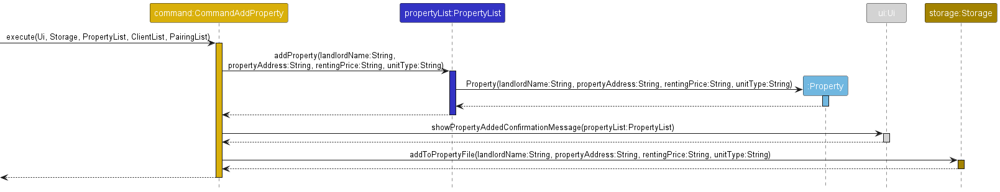
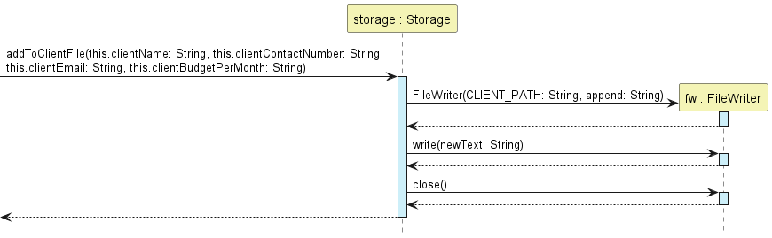

# Property Rental Manager - Developer Guide
* [Acknowledgements](#acknowledgements)
* [Setting Up and Getting Started](#setting-up-and-getting-started)
* [Design](#design)
  * [List Component](#list-component)
  * [Pairing Component](#pairing-component)
  * [Storage Component](#storage-component)
* [Implementation](#implementation)
  * [Add Feature](#add-feature)
  * [Delete Client/Property Feature](#delete-clientproperty-feature)
  * [Pairing and Unpairing Features](#pairing-and-unpairing-features)
  * [Storage Feature](#storage-feature)
  * [List Feature](#list-feature)
* [Appendix A: Product Scope](#appendix-a-product-scope)
* [Appendix B: User Stories](#appendix-b-user-stories)
* [Appendix C: Non Functional Requirement (NFR)](#appendix-c-non-functional-requirements)
* [Appendix D: Glossary](#appendix-d-glossary)
* [Appendix E: Instructions for Manual Testing](#appendix-e-instructions-for-manual-testing)
___
## Acknowledgements
* [AddressBook Level-3](https://github.com/se-edu/addressbook-level3) 
___
## Setting Up and Getting Started
1. Ensure that you have Java 11 or above installed.
2. Download the latest version of `PropertyRentalManager.jar` from [here](https://github.com/AY2223S1-CS2113-F11-1/tp/releases).
3. Put the JAR file into an empty folder.
4. Open a command window and change the current working directory to the directory that the JAR file is located in using
   following command:
```
cd [PATH_TO_JAR_DIRECTORY]
```
5. Run Property Rental Manager
```
java -jar PropertyRentalManager.jar
```
___
## Design

### List Component
The list feature has the following commands in it -
* `list -client` This lists every client, along with all their information
* `list -property` This lists every property, along with all its information
* `list -everything` This lists everything about both clients and properties
* `list -client TAG` This lists only the information present in the TAG for every client. The types of
  TAGs are -
    * `c/` This is for contact number
    * `b/` This is for budget
    * `n/` This is for name
    * `e/` This is for e-mail
    * `-short` This is for the shorthand version(displays just name and budget)
* `list -property TAG` This lists only the information present in the TAG for every property. The types
  of TAG are -
    * `a/` This is for address
    * `n/` This is for name
    * `p/` This is for price
    * `t/` This is for unit type
    * `-short` This is for the shorthand version(displays address, price and unit type)
* `list -pair` This lists all clients and properties that have been paired, in no particular order.
* `list -pair -short` This lists the -short version of all clients and properties that have been paired, in 
no particular order

There are 7 different classes, which each inherit from the Command class, and work in similar ways - 
* They are executed when an object is created in the corresponding Parse class.
* On execution, they read information about a single client or property and send it to the corresponding 
display function in Ui
* The Ui function then displays the necessary information.
* Finally, it states the number of items present, and the Command object is no longer used.


---  

### Pairing Component
API: [`pairingList.java`](../src/main/java/seedu/duke/PairingList.java)

* `PairingList` is responsible for recording which clients renting which property.
* `PairingList` does not inherit from other classes. It stores references to `Client` and `Property` objects.

Here is how classes involved in the pairing/unpairing actions interact with each other:


1. `PairParser` and `UnpairParser` inherit from a general `PairUnpairParser`, which contains parsing methods that are 
    common to its subclasses.
2. `PairParser` and `UnpairParser` are responsible for checking input format. After (successful) checking, they create 
    `CommandPair` and `CommandUnpair` objects respectively.
3. `CommandPair` and `CommandUnpair` contain references to `ClientList` and `PropertyList` because the command classes
    need to validate user input against the data `ClientList` and `PropertyList`.
4. After input is validated, `PairingList` is updated with the new pairings. `Storage` records these changes and `Ui` 
    prints the confirmation message for the user action.


Here is the underlying data structure of `PairingList`:


* `PairingList` is essentially a "wrapper" to the underlying `HashMap` with key-value pairs where the `Client` is the key and `Property` is the value.
* `PairingList` provides methods to add or delete these key-value pairs to represent the pairing and unpairing of real-life
    clients and properties.
* The `Client` and `Property` references must be present in `ClientList` and `PropertyList` as well, since `PairingList` is an
    implementation of an adjacency list. 

---
### Storage Component
For `Storage` feature:


The Storage class is a superclass itself that is not inherit from other class. This class is responsible for managing 
three different text file:
- `client.txt` - Stores the client that is in the Client ArrayList.
- `property.txt` - Stores the property that is in the Property ArrayList.
- `pairing.txt` - Stores the relationship between a client and property which is stored in the Pairing hashmap.


It has an association with other class which includes:
- CommandAddProperty
- CommandAddClient
- CommandDeleteProperty
- CommandDeleteClient
- CommandPair
- CommandUnpair

Since the arraylist changes by **adding** and **deleting** operations while hashmap changes by **pair** and **unpair** 
operations, the text files will be updated when `add`, `delete`, `pair` or `unpair` is invoked.

___
## Implementation

This section describes the implementation details of the features within Property Rental Manager.

---
### Add Feature
The add feature simply adds an entity to its corresponding list. For Property Rental Manager, there are two variations to the add feature, namely `add -client` and `add -property`.

- `add -client`: Add a new client to the client list.
- `add -property`: Add a new property to the property list.

The implementation of add feature can be simplified into two major sections. The first section involves the parsing and validation of relevant information provided by the user while the second section comprises the actual addition of client/property to the client list/property list.

<br/>

**Section 1: Parse and Validation of Information**

The first section is facilitated by the following classes:

- `ParseAdd`: Contains common methods used by `ParseAddClient` and `ParseAddProperty`.
- `ParseAddClient`: Extracts and validates client information from `commandDescription`(User Input).
- `ParseAddProperty`: Extracts and validates property information from `commandDescription`(User Input).

The following is a simple class diagram of the three classes:
<p align="center">


</p>

<p align="center">
Parse Add Related Classes Diagram
</p>

As shown above, both `ParseAddClient` and `ParseAddProperty` classes have a similar core method called `parseCommand()` which is responsible for client or property detail extraction and validation. The rest of the methods in both classes are sub-methods of the `parseCommand()` method.

Also, most of the sub-methods are used to perform validations on the extracted details. Most of them are implemented via regex pattern checker.

- Client:
    - `checkForValidSingaporeContactNumber(String)`
    - `checkForValidEmail(String)`
    - `checkForBudgetNumberFormat(String)`
    - `checkForDuplicateClient(ClientList, ArrayList<String>)`
- Property:
    - `checkForValidSingaporeAddress(String)`
    - `checkForValidSingaporeLandedPropertyAddress(String)`
    - `checkForValidSingaporeBuildingAddress(String)`
    - `checkForPriceNumberFormat(String)`
    - `checkForValidUnitType(String)`
    - `checkForValidAddressFormatUnitTypeMatching(String, String)`
    - `checkForDuplicateProperty(PropertyList, String)`
- Common:
    - `checkForEmptyDetails(String)`: Checks for any missing essential details, non-essential detail such as optional email can be empty.

Note: Since the target user is a property manager working in Singapore, some validations are tailored to Singapore context.

<br/>

**Section 2: Addition of client or property to client list or property list**

The second section is facilitated by the following classes: 
- `CommandAdd`: Abstract superclass of `CommandAddClient` and `CommandAddProperty` classes.
- `CommandAddClient`: Creates a `Client` object and add it to the `clientList`.
- `CommandAddProerty`: Creates a `Property` object and add it to the `propertyList`.

The following is a simple class diagram of the three classes:

<p align="center">


</p>

<p align="center">
Command Add Related Classes Diagram
</p>


As shown above, both `CommandAddClient` and `CommandAddProperty` classes have a similar core method called `execute(...)` which is responsible for the new client or property addition into their respective lists.

<br/>

**Example Scenario**

Given below is an example scenario on how add client/property behaves at each step.


- **Step 1**: The user executes ```add -client n/NAME c/CONTACT_NUMBER e/EMAIL b/BUDGET_MONTH``` or ```add -property n/NAME a/ADDRESS p/PRICE t/TYPE```. Depending on `add -client` or `add -property` specified, a `Parser` object of type `ParseAddClient` or `ParseAddProperty` is created.


- **Step 2**: The `Parser` object will then call method `ParseAddClient#parseCommand()` or `ParseAddProperty#parseCommand()` which will check for any incorrect formatting before the extraction and validation of client/property details.


- **Step 3**: If there is no error, a `Command` object of type `CommandAddClient` or `CommandAddProperty` is created.


- **Step 4**: Next, the `Command` object will then call method `CommandAddClient#execute(...)` or `CommandAddProperty#execute(...)` which will add a new `Client` or `Property` type object created into their respective `clientList`/`propertyList`.


- **Step 5**: Lastly, method `Ui#showClientAddedConfirmationMessage()` or `Ui#showPropertyAddedConfirmationMessage()` is called to notify user about the successful addition of new client or property. Also, method `Storage#addToClientFile` or `Storage#addToPropertyFile` is called to update their respective storage files.

The following are simplified sequence diagrams of add feature for client and property:

<p align="center">
Add Client Sequence Diagram
</p>


<p align="center">
Add Property Sequence Diagram
</p>

---

### Delete Client/Property feature
The **delete client/property** mechanism involves the following classes: ```ParseDeleteClient```,
```ParseDeleteProperty```, ```CommandDeleteClient```, ```CommandDeleteProperty```,
```ClientList```, ```PropertyList``` and ```PairingList```.

Given below is an example usage scenario and how the delete client/property behaves at each step.

**Step 1:** The user executes ```delete -client ic/INDEX``` or ```delete -property ip/INDEX```.
The ```ParseDeleteClient``` or ```ParseDeleteProperty``` class is called respectively and the format of the user
input is checked for any incorrect formatting.

**Step 2:** If there are no errors, ```CommandDeleteClient``` or ```CommandDeleteProperty``` is called respectively.
The ```CommandDeleteClient#execute()``` or ```CommandDeleteProperty#execute()``` method is then called.

**Step 3:** The ```ClientList#deleteClient()``` or ```PropertyList#deleteProperty()``` method is called which 
removes the Client or Property with that specific index from their respective ArrayList.

**Step 4:** Any pairings involving that specific Client or Property is also deleted using the
```pairingList#deletePairing()``` method. A message showing all the deleted pairs is shown to the user.

**Step 5:** The corresponding line(s) in the respective files are deleted. The method is shown in the Storage
Implementation section.

The following *class diagram* shows all the classes involved in the **delete client/property** operation
and their relationships.


The following *sequence diagram* shows how the **delete client** operation works, showcasing the
```ClientList#deleteClient()``` method.


The following *sequence diagram* shows how the **delete property** operation works, showcasing the
```PropertyList#deleteProperty()``` method.


---

### Pairing and Unpairing Features

`PairingList` facilitates pair and unpair commands by storing client-property pairs.

When a client rents a property, the client and property form a pair.

* `PairingList` uses a hash map to represent these client-property pairs, where the key is a `Client` object
  and the value is a `Property` object.
* A hash map is chosen due to its constant time lookup performance, making it efficient at querying the property that a
  client is renting.
* Also, the `java.util.HashMap` prevents duplicate keys, which dovetails nicely with the fact that real-life tenants(clients) only have
  one place of residence at any time.

#### Pair Feature

The partial sequence diagram for the pair command, when called from `Duke.java`, is shown below:


**NOTE**: Self-invocations have been omitted to emphasise inter-object method calls.

The pair command takes in user input of the format:
```
pair ip/PROPERTY_INDEX ic/CLIENT_INDEX
```
where `PROPERTY_INDEX` and `CLIENT_INDEX` must be positive integers which are indexes present in `ClientList`
and `PropertyList`, if their arrays were 1-indexed.

How the pair command works:
1. The user input is first parsed by `Parser` (specifically, `PairParser`).
2. `PairParser` checks the user input for formatting mistakes such as missing flags, wrong flag order and non-integers.
3. After a successful check, a `CommandPair` object is created.
4. When `CommandPair` is executed, there are more checks to validate the parsed input against data from `PropertyList` and
    `ClientList`. These checks throw exceptions when the user inputs list indexes which are not within `PropertyList` or `ClientList`.
5. After passing all these checks, the program fetches the desired `Property` and `Client` objects from
   `PropertyList` and `ClientList`.
6. A third layer of checks throws exceptions if the `Client` and `Property` objects already match an existing pair, the
    `Client` is already paired with some other `Property`, or when the user pairs a client whose budget is lower than the property's rental price.
7. The `Client` and `Property` objects are inserted as a pair into the hashmap of `PairingList`.
 
#### Unpair Feature

The unpair command takes in user input of the format:
```
unpair ip/PROPERTY_INDEX ic/CLIENT_INDEX
```
where `PROPERTY_INDEX` and `CLIENT_INDEX` must be positive integers which are indexes present in `ClientList`
and `PropertyList`, if their private arrays were 1-indexed.

(The sequence diagram for unpair is not provided as the mechanism is similar to that of [Pair](#pair-feature))

How the unpair command works :
1. The user input for an unpair command is first parsed by `Parser` (specifically, `UnpairParser`).
2. `UnpairParser` checks the user input for formatting mistakes such as missing flags, wrong flag order and non-integers.
3. After a successful check, a `CommandUnpair` object is created.
4. When `CommandUnpair` is executed, there are more checks to validate the parsed input against data from `PropertyList` and
   `ClientList`. These checks throw exceptions when the user inputs list indexes which are not within `PropertyList` or `ClientList`.
5. After passing all these checks, the program fetches the desired `Property` and `Client` objects from
   `PropertyList` and `ClientList`.
6. A third layer of checks throws exceptions if the `Client` and `Property` objects are not in an existing pair.
7. The `Client`-`Property` pair is deleted from the hashmap of `PairingList`.

---
### Find Feature

The find command takes in an input from the user in the following format:
```
find -client f/<QUERY_TEXT>
find -property f/<QUERY_TEXT>
```
where `QUERY_TEXT` refers to the text that will be searched through the Client List when the user indicates `-client` and Property List when the user indicates `-property`.

The sequence diagram for both find client and find property is as shown below:


The program will iterate through all the entities to search for any matches with the query text. 

For clients, it will identify if the query text matches:
- Name
- Contact Number
- Email
- Budget

For properties, it will identify if the query text matches:
- Landlord Name
- Address
- Rental Price
- Unit Type

For example, if a query text is "Ken" and the address is "Kent Ridge", it will be identified as a match since the word is contained within part of the address.

Upon identifying a match, the program will print out the message to the console providing the full details, inclusive of their respective index number. This is to help facilitate other commands such as pairing or checking.
---

### Storage Feature

The implementation of Storage class requires consists of different level of operations:

- Load Files
- Append to File
- Update to File

#### Load Files:

At the file loading level, it comprises checks to verify the directory is created. This is done by invoking a method: 
`loadFiles(hasDirectory, hasPropertyFile, hasClientFile, hasPairingFile, clientList, propertyList, pairingList)`.
This method would conduct the following operations:
- Create a `data` directory if not already exist. (`hasDirectory` is `false`)
- Load Clients into Client ArrayList if `hasClientFile` is `true`.
- Load Properties into Property ArrayList if `hasPropertyFile` is `true`.
- Load Pairings into Pairing HashMap if `hasPairingFile` is `true`.

An empty file would not be loaded into the ArrayList and PropertyList as the code is designed to read for `next()`.
An empty file would invoke a `false` in `hasNext()`, thus adding operation would not continue. The overall operation can
be visualised in the flowchart above.

#### Append To File
When file is appended into the text file, it's being stored in different formats as shown below:

- Client:  `NAME | CONTACT_NUMBER | EMAIL <optional> | BUDGET` 
- Property: `NAME | ADDRESS | RENTAL_PRICE | UNIT_TYPE` 
- Pairing: `[CLIENT_FORMAT] : [PROPERTY_FORMAT]` 

The text file of which Client, Property and Pairing is being stored is `client.txt`, `property.txt` and `pairing.txt` 
respectively.




The three sequence diagram above shows the sequence of which the append operation is being invoked. All three
operations are similar in operations but are invoked with different `parameter` and `path`.

### Update To File
The update operation happens when entries in ClientList and PropertyList is being deleted and entries the hash map of 
PairingList is being removed.

The sequence diagram of `updateClient`, `updateProperty` and `updatePair` can be seen below:


Note that when delete operation is being invoked on client and property, the `updatePair` method will also be invoked to
prevent entries retaining within pairingList after it has been deleted from clientList or propertyList.

---

### List feature

There are 3 main steps whenever a list command needs to be executed
* When the user enters any command, it first needs be understood. That is handled by the ParseManager class.
   Next, when the first word entered by the user is determined to be `list`, ParseManager itself then determines
   the type of list command entered, including the tags. ParseListClient, ParseListProperty and ParseListEverything
   are checkers to ensure that a valid command has been entered. ParseListClient and ParseListProperty also determine
   if tags have been entered, and if those tags are valid.
  ```
        case COMMAND_LIST:
            ArrayList<String> listCommandTypeAndFlags = getListCommandType(commandDetail);
            boolean isListProperty = listCommandTypeAndFlags.get(0).trim().equals(PROPERTY_FLAG);
            boolean isListClient = listCommandTypeAndFlags.get(0).equals(CLIENT_FLAG);
            boolean isListEverything = listCommandTypeAndFlags.get(0).equals(EVERYTHING_FLAG);
            if (isListProperty) {
                return new ParseListProperty(listCommandTypeAndFlags.get(1));
            } else if (isListClient) {
                return new ParseListClient(listCommandTypeAndFlags.get(1));
            } else if (isListEverything && listCommandTypeAndFlags.get(1).isEmpty()) {
                return new ParseListEverything();
            } else {
                throw new UndefinedSubCommandTypeException(MESSAGE_INCORRECT_LIST_DETAILS);
            }
  ```
This block of code is part of ParseManager. It determines the type of list operation(-client, 
-property or -everything) and returns the corresponding object.  
Both ParseListClient and ParseListObject then determine if tags are present, and if they are valid, 
throwing exceptions if any errors are encountered. They then return the corresponding Command type necessary.

* There are five different classes which handle each of the features described above. Each class inherits from the
   abstract Command class, and reads information present in either the PropertyList or ClientList objects respectively.

The execute function retrieves the propertyList holding all the current properties. It then loops 
through every property present. For every property, it passes it to the corresponding display function
in Ui.

* Each of these commands then uses a method present in the Ui class, to print an individual client, or property.
   The loop for printing every single client or property is present in the Command itself.
  
The above is an example for CommandListClients. It reads from ClientList. Then, it displays each line
using the displayOneClient function in Ui.  
The sequence diagram of the operation is as follows - 

___

## Appendix A: Product Scope

### Target user profile
* Property agent who are managing single owner rental units
* has a need to keep track of information of properties that are being put out for rental.
* has a need to keep track of information of clients' (prospective tenants) information.
* is a fast typist
* favors a command-line interface over a Graphic User Interface.

### Value proposition
Aids property agent in tracking information related to the properties and clients (prospective tenants) they manage:
- Record down information of properties (landlord, address, rental price, unit type).
- Record down information of clients (name, contact number, budget), who are looking to rent properties.
- Record down instances where a client decides to rent a property/ stop renting a property.
- View client and property information quickly.

___


## Appendix B: User Stories

| Version | As a ... | I want to ...                         | So that I can ...                                                    |
|---------|----------|---------------------------------------|----------------------------------------------------------------------|
| v1.0    | user     | add properties                        | keep track of properties                                             |
| v1.0    | user     | add clients                           | keep track of clients                                                |
| v1.0    | user     | delete properties                     | prevent properties I am no longer tracking from cluttering my data   |
| v1.0    | user     | delete clients                        | prevent clients I am no longer tracking from cluttering my data      |
| v1.0    | user     | view a list of properties             | find out what and how many properties I manage                       |
| v1.0    | user     | view a list of clients                | find out what and how many clients I manage                          |
| v1.0    | user     | check the details of a property       | view the property's information                                      |
| v1.0    | user     | pair a client to a property           | record down which client is renting which property                   |
| v1.0    | user     | unpair a client to a property         | update my rental records when a client is no longer renting property |
| v1.0    | user     | save my data                          | used the data created from a previous use of the app                 |
| v1.0    | user     | quit the app                          | free up memory for other applications                                |
| v2.0    | user     | check the details of a client         | view the client's information                                        |
| v2.0    | user     | search clients using their details    | easily find specific clients                                         |
| v2.0    | user     | search properties using their details | easily find specific properties                                      |

---

## Appendix C: Non-Functional Requirements
1. Should work on any Windows, Linux and MacOS that has Java `11` or above installed.
2. The system should respond to the user input within 2 seconds.
3. The system adheres to stict user input formatting to prevent corruption of data.
4. The system is programmed to recognise only English text. Any other language might not be recognised by the program.
5. The system stores the data in the text file in the data directory. Any deletion of the file would result in the loss of data.
6. This system is contrained under a single user. Multiple users are not supported

---
## Appendix D: Glossary

* *client* - Person who is seeking for property to rent

---
## Appendix E: Instructions for Manual Testing

### Launch
1. Download the JAR file and move it into an empty folder.
2. On a command line application, change the current working directory to the same folder as the JAR file and run the app using:
```
java -jar PropertyRentalManager.jar
```
3. Expected: The app's welcome message is printed onto the terminal. 
    
### Add

### Delete

### List

### Pair
1. Successful Pairing
    1. Prerequisites: 
       * Have at least 1 client and 1 property added to the app. 
       * Ensure that the client's budget is higher than or equal to the property's rental price.
       * Ensure that the client and property have **NOT** been paired.
    2. Test case: `pair ip/1 ic/1`

        Expected: Pairing is added. Terminal shows successful pairing message, the name of the paired client, 
        and the address of the paired property.


2. Failed Pairing (budget exceeded)
   1. Prerequisites:
       * Have at least 1 client and 1 property added to the app.
       * Ensure that the client's budget is lower than the property's rental price.
   2. Test case: `pair ip/1 ic/1`
   
       Expected: Terminal shows unsuccessful pairing message, name and budget of client, and the address and rental 
       price of the property.


3. Failed Pairing (client already paired to another property)
   1. Prerequisites:
       * Have at least 1 client and 2 properties added to the app.
       * Ensure that the client's budgets is higher than or equal to the rental prices of both properties.
       * Have paired the client and a property e.g `pair ip/1 ic/1`
   2. Test case: `pair ip/2 ic/1` (pair a different property to the same client)
   
      Expected: Terminal shows unsuccessful pairing message.


4. Failed Pairing (client and property form an existing pairing)
    1. Prerequisites:
        * Have at least 1 client and 1 property added to the app.
        * Ensure that the client's budgets is higher than or equal to the property's rental price.
        * Have paired the client and property e.g `pair ip/1 ic/1`
    2. Test case: `pair ip/1 ic/1` (re-pair using the same indexes)
   
        Expected: Terminal shows unsuccessful pairing message.


### Unpair
1. Successful unpairing:
   1. Prerequisites:
      * Have at least 1 client and 1 property added to the app.
      * Have paired the client and property e.g. `pair ip/1 ic/1`
   2. Test case: `unpair ip/1 ic/1` (unpair using the same indexes as the pair command)
      
       Expected: Pairing is deleted. Terminal shows successful unpairing message showing the client's name and the 
       property address.


2. Failed unpairing (unpairing a property and a client that have not been paired):
   1. Prerequisites:
      * Have at least 1 client and 1 property added to the app.
      * Have **NOT** paired the client and property.
   2. Test case: `unpair ip/1 ic/1`
       
       Expected: Terminal shows unsuccessful pairing message.


### Check

#### Check Property
1. Successful check property
   1. Prerequisites:
      * Have at least 2 clients and 2 properties added to the app.
      * Ensure that all clients have budgets equal to or greater than that of the properties.
      * Pair one of the properties with 2 clients: e.g. input `pair ip/1 ic/1` and `pair ip/1 ic/2`
   2. Test case: `check -property i/1`
      
      Expected: Terminal shows details of the property and information of the clients renting the property. Number of list results is greater than 0.
   3. Test case: `check -property i/2`
      
       Expected: Terminal shows details of the property, number of list results is 0. 
   

2. Failed check property
   1. Test case: `check -property i/0`
   
        Expected: Terminal shows error message.
   
   2. Test case: `check -property i/[INDEX]`, where INDEX is an index that is not in the property list (1-indexed).
   
        Expected: Terminal shows error message.

   3. Test case: `check -property i/1r2342`
   
        Expected: Terminal shows error message.

### Find

1. Querying for Client/Property stored in the Client/Property List:
  
    1. Prerequisites: List the clients using `list -client` command to verify that there is at least 1 client  in the database.
    2. Test case: `find -client f/<QUERY_TEXT>`
        - Enter the name (or part of the name) of the client that is shown in the list for the `<QUERY_TEXT>` portion. Omit the directional brackets when entering query text.
        - Expected: All the clients that matches the entered name is displayed with their respective index shown.
    3. Test case: `find -client f/<QUERY_TEXT>`
        - Enter a random text that does not match with any of the client. Omit the direction brackets when entering query text.
        - Expected: An error message will be displayed stating that there is no client that matches with the queried text.
    4. Test case: `find -client n/ f/`
        - Expected: An error message will be displayed indicating that there should only be 1 flag and the flag should be `f/`
    5. Test case: `find -client`
        - Expected: An error message will be displayed indicating that the tag is missing.
    6. Test case: `find -property f/<QUERY_TEXT>`
        - Enter the address (or part of an address) of the property that is in the list for the `<QUERY_TEXT>` portion. Omit the directional brackets when entering the query text.
        - Expected: All the property that matches the address will be displayed along with their respective index.
    7. Test case: `find -property f/<NON_EXISTENT_QUERY_TEXT>`
        - Enter a random text, that is not in the property list. Omit the directional bracket when entering the text.
        - Expected: A message stating that no property matches the text will be displayed.
    8. Test case: `find -property t/3-Room f/`
        - Expected: An error message will be displayed showing that there should only be one tag and the tag should be `f/`.
    9. Test case: `find -property`
        - Expected: An error stating that the tag is missing will be shown.
    10. Any other tags displayed after the `f/` tag will not be flagged as an error since it's possible that names contains a forward slash (/).
    
### Storage

## Instructions for manual testing


### Finding for Client/Property:
1. Querying for Client/Property stored in the Client/Property List:
  
    1. Prerequisites: List the clients using `list -client` command to verify that there is at least 1 client  in the database.
    2. Test case: `find -client f/<QUERY_TEXT>`
        - Enter the name (or part of the name) of the client that is shown in the list for the `<QUERY_TEXT>` portion. Omit the directional brackets when entering query text.
        - Expected: All the clients that matches the entered name is displayed with their respective index shown.
    3. Test case: `find -client f/<QUERY_TEXT>`
        - Enter a random text that does not match with any of the client. Omit the direction brackets when entering query text.
        - Expected: An error message will be displayed stating that there is no client that matches with the queried text.
    4. Test case: `find -client n/ f/`
        - Expected: An error message will be displayed indicating that there should only be 1 flag and the flag should be `f/`
    5. Test case: `find -client`
        - Expected: An error message will be displayed indicating that the tag is missing.
    6. Test case: `find -property f/<QUERY_TEXT>`
        - Enter the address (or part of an address) of the property that is in the list for the `<QUERY_TEXT>` portion. Omit the directional brackets when entering the query text.
        - Expected: All the property that matches the address will be displayed along with their respective index.
    7. Test case: `find -property f/<NON_EXISTENT_QUERY_TEXT>`
        - Enter a random text, that is not in the property list. Omit the directional bracket when entering the text.
        - Expected: A message stating that no property matches the text will be displayed.
    8. Test case: `find -property t/3-Room f/`
        - Expected: An error message will be displayed showing that there should only be one tag and the tag should be `f/`.
    9. Test case: `find -property`
        - Expected: An error stating that the tag is missing will be shown.
    10. Any other tags displayed after the `f/` tag will not be flagged as an error since it's possible that names contains a forward slash (/).
    
### Quit

