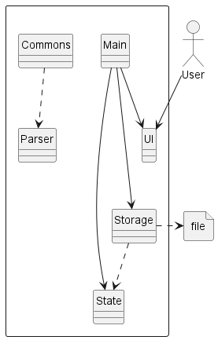

# Developer Guide
The aim of this guide is to help readers understand how the system and components of RecipEditor 
is designed, implemented and tested. This developer guide also serves to help 
developers to understand the architecture of RecipEditor and some design considerations. 
Click to view the latest release of [RecipEditor]((https://github.com/AY2223S1-CS2113-T18-2/tp/releases)).

## Content page
[Acknowledgements](#acknowledgements)

[Design](#design)
- [Architecture](#architecture)
- [Logic Component](#logic-component)
- [Ui Component](#ui-component)
- [Storage Component](#storage-component)
- [Command Component](#command-component)
- [Recipe Module](#recipe-module)
- [Edit Component](#edit-component)
- [GUI Component](#gui-component)
- [Implementation](#implementation)
    - [Loading Of Data On Startup](#loading-of-data-on-startup)
    - [Parsing of Commands](#parsing-of-commands)
    - [Add a New Recipe](#add-recipe)
    - [Edit an Existing Recipe](#add-an-existing-recipe)
    - [Find Recipe Based on Recipe Name and Ingredient](#find-recipe-based-on-recipe-name-and-ingredient)
- [Product Scope](#product-scope)
    - [Target User Profile](#target-user-profile)
    - [Value Proposition](#value-proposition)
- [User Stories](#user-stories)

## Acknowledgements

### External Libraries
- org.apache.commons:commons-lang3:3.0 [link](https://mvnrepository.com/artifact/org.apache.commons/commons-lang3/3.0)
- org.apiguardian:apiguardian-api:1.1.0 [link](https://mvnrepository.com/artifact/org.apiguardian/apiguardian-api)

## Design
### Architecture

  

`Recipeditor` calls to various class a perform all the tasks assigned by the user.

- `Ui`: handles interactions with users, including printing and reading
- `Storage`: manages the storage of the list of recipes
- `Command`: instructs the current task to perform
- `CommandResult`: explains the outcome of each command performed
- `Parser`: interprets the user input into different commands

#### Software running flow:

Upon start, Recipeditor will check load or create saves.

During software run, it will repeat iterations of reading and executing commands.
In each iteration,raw user inputs are read from CLI. They will be
interpreted into commands for the software to execute.
Each execution will either write or read the list of recipes
depending on the command. Finally, the result of current iteration
is reflected to the user.

Termination of software purges all temporary data, while saved changes
can be loaded from saves upon next software launch.

### Ui Component
The UI component is responsible for all user interfaces of the application.

  

**API:** `Ui.java`
1. `Ui` takes `CommandResult` as a parameter to show the output message after a command is completed.
2. `AddMode` calls `Recipe` to add new recipe into the list.
3. `AddMode` calls `Ingredient` to parse ingredients according to its name, amount and unit.

### Storage Component
The storage component allows data to be read from and saved to a storage file.

  

**API:** `Storage.java`
1. `Storage` calls `Recipe` when saving data from `RecipeList` to an external storage file.
2. `Storage` calls `RecipeList` when loading recipe data from external storage file to.
3. `Storage` calls `Ui` to show relevant messages to the user.

The external storage file contains:
- Recipe Name
- Recipe Description
- Recipe Ingredients (name, amount, unit)
- Recipe Steps

### Command Component
The command component features a list of commands falls under `Command`,
identified from user input for the software to carry out certain tasks.
A `CommandResult` is returned from `execute()` method call of each `Command`.
The `CommandResult` consists of a single error message in `String`.

  

Each subclass of `Command` has their own attributes and `CommandResult`
from `Execute` method, allowing them to perform respective tasks.

All types of`Command`and their functionalities are explained below:

`AddCommand`: Add a valid `Recipe` to `RecipeList`, otherwise shows error message
for `invalid Recipe`

`DeleteCommand`: Remove an existing `Recipe` at a valid index from `RecipeList`,
otherwise show error message on `index out of bound`

`ExitCommand`: Deliver a `CommandResult` to terminate software run.

`InvalidCommand`: Deliver a `CommandResult` of invalid command

`ListCommand`: Print all formatted `Recipe` in `RecipeList` to screen

`ViewCommand`: View an existing `Recipe` at a valid index from `RecipeList`,
otherwise show error message on `index out of bound`

### Recipe Module
The recipe module encapsulates the array, recipe and ingredient objects.

  

**API:** `RecipeList.java`
1. `RecipeList` calls `Recipe` to add, edit or delete recipes

**API:** `Recipe.java`
1. `Recipe` calls `Ingredient` to add, edit or delete ingredients

### Edit Component

  

The edit component consists of three parts:
- Parser
  - Parses the user input, instantiates the EditCommand class
- EditModeCommand
  - Handles the edit functions (Add, Swap, Change, Delete, Invalid)
- EditCommand
  - Instantiated by parser whenever /edit is called, instantiates the flag parser, switches the flow between GUI and CLI,
  handles saving the edited recipe

### GUI Component
When the user type 

## Implementation

### Add new recipe
The following sequence diagram shows the usage of relevant classes when trying
to add a new recipe to storage.

  

Step 1: User will first input a customer `AddCommand`. The user input
is read by `Main` and is parsed by the static method `Parser.parseCommand()`.

Step 2: If `AddCommand` of correct format is parsed, `Parser` will create a new 
instance of `GuiWorkFlow`.

Step 3: When the new instance of `GuiWorkFlow` is constructed, it creates a new
instance of `Editor`, and it calls `enterEditor`. This opens the GUI editor for 
user input of `recipe`.

Step 4: `GuiWorkFlow` will load a template `recipe` to Editor for user to edit on it.

Step 5: `GuiWorkFlow` will keep listening to changes made in the editor and save them to
`Template.txt` in `Storage`. This process loops until user exits the editor manually.

Step 6: `GuiWorkFlow` will create an instance of `TextFileParser` and calls `parseTextToRecipe`
to store the newly added `recipe` in itself.

Step 7: `GuiWorkFlow` checks if the user input of recipe has a valid title, which is not
the same as titles of any existing `recipe` in `Storage`.

Step 8: The content and validity of `recipe` are used to create an instance of `AddCommand`, 
which is returned to `Main` for execution.

Step 9: Upon execution of `AddCommand`, its validity is checked. If the `AddCommand` is valid, 
the `recipe` in it will be written to `RecipeList` and `Storage` successfully. Otherwise, a message
of invalid `AddCommand` will be returned backed to `Main`.

## Product scope
### Target user profile

Target user of the application is avid cook who wants to organize their recipe list for ease of reference and search 

### Value proposition

{Describe the value proposition: what problem does it solve?}

## User Stories

|Version| As a ... | I want to ...                                 | So that I can ...                                                                               |
|--------|---------|-----------------------------------------------|-------------------------------------------------------------------------------------------------|
|v1.0|new user| see usage instructions                        | refer to them when I forget how to use the application                                          |
|v1.0|user| add new recipes                               | store recipes that I need without having to remember everything                                 |
|v1.0|user| delete existing recipes                       | remove recipes that I no longer use so that the list will not be cluttered                      |
|v1.0|user| show all recipes in my list                   | view an overview of what recipes I have added beforehand                                        |
|v1.0|user| show detailed recipe that I specified         | view detailed recipe (name, description, ingredients and steps) of the one that I am interested |
|v1.0|user| exit the application                          | close the entire application                                                                    |
|v2.0|user| find recipe by recipe name or ingredient name | locate a recipe without having to go through the entire list    g                               |

## Non-Functional Requirements

{Give non-functional requirements}

## Glossary

* *glossary item* - Definition

## Instructions for manual testing

{Give instructions on how to do a manual product testing e.g., how to load sample data to be used for testing}
