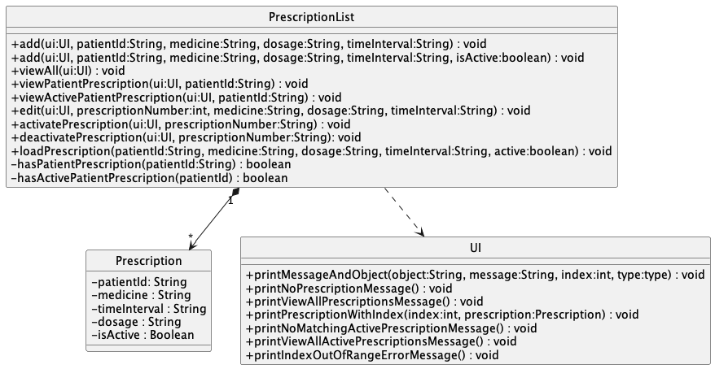
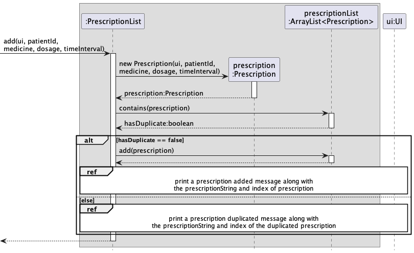

# Developer Guide

## Acknowledgements

Parser class and its functions are largely adapted from Ria's IP and help from regex101 (https://regex101.com/).

Storage class and its functions are largely adapted from Dhanish's IP on Duke.

## Design & implementation

### PatientList Component

The Patient and PatientList classes are used in conjunction to manage patients, and the list of patients. Each patient has a name,
a unique ID, a date of birth and gender. The PatientList class holds an ArrayList of Patients and manipulates them accordingly.

At the start of the program, a new PatientList object is instantiated. Through methods in the Storage class, data is read from the
relevant text files to create Patients that existed prior to the last closure of the program, and then adds these patients to the
ArrayList in PatientList. This finishes the initial set-up.

The above is a summary of the aforementioned process, omitting some commands in the code that has to do with Visits, Prescriptions and UI classes
and related methods.

The `PatientList` Component,
 * stores the list of patients
 * can add new patients to the list
 * can modify the details of patients
 * allows users to view all patients
 * allows users to find a particular patient given ID

**Important methods in PatientList class:**
* `addPatient` - this method takes in the aforementioned variables through UI class and parses them. If they are all valid, a new
`Patient` is created and added to the list of `Patient`s in PatientList.
* `findPatient` - this method takes in an `ID`, iterates through the list of Patients and compares the `ID` with the `ID` of each of the
existing `Patient`s in the list. If there is a match, the corresponding `Patient` is returned. Else, returns null.
* `retrievePatient` - this method is very similar to findPatient, but instead of returning the Patient found, it prints out the details
of the `Patient` using the `toString` method in the `Patient` class.
* `listPatients` - this method first checks if the list of `Patient`s is non-empty. If not so, it prints a message that there are
no patients in the system currently and terminates.
Else, it iterates through the list of `Patient`s and uses the `toString` method in `Patient` to print out the details of each `Patient`.
* `modifyPatientDetails` - this method takes in `name`, `birthDate`, `gender` and `ID`. It tries to find the patient with a matching `ID`.
If the `Patient` is not found, returns. Else, if the name is not an empty `String`, replace the existing `name` with the input `name`.
Repeat for `birthDate` and `gender`.

### VisitList Component
The `VisitList` Component,
* stores the list of visits
* can add new visit to the list
* can edit reason for an existing visit in the list
* can delete reason for an existing visit with reason in the list
* can view all visits in the list
* can view all visits for a patient
* can view a specific visit
* depends on `UI` class (as the `VisitList` component interacts with user through the UI component, and makes use of its methods to print details)

**Important Methods in `VisitList` class:**
* `addVisit` - This method allows user to add a visit to the `VisitList` by specifying `id` of patient, `dateOfVisit`, `timeOfVisit` 
and `reason`. `reason` is optional, and it can be left blank, and be modified later on via the `editReason` method.
* `editReason` - This method allows user to edit reason for an existing visit, by specifying `index` of visit and `reason` for visit. `reason` must not be left blank here, 
as it is equivalent to deleting a reason, for which a user should use the `deleteReason` method instead.
* `deleteReason` - This method allows user to delete reason for an existing visit, by specifying `index` of the visit.
* `viewAll` - This method iterates through the list of all visits, and prints each visit record
* `viewPatient` - This method iterates through the list of all visits, and prints the visit records that match the specified `id` of patient
* `viewVisit` - This method iterates through the list of all visits, and prints the visit record that matches the specified `index` of the visit

**How Adding a new Visit into the VisitList Works**

1. `VisitList` is first called to add a new visit with the required details. This calls the constructor class of `Visit` class to create an instance of `Visit`
2. The new visit is then added to the `ArrayList<Visit>`
3. Lastly, the 'UI' class is called, to print a confirmation message that the visit has been added, and prints out the details of this new visit.

### PrescriptionList component
**API**: `PrescriptionList.java`

The `PrescriptionList` component,
* stores the list of prescriptions
* can add new prescription to the list
* can edit existing prescriptions inside the list
* can change the status of prescription inside the list
* can view all prescriptions, view a patient's prescription or view a patient's active prescription 
* depends on `UI` class (because the `PrescriptionList` component needs to interact with user through the `UI` 
component)

**Methods in `PrescriptionList` class:**

* **`add`** - This method allow user to add prescription into the list by specifying `patientId`, `medicine`, `dosage` and 
`timeInterval`.
* **`viewAll`** - This methods iterates through the list of all prescriptions and print the details of prescriptions from
all patients.
* **`viewPatientPrescription`** - This method iterates through the list of prescriptions and print the details of 
prescriptions from the specified `patientId`.
* **`viewActivePatientPrescription`** - This method iterates through the list of prescriptions and print the details of
all active prescriptions with the specified `patientId`
* **`edit`** - This method allows user to edit the `medicine`, `dosage` or `timeInterval` of the prescription of the 
specified index
* **`activatePrescription`** - This method allows user to set the prescription of specified index as active.
* **`deactivatePrescription`** - This method allows user to set the prescription of specified index as inactive.

**Members in `Prescription` class**

* `medicine` - Stores the medicine name
* `timeInterval` - The time Interval the medicine is taken between
* `patientId` - The identification number of patient 
* `dosage` 
* `isActive` - Whether is the prescription currently active or not

How adding a new prescription into the list works:

1. When `PrescriptionList` is called to add a new prescription with the given details, it calls the constructor of the 
`Prescription` class to create the `Prescription` instance.
2. The new prescription is then added to the `ArrayList<Prescription>`
3. Lastly, `UI` prints an acknowledge message of what the new prescription has.

How activating/deactivating an existing prescription in the list works:

1. When `activate(ui, 1)` initiates an action in the `PrescriptionList`, it transfer the prescriptionNumber `1` into
the index in the array.
2. It gets the `prescriptionEdited` from the `ArrayList<>` with the resolved index.
3. Then, the `prescriptionEdited` is set active.
4. Lastly, `UI` prints an acknowledge message of the most updated details of the prescription.

## Product scope
### Target user profile

Our target user profile is a doctor in need of quick access to information about his/her patients, visits, and
prescriptions. The doctor can quickly see all of the prescriptions that have been given, when a patient has visited, 
what their reasons were, etc. through this interface. The doctor can also quickly update this before, during, or after
each visit and prescription to ensure that it stays up to date and easy-to-use.

### Value proposition

Doctors tend to use sticky notes or quick pieces of paper to jot down notes such as prescriptions, reason for visit, etc.
This platform allows a doctor to quickly reference basic information about a patient, find their previous prescriptions
and visits, and look at the history to make a decision. A doctor can mark a prescription as active or inactive, allowing
a consistent history. Moreover, the only part of these records that a doctor can delete is a reason, ensuring continuity
of information.

## User Stories

| Version | As a ...    | I want to ...                                               | So that I can ...                                                                   |
|---------|-------------|-------------------------------------------------------------|-------------------------------------------------------------------------------------|
| v1.0    | user        | exit the program                                            | leave the program without damage                                                    |
| v1.0    | doctor/user | add a new patient                                           | have the patient record saved to the list of patients                               |
| v1.0    | doctor/user | see all patients                                            | see all the patients that are saved in the program i.e. are treated by me           |
| v1.0    | doctor/user | see all the information about a patient                     | refer to them to see all the patients that are being treated by me                  |
| v1.0    | doctor/user | edit a patients record                                      | change his record to reflect changes in the patient                                 |
| v1.0    | doctor/user | add a patient visitation record                             | refer later on for future care for the patient                                      |
| v1.0    | doctor/user | add a reason for visit to the existing record               | have on record the reason the patient came for treatment for future use             |
| v1.0    | doctor/user | edit a patient visitation record                            | change the visit information in case error was entered                              |
| v1.0    | doctor/user | add new prescription for a patient                          | add a new prescription for treatment for the patient                                |
| v1.0    | doctor/user | edit a prescription                                         | changes a prescription in case of a change in treatment or error in the current one |
| v1.0    | doctor/user | view list of existing prescriptions for a patient           | refer to them for future patient treatments                                         |
| v2.0    | doctor/user | view information for patient specific visit                 | refer to the visit in case i want to reflect on the visit                           |
| v2.0    | doctor/user | view all patients visit                                     | see the patient and where treated and are on record                                 |
| v2.0    | doctor/user | view list of all existing prescriptions for all of patients | see which prescription the patient was ever prescribed                              |
| v2.0    | doctor/user | view list of all active prescriptions for all of patients   | see which prescription the patient is currently taking                              |
| v2.0    | doctor/user | change a prescription status to active                      | have on record that the patient is currently taking the prescription                |
| v2.0    | doctor/user | change a prescription status to inactive                    | have on record that the patient is currently not taking the prescription            |

|v2.0|user|find a to-do item by name|locate a to-do without having to go through the entire list|

## Non-Functional Requirements

### Parser

The parsing class utilizes regex for each of the commands for two main reasons: usability and error-catching.

For usability, the input is automatically separated into distinct groups through the Java regex library, which allows
input such as ID, name, etc. to be pulled out in multi-word or one word parts.

For error-catching, the input is checked to be in a certain format (i.e. DOB is DD-MM-YYYY)
or of a certain type (i.e. the ID is one word made up of letters and numbers).

If there is an error, the regex also helps with identifying the exact error issue, and
sending that back to the user.

For example: the `add` command for `Patient`

`To add a patient: add n/[name] g/[M/F] d/[DOB] i/[ID]`
* n/ checks for one or two words to store as the name
* g/ checks for one letter indicating male or female
* d/ checks for date of birth formatted as (DD-MM-YYY)
* i/ checks for a single ID containing numbers or letters

### Index Reference

We utilize both ID and index reference in this tP, which may look confusing at first.
Indices for visit and prescription are unique when created, and can be found when adding, editing, or viewing
a visit or prescription. If you want to find a visit, you can search for a patient's visits through viewPatient in the
visit menu, and then use the given index of the visit you find to edit it. The same workflow applies for prescription.

## Glossary

* *patient* - A single individual with a unique ID
* *visit* - A single visit of one existing patient on a specific date and time
* *prescription* - A single prescription of one existing patient, either inactive if it has been updated
* or active based on in the patient has been using it or if a new record has replaced it

## Instructions for manual testing

To load sample data, please reference the following formats:

`patient.txt`: Name | DOB | G | ID
- Example: Jane Doe | 09-09-1978 | F | T1

`visit.txt`: ID | Reason | Date | Time
- Example: T1 | checkup | 08-11-2022 | 08:00

`prescription.txt`: ID | Name | Dosage | Time Interval | Active Status (True or False)
- Example: T2 | penicillin | 1 tablet | every 3 days | T

