# MoneyGoWhere: Developer Guide

<p align="center"></p>

## Contents
* [Introduction](#introduction)
* [Acknowledgements](#acknowledgements)
* [Getting Started](#getting-started)
* [Design](#design)
    * [Software Architecture](#software-architecture)
    * [Core Components](#core-components)
    * [Component Interactions](#component-interactions)
    * [Common Component](#common-component)
    * [Exceptions Component](#exceptions-component)
    * [UserInterface Component](#userinterface-component)
    * [Parser Component](#parser-component)
    * [Commands Component](#commands-component)
    * [Data Component](#data-component)
    * [Storage Component](#storage-component)
    * [API Component](#api-component)
    * [Logger Component](#logger-component)
* [Implementation](#implementation)
    * [Loading Data to File](#loading-data-from-file)
    * [Saving Data to File](#saving-data-to-file)
    * [Printing an expense](#printing-an-expense)
    * [Adding an Expense: `Add-Expense`](#adding-an-expense-add-expense)
    * [Viewing an Expense: `View-Expense`](#viewing-an-expense-view-expense)
    * [Deleting an Expense: `Delete-Expense`](#deleting-an-expense-delete-expense)
    * [Editing an Expense: `Edit-Expense`](#editing-an-expense-edit-expense)
    * [Sorting Expenses: `Sort-Expense`](#sorting-expenses-sort-expense)
    * [Converting currency: `Convert-Currency`](#converting-currencies-convert-currency)
    * [Printing a Recurring Payment](#printing-a-recurring-payment)
    * [Adding a Recurring Payment: `Add-RecurringPayment`](#adding-a-recurring-payment-add-recurringpayment)
    * [Viewing a Recurring Payment: `View-RecurringPayment`](#viewing-a-recurring-payment-view-recurringpayment)
    * [Deleting a Recurring Payment: `Delete-RecurringPayment`](#deleting-a-recurring-payment-delete-recurringpayment)
    * [Editing a Recurring Payment: `Edit-RecurringPayment`](#editing-a-recurring-payment-edit-recurringpayment)
    * [Adding an Expense from a Recurring Payment: `Pay-RecurringPayment`](#adding-an-expense-from-a-recurring-payment-pay-recurringpayment)
    * [Printing an Income](#printing-an-income)
    * [Adding an Income: `Add-Income`](#adding-an-income-add-income)
    * [Viewing an Income: `View-Income`](#viewing-an-income-view-income)
    * [Deleting an Income: `Delete-Income`](#deleting-an-income-delete-income)
    * [Editing an Income: `Edit-Income`](#editing-an-income-edit-income)
    * [Printing a Target](#printing-a-target)
    * [Adding a Target: `Add-Target`](#adding-a-target-add-target)
    * [Viewing a Target: `View-Target`](#viewing-a-target-view-target)
    * [Deleting a Target: `Delete-Target`](#deleting-a-target-delete-target)
    * [Editing a Target: `Edit-Target`](#editing-a-target-edit-target)
    * [Merging a data file: `Merge-File`](#merging-a-data-file-merge-file)
* [Product Scope](#product-scope)
    * [Target User Profile](#target-user-profile)
    * [Value Proposition](#value-proposition)
* [User Stories](#user-stories)
* [Non-Functional Requirements](#non-functional-requirements)
* [Glossary](#glossary)
* [Manual Testing](#manual-testing)

<div style="page-break-after: always;"></div>

## Introduction

MoneyGoWhere is a financial tracker designed to help computing professionals manage their finances.
This developer guide explains the design considerations and implementation details required for future developers to work on MoneyGoWhere.

## Acknowledgements

We would like to acknowledge the following sources from which our team has referenced during the development of MoneyGoWhere:
* AddressBook-Level3's User Guide and Developer Guide ([Website](https://se-education.org/addressbook-level3/))
* Apache Commons CLI Library ([Website](https://commons.apache.org/proper/commons-cli/))
* Apache Commons Text Library ([Website](https://commons.apache.org/proper/commons-text/))

<div style="page-break-after: always;"></div>

## Getting Started

Our team developed this program using Java JDK 11 and Intellij IDEA.
The following steps will guide you through the setup process to get your development environment up and running.
1. Install JDK 11.
2. Install Intellij IDEA.
3. Fork the [MoneyGoWhere](https://github.com/AY2223S1-CS2113T-W11-1/tp) repository and clone it to your system.
4. Launch Intellij IDEA and open the repository you have cloned.
5. Navigate to `File > Project Structure > Project Settings > Project` and set `SDK` to `11`.
6. Verify the setup process by running `MoneyGoWhere#main()`.
   You should see the following greeting message if the project setup is successful:

```
  __  __                         _____   __          ___                   
 |  \/  |                       / ____|  \ \        / / |                  
 | \  / | ___  _ __   ___ _   _| |  __  __\ \  /\  / /| |__   ___ _ __ ___ 
 | |\/| |/ _ \| '_ \ / _ \ | | | | |_ |/ _ \ \/  \/ / | '_ \ / _ \ '__/ _ \
 | |  | | (_) | | | |  __/ |_| | |__| | (_) \  /\  /  | | | |  __/ | |  __/
 |_|  |_|\___/|_| |_|\___|\__, |\_____|\___/ \/  \/   |_| |_|\___|_|  \___|
                           __/ |                                           
                          |___/                                            

Your MoneyGoWhere? Let me help you track it.
```

<div style="page-break-after: always;"></div>

## Design
### Software Architecture
The software architecture diagram below describes the program's design and the interaction between components.

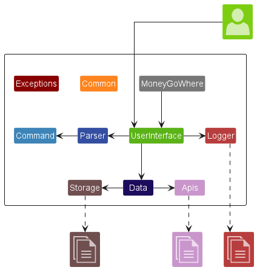

<div style="page-break-after: always;"></div>

### Core Components

| Component     | Function                                                                 |
|---------------|--------------------------------------------------------------------------|
| MoneyGoWhere  | Main entrypoint of the program.                                          |
| Common        | Define various parameters used by the program.                           |
| Exceptions    | Define the exceptions thrown by the program.                             |
| UserInterface | Interface with the user via standard I/O and handle commands.            |
| Parser        | Provide functions to parse inputs read from standard input.              |
| Command       | Define the commands accepted by the program along with its arguments.    |
| Data          | Defines classes to store data and provides functions to operate on data. |
| Storage       | Provide functions to save and load data.                                 |
| API           | Provide functions to interact with external APIs.                        |
| Logger        | Provide functions to log user actions and the program's behaviour.       |

<div style="page-break-after: always;"></div>

### Component Interactions
The sequence diagram below describes the interaction between the various core components when a command is entered.
In this example,
the user launches the program and enters the command `Add-Expense -n Expense -a 7.80` to add an expense with the name `Expense` and the amount `7.80`.
The sequence diagrams referenced by the component interaction diagram can be seen [below](#component-interaction-reference-diagrams).


* When the user launches the program, `MoneyGoWhere` creates an instance of `UserInterface`.
* `UserInterface` creates instances of `Logger` and `Data`.
* `MoneyGoWhere` calls `UserInterface#run()` to start the interface between the program and the user.
* `UserInterface#run()` calls `UserInterface#runLocalStorageLoadFromFile()` to load data from local storage.
* `UserInterface#run()` will execute continuously in a loop until the user enters the command `Bye`.
* `UserInterface#run()` calls `UserInterface#getConsoleCommand()` to read and parse the user's input.
* `UserInterface#run()` will then call the corresponding command handler function based on the user's input.\
  In the example above, `consoleCommand` is an instance of `ConsoleCommandAddExpense` and hence,
  `UserInterface#runCommandAddExpense()` is called.
* When the command handler function is called, it calls `Data` functions to perform operations on data.\
  In the example above, `UserInterface#runCommandAddExpense()` calls `Data#addExpense()` to add an expense to the program.
* After the operations are performed, command handler functions calls `UserInterface#runLocalStorageSaveToFile()` functions to save data to local storage.

<div style="page-break-after: always;"></div>

#### Component Interaction Reference Diagrams

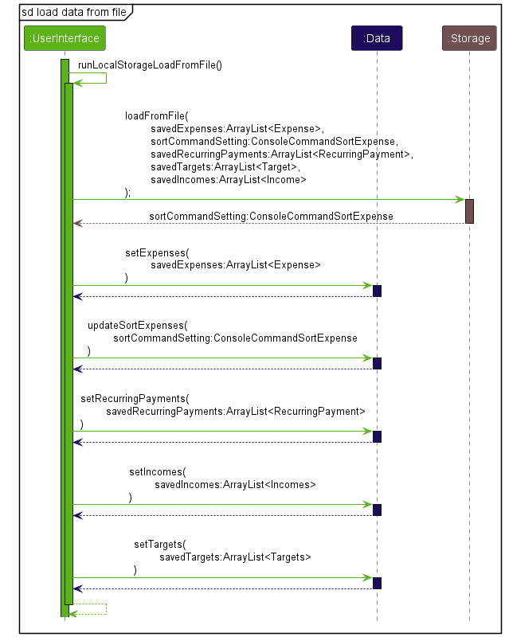

1. `UserInterface#runLocalStorageLoadFromFile()` calls `Storage#loadFromFile()` to read any existing data from local storage.
2. `UserInterface#runLocalStorageLoadFromFile()` calls the corresponding set functions to load the data into the program.


1. `UserInterface#getConsoleCommand()` calls `UserInterface#getConsoleInput()` to read the user's input as a string.
2. `UserInterface#getConsoleCommand()` calls `Logger#logCommand()` to log the command entered by the user into a log file.
3. `UserInterface#getConsoleCommand()` calls `Parser#parse()` to parse the input string into the corresponding console command object.

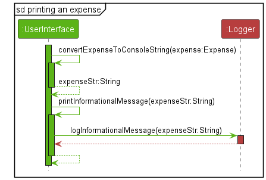

1. `UserInterface` calls the corresponding convert object function based on the data object's class.\
   In the example above, `UserInterface` calls `UserInterface#convertExpenseToConsoleString()` to convert the expense object into a formatted string.
2. `UserInterface` calls `UserInterface#printInformationalMessage()` to print the formatted string.
3. `UserInterface#printInformationalMessage()` calls `System.out.println()` to print the formatted string to a standard out.
4. `UserInterface#printInformationalMessage()` calls `Logger#logInformationalMessage()` to log the formatted string to a log file.


* `UserInterface#runLocalStorageSaveToFile()` calls the get functions to retrieve the data from the program.
* `UserInterface#runLocalStorageSaveToFile()` calls `Storage#saveToFile()` to write the data to local storage.

<div style="page-break-after: always;"></div>

### Common Component

The Common component consists of the classes `Messages` and `Configurations`.\
\
`Messages` defines the messages used by the program during execution. It includes the informational, warning and error messages that are displayed to the user.\
`Configurations` defines the configuration parameters used by the program. It stores parameters such as data formatting information, directory and file paths, and the URLs of different APIs.

<div style="page-break-after: always;"></div>

### Exceptions Component

The Exceptions component consists of various exception classes which inherits from `MoneyGoWhereException`.

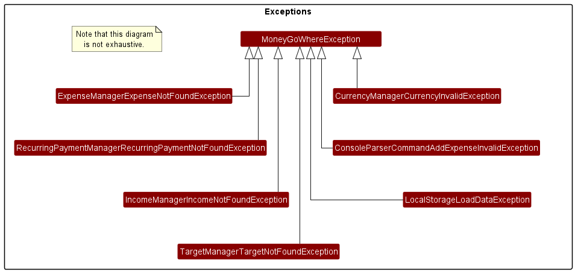

The exceptions are thrown and handled by the program depending on the conditions outlined in their Javadoc comments.\
For example, `ConsoleParserCommandAddExpenseInvalidException` is thrown when an error is encountered while parsing the command.
Do refer to the [exceptions](https://github.com/AY2223S1-CS2113T-W11-1/tp/tree/master/src/main/java/seedu/moneygowhere/exceptions) package to view the full list of exceptions.

<div style="page-break-after: always;"></div>

### UserInterface Component

The UserInterface component consists of the class `ConsoleInterface` which runs the command line interface that the user interacts with.

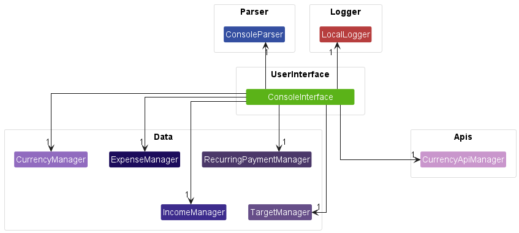

`ConsoleInterface` defines various command handlers which are called based on the command entered by the user.\
For example, entering the command string `Add-Expense -n Expense -a 7.80` will result in the execution of the `ConsoleInterface#runCommandAddExpense()` command handler to add an expense to the program.
Do refer to the [ConsoleInterface.java](https://github.com/AY2223S1-CS2113T-W11-1/tp/blob/master/src/main/java/seedu/moneygowhere/userinterface/ConsoleInterface.java) class to view the full list of command handler functions.

<div style="page-break-after: always;"></div>

### Parser Component

The Parser component consists of the classes `ConsoleParserConfigurations` and `ConsoleParser`.\
\
`ConsoleParserConfigurations` defines the syntax and arguments used by `ConsoleParser` when parsing the commands entered by the user.\
`ConsoleParser` defines the `ConsoleParser#parse()` to parse commands and arguments into their corresponding console command subclasses.\
\
When `ConsoleParser#parse()` is invoked to parse a command entered by the user:
* `ConsoleParser#parse()` calls the corresponding command parser function to parse the command arguments.
* The command parser function validates, parses and normalizes the command arguments before returning the corresponding console command subclass.

<div style="page-break-after: always;"></div>

### Commands Component

The Commands component consists of various console command classes which inherits from the abstract class `ConsoleCommand`.


The corresponding console command subclass is returned by `ConsoleParser#parse()` depending on the command supplied in the function's parameter.
For example, supplying the command string `Add-Expense -n Expense -a 7.80` to `ConsoleParser#parse()` will return a `ConsoleCommandAddExpense` object.
Do refer to the [commands](https://github.com/AY2223S1-CS2113T-W11-1/tp/tree/master/src/main/java/seedu/moneygowhere/commands) package to view the full list of console command subclasses.

<div style="page-break-after: always;"></div>

### Data Component

The Data component consists of the classes `Expense`, `Income`, `RecurringPayment`, `Target` along with their corresponding manager classes.

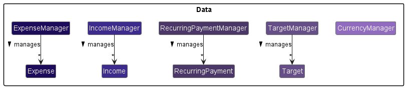

`Expense`, `Income`, `RecurringPayment` and `Target` define the attributes and their respective data types.\
`ExpenseManager`, `IncomeManager`, `RecurringPaymentManager` and `TargetManager` define functions to store and manage the respective data objects.\
`CurrencyManager` defines functions to add, retrieve, update and delete currencies and manages a HashMap of different currency codes and their corresponding exchange rates.

<div style="page-break-after: always;"></div>

### Storage Component

The Storage component consists of the classes `LocalStorageConfigurations`, `LocalStorageNullErrorHandler` and `LocalStorage`.\
\
`LocalStorageConfigurations` defines the syntax and arguments used by `LocalStorage` when reading data from and writing data to a xml file.\
`LocalStorageNullErrorHandler` overwrites several default error handlers in the xml parser to allow for custom error handling.\
`LocalStorage` defines functions that loads and saves data.

### API Component

The API component consists of the classes `CurrencyApiManager` and `CurrencyApi`.\
\
The `CurrencyApiManager` class calls functions in `CurrencyApi`.\
The `CurrencyApi` class contains functions that fetches data from the API and loads that data into a HashMap of exchange rates.\
\
When `CurrencyApiManager#getCurrencyApi()` is invoked to retrieve the list of currencies and their corresponding conversion rates:
* `CurrencyApiManager#getCurrencyApi()` calls `CurrencyApi#getJson()` to fetch data from the API in the form of a JSON file.
    * The data contains the currency codes and its corresponding exchange rates with respect to the Singapore Dollar.
    * The data is written into a text file called `exchangeRates.txt`.
* `CurrencyApiManager#getCurrencyApi()` calls `CurrencyApi#loadFromFile()` to load the data from `exchangeRates.txt` into a HashMap of exchange rates.

### Logger Component

The Logger component consists of the classes `LocalLoggerFormatter` and `LocalLogger`.\
\
`LocalLoggerFormatter` formats the log record before it is written to a log file.
`LocalLogger` defines functions to log different types of messages to a log file.

<div style="page-break-after: always;"></div>

## Implementation
### Loading Data from File

The following sequence diagram illustrates the process of loading data from local storage.

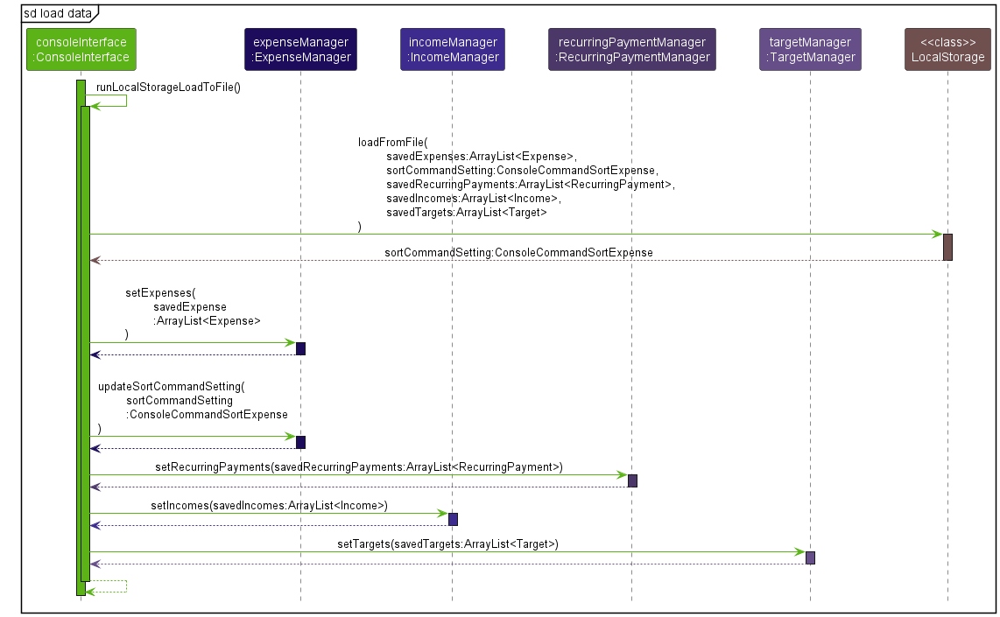

<div style="page-break-after: always;"></div>

### Saving Data to File

The following sequence diagram illustrates the process of saving data to local storage.


<div style="page-break-after: always;"></div>

### Printing an Expense

The following sequence diagram illustrates the process of printing and logging an `Expense` object.


<div style="page-break-after: always;"></div>

### Adding an Expense: `Add-Expense`

The `Add-Expense` command adds a new expense to the program.

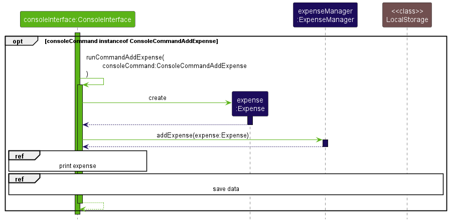

<div style="page-break-after: always;"></div>

### Viewing an Expense: `View-Expense`

The `View-Expense` command displays existing expenses in the program.

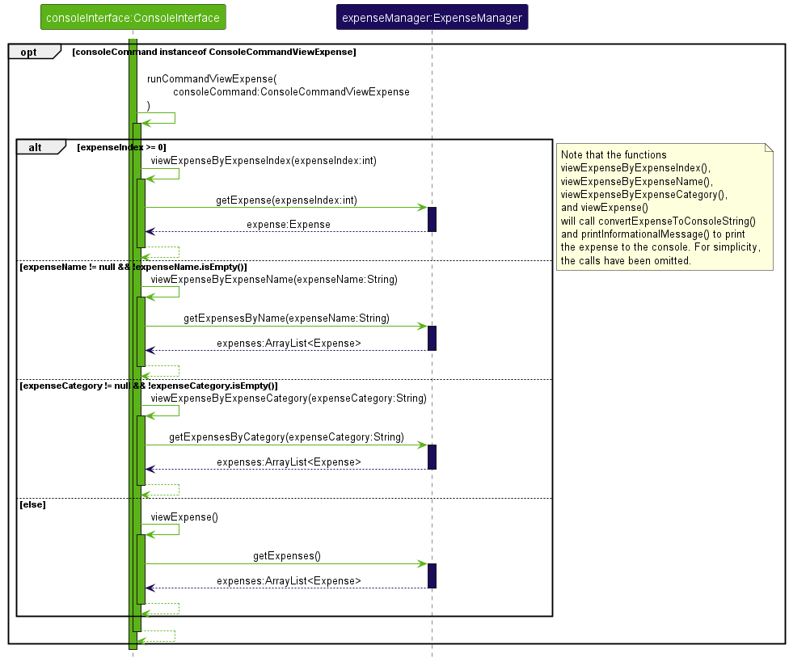

<div style="page-break-after: always;"></div>

### Deleting an Expense: `Delete-Expense`

The `Delete-Expense` command removes an existing expense from the program.


<div style="page-break-after: always;"></div>

### Editing an Expense: `Edit-Expense`

The `Edit-Expense` command changes the attributes of an existing expense in the program.

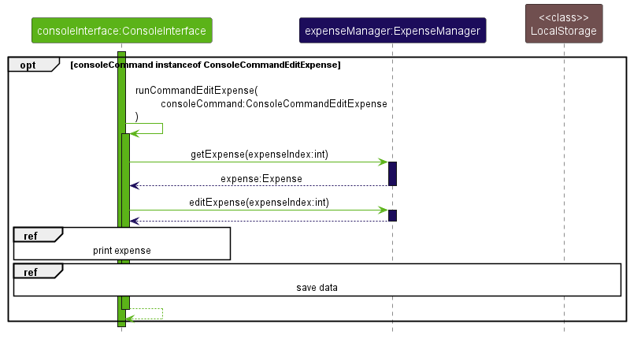

<div style="page-break-after: always;"></div>

### Sorting Expenses: `Sort-Expense`

The `Sort-Expense` command sorts the existing expenses in the program.

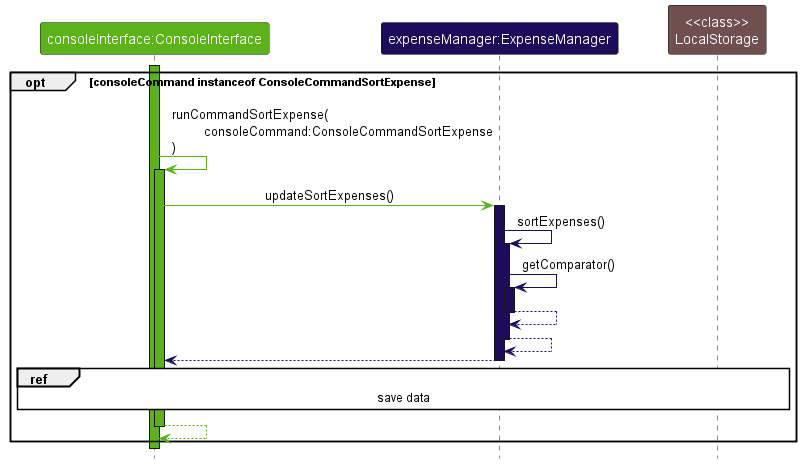

<div style="page-break-after: always;"></div>

### Converting Currencies: `Convert-Currency`

The `Convert-Currency` command converts the currency of an existing expense in the program.

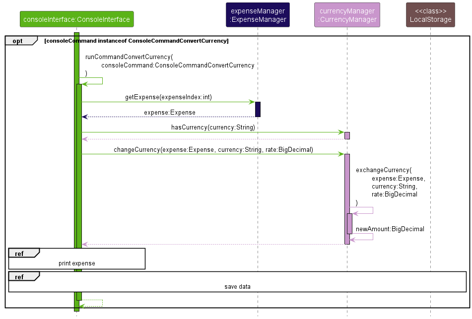

<div style="page-break-after: always;"></div>

### Printing a Recurring Payment

The following sequence diagram illustrates the process of printing and logging a `RecurringPayment` object.


<div style="page-break-after: always;"></div>

### Adding a Recurring Payment: `Add-RecurringPayment`

The `Add-RecurringPayment` command adds a new recurring payment to the program.


<div style="page-break-after: always;"></div>

### Viewing a Recurring Payment: `View-RecurringPayment`

The `View-RecurringPayment` command displays existing recurring payments in the program.


<div style="page-break-after: always;"></div>

### Deleting a Recurring Payment: `Delete-RecurringPayment`

The `Delete-RecurringPayment` command removes an existing recurring payment from the program.


<div style="page-break-after: always;"></div>

### Editing a Recurring Payment: `Edit-RecurringPayment`

The `Edit-RecurringPayment` command changes the attributes of an existing recurring payment in the program.


<div style="page-break-after: always;"></div>

### Adding an Expense from a Recurring Payment: `Pay-RecurringPayment`

The `Pay-RecurringPayment` command adds a new expense based on an existing recurring payment.
This command helps the user to track when recurring payments are paid.

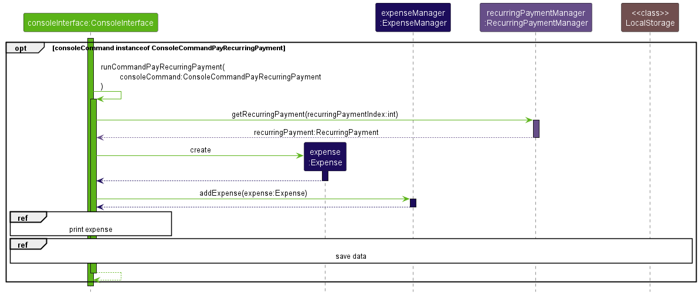

<div style="page-break-after: always;"></div>

### Printing an Income

The following sequence diagram illustrates the process of printing and logging an `Income` object.


<div style="page-break-after: always;"></div>

### Adding an Income: `Add-Income`

The `Add-Income` command adds a new income to the program.

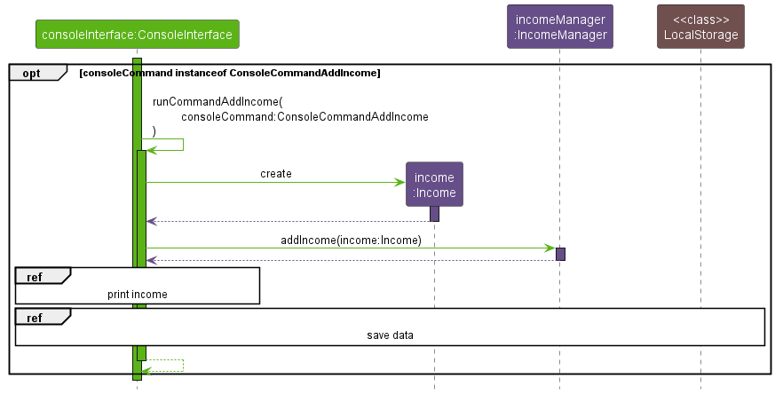

<div style="page-break-after: always;"></div>

### Viewing an Income: `View-Income`

The `View-Income` command displays existing incomes in the program.


<div style="page-break-after: always;"></div>

### Deleting an Income: `Delete-Income`

The `Delete-Income` command removes an existing income from the program.

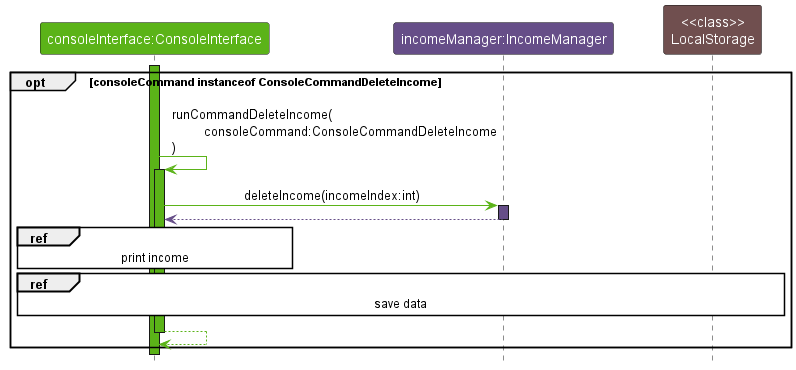

<div style="page-break-after: always;"></div>

### Editing an Income: `Edit-Income`

The `Edit-Income` command changes the attributes of an existing income in the program.

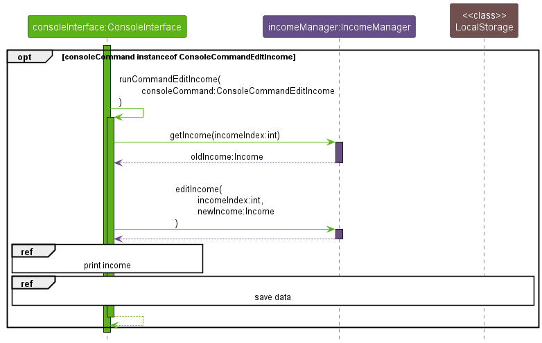

<div style="page-break-after: always;"></div>

### Printing a Target

The following sequence diagram illustrates the process of printing and logging a `Target` object.


<div style="page-break-after: always;"></div>

### Adding a Target: `Add-Target`

The `Add-Target` command adds a new target to the program.


<div style="page-break-after: always;"></div>

### Viewing a Target: `View-Target`

The `View-Target` command displays existing targets in the program.

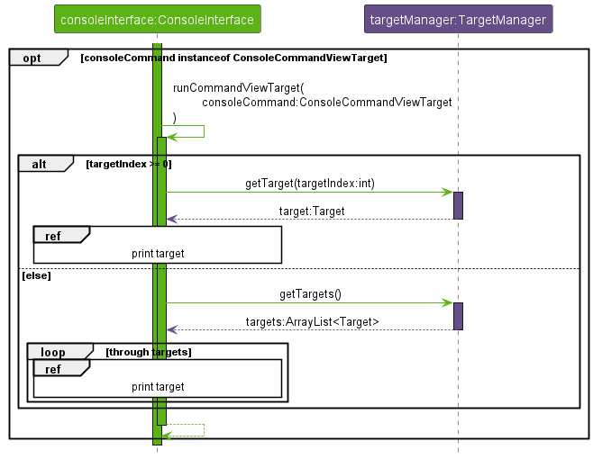

<div style="page-break-after: always;"></div>

### Deleting a Target: `Delete-Target`

The `Delete-Target` command removes an existing target from the program.

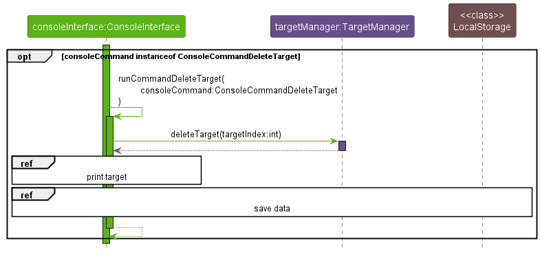

<div style="page-break-after: always;"></div>

### Editing a Target: `Edit-Target`

The `Edit-Target` command changes the attributes of an existing target in the program.


<div style="page-break-after: always;"></div>

### Merging a data file: `Merge-File`

The `Merge-File` command merges data from an external data file with the existing data in the current data file.


<div style="page-break-after: always;"></div>

## Product Scope
### Target User Profile

MoneyGoWhere is targeted at users who
* Prefer command line interfaces to graphical interfaces
* Use multiple operating systems concurrently
* Type fast

### Value Proposition

MoneyGoWhere is a financial tracker designed specifically to help computing professionals manage their finances. The program
* Runs on mainstream desktop operating system
* Works over remote command shells such as `ssh`, allowing easy access over the internet
* Stores data using the Extensible Markup Language, simplifying the transfer and backup of data using tools such as `scp` or `rsync`

<div style="page-break-after: always;"></div>

## User Stories

| User story was implemented in... | As a ... | I want to ...                                     | So that I can ...                                 |
|:--------------------------------:|:--------:|---------------------------------------------------|---------------------------------------------------|
|               v1.0               |   user   | add expenses                                      | keep track of my finances                         |
|               v1.0               |   user   | view expenses                                     | keep track of my finances                         |
|               v1.0               |   user   | view expenses by name                             | search for past expenses easily                   |
|               v1.0               |   user   | view expenses by category                         | keep track of my spending across different areas  |
|               v1.0               |   user   | delete expenses                                   | keep track of my finances                         |
|               v1.0               |   user   | edit expenses                                     | keep track of my finances                         |
|               v1.0               |   user   | categorise expenses                               | keep track of my spending across different areas  |
|               v1.0               |   user   | sort expenses by alphabetical order               | organise my spending by their names               |
|               v1.0               |   user   | sort expenses by amount                           | keep track of the extent of my spending           |
|               v1.0               |   user   | sort expenses by date                             | keep track of my spending over time               |
|               v1.0               |   user   | save my data to a file                            | store my data easily                              |
|               v1.0               |   user   | load my data from a file                          | retrieve my data easily                           |
|               v1.0               |   user   | add my income                                     | keep track if my spending exceeds my income       |
|               v1.0               |   user   | add expense targets                               | keep track of my financial goals                  |
|               v2.0               |   user   | convert between different currencies              | keep track of expenses across multiple currencies |
|               v2.0               |   user   | update currency exchange rates                    | convert between currencies using the latest rates |
|               v2.0               |   user   | view my income                                    | keep track if my spending exceeds my income       |
|               v2.0               |   user   | delete my income                                  | keep track if my spending exceeds my income       |
|               v2.0               |   user   | edit my income                                    | keep track if my spending exceeds my income       |
|               v2.0               |   user   | view expense targets                              | keep track of my financial goals                  |
|               v2.0               |   user   | delete expense targets                            | keep track of my financial goals                  |
|               v2.0               |   user   | edit expense targets                              | keep track of my financial goals                  |
|               v2.0               |   user   | add recurring payments                            | keep track of my recurring payments               |
|               v2.0               |   user   | view recurring payments                           | keep track of my recurring payments               |
|               v2.0               |   user   | delete recurring payments                         | keep track of my recurring payments               |
|               v2.0               |   user   | edit recurring payments                           | keep track of my recurring payments               |
|               v2.0               |   user   | add an expense from an existing recurring payment | keep track of when recurring payments were paid   |
|               v2.0               |   user   | merge several data files together                 | consolidate my expenses easily                    |

<div style="page-break-after: always;"></div>

## Non-Functional Requirements

1. The program should provide the same user experience regardless of the platform it is running on.
2. The program should be able to run without an internet connection.
3. The program should be responsive.

## Glossary

| Term                                     | Definition                                                  |
|------------------------------------------|-------------------------------------------------------------|
| Mainstream Desktop Operating System (OS) | Windows, Mac OS, Linux                                      |
| Secure Shell (ssh)                       | Protocol that enables secure access to a remote system      |
| Secure Copy (scp)                        | Protocol enables secure data transfer with a remote system  |
| Remote Sync (rsync)                      | Tool that synchronises a file between a client and a server |

## Manual Testing

### Launching MoneyGoWhere
1. Set up the project according to the steps in [Getting Started](#getting-started).
2. Launch MoneyGoWhere by running `main()` in `MoneyGoWhere.java`.

### Running Commands
1. Refer to the [User Guide](https://ay2223s1-cs2113t-w11-1.github.io/tp/UserGuide.html) for the list of commands and its corresponding arguments.
   It details the type of values accepted by each argument and which arguments are mandatory and optional.
2. Enter a command into the program.

### Terminating MoneyGoWhere
1. Enter `Bye` into the console.

