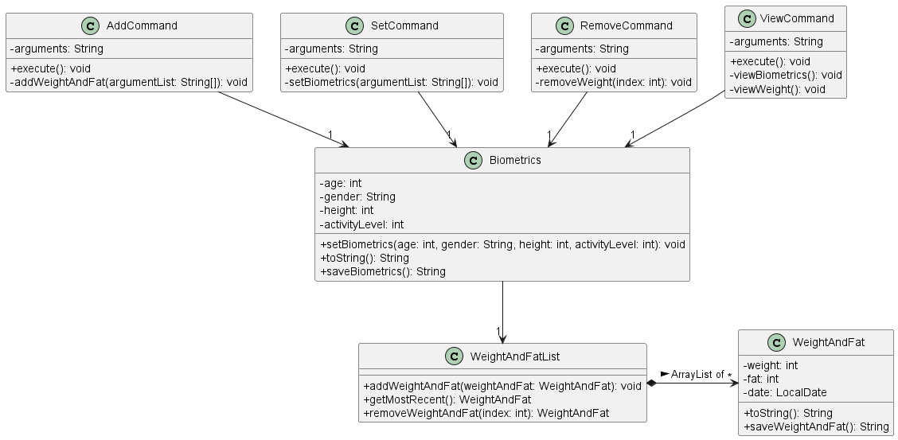

# Developer Guide

## Acknowledgements

{list here sources of all reused/adapted ideas, code, documentation, and third-party libraries -- include links to the original source as well}  
Zhou Zhou's Individual Project: https://github.com/maanyos/ip

## Design & implementation

{Describe the design and implementation of the product. Use UML diagrams and short code snippets where applicable.}
Biometrics component:  
The Biometrics component stores information about the user's biometrics and holds a reference 
to an ArrayList of the user's weight and fat records under WeightAndFatList class.  
WeightAndFatList is separated from Biometrics for better abstraction and cohesion.  
[Proposed] Weight and fat records will be associated with a date, and the WeightAndFatList class
stores records in descending order of date for viewing purposes.

## Product scope
### Target user profile

{Describe the target user profile}  
TracknFit is designed for fitness enthusiasts who are new or moderately experienced in fitness 
and do not require specialised fitness advice 

### Value proposition

{Describe the value proposition: what problem does it solve?}  
TracknFit helps the user track their exercise routines, dietary habits and biometrics, allowing them
to better understand their journey and progress towards their fitness goals.

## User Stories

| Version | As a ... | I want to ...                  | So that I can ...                                           |
|---------|----------|--------------------------------|-------------------------------------------------------------|
| v1.0    | new user | see usage instructions         | refer to them when I forget how to use the application      |
| v2.0    | old user | record my biometrics over time | see how I am progressing in my fitness journey              |
| v2.0    | user     | find a to-do item by name      | locate a to-do without having to go through the entire list |
| v2.1    | new user | set my biometrics              | receive personalised recommendations                        |

## Non-Functional Requirements

{Give non-functional requirements}

## Glossary

* *glossary item* - Definition
* *biometrics* - age, gender, height, weight and fat percentage of user
* *fat* - fat and fat percentage are used interchangeably to improve consistency in variable names

## Instructions for manual testing

{Give instructions on how to do a manual product testing e.g., how to load sample data to be used for testing}
