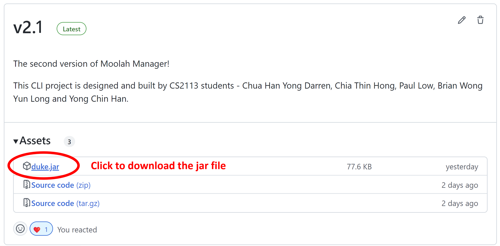

# User Guide

- [Introduction](#introduction)
- [About This Guide](#about-this-guide)
  * [What is in Moolah Manager](#what-is-in-moolah-manager)
  * [Command Format](#command-format)
- [Getting Started](#getting-started)
  * [Setting Up](#setting-up)
  * [Viewing Help: `help`](#viewing-help-help)
- [Managing Transactions](#managing-transactions)
  * [Adding a Transaction: `add`](#adding-a-transaction-add)
  * [Editing a Transaction: `edit`](#editing-a-transaction-edit)
  * [Listing the Transactions: `list`](#listing-the-transactions-list)
  * [Searching for Transactions: `find`](#searching-for-transactions-find)
  * [Deleting a Transaction: `delete`](#deleting-a-transaction-delete)
  * [Purging all Transactions: `purge`](#purging-all-transactions-purge)
- [Budgeting and Financial Insights](#budgeting-and-financial-insights)
  * [Viewing the Statistics: `stats`](#viewing-the-statistics-stats)
  * [Managing the Budget: `budget`](#managing-the-budget-budget)
- [General](#general)
  * [Persistent Data](#persistent-data)
  * [Exiting the Program: `exit`](#exiting-the-program-exit)
- [Command Summary](#command-summary)
- [FAQ](#faq)


## Introduction

Financial bookkeeping via traditional mobile applications has always been a hassle due to the repetitive clicks needed to
manage monetary transactions. With Moolah Manager, you will be encouraged to take ownership of managing your finances via
a time-saving and efficient command-line (CLI) interface.

The main features of Moolah Manager include:

- Managing records of monetary transactions
- Gathering financial insights such as categorical savings and periodic expenditure
- General budgeting and reminders about spending

The application is optimised for use with a keyboard and all you need is to just type in your commands into a terminal.
Moreover, if you are a fast-typist, the recording and querying of transactions can be performed efficiently.

_Written by: Chua Han Yong Darren_

## About This Guide

### What is in Moolah Manager
Moolah Manager is a comprehensive app for Financial bookkeeping using an intuitive CLI platform, with many features
you can use!

In our managing records features, you can add, delete, edit monetary transaction entries to keep their records 
up-to-date. Moolah Manager also features the ability to edit dates of transactions and add categories to better 
classify the expenses.

As for statistics, Moolah Manager supports the viewing of summarised expenses in daily, weekly and monthly formats. 
This enables you to better understand your expenses, and savings across various time periods. In addition, Moolah 
Manager also shows which category of expenses users spend more on so that they can better manage spending. 

Beyond just tracking expenses, Moolah Manager allows you to set your expense budgets to take charge of your spending 
habits. You will be able to allocate budgets for different categories or for the week to better stick to your plans. 

Lastly, our additional features will ensure that you will be able to seek help with the commands with a list of usable 
commands and guides for using the application for first time users. Moolah Manager will also save the application 
expenses everytime it is updated, so that you don’t have to!

_Written by: Paul Low_

### Command Format

General illustrations about the text format used for the commands in this guide can be found below. 

1. The **first word** in the command refers to the command word to be supplied by the user. The command words are case-insensitive. 
   1. e.g. `exit`, `EXIT` and `eXiT` will all both interpreted as the same.

2. Words in `UPPER CASE` refer to the parameters in each command. Each parameter must be prepended with a tag.
   1. e.g. in `delete e/ENTRY`, `delete` is the command word, while `ENTRY` is a parameter expected after the tag `e/`.

3. Parameters in square brackets are optional.
   1. e.g. `help [o/detailed]` can be used as `help o/detailed` or `help.
   2. Note that the parameter `detailed` is written in lower case here, which means, only the exact wording is accepted.

4. Each parameter is separated by a space. Users are not allowed to use spaces in their parameter. 

_Written by: Chia Thin Hong_

## Getting Started

### Setting Up

1. Ensure that you have Java 11 or above installed. If not, kindly install Java's [latest version](https://www.oracle.com/java/technologies/downloads/).
2. Download the latest version of `Moolah Manager` from [here](https://github.com/AY2223S1-CS2113-W12-2/tp/releases).
   As shown in Figure 1 below, click on the `duke.jar` file from the latest version available.

    <p align="center">
    
    <br />
    <i>Figure 1: How to Download Moolah Manager</i>
    </p>

3. Copy the file to the directory that you wish to use as a home directory for Moolah Manager. The data saved during the
   application will reside in the same directory.
4. Launch a command prompt or terminal and run the command `java -jar duke.jar` to start the application.
5. Moolah Manager will display a greeting message and a remaining budget for the current month.

_Written by: Chua Han Yong Darren_

### Viewing Help: `help`

Display basic or detailed help message explaining the command available in the application. 

Format: `help [o/detailed]`

| Field      | Description                                    |
|------------|------------------------------------------------|
| `detailed` | To list the detailed version of help messages. |

**Important Information:**

- To view detailed help, the exact `o/detailed` must be added in the command.

Example(s): 

 - `help`

 - `help o/detailed`

Expected output: 
```
help
____________________________________________________________
Gotcha! Here are the commands that you may use:
Command Word: HELP
To display a list of available commands with their respective expected parameters.
Type "help o/detailed" for a detailed version of all parameters used.
Usage: help [o/detailed]

Command Word: BUDGET
To set the amount of monthly budget.
Usage: budget b/BUDGET

Command Word: ADD
To add a new transaction entry, which could be either an "income" or an "expense" into the transaction list.
Usage: add t/TYPE c/CATEGORY a/AMOUNT d/DATE i/DESCRIPTION
... (Similar output for other commands truncated)
```

_Written by: Chia Thin Hong_

## Managing Transactions

### Adding a Transaction: `add`

Adds a new item to the list of todo items.

Format: `todo n/TODO_NAME d/DEADLINE`

* The `DEADLINE` can be in a natural language format.
* The `TODO_NAME` cannot contain punctuation.

Example(s):

`todo n/Write the rest of the User Guide d/next week`

`todo n/Refactor the User Guide to remove passive voice d/13/04/2020`

Expected output: 
```

```

_Written by: Yong Chin Han_

### Editing a Transaction: `edit`

Edit a transaction entry from the list of transactions.

**Format:** `edit e/ENTRY [t/TYPE] [c/CATEGORY] [a/AMOUNT] [d/DATE] [i/DESCRIPTION]`

| Field         | Description                                                                                                                          |
|---------------|--------------------------------------------------------------------------------------------------------------------------------------|
| `ENTRY`       | A list entry value for the transaction. It is a positive whole number ranging from 1 to 1000000.                                     |
| `TYPE`        | The type of transaction. It should either be `expense` or `income`.                                                                  |
| `CATEGORY`    | A category for the transaction. It is a one-word parameter flexibly defined by the user. No numeral, symbol or spacing is allowed.   |
| `AMOUNT`      | The amount of the transaction. It is a positive integer, e.g. 10.                                                                    | 
| `DATE`        | The date when the transaction took place on. It must be in ddMMyyy y format, e.g. 29102022.                                          |                                                                                                 
| `DESCRIPTION` | Provides more information about the transaction. It is a one-word parameter defined by the user without any spacing.                 | 


**Example(s):**

- `edit e/1 t/expense c/food`
- `edit e/2 a/10 d/10202022 i/games`

**Expected output:**

```
edit e/1 t/expense c/food
____________________________________________________________
I have edited the following Expense transaction:
[-][food] $20 at Jan 30 2022 | Description: banana_pudding
____________________________________________________________
```

_Written by: Brian Wong Yun Long_

### Listing the Transactions: `list`


Lists all or some transactions based on selection. If tag filters are used, the transactions retrieved from the records must
match all the filter tags that have been specified in order to be recognized as a valid record.

**Format:** `list [t/TYPE] [c/CATEGORY] [d/DATE] [m/MONTH] [y/YEAR] [p/PERIOD] [n/NUMBER]`

| Field      | Description                                                                                                                        |
|------------|------------------------------------------------------------------------------------------------------------------------------------|
| `TYPE`     | The type of transaction. It should either be `expense` or `income`.                                                                |
| `CATEGORY` | A category for the transaction. It is a one-word parameter flexibly defined by the user. No numeral, symbol or spacing is allowed. |
| `DATE`     | The date when the transaction took place on. It must be in ddMMyyyy format, e.g. 29102022.                                         | 
| `MONTH`    | The month which the transaction falls on. It is in numerical form, i.e. from 1 to 12, where 1 represents January.                  |                                                                                                 
| `YEAR`     | The year which the transaction falls on. It must be in yyyy format and only year 1000 and onwards are accepted.                    | 
| `PERIOD`   | The period which the transaction falls on. It should either be `weeks` or `months`                                                 |
| `NUMBER`   | The last N number of weeks or months. It is a positive whole number that is from 1 to 100.                                         |

**Important Information:**

- In order to view transactions for a specific month via `m/MONTH` tag, it is mandatory to include a `y/YEAR` tag.
- The `p/PERIOD` and `n/NUMBER` tags must be used as a pair for viewing transactions for the
  last N number of weeks or months.
- The `m/MONTH` and `y/YEAR` tags should not be used together with `p/PERIOD` and `n/NUMBER` tags.

**Example(s):**

- `list`
- `list y/2022`
- `list t/income c/transport d/27102022`
- `list c/food m/1 y/2022`
- `list t/expense c/leisure p/weeks n/5`

**Expected output:**

```
list c/food m/1 y/2022
____________________________________________________________
Here are your transaction records:
[-][food] $80 on Jan 13 2022 | Description: toilet_cake 
[+][food] $20 on Jan 30 2022 | Description: banana_pudding
____________________________________________________________
```

_Written by: Chua Han Yong Darren_

### Searching for Transactions: `find`

Find a specific or multiple transactions based on any keywords that have been specified.

**Format:** `find KEYWORDS`

**Example(s):**

- `find Jan 30`
- `find banana_pudding`

**Expected output:**

```
find Jan 30
____________________________________________________________
Here are the transaction records that match your search expression:
[+][food] $20 at Jan 30 2022 | Description: banana_pudding
____________________________________________________________
```

_Written by: Chua Han Yong Darren_

### Deleting a Transaction: `delete`

Deletes a transaction entry from the list of transactions.

**Format:** `delete e/ENTRY`

| Field   | Description                                                                                      |
|---------|--------------------------------------------------------------------------------------------------|
| `ENTRY` | A list entry value for the transaction. It is a positive whole number ranging from 1 to 1000000. |

**Example(s):**

- `delete e/1`
- `delete e/2`

**Expected output:**

```
delete e/1
____________________________________________________________
I have deleted the following transaction:
[+][food] $20 at Jan 30 2022 | Description: banana_pudding
____________________________________________________________
```

_Written by: Brian Wong Yun Long_

### Purging all Transactions: `purge`

Deletes all transaction entries from the list of transactions.
The User would have to input 'Y' after the prompt to confirm the operation, otherwise
the operation will be aborted.

**Format:** `purge`

**Example(s):**

- `purge`

**Expected output:**

```
purge
____________________________________________________________
Are you sure you want to proceed with this command? Please enter 'Y' to confirm.
____________________________________________________________
____________________________________________________________
Y
____________________________________________________________
____________________________________________________________
All your transactions have been purged.
____________________________________________________________

```

_Written by: Brian Wong Yun Long_

## Budgeting and Financial Insights

### Viewing Moolah Statistics: `stats`
View the general statistics of monetary transactions, from 3 main views: Categorical Savings, Monthly Expenditure and
Time Insights. Various statistics listed include total income, total expense, total savings, total expenses, sum of expenses
ordered by category or time and more.


#### Statistics for Categorical Savings
View the total amount sum of all transactions in each category. 

**Format:** `stats s/categorical_savings`

**Example(s):**
- `stats s/categorical_savings`

**Expected output:**
```
stats s/categorical_savings
____________________________________________________________
Here are your requested statistics for the categorical_savings type:
[bonus] $540
[transport] $11
[salary] $2000
[food] $80

____________________________________________________________
```

#### Statistics for Monthly Expenditure
View the total income, expense and savings values of all transactions in each month.

**Format:** `stats s/monthly_expenditure`

**Example(s):**
- `stats s/monthly_expenditure`

**Expected output:**
```
stats s/monthly_expenditure
____________________________________________________________
Here are your requested statistics for the monthly_expenditure type:
[Sep 2022]
Income: $2000
Expense: $81
Savings: $1919
Spending Habit: Excellent! You saved quite a lot this month.

[Aug 2022]
Income: $0
Expense: $10
Savings: $-10
Spending Habit: Oops, you spent too much. Do manage your expenses within your constraints.

[Oct 2022]
Income: $540
Expense: $0
Savings: $540
Spending Habit: Excellent! You saved quite a lot this month.

____________________________________________________________
```
#### Statistics for Time Insights of specific time period
View monthly expenditure, total income, expense and savings values of all transactions in the specified year or month.
**Format:** `stats s/time_insights y/YEAR [m/MONTH]`

**Example(s):**

- `stats s/time_insights y/2022`
- `stats s/time_insights y/2022 m/10`

**Expected output:**
```
stats s/time_insights y/2022
____________________________________________________________
Here are the total savings and expenses for
Year: 2022

-----CATEGORIES-----
[bonus] $540
[transport] $11
[salary] $2000
[food] $80

-----EXPENDITURE-----
Income: $2540
Expense: $91
Savings: $2449
____________________________________________________________
```


#### Statistics for Time Insights of past periods from current date
View monthly expenditure, total income, expense and savings values of all transactions in the specified number of periods
before current date.

**Format:** `stats s/time_insights p/PERIOD n/NUMBER `

**Example(s):**

- `stats s/time_insights p/weeks n/3`
- `stats s/time_insights p/months n/12`

**Expected output:**
```
stats s/time_insights p/weeks n/3
____________________________________________________________
Here are the total savings and expenses for
The past 3 weeks: 

-----CATEGORIES-----
[bonus] $540

-----EXPENDITURE-----
Income: $540
Expense: $0
Savings: $540
____________________________________________________________
```

                                                

_Written by: Paul Low_

### Managing the Budget: `budget`
To set the amount of monthly budget, with a value from 1 to 10<sup>13</sup>.

Format: `budget b/BUDGET`

| Field      | Description                                                                                                   |
|------------|---------------------------------------------------------------------------------------------------------------|
| `BUDGET`   | An estimate of expense for every month. It is a positive whole number that is from 1 to 10^13 (Ten Trillion). |

**Important Information:**

- The monthly budget is set to $1000 by default if the user has never run this command.

Example(s):

`budget b/1000`

`budget b/52013149999`

Expected output: 
```
budget b/52013149999
____________________________________________________________
You have successfully updated the budget.
Monthly budget set as: $52013149999
____________________________________________________________
```


_Written by: Chia Thin Hong_

## Others

### Persistent Data

_Written by: Yong Chin Han_

### Exiting the Program: `exit`

Exits the program.

Format: `exit`

Example(s):

`exit`

Expected output:
```
exit
____________________________________________________________
Goodbye and see you soon.
____________________________________________________________
```

_Written by: Brian Wong Yun Long_

## Command Summary


| Command                                                                  | Command Syntax                                                               | Example                                                                                                                                                            |
|--------------------------------------------------------------------------|------------------------------------------------------------------------------|--------------------------------------------------------------------------------------------------------------------------------------------------------------------|
| help                                                                     | help                                                                         | help                                                                                                                                                               |
| help (detailed)                                                          | help o/detailed                                                              | help o/detailed                                                                                                                                                    |
| add                                                                      | add t/TYPE c/CATEGORY a/AMOUNT d/DATE i/DESCRIPTION                          | add t/expense c/transport a/1 d/02102022 i/bus_fare <br> add t/income c/bonus a/10000000 d/03102022 i/thank_you_boss                                               |
| list                                                                     | list                                                                         | list                                                                                                                                                               |
| list ( with filters )                                                    | list [t/TYPE] [c/CATEGORY] [d/DATE] [m/MONTH] [y/YEAR] [p/PERIOD] [n/NUMBER] | list c/food d/13092022 <br> list t/income d/30092022  <br/>     list p/months n/1<br/>  list t/income d/30092022 y/2022<br/>   list t/income d/30092022 y/2022 m/9 |
| statistics for categorical savings                                       | stats s/categorical_savings                                                  | stats s/categorical_savings                                                                                                                                        |
| statistics for monthly expenditure                                       | stats s/monthly_expenditure                                                  | stats s/monthly_expenditure                                                                                                                                        |
| statistics for time insight of a specific year OR month of specific year | stats s/time_insights y/YEAR [m/MONTH]                                       | stats s/time_insights y/2022 <br/> stats s/time_insights y/2002 m/10                                                                                               |
| statistics for time insight for the PAST periods from current date       | stats s/time_insights p/PERIOD n/NUMBER                                      | stats s/time_insights p/weeks n/3 <br/> stats s/time_insights p/months n/12                                                                                        |
| budget                                                                   | budget b/BUDGET                                                              | budget b/9999999999999 <br/> budget b/1                                                                                                                            |
| delete                                                                   | delete e/ENTRY                                                               | delete e/3                                                                                                                                                         |
| purge                                                                    | purge                                                                        | purge                                                                                                                                                              |
| find                                                                     | find KEYWORDS                                                                | find bus_fare <br> find transport <br> find Sep 13                                                                                                                 |
| bye                                                                      | bye                                                                          | bye                                                                                                                                                                |

Tags used ( **OPTIONAL** tags are enclosed with SQUARE BRACKETS "[" and "]" in the **command syntax in the table** above):
* The `TYPE` is either `"expense"` or `"income"`.
* The `CATEGORY` is a one-word parameter flexibly defined by the user. [ No numeral, symbol or spacing is allowed ]
* The `AMOUNT` is a positive whole number that is from 1 to 10000000. [ No alphabet, symbol or spacing is allowed ]
* The `DATE` MUST be in ddMMyyyy format. [ E.g. 29102022 ] 
* The `DESCRIPTION` is a one-word parameter defined by the user. [ Spacing is not allowed ]
* The `ENTRY` is the entry value which is a positive whole number that is from 1 to 1000000. [ No alphabet, symbol or spacing is allowed ]
* The `KEYWORDS` is any string used to find matching transactions. [ Spacing is allowed (Special Case) ]
<!-- * The `KEYWORDS` are parameter value(s) within Search-fields that would be searched.  [ Available Search-fields: date, type, category , amount, description. Cross-search across different Search-fields NOT supported ] -->
* The `BUDGET` is a positive whole number that is from 1 to 10<sup>13</sup> (Ten Trillion). [ No alphabet, symbol or spacing is allowed ]
* The `YEAR` is the year in yyyy format. 
* The `MONTH` is the month in numerical form. [ From 1 to 12 , where 1 represents January etc. ]
* The `PERIOD` is the selection of either periods in `"weeks"` or `"months"`. [ Used with "n/NUMBER" ONLY ]
* The `NUMBER` is a positive whole number that is from 1 to 100, representing the number of periods to view.  [ Used with "p/PERIODS" ONLY ]


_Written by: Yong Chin Han_

## FAQ

**Q**: How do I view commands while the app is running? 
* **A**: Type `help` command to view all the commands!

**Q**: Can I directly input values into the duke.txt file? 
* **A**: It is strongly advisable not to edit the duke.txt file as that could disrupt Moolah Manager's retrieval of the data.

**Q**: What should I do if most of my transactions are incorrect?
* **A**: You can consider using the edit or delete function to modify individual transactions at a time. However, if
 there are too many transactions to change, you can consider using the purge function to delete all values. 
 
**Q**: What is the purpose of using the different statistics commands?
* **A**: They provide you with great flexibility in viewing the current transactions from different perspectives. To analyze 
all of the stored transactions, use `stats s/categorical_savings` or `stats s/monthly_expenditure`. Otherwise, use stats s/time_insights
to analyze transactions for a specified time period.  

_Written by: Paul Low_
