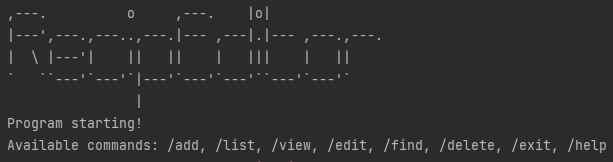
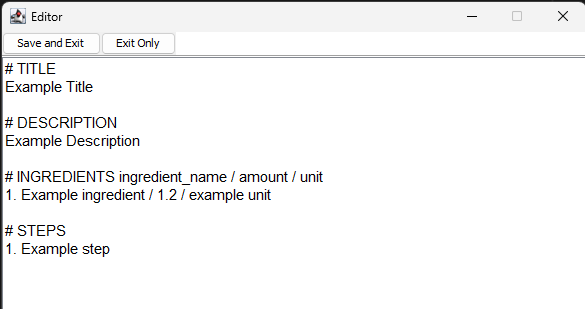

# RecipEditor
## **Introducing _RecipEditor_**
<hr />

_RecipEditor_ is a hybrid CLI-GUI application that allows you to manage your recipes.

_RecipEditor_ can be used across all operating systems such as Windows, Mac OS X, Linux and Unix.
It is optimised for use via a complement of Command-Line Interface (CLI) and Graphical user interface (GUI).
Both the CLI and GUI are made to be as simple as possible so that it would be especially beneficial for
fast typers who needs a platform to keep track of the countless recipes.

If you type fast, and you need an easy and quick way to record your recipes, _RecipEditor_ is the app for you! 💯

## **About This User Guide**
<hr />
This guide explains how you can use all the features available on _RecipEditor_ and maximise your user experience.

To preface, we do expect users to have a basic level of comfort with using computers,
and it would be even better if you are familiar with CLI to be using _RecipEditor_.
However, if you do not, do not worry as we have provided a comprehensive set of instructions to
[get started](#2-quick-start)!

Throughout this guide, we will be using some special formatting and symbols to bring your attention to certain aspects:

| Formatting | Meaning                                                                                                                         |
|------------|---------------------------------------------------------------------------------------------------------------------------------|
| _italics_  | Text that has been _italicised_ indicates that it is a term specific to _RecipEditor_.                                          |
| **bold**   | Text that has been **bolded** indicates that it is important.                                                                   |
| `abc`      | Text with a `highlight` indicates that it is code that can be typed by you into the command line or displayed by _RecipEditor_. |
| ℹ️         | This symbol indicates important information.                                                                                    |
| ⏫          | This symbol indicates a shortcut to the content page. You may click it to quickly navigate back to the content page.            |


## **Content Page**
<hr />

- [Quick Start](#quick-start)
- [Features](#features)
    - [Add Command](#add-command) `/add`
    - [Edit Command](#edit-command) `/edit`
    - [Delete Command](#delete-command) `/delete`
    - [List Command](#list-command) `/list`
    - [View Command](#view-command) `/view`
    - [Find Command](#find-command) `/find`
    - [Help Command](#help-command) `/help`
    - [Exit Command](#exit-command) `/exit`
    - [Storage](#storage)
        - [Saving The Data](#saving_the_data)
        - [Editing Data File](#editing-data-file)
        - [Parsing Data File](#parsing-data-file)
- [Command Summary](#command-summary)

# Quick Start

1. Ensure that you have Java 11 or above installed.
2. Down the latest version of `RecipEditor` from [here]([https://github.com/AY2223S1-CS2113-T18-2/tp/releases]).
3. Go to the directory of the `RecipEditor.jar`
4. Use command line to start the program `java -jar RecipEditor.jar`

If successfully loaded, you will see this screen:

<p align="center" width="100%">
  
</p>
[⏫ Back to content page](#content-page)

# Features 
<hr/>

ℹ️ ***Command Format***
- Commands are not case-sensitive (e.g. `help`, `HELP`,`hElP` are all able to execute the `help` command)

- Words in upper case (e.g. `UPPER_CASE`) are used to signify parameters.

## Add Command

Adds new recipe to your recipe list. This feature allows you to record down the recipe title, recipe description,
ingredients used and the steps involved. To record the ingredients used, user can note down the ingredient name,
amount and the respective units. As for the steps involved, user will specify the steps in the order of execution.

ℹ This feature brings out a GUI editor that allows user to quickly type all the different sections at once.

Format: `/add`

### GUI Editor

A simple GUI text editor will open and loaded with a template file as shown below:

<p align="center" width="100%">
  
</p>

ℹ Ingredient amount takes in floats (eg. 0.5), but not fraction (eg. 1/2)

Edit the corresponding field according to the following convention:
- `# TITLE`: Only one line, which is the next line after `# TITLE`, will be accepted
- `# DESCRIPTION`: Multiple lines are supported
- `# INGREDIENTS`:
    - Format: `INDEX. INGREDIENT_NAME / AMOUNT / UNIT`
        - Example:
          <br /> `1. Egg / 2 / pieces`
          <br /> `2. Flour / 100 / gram`
- `# STEPS`
    - Format: `INDEX. STEP_DESCRIPTION`
        - Example:
          <br /> `1. Crack the eggs and stir`
          <br /> `2. Crack the eggs and stir`
  
Example:
```
# TITLE 
Carbonara

# DESCRIPTION
Carbonara is an Italian pasta dish from Rome made with eggs, hard cheese, cured pork and black pepper.
Hot pasta tossed with a creamy sauce of raw beaten eggs, accentuated with crisp bits of guanciale, and 
finished with a shower of grated aged Pecorino Romano cheese plus freshly ground black pepper.

# INGREDIENTS ingredient_name / amount / unit
1. Extra virgin olive oil / 1 / table spoon
2. Eggs / 3 / whole
3. Parmesan cheese / 1 / cup
4. Spaghetti / 0.9 / pound

# STEPS 
1. Heat the pasta water.
2. Sauté the pancetta or bacon and garlic.
3. In a small bowl, beat the eggs and mix in about half of the cheese.
4. Once the water has reached a rolling boil, add the dry pasta, and cook, uncovered, at a rolling boil.
5. Add the beaten egg mixture.
6. Pour the mixture over the pasta.
```

ℹ After inputting all the relevant field, you can click on the "_Save and Exit_" button in the top left corner of the GUI editor.

ℹ Otherwise, if you decide not to save the information you have inputted, you can click on the "_Exit Only_" button to exit the add mode.

[⏫ Back to content page](#content-page)

## Edit Command

Edit existing recipe with the given _INDEX_ as shown in the recipe list. To see the index of the recipe, you can use the `/list` command to
show all the recipe titles that is in your current recipe list. The _INDEX_ will be the number on the left of the recipe title.

ℹ This feature allows you to choose between using GUI editor or CLI editor. For GUI editor, it will load the recipe information that was previously 
saved by the user. For CLI, you can make the relevant edits using the commands and flags as shown below.

### GUI Editor
The GUI Editor workflow is similar to [GUI Editor](#gui-editor)

Format: `/edit INDEX`

Example: 
```
/edit 1
```

### CLI Editor
The CLI Editor updates the recipe directly on the CLI. Users have to input the appropriate flags (recipe and command flags)
and take note of the format before entering the command.

Format: `/edit RECIPE_INDEX COMMAND_FLAG RECIPE_FLAG PARAMETERS`

**Recipe flags**: Specify the part of recipe that will be changed
- `-t`: *Title*
- `-d`: *Description*
- `-i`: *Ingredient*
- `-s`: *Step*

**Command flags**: Specify the type of function to be used**
- `-add`: *Adds a new ingredient or step*
  
      ℹ Only works for ingredient or step. Cannot add moreout  than 1 recipe title or description.
      - Parameter: `INGREDIENT or STEP`
      - Example:
      ```
      /edit 2 -add 
      ```

- `-del`: *Deletes an ingredient or step*
  
  ℹ Only works for ingredient or step. Cannot delete recipe title or description.

    - Parameter: `INDEX`
    - Exactly **1 (one)** integer must be provided.
  - Example:
  ```
  /edit 2 -del -i 2 
      
  Delete "Lettuce"
  Caesar salad: ingredient edited.
  ```
  
- `-swp`: *Swaps two ingredients or steps*
  - Parameter: `INDEX_1 INDEX_2`
    - Exactly **2 (two)** integers must be provided.
  - Example:
  ```
  /edit 1 -swp -s 2 3
      
  Swap "Heat oil in a frying pan" and "Pour sauce into the pan"
  Fried rice: step edited.
  ```

- `-chg`: *Changes the ingredient, step, title or description*
  - Parameter: `INDEX [INGREDIENT or STEP]` or `[TITLE or DESCRIPTION]`

    ℹ For title and description, type the changes right after the flags. No need for index.

    ℹ For ingredient and step, exactly **1 (one) index** must be provided before the changes.
        
      - Ingredient format: `INGREDIENT_NAME / AMOUNT / UNIT`
      - Step format: `STEP`
  - Examples: 
  ```
  /edit 2 -chg -d Lettuce salad with croutons and dressing
      
  Change "Green salad" to "Lettuce salad with croutons and dressing"
  Caesar salad: description edited.
  ```
  ```
  /edit 3 -chg -i 2 Oyster sauce / 1.0 / tbsp
      
  Change "Soy sauce / 2.0 / tsp" to "Oyster sauce / 1.0 / tbsp"
  Stir fry: ingredient edited.
  ```

ℹ The flag order (recipe and command flag) does not matter, but exactly 1 (one) command flag and 1 (one) recipe flag are allowed in 
an edit command.

ℹ Not including the index, adding the wrong flags or using inappropriate parameters will throw an error.

[⏫ Back to content page](#content-page)

## Delete Command

Delete existing recipe with given recipe title or recipe index from the list. This helps you to organise your recipe list such that those recipes that
'outdated' or no longer used by you can be removed.

Format: `/delete [RECIPE_TITLE OR RECIPE_INDEX]`

ℹ The _RECIPE_TITLE_ is not case-sensitive. Therefore, inputting _recipe_title_ and _RECIPE_TITLE_ yields the same result.

Example: 
```
/delete carbonara

Carbonara is deleted from the recipe list.
```
```
/delete 1

Carbonara is deleted from the recipe list.
```

[⏫ Back to content page](#content-page)

## List Command

List the existing recipe titles previously added to the recipe list. This gives you a quick overview of the recipes that you have added previously.

Format: `/list`

Example:
```
/list

1. Apple Crumble
2. Gyoza
3. Nasi Briyani
```

[⏫ Back to content page](#content-page)

## View Command

View the full details of the specified recipe according to the index shown in the list. The details shown include recipe title, recipe description,
ingredients used and steps involved. To record the ingredients used, user can note down the ingredient name,
amount and the respective units. As for the steps involved, user will specify the steps in the order of execution.

Format: `/view RECIPE_INDEX`

Example: 
```
/view 1
Recipe Title: 
Carbonara

Recipe Description: 
Carbonara is an Italian pasta dish from Rome made with eggs, hard cheese, cured pork
and black pepper. Hot pasta tossed with a creamy sauce of raw beaten eggs, accentuated with crisp bits of
guanciale, and finished with a shower of grated aged Pecorino Romano cheese plus freshly ground black pepper.

Recipe Ingredients: 
1. Extra virgin olive oil / 1 / table spoon
2. Eggs / 3 / whole
3. Parmesan cheese / 1 / cup
4. Spaghetti / 0.9 / pound

Recipe Steps:
1. Heat the pasta water.
2. Sauté the pancetta or bacon and garlic.
3. In a small bowl, beat the eggs and mix in about half of the cheese.
4. Once the water has reached a rolling boil, add the dry pasta, and cook, uncovered, at a rolling boil.
5. Add the beaten egg mixture.
6. Pour the mixture over the pasta.
```
[⏫ Back to content page](#content-page)

## Find Command
Find the recipes with relevant recipe title or ingredient name as what the user inputs. Program will look through all the recipe titles
and every ingredient names for all recipes, and list out the recipe title that contains what the user inputs.

ℹ User can input _RECIPE_TITLE_ or _INGREDIENT_NAME_

ℹ The _RECIPE_TITLE_ is not case-sensitive. Therefore, inputting _recipe_title_ and _RECIPE_TITLE_ yields the same result.

Format: `/find -RECIPE_FLAG [RECIPE_TITLE or INGREDIENT_NAME]`

Example: 
```
/find -t egg

1. Egg Fried Rice
2. Egg Tofu
3. Maggi with Egg
```
```
/find -i egg

1. Carbonara
2. Fried Rice
3. Nasi Lemak
```

[⏫ Back to content page](#content-page)

## Help Command

Shows the specific command syntax in _RecipeEditor_.

Format: `/help COMMAND`

Example:
```
/help find

Syntax: /find <ingredient/title>
Description: For the given ingredient or title, find recipes which contains it.
```

[⏫ Back to content page](#content-page)

## Exit Command

Exits the _RecipEditor_.

Format: `/exit`

```
/exit

RecipEditor ends here...
Program exiting
```

[⏫ Back to content page](#content-page)

# Data Management
<hr />

## Storage

The data files are stored at _"./RecipeData"_ directory.

The template file and other miscellaneous files are stored at _"./RecipeData/App"_ directory.

The recipe data files are stored at _"./RecipeData/Recipes"_ directory.

There are 2 types of recipe data files to store recipes:
- **Overall File (OF)**: Keeps track of the recipe titles. User can open this file to have a birds-eye-view
at all the recipes that is currently in the recipe list.
- **Individual Recipe File (IRF)**: The details of each recipe is saved as an individual file that is named
after the recipe title. User can open the individual recipe file to look at the full details of the recipe.

### Saving The Data
There is no need to save manually. Any updates made to the data will be automatically 
stored into the local drive and reloaded when _RecipEditor_ is restarted.

### Editing Data File

- After `/add`
    - New IRF (whose file name is named after the Recipe Title) is saved
    - New Recipe Title is appended to OF
- After `/edit INDEX`
    - Update existing IRF at INDEX
    - Update OF (change Title)
- After `/delete RECIPE_TITLE`
    - Delete existing IRF
    - Update OF by removing the Recipe Title of the recipe being deleted

### Parsing Data File

- If user tempered with the data files, these are the potential problems encountered when the program starts and reads
  the data
    - Mismatch between IRF Title and OF Title
        - Delete IRF
    - IRF content cannot be parsed
        - Delete IRF
- New OF File is generated from the model contains the valid recipes loaded from IRFs

[⏫ Back to content page](#content-page)

# Command Summary

| Command | Action                                           | Format                                  | Example    |
|---------|--------------------------------------------------|-----------------------------------------|------------|
| add     | Add new recipe                                   | `/add`                                  | `/add`     |
| edit    | Edit recipe at INDEX                             | `/edit INDEX`                           | `/edit 1`  |
| delete  | Deletes recipe of given RECIPE_TITLE             | `/delete RECIPE_TITLE`                  | `/delete carbonara`     |
| list    | List all recipes                                 | `/list`                                 | `/list`    |
| view    | View recipe at INDEX                             | `/view INDEX`                           | `/view 1`  |
| find    | Find recipe with RECIPE_TITLE or INGREDIENT_NAME | `/find RECIPE_TITLE_OR_INGREDIENT_NAME` | `/find egg` |
| help    | Show available commands                          | `/help`                                 | `/help`    |
| exit    | Exit the program                                 | `/exit`                                 | `/exit`    |
