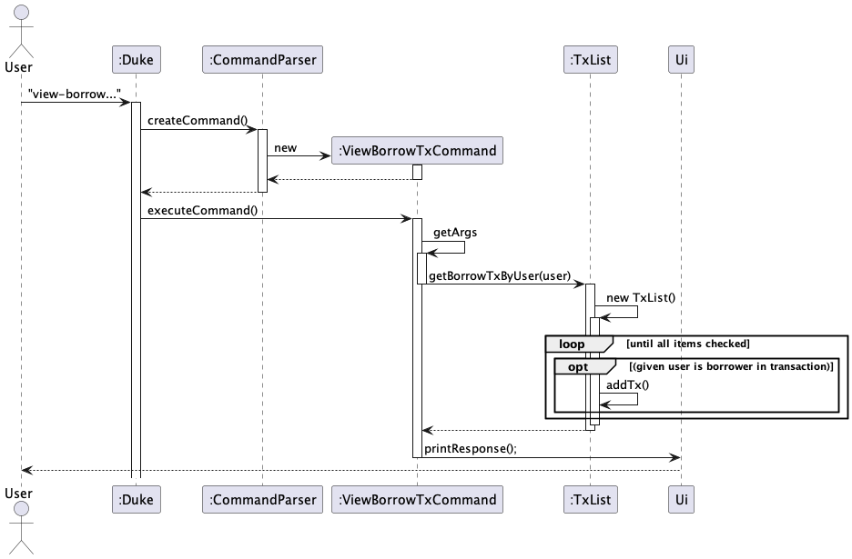

# See Zhuo Rui Jorelle - Project Portfolio Page

## Overview

Upcycle is a perfect desktop app dedicate to managing rental businesses. The nature of these businesses
requires dealing with tons of data; therefore, noting down all information with notes and pen is not ideal for managers.
It is developed for rental business managers, who can type fast to efficiently keep track of all of their customers, items,
and transactions via a Command Line Interface.

### Summary of Contributions
+ **Code contributed:**
    + Code written for this project can be seen [here](https://nus-cs2113-ay2223s1.github.io/tp-dashboard/?search=&sort=groupTitle&sortWithin=title&timeframe=commit&mergegroup=&groupSelect=groupByRepos&breakdown=true&checkedFileTypes=docs~functional-code~test-code~other&since=2022-09-16&tabOpen=true&tabType=zoom&zA=jorellesee&zR=AY2223S1-CS2113-W12-1%2Ftp%5Bmaster%5D&zACS=176.60059171597632&zS=2022-09-16&zFS=&zU=2022-11-05&zMG=false&zFTF=commit&zFGS=groupByRepos&zFR=false)
+ **Features and classes implementations:**
    + User-related features:
        + View a user's borrow transactions `view-user-borrow-tx`
        + View a user's lend transactions `view-user-lend-tx`
        + View a user's gain `view-user-gain`
        + View a user's loss `view-user-loss`
        + Find user by keyword `find users`
    + Item-related features:
      + Find items by keyword `find-items`
    + Wrote base class for Ui
    + Testing: Wrote automated testing scripts for Item and ItemList related tests.
    + DukeException: Contributed to some exception classes and ExceptionMessages.
+ **User Guide contributions:**
    + Wrote guide for
        + `view-user-borrow-tx`
        + `view-user-lend-tx`
        + `view-user-gain`
        + `view-user-loss`
        + `find users`
        + `find-items`
+ **Developer Guide contributions:**
    + Contributed to the Implementation subsection for all of the above features. Below are some diagrams drawn:
  
    + Contributed to User Stories
    + Contributed to Target User Profile for Upcycle
+ **Team tasks contributions:**
    + Reviewed teammates' PR.
        + For example, the initial name for the 'help' command was 'list-all-commands', which I thought could be confusing for the user, and hence I recommended a naming change.  
    + Completed tasks and milestones before the deadline, consistently each week.
+ **Community contributions:**
    + Reviewed peers' DG
    + Reported bugs/flaws in peers' tp for PED
